# Création d’une diffusion cross-canal{#cross-channel-delivery}

Ce document vous permet de découvrir la fonctionnalité d&#39;Adobe Campaign suivante via un cas pratique standard : création d&#39;un workflow de diffusion cross-canal.

Dans ce cas pratique, l&#39;objectif est de sélectionner une audience parmi les destinataires de la base de données et de la segmenter en deux groupes différents afin d&#39;envoyer un email au premier groupe et un SMS au deuxième.

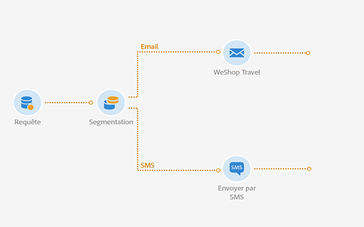

Pour plus d&#39;informations sur les workflows et les différents canaux disponibles dans Adobe Campaign, consultez les documents suivants :

* [Présentation des workflows](../../automating/using/get-started-workflows.md)
* [Découvrir les canaux de communication](../../channels/using/get-started-communication-channels.md)

## Créer un workflow       {#creating-workflow}

Afin d&#39;envoyer deux diffusions différentes à un groupe donné, vous devez tout d&#39;abord définir votre cible.

Pour ce faire, vous devez créer une requête pour identifier les destinataires, et donc, créer un workflow.

Créez un nouveau workflow dans le programme ou la campagne de votre choix:

1. Dans **[!UICONTROL Activités marketing]**, cliquez sur **[!UICONTROL Créer]** et sélectionnez **[!UICONTROL Workflow]**.
1. Sélectionnez **[!UICONTROL Nouveau workflow]** en tant que type de workflow et cliquez sur **[!UICONTROL Suivant]**.
1. Saisissez les propriétés du workflow, puis cliquez sur **[!UICONTROL Créer]**.

Les étapes détaillées pour créer un workflow sont présentées dans la section [Création d&#39;un workflow](../../automating/using/building-a-workflow.md).

## Créer une activité Requête {#creating-query-activity}

Une fois le workflow créé, vous accédez à son interface.

Insérez une activité Requête dans votre workflow afin de cibler les profils qui recevront vos diffusions.

1. Dans **[!UICONTROL Activités]** > **[!UICONTROL Ciblage]**, effectuez un glisser-déposer d’une activité [Requête](../../automating/using/query.md).
1. Double-cliquez sur l&#39;activité.
1. Dans l’onglet **[!UICONTROL Cible]**, parcourez les raccourcis et sélectionnez l’une de vos [audiences](../../audiences/using/about-audiences.md).
1. Déplacez le raccourci dans la zone d&#39;édition. En fonction du type de raccourci sélectionné, une fenêtre s&#39;affiche.
1. Paramétrez les éléments de ciblage puis validez votre requête.

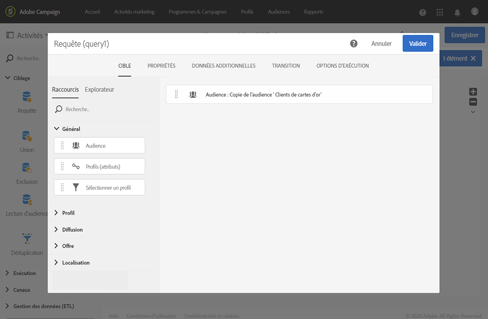

Vous pouvez créer une requête sur un ou plusieurs éléments.

Utilisez le bouton **[!UICONTROL Comptage]** pour avoir une estimation du nombre de profils ciblés par la requête.

## Créer une activité Segmentation {#creating-segmentation-activity}

Une fois votre cible identifiée par l&#39;activité Requête, vous devez sélectionner un critère pour segmenter la cible en deux populations distinctes : l&#39;une recevra un email et l&#39;autre un SMS.

Vous devez utiliser une activité de [Segmentation](../../automating/using/segmentation.md) pour créer un ou plusieurs segments à partir d&#39;une population calculée en amont dans une requête.

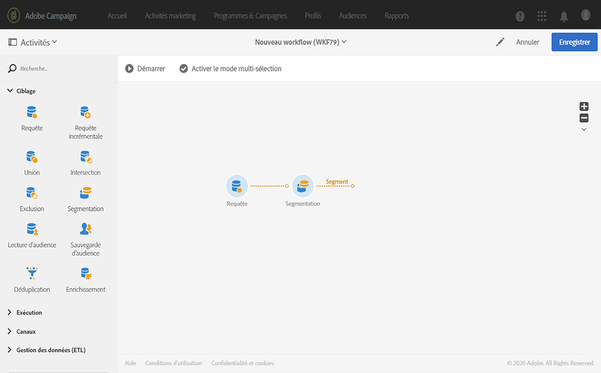

Le premier groupe **Email** ciblera les destinataires dont l&#39;email est renseigné, mais pas le numéro de téléphone portable. Le second groupe **SMS** contiendra les destinataires dont le numéro de téléphone portable est enregistré dans leur profil.

Pour configurer la première transition (Email) :

1. Dans l’onglet **[!UICONTROL Segments]**, un premier segment est présent par défaut. Modifiez ses propriétés pour le configurer.

   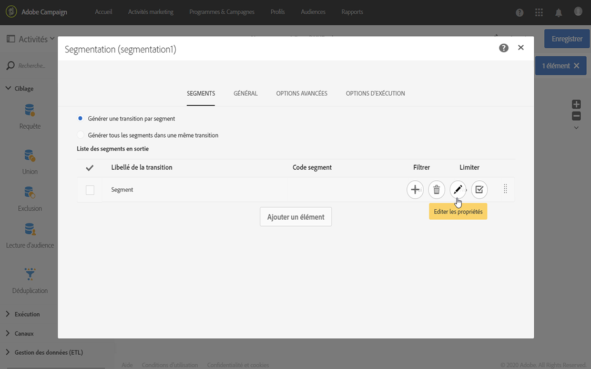

1. Sélectionnez l’**[!UICONTROL email]** du profil comme critère de filtrage.

   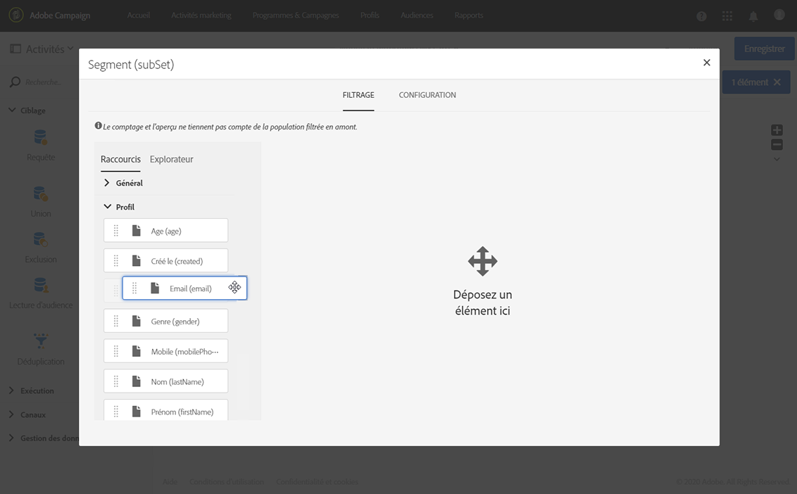

1. Dans la nouvelle fenêtre qui s’affiche à l’écran, sélectionnez l’opérateur **[!UICONTROL N’est pas vide]** .

   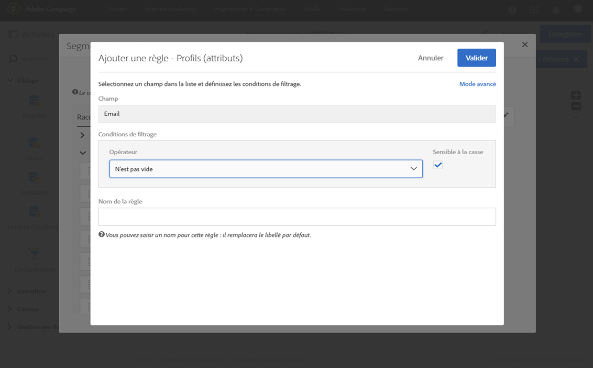

1. Ajoutez un deuxième critère de filtrage, à savoir, **[!UICONTROL Mobile]**, et sélectionnez l’opérateur **[!UICONTROL Est vide]**.

   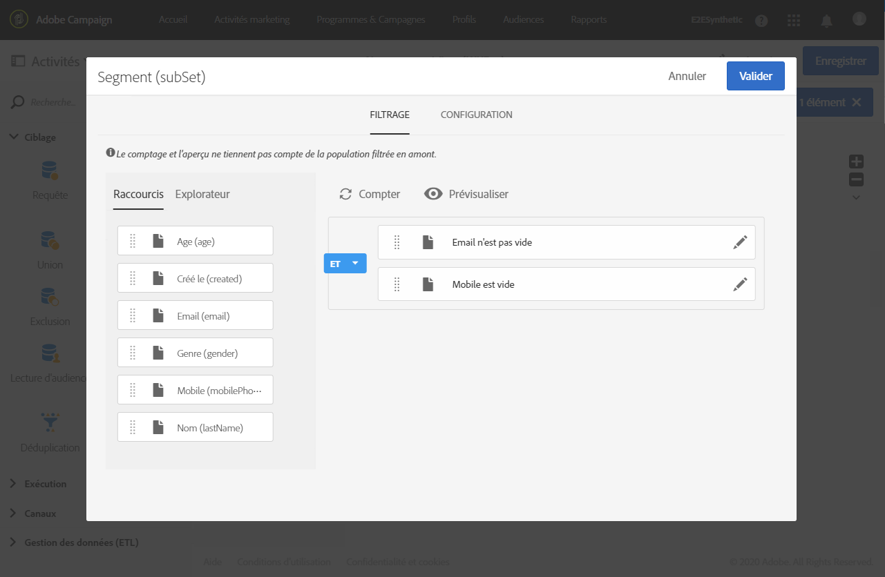

   Tous les profils provenant de la requête qui auront un email, mais pas de téléphone portable renseigné, seront dans cette transition.

1. Pour plus de clarté dans votre workflow, vous pouvez éditer le libellé de la transition. Validez vos modifications.

   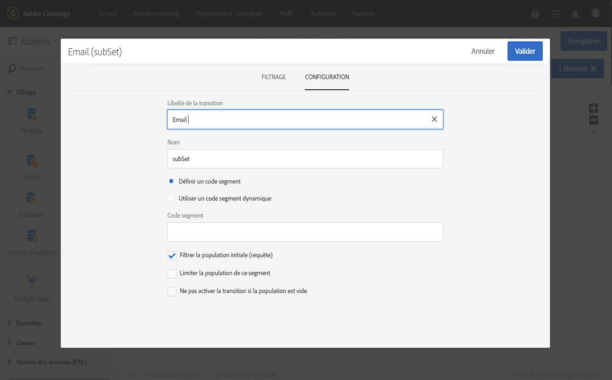

Votre première transition est paramétrée. Pour configurer la seconde transition (SMS) :

1. Cliquez sur le bouton **[!UICONTROL Ajouter un élément]** pour ajouter une nouvelle transition.
1. Définissez une condition qui vous permet de récupérer tous les profils dont les numéros de téléphone mobile ont été fournis. Pour cela, créez une règle sur le champ **[!UICONTROL Mobile]** avec l’opérateur logique **[!UICONTROL N’est pas vide]**.

   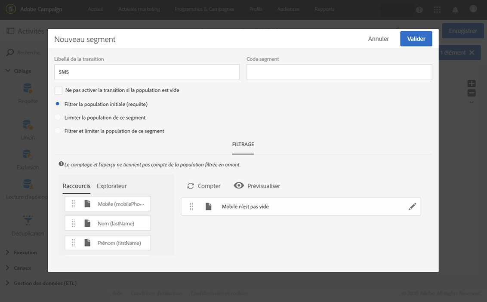

   Tous les profils provenant de la requête qui auront un numéro de téléphone portable renseigné seront dans cette transition.

1. Vous pouvez modifier le libellé de la transition. Validez vos modifications.

Votre seconde transition est maintenant également configurée.

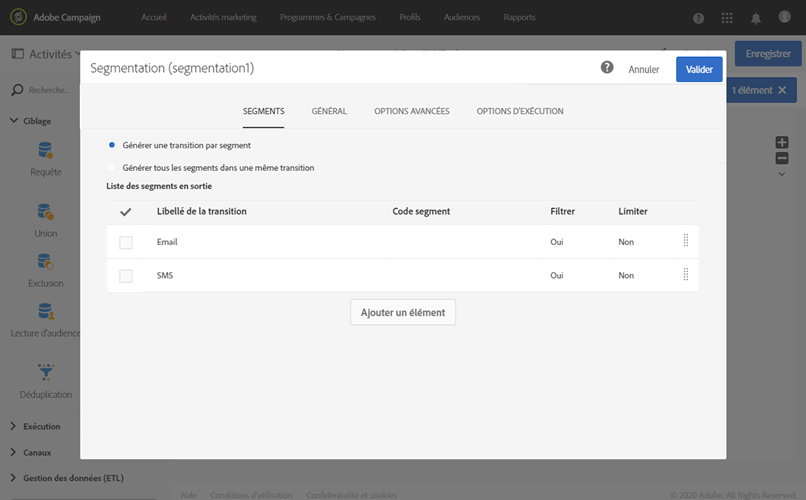

## Créer des diffusions {#creating-deliveries}

Comme deux transitions ont déjà été créées, vous devez désormais ajouter deux types de diffusion à la suite des transitions sortantes de l’activité Segmentation : une activité [diffusion Email](../../automating/using/email-delivery.md) et une activité [diffusion SMS](../../automating/using/sms-delivery.md).

Adobe Campaign vous permet d&#39;ajouter des diffusions dans un workflow. Pour ce faire, sélectionnez une diffusion depuis la catégorie **[!UICONTROL Canaux]** de la palette d&#39;activités de votre workflow.

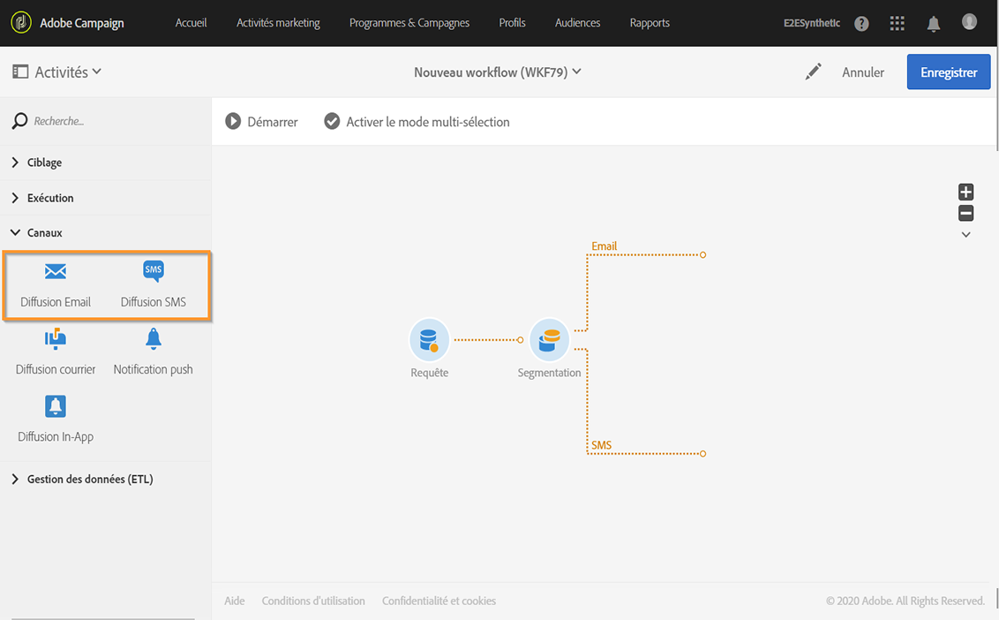

Pour créer une diffusion email :

1. Effectuez un glisser-déposer d’une activité [Diffusion Email](../../automating/using/email-delivery.md) après le premier segment.
1. Double-cliquez sur l&#39;activité pour l&#39;éditer.
1. Sélectionnez **[!UICONTROL Email simple]**.
1. Sélectionnez **[!UICONTROL Ajouter une transition sortante avec la population]** et cliquez sur **[!UICONTROL Suivant]**.

   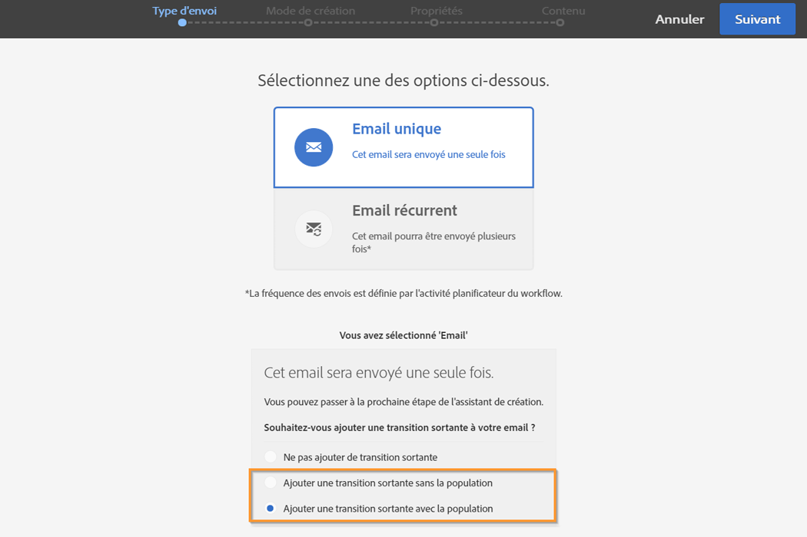

   La transition sortante vous permettra de récupérer la population et les logs de tracking. Vous pourrez utiliser ceci, par exemple, pour envoyer un deuxième email aux personnes qui n’ont pas cliqué sur le premier.

1. Sélectionnez un modèle d&#39;email et cliquez sur **[!UICONTROL Suivant]**.
1. Saisissez les propriétés de l&#39;email et cliquez sur **[!UICONTROL Suivant]**.
1. Pour créer la mise en page de votre email, sélectionnez **[!UICONTROL Utiliser le concepteur d&#39;email]**.
1. Editez et enregistrez votre contenu.
1. Dans la section **[!UICONTROL Planning]** du tableau de bord des messages, désélectionnez l’option **[!UICONTROL Demander confirmation avant d’envoyer les messages]**.

Pour créer une diffusion SMS :

1. Effectuez un glisser-déposer d’une activité [Diffusion SMS](../../automating/using/sms-delivery.md) après l’autre segment.
1. Double-cliquez sur l&#39;activité pour l&#39;éditer.
1. Sélectionnez **[!UICONTROL SMS]** et cliquez sur **[!UICONTROL Suivant]**.
1. Sélectionnez un modèle de SMS et cliquez sur **[!UICONTROL Suivant]**.
1. Saisissez les propriétés SMS et cliquez sur **[!UICONTROL Suivant]**.
1. Editez et enregistrez votre contenu.

Une fois vos diffusions créées et éditées, votre workflow est prêt à être démarré.

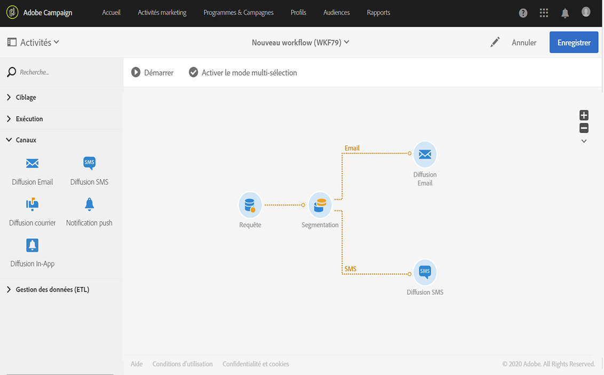

## Exécuter le workflow {#running-the-workflow}

Une fois le workflow démarré, la population ciblée par l’activité **[!UICONTROL Requête]** sera segmentée afin de recevoir une diffusion par email ou par SMS.

Pour exécuter votre workflow, cliquez sur le bouton **[!UICONTROL Démarrer]** dans la barre d’actions.

Vous pouvez accéder à vos diffusions depuis le menu avancé **[!UICONTROL Plans marketing]** > **[!UICONTROL Activités marketing]** depuis le logo Adobe Campaign. Cliquez sur la diffusion puis sur le bouton **[!UICONTROL Rapports]** pour accéder aux [rapports de diffusion](../../reporting/using/about-dynamic-reports.md#accessing-dynamic-reports), tels que la synthèse de la diffusion, les taux d&#39;ouvertures ou le rendu des emails en fonction des types de messagerie des destinataires.
