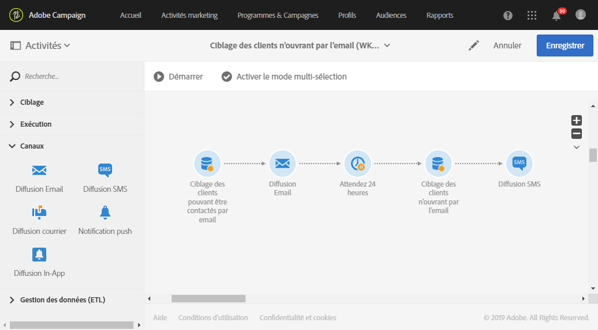

# Workflow de reciblage envoyant une nouvelle diffusion aux personnes n’ayant pas ouvert l’email{#retargeting-delivery-to-non-openers}

Vous pouvez envoyer un email à des clients et ensuite un SMS à ceux qui n&#39;ont pas ouvert l&#39;email.

1. Dans **[!UICONTROL Activités marketing]**, cliquez sur **[!UICONTROL Créer]** et sélectionnez **[!UICONTROL Workflow]**.
1. Sélectionnez **[!UICONTROL Nouveau workflow]** en tant que type de workflow et cliquez sur **[!UICONTROL Suivant]**.
1. Saisissez les propriétés du workflow, puis cliquez sur **[!UICONTROL Créer]**.

## Créer une activité Requête{#creating-a-query-activity}

1. Dans **[!UICONTROL Activités]** > **[!UICONTROL Ciblage]**, effectuez un glisser-déposer d’une activité [Requête](../../automating/using/query.md).
1. Double-cliquez sur l&#39;activité.
1. Dans **[!UICONTROL Raccourcis]**, effectuez un glisser-déposer d&#39;un élément **[!UICONTROL Profils]** et sélectionnez **[!UICONTROL email]** avec l&#39;opérateur **[!UICONTROL n&#39;est pas vide]**.
1. Dans **[!UICONTROL Raccourcis]**, effectuez un glisser-déposer d&#39;un élément **[!UICONTROL Profils]** et sélectionnez **[!UICONTROL Ne plus contacter par email]** avec la valeur **[!UICONTROL non]**.
1. Cliquez sur **[!UICONTROL Confirmer]**.

## Créer une diffusion email{#creating-an-email-delivery}

1. Faites glisser et déposer une [diffusion Email](../../automating/using/email-delivery.md) après chaque segment.
1. Cliquez sur l&#39;activité et sélectionnez  pour édition.
1. Sélectionnez **[!UICONTROL Email simple]** et cliquez sur **[!UICONTROL Suivant]**.
1. Sélectionnez **[!UICONTROL Ajouter une transition sortante sans la population]** et cliquez sur **[!UICONTROL Suivant]**.
1. Sélectionnez un modèle d&#39;email et cliquez sur **[!UICONTROL Suivant]**.
1. Saisissez les propriétés de l&#39;email et cliquez sur **[!UICONTROL Suivant]**.
1. Pour créer la mise en page de votre email, cliquez sur **[!UICONTROL Utiliser le Concepteur d&#39;email]**.
1. Insérez des éléments ou sélectionnez un modèle existant.
1. Personnalisez votre email avec des offres spécifiques à chaque emplacement. Pour plus d&#39;informations, consultez la section décrivant la [conception d&#39;un email](../../designing/using/designing-from-scratch.md#designing-an-email-content-from-scratch).
1. Cliquez sur **[!UICONTROL Aperçu]** pour vérifier votre mise en page.
1. Cliquez sur **[!UICONTROL Enregistrer]**.

## Ciblage des personnes n&#39;ayant pas ouvert l&#39;email dans une activité Requête{#targeting-non-openers-in-a-query-activity}

1. Dans **[!UICONTROL Activités]** > **[!UICONTROL Exécution]**, effectuez un glisser-déposer d’une activité [Attente](../../automating/using/wait.md).
1. Dans **[!UICONTROL Durée]**, cliquez sur  et sélectionnez un jour.
1. Dans **[!UICONTROL Activités]** > **[!UICONTROL Ciblage]**, effectuez un glisser-déposer d’une **[!UICONTROL activité Requête]**.
1. Double-cliquez sur l&#39;activité.
1. Dans **[!UICONTROL Raccourcis]**, effectuez un glisser-déposer des **[!UICONTROL Logs de tracking]** et de l&#39;opérateur **[!UICONTROL existe]**.
1. Dans **[!UICONTROL Raccourcis]** > **[!UICONTROL Diffusion]**, effectuez un glisser-déposer de l’élément **[!UICONTROL diffusion]** avec l’opérateur **[!UICONTROL est égal à]** et sélectionnez la diffusion comme valeur.
1. Dans **[!UICONTROL Raccourcis]** > **[!UICONTROL Diffusion]**, effectuez un glisser-déposer de l’élément **[!UICONTROL type]** et sélectionnez **[!UICONTROL Ouverture]** comme valeur.
1. Sélectionnez l&#39;opérateur **[!UICONTROL sauf]** entre les règles.
1. Cliquez sur **[!UICONTROL Confirmer]**.

## Créer une diffusion SMS{#creating-a-sms-delivery}

1. Effectuez un glisser-déposer d&#39;une diffusion SMS après chaque segment.
1. Cliquez sur l&#39;activité et sélectionnez  pour édition.
1. Sélectionnez **[!UICONTROL SMS simple]** et cliquez sur **[!UICONTROL Suivant]**.
1. Sélectionnez un modèle de SMS et cliquez sur **[!UICONTROL Suivant]**.
1. Saisissez les propriétés SMS et cliquez sur **[!UICONTROL Suivant]**.
1. Pour créer la mise en page de votre SMS, cliquez sur **[!UICONTROL Concepteur d&#39;email]**.
1. Insérez des éléments ou sélectionnez un modèle existant.
1. Personnalisez votre SMS avec des offres spécifiques à chaque emplacement.
Pour plus d’informations, voir la section [Conception d’un SMS](../../channels/using/creating-an-sms-message.md).
1. Cliquez sur **[!UICONTROL Aperçu]** pour vérifier votre mise en page.
1. Cliquez sur **[!UICONTROL Enregistrer]**.

**Rubriques connexes :**

* [Canal email](../../channels/using/creating-an-email.md)
