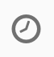

# Utilisation du flux de travail : Retargeting workflow envoie une nouvelle livraison aux non-initiateurs{#retargeting-delivery-to-non-openers}

Vous pouvez envoyer un email aux clients, puis un SMS à ceux qui n'ont pas ouvert le courrier.

1. In **[!UICONTROL Marketing Activities]**, click **[!UICONTROL Create]** and select **[!UICONTROL Workflow]**.
1. Sélectionnez **[!UICONTROL Nouveau Workflow]** comme type de flux de travail et cliquez **[!UICONTROL sur Suivant]**.
1. Entrez les propriétés du flux de travail et cliquez **[!UICONTROL sur Créer]**.

## Creating a query activity{#creating-a-query-activity}

1. Dans **[!UICONTROL Activités]** &gt; **[!UICONTROL Cibler]**, glisser-déposer une **[!UICONTROL activité de requête]**.
1. Double-cliquez sur l'activité.
1. Dans **[!UICONTROL les raccourcis]**, les **[!UICONTROL profils]** de drag-and-drop et le **[!UICONTROL courriel]** avec l'opérateur **[!UICONTROL n'est pas vide]**.
1. Dans **[!UICONTROL Raccourcis]**, profils de drag-and-drop **[!UICONTROL et]** sélectionnez **[!UICONTROL ne plus contacter par email]** avec la valeur **[!UICONTROL non]**.
1. Cliquez sur **[!UICONTROL Confirmer]**.

## Creating an email delivery{#creating-an-email-delivery}

1. Glisser-déposer un**[!UICONTROL Livraison par courriel]** livraison par courriel après chaque segment.
1. Cliquez sur l'activité et sélectionnez  à modifier.
1. Sélectionnez **[!UICONTROL Simple Email]** et cliquez **[!UICONTROL sur Suivant]**.
1. Sélectionnez **[!UICONTROL Ajouter une transition de sortie sans la population]** et cliquez **[!UICONTROL sur Suivant]**.
1. Sélectionnez un modèle de courriel et cliquez **[!UICONTROL sur Suivant]**.
1. Entrez les propriétés de courriel et cliquez **[!UICONTROL sur Suivant]**.
1. Renommez l'offre **email email**.
1. Pour créer la disposition de votre courriel, cliquez **[!UICONTROL sur Utiliser le concepteur de courriel]**.
1. Insérez des éléments ou sélectionnez un modèle existant.
1. Personnalisez votre email avec des offres spécifiques à chaque emplacement. Pour plus d'informations, reportez-vous [à la conception d'un email](../../designing/using/about-email-content-design.md#designing-an-email-content-from-scratch).
1. Cliquez **[!UICONTROL sur Aperçu]** pour vérifier votre disposition.
1. Cliquez sur **[!UICONTROL Enregistrer]**.

## Ciblant les non-initiateurs dans une activité de requête{#targeting-non-openers-in-a-query-activity}

1. Dans **[!UICONTROL Activités]** &gt; **[!UICONTROL Exécution]**, glisser-déposer une **[!UICONTROL activité]** d'attente.
1. Dans **[!UICONTROL la durée]**, cliquez  et sélectionnez un jour.
1. Dans **[!UICONTROL Activités]** &gt; **[!UICONTROL Cibler]**, glisser-déposer une **[!UICONTROL activité de requête]**.
1. Double-cliquez sur l'activité.
1. Dans **[!UICONTROL Raccourcis]**, les logs **[!UICONTROL de suivi de glisser-déposer]** et de l'opérateur **[!UICONTROL existent]**.
1. Dans **[!UICONTROL Raccourcis]**&gt; **[!UICONTROL Livraison]**, **[!UICONTROL livraison de glisser-déposer]** avec l'opérateur **[!UICONTROL est égal]** et sélectionner la livraison en valeur.
1. Dans **[!UICONTROL Raccourcis]**&gt; **[!UICONTROL Livraison]**, **[!UICONTROL type de glisser-déposer]** et vérifier **[!UICONTROL en]** fonction de la valeur.
1. Sélectionnez l'opérateur entre les règles comme **[!UICONTROL à l'exception]**.
1. Cliquez sur **[!UICONTROL Confirmer]**.

## Créer une livraison SMS{#creating-a-sms-delivery}

1. Glisser-déposer une livraison SMS après chaque segment.
1. Cliquez sur l'activité et sélectionnez  à modifier.
1. Sélectionnez **[!UICONTROL Simple SMS]** et cliquez **[!UICONTROL sur Suivant]**.
1. Sélectionnez un modèle de SMS et cliquez **[!UICONTROL sur Suivant]**.
1. Entrez les propriétés de SMS et cliquez **[!UICONTROL sur Suivant]**.
1. Pour créer la configuration de vos SMS, cliquez sur **[!UICONTROL le designer Email]**.
1. Insérez des éléments ou sélectionnez un modèle existant.
1. Personnalisez vos SMS avec des offres spécifiques à chaque emplacement.
Pour plus d'informations, reportez-vous [à la conception d'un SMS](../../channels/using/creating-an-sms-message.md).
1. Cliquez **[!UICONTROL sur Aperçu]** pour vérifier votre disposition.
1. Cliquez sur **[!UICONTROL Enregistrer]**.

**Rubriques connexes :**

* [Requête](../../automating/using/query.md)
* [Diffusion SMS](../../automating/using/sms-delivery.md)
* [Diffusion Email ](../../automating/using/email-delivery.md)
* [Canal email](../../channels/using/creating-an-email.md)
