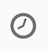

# Dossier d'utilisation du workflow : Retarguer le flux de travail en envoyant une nouvelle livraison à des non-ouvriers{#retargeting-delivery-to-non-openers}

Vous pouvez envoyer un courriel à vos clients, puis un SMS à ceux qui n'ont pas ouvert le courrier.

1. In **[!UICONTROL Marketing Activities]**, click **[!UICONTROL Create]** and select **[!UICONTROL Workflow]**.
1. Sélectionnez **[!UICONTROL Nouveau workflow]** comme type de workflow et cliquez sur **[!UICONTROL Suivant]**.
1. Entrez les propriétés du workflow et cliquez sur **[!UICONTROL Créer]**.

## Creating a query activity{#creating-a-query-activity}

1. Dans **[!UICONTROL Activités]** &gt; **[!UICONTROL Ciblage]**, faites glisser et déposez une activité **[!UICONTROL de]** requête.
1. Double-cliquez sur l'activité.
1. Dans **[!UICONTROL Raccourcis]**, faites glisser-déplacer **[!UICONTROL Profils]** et sélectionnez **[!UICONTROL e-mail]** avec l'opérateur **[!UICONTROL n'est pas vide]**.
1. Dans **[!UICONTROL Raccourcis]**, faites glisser et déplacer **[!UICONTROL Profils]** et sélectionnez **[!UICONTROL ne plus contacter par e-mail]** avec la valeur **[!UICONTROL no]**.
1. Cliquez sur **[!UICONTROL Confirmer]**.

## Creating an email delivery{#creating-an-email-delivery}

1. Faites glisser et déposez une livraison **[!UICONTROL par]** e-mail après chaque segment.
1. Cliquez sur l'activité et sélectionnez  à modifier.
1. Sélectionnez **[!UICONTROL Simple email]** et cliquez sur **[!UICONTROL Suivant]**.
1. Sélectionnez **[!UICONTROL Ajouter une transition sortante sans la population]** et cliquez sur **[!UICONTROL Suivant]**.
1. Sélectionnez un modèle de courriel et cliquez sur **[!UICONTROL Suivant]**.
1. Entrez les propriétés du courrier électronique et cliquez sur **[!UICONTROL Suivant]**.
1. Pour créer la mise en page de votre e-mail, cliquez sur **[!UICONTROL Utiliser le Concepteur]** d'e-mails.
1. Insérez des éléments ou sélectionnez un modèle existant.
1. Personnalisez votre e-mail avec des offres spécifiques à chaque emplacement.Pour plus d'informations, reportez-vous à la [conception d'un e-mail](../../designing/using/designing-from-scratch.md#designing-an-email-content-from-scratch).
1. Cliquez sur **[!UICONTROL Aperçu]** pour vérifier votre disposition.
1. Cliquez sur **[!UICONTROL Enregistrer]**.

## Ciblage des non-ouverture dans une activité de requête{#targeting-non-openers-in-a-query-activity}

1. Dans **[!UICONTROL Activités]** &gt; **[!UICONTROL Exécution]**, faites glisser et déposez une activité **** Attente.
1. Dans **[!UICONTROL Durée]**, cliquez sur  et sélectionnez un jour.
1. Dans **[!UICONTROL Activités]** &gt; **[!UICONTROL Ciblage]**, faites glisser et déposez une activité **[!UICONTROL de]** requête.
1. Double-cliquez sur l'activité.
1. Dans **[!UICONTROL Raccourcis]**, faites glisser-déplacer les journaux **[!UICONTROL de]** suivi et l'opérateur **[!UICONTROL existe]**.
1. Dans **[!UICONTROL Raccourcis]**&gt; **[!UICONTROL Livraison]**, glisser-déplacer la **[!UICONTROL livraison]** avec l'opérateur **[!UICONTROL est égal à]** et sélectionnez la livraison comme valeur.
1. Dans **[!UICONTROL Raccourcis]**&gt; **[!UICONTROL Livraison]**, faites glisser et déplacer le **[!UICONTROL type]** et cochez **[!UICONTROL Ouvrir]** comme valeur.
1. Sélectionnez l'opérateur entre les règles comme **[!UICONTROL sauf]**.
1. Cliquez sur **[!UICONTROL Confirmer]**.

## Création d'une livraison sms{#creating-a-sms-delivery}

1. Faites glisser et déposez une livraison sms après chaque segment.
1. Cliquez sur l'activité et sélectionnez  à modifier.
1. Sélectionnez **[!UICONTROL Simple sms]** et cliquez sur **[!UICONTROL Suivant]**.
1. Sélectionnez un modèle sms et cliquez sur **[!UICONTROL Suivant]**.
1. Entrez les propriétés sms et cliquez sur **[!UICONTROL Suivant]**.
1. Pour créer la mise en page de votre sms, cliquez sur **[!UICONTROL Email Designer]**.
1. Insérez des éléments ou sélectionnez un modèle existant.
1. Personnalisez votre sms avec des offres spécifiques à chaque emplacement.
Pour plus d'informations, reportez-vous à [la conception d'un système de gestion des données](../../channels/using/creating-an-sms-message.md).
1. Cliquez sur **[!UICONTROL Aperçu]** pour vérifier votre disposition.
1. Cliquez sur **[!UICONTROL Enregistrer]**.

**Rubriques connexes :**

* [Requête](../../automating/using/query.md)
* [Diffusion SMS](../../automating/using/sms-delivery.md)
* [Diffusion Email ](../../automating/using/email-delivery.md)
* [Canal email](../../channels/using/creating-an-email.md)
