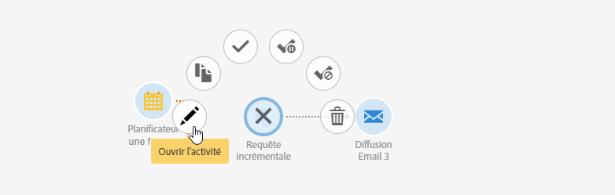

# Interface des workflows{#workflow-interface}

Dans le cadre de vos campagnes et programmes, vous pouvez créer des workflows afin de gérer des processus complets.

L'écran d'édition d'un workflow se compose des éléments suivants:

* la [palette](../../automating/using/workflow-interface.md#palette), référençant les activités disponibles
* l'[espace de travail](../../automating/using/workflow-interface.md#workspace), dans lequel les activités sont paramétrées et organisées
* la [barre d'actions](../../automating/using/workflow-interface.md#action-bar), composée des boutons permettant d'interagir avec le workflow et ses composants.
* les [actions rapides](../../automating/using/workflow-interface.md#quick-actions), qui s'affichent autour d'une activité sélectionnée, permettant d'interagir avec cette dernière.

## Palette {#palette}

La palette se situe sur la partie gauche de l'écran. Toutes les activités disponibles sont réparties en plusieurs catégories:

* [Ciblage](../../automating/using/about-targeting-activities.md) : activités spécifiques à la réalisation d'un ciblage, à la manipulation et au filtrage de populations
* [Exécution](../../automating/using/about-execution-activities.md) : activités spécifiques à l'organisation et à l'exécution du workflow
* [Canaux](../../automating/using/about-channel-activities.md) : activités représentant les différents canaux de communication disponibles
* [Data Management (ETL)](../../automating/using/about-data-management-activities.md) : activités de manipulation des données

Pour utiliser une activité de la palette dans votre workflow, faites-la glisser jusqu'à l'emplacement de votre choix dans l'espace de travail.

Vous devez paramétrer chaque activité ajoutée depuis la palette avant de démarrer le workflow.

## Espace de travail {#workspace}

L'espace de travail est la zone centrale de l'éditeur de workflows. C'est dans cette zone que vous pouvez déposer vos activités, les relier entre-elles à l'aide de transitions et les paramétrer.

Pour lier deux activités, déplacez l'extrémité de la transition de la première activité jusqu'à l'activité suivante. Vous pouvez aussi déplacer la seconde activité sur l'extrémité de la flèche de la première. Si vous déplacez l'une des deux activités, elles restent liées.

Les transitions qui suivent les activités traitant des données contiennent les populations intermédiaires. Vous pouvez y accéder si vous avez coché l'option **[!UICONTROL Conserver les résultats intermédiaires]** dans la section **Exécution]des propriétés du workflow.[!UICONTROL **

Lorsqu'une activité est sélectionnée, des actions rapides s'affichent autour de celle-ci et permettent d'interagir avec. Par exemple pour paramétrer une activité, sélectionnez-la puis ouvrez-la à l'aide du bouton 

Certains raccourcis sont activés uniquement au niveau de l'espace de travail :

* sélection de plusieurs activités et transitions en dessinant une zone autour de ces dernières.
* touche **Ctrl** + clic gauche pour sélectionner plusieurs activités et/ou transitions.
* touche **Entrée** pour accéder au détail de l'activité ou de la transition actuellement sélectionnée.
* touche **Suppr** pour supprimer l'activité actuellement sélectionnée.
* touches **Ctrl + C** pour copier les activités sélectionnées et touches **Ctrl + V** pour les coller dans l'espace de travail.

## La barre d'actions {#action-bar}

En fonction des éléments sélectionnés dans l'espace de travail ou du statut d'exécution du workflow, les boutons disponibles dans la barre d'actions peuvent différer.

 **[!UICONTROL Ouvrir activitypermet]** de modifier les propriétés du processus.

 **[!UICONTROL Startlance]** le processus.

 **[!UICONTROL Pausepauses]** le processus.

 **[!UICONTROL Stopinterromts workflow execution]** . Sans possibilité de reprendre à l'endroit où il s'est arrêté.

 **[!UICONTROL Restartredémarre]** le processus.

 **[!UICONTROL Journal et tasksopens]** le journal d'exécution du flux de travaux.

 **[!UICONTROL Activer multi-selectionactive le mode]** de sélection multiple. Le workflow doit comporter au minimum deux activités.

 **[!UICONTROL Désactiver multi-selectiondésactive]** le mode de sélection multiple. 

 **[!UICONTROL Ouvrir la transition Ouvre]** la transition sélectionnée. 

  **[!UICONTROL Normal executionréactive]** la sélection si elle a été désactivée ou marquée comme mise en pause. 

 **[!UICONTROL Exécution suspendedpauses]** le workflow à l'activité sélectionnée. 

 **[!UICONTROL Aucun executiondésactive]** l'activité. 

 **[!UICONTROL Supprimer la selectionsupprime]** les activités sélectionnées. 

 **[!UICONTROL Copier le sélectioncopie]** les activités sélectionnées.

 **[!UICONTROL Pastepastes]** les activités qui ont été copiées.

## Actions rapides {#quick-actions}

Lorsqu'une activité est sélectionnée, des boutons d'actions rapides apparaissent autour de l'activité, permettant d'interagir avec cette dernière.

 **[!UICONTROL Ouvrir activityopen]** l'activité sélectionnée.

 **[!UICONTROL Copier le sélectioncopie]** de l'activité sélectionnée.

 **[!UICONTROL Ouvrez les options avancées de l'activité pour les]** options avancées de l'activité de remise par courrier électronique ou par SMS sélectionnée.

 **[!UICONTROL Normal executionréactive]** la sélection si elle a été désactivée ou marquée comme mise en pause.

 **[!UICONTROL Exécution suspendedpauses]** le workflow à l'activité sélectionnée.

 **[!UICONTROL Aucun executiondésactive]** l'activité.

 **[!UICONTROL Executionforce immédiatement]** le traitement immédiat de la sélection. Ce bouton est uniquement disponible pour les activités Planificateur et Attente.

 **[!UICONTROL Supprimer la selectionsupprime]** les activités sélectionnées.

## Duplication des activités de workflow {#duplicating-workflow-activities}

L'espace de travail permet de dupliquer des activités de workflow en les copiant et en les collant dans le même workflow ou dans un autre depuis une même instance de Campaign.

Une fois une activité dupliquée, l'ensemble de sa configuration est conservée. Pour les activités de diffusion (email, SMS, notification push, etc.), l'objet de diffusion associé à l'activité est dupliqué.

>[!NOTE]
>
>Les activités de workflow ne peuvent pas être dupliquées d'une instance à une autre. Les activités des workflows techniques ne peuvent pas être dupliquées.

Pour dupliquer une activité, procédez comme suit :

1. Sélectionnez l'activité, puis cliquez sur le bouton **[!UICONTROL Copier la sélection]dans les actions rapides.**

   Vous pouvez également utiliser le raccourci clavier **Ctrl + C**.

   

1. Cliquez avec le bouton droit dans l'espace de travail du workflow cible, puis cliquez sur le bouton **[!UICONTROL Coller].**

   Vous pouvez également utiliser le raccourci clavier **Ctrl + V**.

   

1. L'activité est dupliquée avec tous les paramètres configurés initialement.

Il est également possible de copier-coller plusieurs activités, ce qui permet de dupliquer un workflow entier.

Pour ce faire, sélectionnez les activités en traçant une zone autour d'elles. Cliquez ensuite sur le bouton **[!UICONTROL Copier la sélection]** dans la barre d'actions (ou appuyez sur **Ctrl + C**). Vous pouvez coller les activités à l'emplacement de votre choix.

