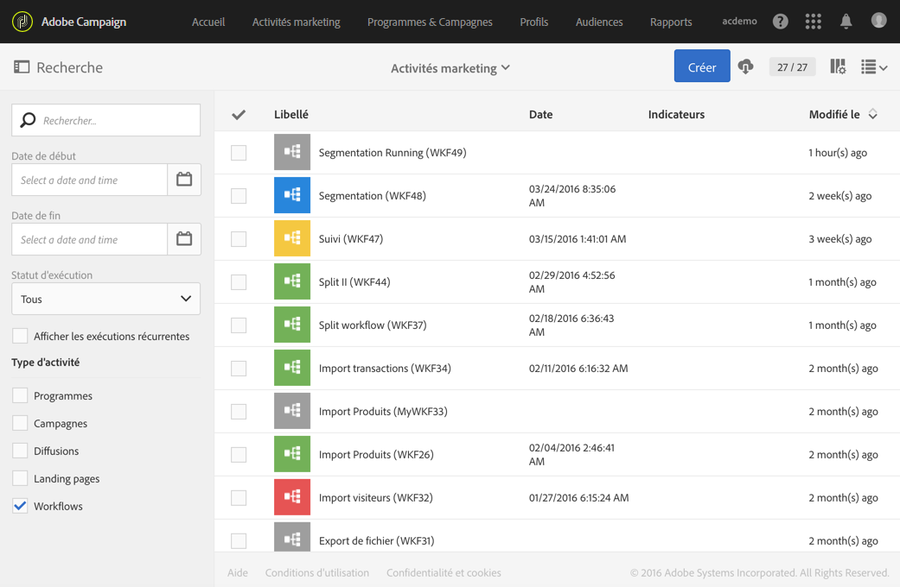

# Cycle de vie d&#39;un workflow {#life-cycle}

Le cycle de vie d’un workflow comporte trois grandes étapes, chacune d’elle étant associée à un statut et à une couleur :

* **En édition** (gris)

  C’est la phase de conception initiale d’un nouveau workflow (voir [Créer un workflow](../../automating/using/building-a-workflow.md#creating-a-workflow)). Un tel workflow n’est pas encore pris en charge par le serveur, il peut donc être modifié sans risque.

* **En cours** (bleu)

  Une fois la phase de conception terminée, le workflow peut être démarré et il est pris en charge par le serveur.

* **Terminé** (vert)

  Un workflow est terminé lorsqu’il n’a plus de tâche en cours ou quand un opérateur ou une opératrice a explicitement mis fin à l’instance.

Une fois qu’il a été démarré, un workflow peut également se voir attribuer deux autres statuts :

* **Avertissement** (jaune)

  Le workflow n’a pas pu se terminer ou a été mis en pause à l’aide des boutons  ou .

* **En erreur** (rouge)

  Une erreur est survenue pendant l’exécution du workflow. Ce dernier est arrêté et une action est requise de la part de l’utilisateur. Pour connaître l&#39;origine de l&#39;erreur, utilisez le bouton  afin d&#39;accéder au log du workflow (voir [Contrôle](../../automating/using/monitoring-workflow-execution.md)).

La liste des activités marketing permet d’afficher tous les workflows ainsi que leur statut. Voir à ce sujet la section [Gérer les activités marketing](../../start/using/marketing-activities.md#about-marketing-activities).

