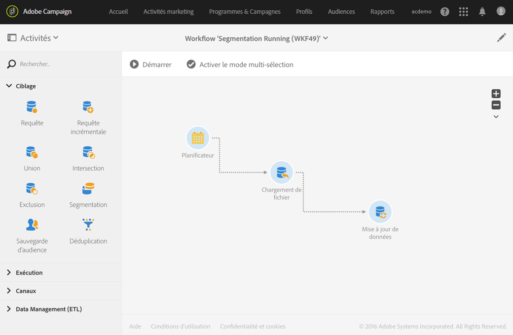

# Principes de fonctionnement des workflows{#workflow-operating-principles}

Un workflow est un **enchaînement d'activités paramétrables**. Chaque activité possède un rôle précis dans le processus. Le résultat de chaque activité est transmis à l'activité suivante via une **transition**, représentée par une flèche.

Le type des données transmises d'une activité à une autre peut influer sur le paramétrage des activités suivantes. Par exemple, si une population est définie avant une activité de diffusion d'email, elle peut servir de cible pour l'email en question.

Vous pouvez ouvrir les activités afin d'en vérifier ou modifier les paramètres avant ou après l'exécution du workflow.

Vous pouvez ouvrir les transitions afin de vérifier que les données transmises sont correctes pendant ou après l'exécution du workflow. Pour accéder au détail des transitions, vous devez cocher l'option **[!UICONTROL Conserver les résultats intermédiaires]** dans la section **Exécution]des propriétés du workflow.[!UICONTROL **

