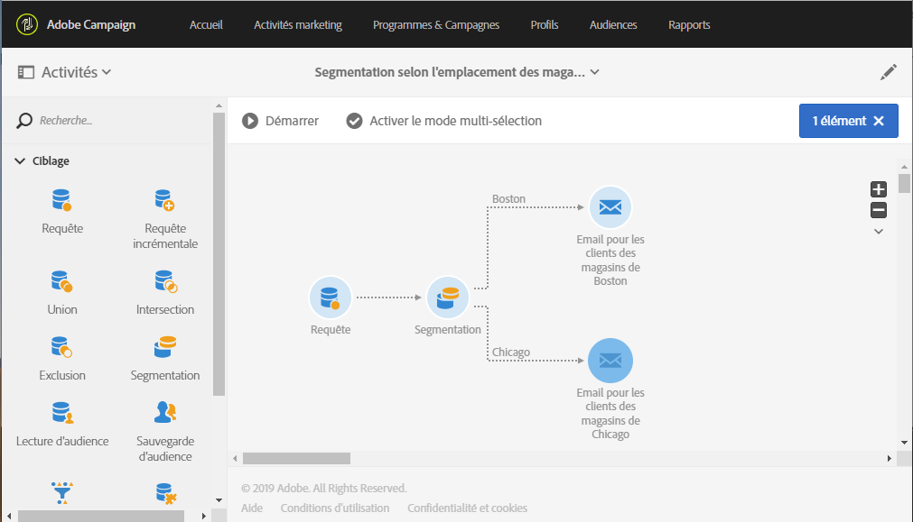

# Segmentation en fonction de la localisation {#segmentation-on-location}

Vous pouvez envoyer un email de ciblage aux clients avec des offres dans leurs magasins locaux.

1. Dans **[!UICONTROL Activités marketing]**, cliquez sur **[!UICONTROL Créer]** et sélectionnez **[!UICONTROL Workflow]**.
1. Sélectionnez **[!UICONTROL Nouveau workflow]** en tant que type de workflow et cliquez sur **[!UICONTROL Suivant]**.
1. Saisissez les propriétés du workflow, puis cliquez sur **[!UICONTROL Créer]**.

## Sélectionner les destinataires pouvant être contactés par email{#selecting-recipients-contactable-via-email}

1. Dans **[!UICONTROL Activités]** > **[!UICONTROL Ciblage]**, effectuez un glisser-déposer d’une activité Requête .
1. Double-cliquez sur l&#39;activité.
1. Dans **[!UICONTROL Raccourcis]**, effectuez un glisser-déposer d&#39;un élément **[!UICONTROL Profils]** et sélectionnez le champ **[!UICONTROL email]** avec l&#39;opérateur **[!UICONTROL n&#39;est pas vide]**.
1. Dans **[!UICONTROL Raccourcis]**, effectuez un glisser-déposer d&#39;un élément **[!UICONTROL Profils]** et sélectionnez le champ **[!UICONTROL Ne plus contacter par email]** avec la valeur **[!UICONTROL non]**.
1. Cliquez sur **[!UICONTROL Confirmer]** à deux reprises.

## Créer une activité Segmentation{#creating-a-segmentation-activity}

1. Effectuez un glisser-déposer d&#39;une activité [Segmentation](../../automating/using/segmentation.md) et double-cliquez dessus.
1. Cliquez sur le segment, puis ouvrez la transition pour cibler les gens de la première ville. Ici, Paris.
1. Effectuez un glisser-déposer de l&#39;élément **[!UICONTROL Localisation]** et sélectionnez **[!UICONTROL Ville]** avec l&#39;opérateur **[!UICONTROL égal à]** et la valeur **[!UICONTROL Paris]**.
Remarque : pour atteindre toutes les personnes qui ont entré paris, quelle que soit la casse, décochez l&#39;option Sensible à la casse.
1. Cliquez sur **[!UICONTROL Confirmer]**.
1. Dans **[!UICONTROL Liste des segments en sortie]**, cliquez sur **[!UICONTROL Ajouter un élément]** et sur  pour créer un segment ciblant les personnes dans la deuxième ville. Ici, Toulouse.
1. Effectuez un glisser-déposer de l&#39;élément **[!UICONTROL Localisation]**, sélectionnez **[!UICONTROL Ville]** avec l&#39;opérateur **[!UICONTROL égal à]** et saisissez la valeur **[!UICONTROL Toulouse]**.
1. Pour atteindre toutes les personnes qui ont entré toulouse, quelle que soit la casse, décochez l&#39;option Sensible à la casse.
1. Cliquez sur **[!UICONTROL Confirmer]**.

## Créer une diffusion email{#creating-an-email-delivery}

1. Dans **[!UICONTROL Activités]** > **[!UICONTROL Canaux]**, effectuez un glisser-déposer d’une activité [Diffusion Email](../../automating/using/email-delivery.md) après chaque segment.
1. Cliquez sur l&#39;activité et sélectionnez  pour édition.
1. Sélectionnez **[!UICONTROL Email simple]** et cliquez sur **[!UICONTROL Suivant]**.
1. Sélectionnez un modèle d&#39;email et cliquez sur **[!UICONTROL Suivant]**.
1. Saisissez les propriétés de l&#39;email et cliquez sur **[!UICONTROL Suivant]**.
1. Pour créer la mise en page de votre email, cliquez sur **[!UICONTROL Concepteur d&#39;email]**.
1. Insérez des éléments ou sélectionnez un modèle existant.
1. Personnalisez votre email avec des offres spécifiques à chaque emplacement.

   Pour plus d&#39;informations, consultez la section décrivant la [conception d&#39;un email](../../designing/using/designing-from-scratch.md#designing-an-email-content-from-scratch).

1. Cliquez sur **[!UICONTROL Aperçu]** pour vérifier votre mise en page.
1. Cliquez sur **[!UICONTROL Enregistrer]**.

