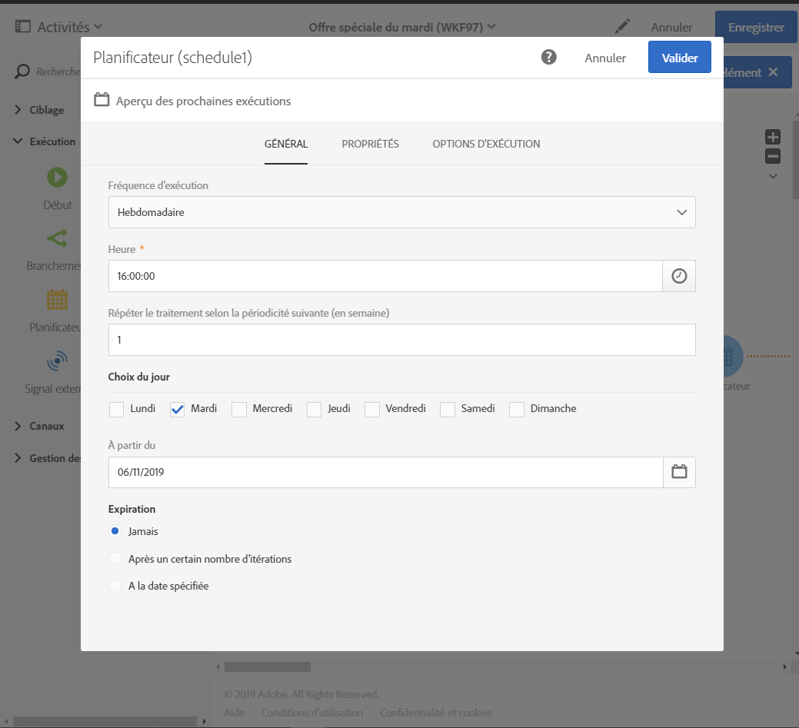

# Utilisation du vorflow : Créez un courrier électronique chaque mardi{#creating-email-every-tuesday}

Vous pouvez envoyer un email chaque mardi à tous les clients pour les offres spéciales.

1. In **[!UICONTROL Marketing Activities]**, click **[!UICONTROL Create]** and select **[!UICONTROL Workflow]**.
1. Sélectionnez **[!UICONTROL Nouveau Workflow]** comme type de flux de travail et cliquez **[!UICONTROL sur Suivant]**.
1. Entrez les propriétés du flux de travail et cliquez **[!UICONTROL sur Créer]**.

## Creating a Scheduler activity{#creating-a-scheduler-activity}

1. Dans **[!UICONTROL Activités]** &gt; **[!UICONTROL Exécution]**, glisser-déposer une **[!UICONTROL activité]** de planificateur.
1. Double-cliquez sur l'activité.
1. Configurez l'exécution de votre livraison.
1. Dans **[!UICONTROL la fréquence d'exécution]**, sélectionnez **[!UICONTROL Weekly]**.
1. Sélectionnez **[!UICONTROL un temps]** et une **[!UICONTROL fréquence de répétition]** pour vos livraisons.
1. Dans **[!UICONTROL les jours de la semaine]**, sélectionnez **[!UICONTROL Mardi]**.
1. Spécifiez un **[!UICONTROL paramètre Start]** et **[!UICONTROL un]** paramètre d'expiration pour votre flux de travail.

>[!NOTE]
>
>Pour démarrer votre flux de travail dans une zone **** temporelle **[!UICONTROL spécifique, dans]** l'onglet Options d'exécution, installez le fuseau horaire pour votre programmeur dans le champ Time Zone.

1. Validez votre activité et sauvegardez votre workflow.

## Creating a Query activity{#creating-a-query-activity}

1. Dans **[!UICONTROL Activités]** &gt; **[!UICONTROL Cibler]**, sélectionner les destinataires, glisser-déposer une **[!UICONTROL activité de requête]** et double-cliquez dessus.
1. Dans **[!UICONTROL Raccourcis]** &gt; **[!UICONTROL Profil]**, drag-and-drop **[!UICONTROL email]**.
1. Sélectionnez **[!UICONTROL n'est pas vide]** en tant qu'opérateur.
1. Dans **[!UICONTROL Raccourcis]** &gt; **[!UICONTROL Généralités]**, ajoutez des profils et ne sélectionnez **[!UICONTROL plus le contact par email]** avec la valeur **[!UICONTROL No]**.
1. Cliquez sur **[!UICONTROL Confirmer]**.

## Creating an Email delivery{#creating-an-email-delivery}

1. Dans **[!UICONTROL Activités]** &gt; **[!UICONTROL Canaux]**, glisser-déposer une **[!UICONTROL livraison par courriel]**.
1. Cliquez sur l'activité et sélectionnez  à modifier.
1. Sélectionnez **[!UICONTROL E-mail récurrent]** et cliquez **[!UICONTROL sur Suivant]**.
1. Sélectionnez un modèle de courriel et cliquez **[!UICONTROL sur Suivant]**.
1. Entrez les propriétés de courriel et cliquez **[!UICONTROL sur Suivant]**.
1. Pour créer la disposition de votre courriel, cliquez sur **[!UICONTROL Utiliser le concepteur de courriel]**.
1. Insérez des éléments ou sélectionnez un modèle existant.
1. Personnalisez votre courriel en utilisant des champs et des liens.
1. Cliquez sur **[!UICONTROL Enregistrer]**.

Pour plus d'informations, reportez-vous [à la conception d'un courriel](../../designing/using/about-email-content-design.md#designing-an-email-content-from-scratch).

**Rubriques connexes :**

* [activité de requête](../..//automating/using/query.md)
* [activité de l'ordonnateur](../..//automating/using/scheduler.md)
* [Diffusion Email ](../..//automating/using/email-delivery.md)
* [Canal email](../..//channels/using/creating-an-email.md)
