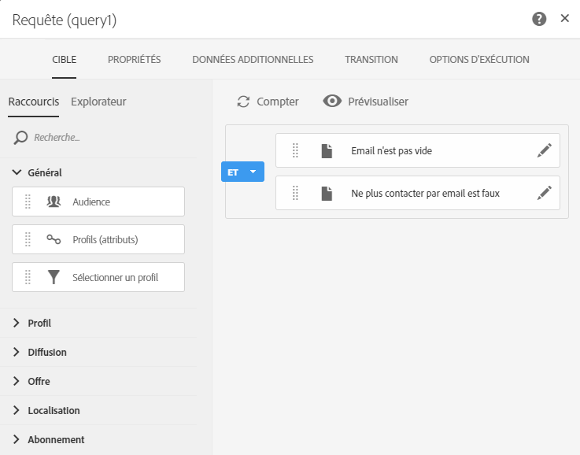

# Cas pratique de workflow : création d'une diffusion email tous les mardis{#creating-email-every-tuesday}

Vous pouvez envoyer un email tous les mardis à tous les clients pour des offres spéciales.

1. Dans **[!UICONTROL Activités marketing]**, cliquez sur **[!UICONTROL Créer]**, puis sélectionnez **[!UICONTROL Workflow]**.
1. Sélectionnez **[!UICONTROL Nouveau workflow]** en tant que type de workflow et cliquez sur **[!UICONTROL Suivant]**.
1. Saisissez les propriétés du workflow, puis cliquez sur **[!UICONTROL Créer]**.

## Créer une activité Planificateur{#creating-a-scheduler-activity}

1. Dans **[!UICONTROL Activités]** &gt; **[!UICONTROL Exécution]**, effectuez un glisser-déposer d'une activité **[!UICONTROL Planificateur]**.
1. Double-cliquez sur l'activité.
1. Configurez l'exécution de votre diffusion.
1. Dans **[!UICONTROL Fréquence d'exécution]**, sélectionnez **[!UICONTROL Hebdomadaire]**.
1. Sélectionnez une **[!UICONTROL Heure]** et **[!UICONTROL Répéter le traitement selon la périodicité suivante]** pour vos diffusions.
1. Dans **[!UICONTROL Jours de la semaine]**, sélectionnez **[!UICONTROL Mardi]**.
1. Spécifiez un paramètre de **[!UICONTROL Début]** et d'**[!UICONTROL Expiration]** pour le workflow.
1. Validez votre activité et sauvegardez votre workflow.

>[!NOTE]
>
>Pour démarrer votre workflow dans un **[!UICONTROL Fuseau horaire]** spécifique, dans l'onglet **[!UICONTROL Options d'exécution]**, configurez le fuseau horaire du planificateur dans le champ Fuseau horaire.

## Créer une activité Requête{#creating-a-query-activity}

1. Dans **[!UICONTROL Activités]** &gt; **[!UICONTROL Ciblage]**, pour sélectionner des destinataires, effectuez un glisser-déposer d'une activité **[!UICONTROL Requête]** et double-cliquez dessus.
1. Dans **[!UICONTROL Raccourcis]** &gt; **[!UICONTROL Profil]**, effectuez un glisser-déposer de l'élément **[!UICONTROL Email]**.
1. Sélectionnez **[!UICONTROL n'est pas vide]** en tant qu'opérateur.
1. Dans **[!UICONTROL Raccourcis]** &gt; **[!UICONTROL Général]**, ajoutez des profils et sélectionnez **[!UICONTROL Ne plus contacter par email]** avec la valeur **[!UICONTROL Non]**.
1. Cliquez sur **[!UICONTROL Confirmer]**.

## Créer une diffusion Email{#creating-an-email-delivery}

1. Dans **[!UICONTROL Activités]** &gt; **[!UICONTROL Canaux]**, effectuez un glisser-déposer d'une activité **[!UICONTROL Diffusion Email]**.
1. Cliquez sur l'activité et sélectionnez  pour édition.
1. Sélectionnez **[!UICONTROL Email récurrent]** et cliquez sur **[!UICONTROL Suivant]**.
1. Sélectionnez un modèle d'email et cliquez sur **[!UICONTROL Suivant]**.
1. Saisissez les propriétés de l'email et cliquez sur **[!UICONTROL Suivant]**.
1. Pour créer la disposition de votre email, cliquez sur **[!UICONTROL Utiliser le Concepteur d'email]**.
1. Insérez des éléments ou sélectionnez un modèle existant.
1. Personnalisez votre email à l'aide de champs et de liens.
1. Cliquez sur **[!UICONTROL Enregistrer]**.

Pour plus d'informations, consultez la section décrivant la [conception d'un email](../../designing/using/designing-from-scratch.md#designing-an-email-content-from-scratch).

**Rubriques connexes :**

* [Activité Requête](../..//automating/using/query.md)
* [Activité Planificateur](../..//automating/using/scheduler.md)
* [Diffusion Email ](../..//automating/using/email-delivery.md)
* [Canal email](../..//channels/using/creating-an-email.md)
