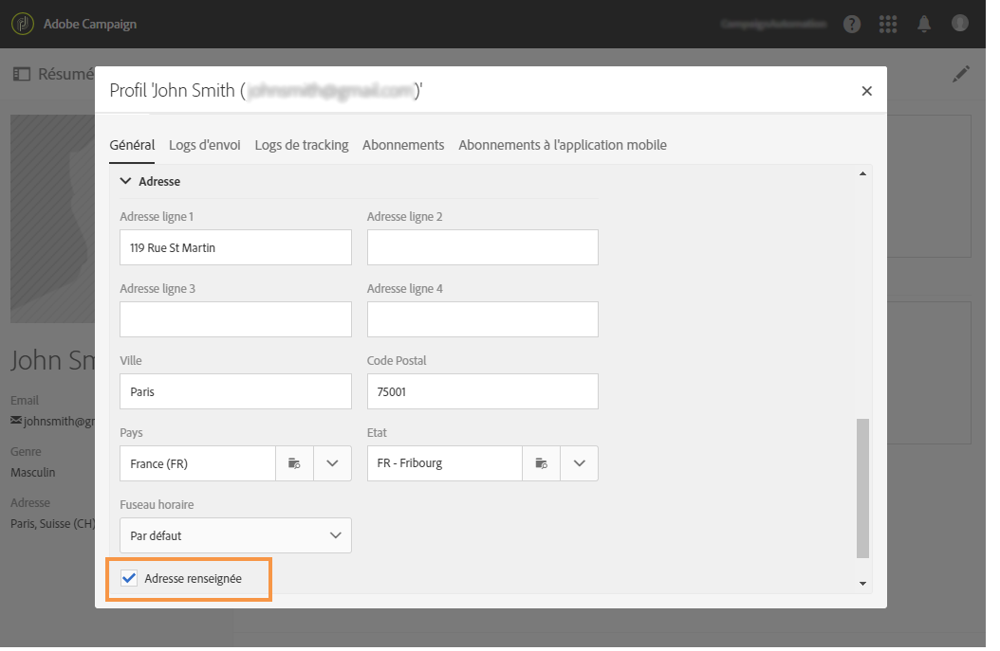
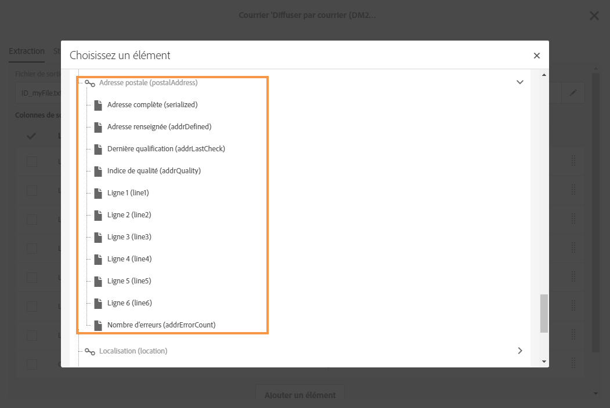

# À propos du courrier{#about-direct-mail}

Courrier est un canal hors ligne qui vous permet de personnaliser et de générer un fichier externe à partager avec vos opérateurs de courrier.Il vous donne la possibilité de combiner les canaux en ligne et hors ligne dans vos parcours clientèle.

>[!NOTE]
>
>Cette fonctionnalité est facultative.Veuillez vérifier votre contrat de licence.Le rôle **[!UICONTROL Export]** est requis pour utiliser le canal Courrier. Veuillez contacter votre administrateur.

Les canaux en ligne vous permettent de créer vos messages (e-mail, SMS, diffusion d’applications mobiles, etc.)et de les envoyer à votre audience directement depuis Adobe Campaign.Avec les canaux hors ligne, c’est différent.Lors de la préparation d’une diffusion courrier, Adobe Campaign génère un fichier comprenant tous les profils ciblés et les informations de contact sélectionnées (adresse postale, par exemple).Vous pourrez ensuite envoyer ce fichier à votre fournisseur de courrier qui se chargera de l’envoi.

La section ci-après décrit comment créer et gérer une diffusion courrier ponctuelle. Vous avez également la possibilité d&#39;inclure une activité de type courrier dans un workflow pour orchestrer des campagnes qui associent des canaux on-line et off-line. Voir à ce propos le guide [Workflows](../../automating/using/get-started-workflows.md).

Dans Adobe Campaign, le processus utilisateur est le suivant :

1. Créer la diffusion
1. Définir l&#39;audience
1. Définir le contenu
1. Définir la date de contact
1. Générer le fichier

**Rubriques connexes :**

* [Cas pratique : diffusions conjointes d’emails et de courriers](../../automating/using/coupling-email-direct-mail.md)

## Recommandations {#recommendations}

### Fournisseurs de courrier {#direct-mail-providers}

Tout d&#39;abord, vous devez prendre connaissance des recommandations de votre opérateur de services postaux. Identifiez les informations de profil à inclure dans le fichier d&#39;extraction pour qu&#39;il puisse personnaliser la communication et l&#39;envoyer à l&#39;audience. Par exemple, le nom et le prénom, l’adresse postale, un code promotionnel, etc. Ces champs sont ceux que vous ajouterez dans l’onglet [Définir l’extraction](../../channels/using/defining-the-direct-mail-content.md#defining-the-extraction) du contenu du courrier.

Assurez-vous que la case **[!UICONTROL Adresse renseignée]** est cochée dans les informations des profils. Si cette option est activée, le profil est ajouté à la cible. Si ce n&#39;est pas le cas, il est exclu par une règle de typologie pendant la phase de préparation (voir [Créer le courrier](../../channels/using/creating-the-direct-mail.md)). Pendant l&#39;import des profils, pensez à mettre à jour ce champ.

### Adresses postales {#postal-addresses}

Lors de l&#39;ajout des champs à inclure dans le fichier d&#39;extraction, les champs d&#39;adresse postale sont accessibles dans le nœud **[!UICONTROL Localisation]**.

Adobe Campaign vous propose un ensemble de champs calculés prédéfinis qui respectent les normes les plus courantes des adresses postales. Ces champs sont accessibles dans le nœud **[!UICONTROL Adresse postale]**.

Par défaut, une adresse peut contenir jusqu&#39;à six lignes : la première ligne (**[!UICONTROL Ligne 1]**) contient le prénom et le nom, les suivantes contiennent les coordonnées postales (rue et compléments) et la dernière contient le code postal et la ville.

