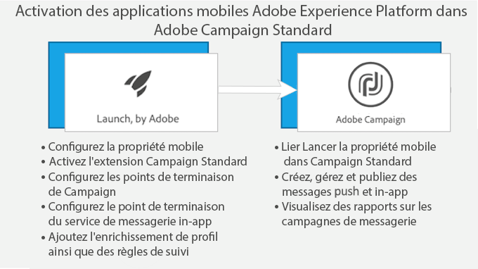

# A propos de la messagerie in-app{#about-in-app-messaging}

La messagerie in-app est un canal de messagerie qui permet d'afficher un message lorsque l'utilisateur est actif dans l'application mobile. Ce type de message complète les notifications push qui sont diffusées au centre de notification du téléphone de l'utilisateur. Pour plus d'informations sur le canal Notification push, consultez cette [section](../../channels/using/about-push-notifications.md).

Pour ce canal, les applications mobiles doivent être intégrées avec le SDK Adobe Experience Platform. Ces applications doivent être activées dans Adobe Experience Platform Launch avant d'être disponibles dans Adobe Campaign pour les remises In-App.

Pour commencer à envoyer des messages In-App sur des applications mobiles en utilisant le SDK Experience Platform, vous devez remplir les conditions préalables suivantes :

1. Dans Adobe Campaign, vérifiez que vous pouvez accéder au canal **[!UICONTROL In-App].** Si vous ne pouvez pas accéder à ces canaux, contactez l'équipe de votre compte.
1. Dans Launch Platform Launch, créez l'application mobile en créant une propriété mobile et en instrumentant votre application mobile avec le SDK Experience Platform.

   Pour plus d'informations, consultez la section sur la [configuration d'une application mobile](https://aep-sdks.gitbook.io/docs/getting-started/create-a-mobile-property) dans la documentation Adobe Launch.

1. In Experience Platform Launch, install the **[!UICONTROL Adobe Campaign Standard]** extension for your mobile application in Experience Platform Launch:

   For more on extensions, refer to the [Configure Campaign Standard Extension in Experience Platform Launch](https://aep-sdks.gitbook.io/docs/using-mobile-extensions/adobe-campaign-standard) in Experience Platform Launch documentation.

1. In Experience Platform Launch, configure rules and data elements for your application, see [Configuring your application in Experience Platform Launch](https://helpx.adobe.com/campaign/kb/configuring-app-sdk.html#ConfiguringyourapplicationinLaunch)
1. Configure your Experience Platform Launch application in Adobe Campaign Standard, see [Setting up your Experience Platform Launch application in Adobe Campaign](https://helpx.adobe.com/campaign/kb/configuring-app-sdk.html#SettingupyourAdobeLaunchapplicationinAdobeCampaign) .

Pour découvrir comment configurer les SDK Experience Platform, consultez cette [page](https://helpx.adobe.com/campaign/kb/configuring-app-sdk.html).

**Contenu connexe :**

* [Préparation et envoi d'un message In-App](../../channels/using/preparing-and-sending-an-in-app-message.md)
* [Personnalisation d'un message in-app](../../channels/using/customizing-an-in-app-message.md)
* [Personnaliser un type de message de notification locale](../../channels/using/customizing-an-in-app-message.md#customizing-a-local-notification-message-type)
* [Envoi d'un message In-App dans un workflow](../../automating/using/in-app-delivery.md)
* [FAQ sur les notifications Push et In-App](https://helpx.adobe.com/campaign/kb/push_inapp_faq.html)