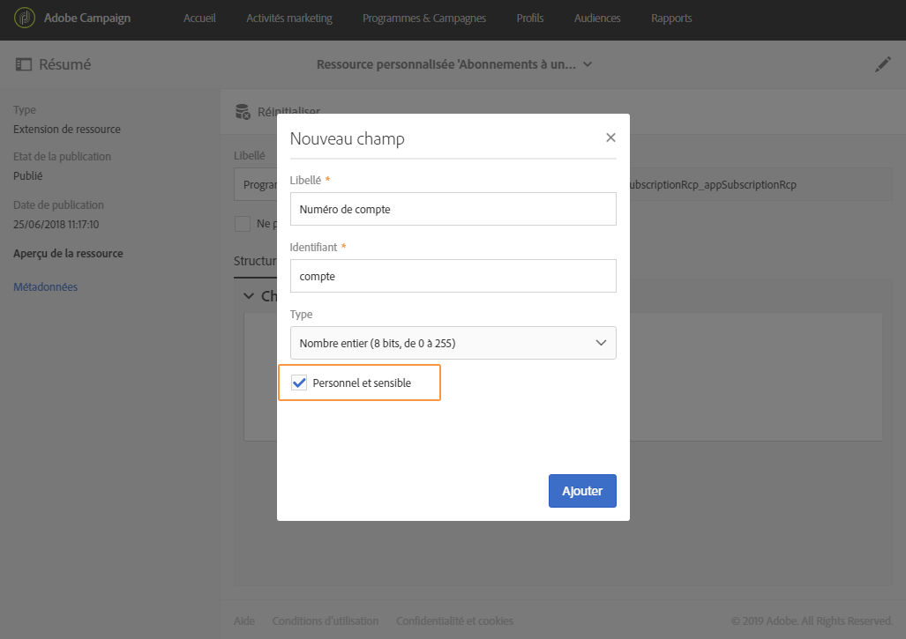

# À propos de la messagerie In-App{#about-in-app-messaging}

La messagerie in-app est un canal de messagerie qui permet d&#39;afficher un message lorsque l&#39;utilisateur est actif dans l&#39;application mobile. Ce type de message complète les notifications push qui sont diffusées au centre de notification du téléphone de l&#39;utilisateur. Pour plus d&#39;informations sur le canal Notification push, consultez cette [section](../../channels/using/about-push-notifications.md).

Pour ce canal, les applications mobiles doivent être intégrées avec le SDK Adobe Experience Platform. Ces applications doivent être activées dans Adobe Experience Platform Launch avant d&#39;être disponibles dans Adobe Campaign pour les diffusions In-App.

Pour commencer à envoyer des messages In-App sur des applications mobiles en utilisant le SDK Experience Platform, vous devez remplir les conditions préalables suivantes :

1. Dans Adobe Campaign, vérifiez que vous pouvez accéder au canal **[!UICONTROL In-App]**. Si vous ne pouvez pas accéder à ces canaux, contactez l&#39;équipe de votre compte.

1. Pour tirer parti des cas pratiques mobiles dans Adobe Campaign Standard avec une application SDK Experience Cloud, une application mobile doit être créée dans Adobe Experience Platform Launch et configurée dans Adobe Campaign. Pour consulter le guide détaillé, reportez-vous à cette [page](../../administration/using/configuring-a-mobile-application.md).

1. Une fois la configuration effectuée, vous pouvez préparer votre message in-app. Pour plus d&#39;informations à ce propos, Voir à ce propos consultez [cette page](../../channels/using/preparing-and-sending-an-in-app-message.md#preparing-your-in-app-message).

1. Vous pouvez ensuite décider d&#39;envoyer un [message in-app](../../channels/using/customizing-an-in-app-message.md) ou de [personnaliser un type de message de notification locale](../../channels/using/customizing-an-in-app-message.md#customizing-a-local-notification-message-type).

1. Votre diffusion est maintenant prête à être envoyée. Pour en savoir plus, consultez cette [page](../../channels/using/preparing-and-sending-an-in-app-message.md#sending-your-in-app-message).

**Contenu connexe:**

* [Rapport In-App](../../reporting/using/in-app-report.md)
* [Cas pratiques mobiles pris en charge dans Adobe Campaign Standard](../../administration/using/configuring-rules-launch.md)
* [Guide de Campaign Standard Mobile](../../channels/using/get-started-communication-channels.md)

## Gestion des champs de profil mobile avec des données personnelles et sensibles          {#handling-mobile-profile-fields-with-personal-and-sensitive-data}

Dans Adobe Campaign, les données d’attributs de profil mobile envoyées depuis un appareil mobile sont stockées dans la ressource **[!UICONTROL Abonnements à une application (appSubscriptionRcp)]** qui permet de définir les données que vous souhaitez collecter auprès des abonnés de vos applications.

Cette ressource doit être étendue pour collecter les données que vous avez l’intention d’envoyer depuis d’appareil mobile vers Adobe Campaign. Consultez à ce propos cette [page](../../developing/using/extending-the-subscriptions-to-an-application-resource.md).

Pour permettre une personnalisation plus sécurisée de vos messages In-App, les champs de profil mobile de cette ressource doivent être configurés en conséquence. Dans vos **[!UICONTROL Abonnements à une application (appSubscriptionRcp)]**, lors de la création de vos champs de profils mobiles, cochez **[!UICONTROL Personnel et sensible]** pour les rendre non disponibles durant la personnalisation des messages In-App.

>[!NOTE]
>
>Si une implémentation existe avec une extension de ressource personnalisée sur cette table, nous vous conseillons de libeller les champs de manière adéquate avant de les utiliser pour la personnalisation des messages In-App.

Une fois la ressource personnalisée **[!UICONTROL Abonnements à une application]** configurée et personnalisée, vous pouvez commencer à préparer la diffusion In-App à l&#39;aide du modèle **[!UICONTROL Cibler les utilisateurs en fonction de leur profil Mobile (inApp)]**. Seuls les champs qui ne sont pas personnels ni sensibles sont disponibles pour la personnalisation depuis la ressource **[!UICONTROL Abonnements à une application (appSubscriptionRcp)]**.

Si vous devez effectuer une personnalisation avec les champs **Personal and Sensitive**, il est recommandé d&#39;utiliser le modèle **[!UICONTROL Cibler les utilisateurs en fonction de leur profil Campaign (inAppProfile)]** qui possède un mécanisme de sécurité supplémentaire pour veiller à ce que les informations PII de vos utilisateurs restent protégées.