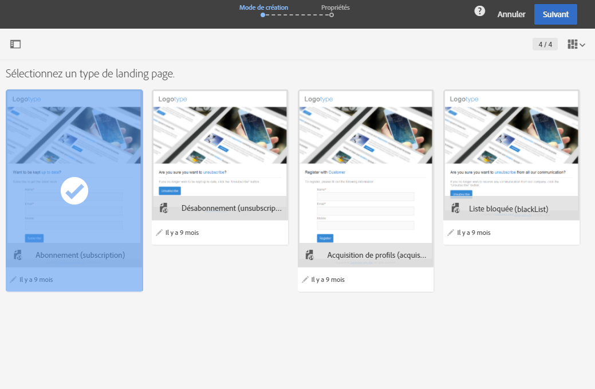
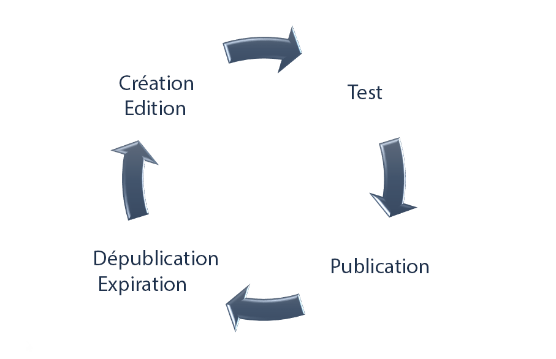

# A propos des landing pages{#about-landing-pages}

Campaign intègre des landing pages. Il s'agit de formulaires web pouvant être utilisés en vue de capturer des informations sur vos audiences, d'offrir des abonnements à un service, d'afficher des données et de développer votre base de données. Les landing pages peuvent également être utilisées pour acquérir ou mettre à jour des profils existants.

>[!CAUTION]
>
>Les landing pages peuvent uniquement être utilisées pour mettre à jour les profils.

Campaign intègre un jeu de modèles de landing page intégrés.

* **[!UICONTROL Acquisition]** : il s'agit du modèle par défaut des landing pages. Il permet de capturer et de mettre à jour les données dans la base de données Campaign.
* **[!UICONTROL Inscription]** : ce modèle doit être utilisé pour proposer des inscriptions à un service.
* **[!UICONTROL Désinscription]** : ce modèle peut être lié à un email envoyé aux abonnés à un service afin de leur permettre de se désinscrire de celui-ci.
* **[!UICONTROL Blackliste]** : ce modèle doit être utilisé lorsqu'un profil ne souhaite plus être contacté par Campaign. Pour plus d'informations sur le blacklistage, consultez [Les processus d'inscription et de désinscription dans Campaign](../../audiences/using/about-opt-in-and-opt-out-in-campaign.md).

Ces modèles sont proposés par défaut lors de la création d'une nouvelle landing page.

Adobe vous recommande de créer vos propres modèles en dupliquant un modèle intégré. Certains paramètres peuvent seulement être définis dans les modèles de landing page et ne sont pas modifiables directement sur les landing pages.

>[!NOTE]
>
>To access landing page templates, click the Adobe Campaign logo on the upper left corner and select **[!UICONTROL Resources]** &gt; **[!UICONTROL Templates]** &gt; **[!UICONTROL Landing page templates]**.

Le cycle de vie complet d'une landing page est le suivant :

1. Création : conception et définition du contenu de la landing page
1. Test : simulation de l'exécution de la landing page sur un profil de test
1. Publication : mise en ligne de la landing page
1. Expiration ou dépublication : expiration ou dépublication manuelle de la landing page, qui n'est alors plus accessible

Une fois créée et publiée, vous pouvez rendre la landing page accessible sur votre site Web ou [insérer un lien direct vers la landing page dans un email](../../designing/using/inserting-a-link.md).

**Rubriques connexes :**

* Vidéo [Créer une landing page](https://helpx.adobe.com/campaign/kt/acs/using/acs-create-edit-landing-page-feature-video-use.html)
* [Utiliser une landing page pour s'inscrire à un service](../../audiences/using/creating-a-service.md)