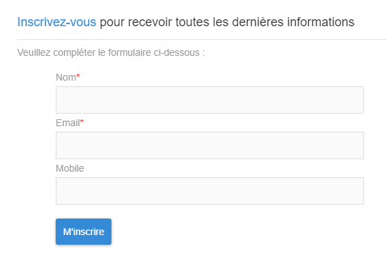

# A propos des landing pages{#about-landing-pages}

Campaign intègre des landing pages. Il s'agit de formulaires web pouvant être utilisés en vue de capturer des informations sur vos audiences, d'offrir des abonnements à un service, d'afficher des données et de développer votre base de données. Les landing pages peuvent également être utilisées pour acquérir ou mettre à jour des profils existants.

Pour plus d'informations sur les étapes requises pour configurer une landing page, reportez-vous à [cette section](../../channels/using/main-steps-to-set-up-a-landing-page.md).

**Rubriques connexes :**

* Tutoriel vidéo [Créer une landing page](https://helpx.adobe.com/fr/campaign/kt/acs/using/acs-create-edit-landing-page-feature-video-use.html)
* [Utiliser une landing page pour s'abonner à un service](../../audiences/using/creating-a-service.md)

## Cycle de vie des landing pages {#landing-pages-life-cycle}

Le cycle de vie complet d'une landing page est le suivant :

1. Création : conception et définition du contenu de la landing page
1. Test : simulation de l'exécution de la landing page sur un profil de test
1. Publication : mise en ligne de la landing page
1. Expiration ou dépublication : expiration ou dépublication manuelle de la landing page, qui n'est alors plus accessible

Une fois créée et publiée, vous pouvez rendre la landing page accessible sur votre site Web ou [insérer un lien direct vers la landing page dans un email](../../designing/using/links.md#inserting-a-link).

## Limites des landing pages{#landing-page-limitations}

La section ci-dessous répertorie les limites que vous devez connaître avant de commencer à configurer des landing pages.

**Ecriture et mise à jour des données**

* Les landing pages sont limitées uniquement aux ressources **[!UICONTROL Profil]** et **[!UICONTROL Abonnement]**. Un enregistrement peut être sauvegardé et mis à jour depuis le **[!UICONTROL Profil]** et un abonnement/désabonnement à un **[!UICONTROL Service]**.
Pour en savoir plus sur la configuration des ressources, voir [Configuration de la structure de données de la ressource](../../developing/using/configuring-the-resource-s-data-structure.md).

>[!CAUTION]
>
>Une page d'entrée ne peut pas afficher ni mettre à jour les données d'une autre ressource que **[!UICONTROL Profil]** et **[!UICONTROL Abonnement]**.

**Préchargement**

* Une landing page ne peut pas afficher automatiquement une liste d'enregistrements. Elle ne peut pas répertorier les services auxquels les profils sont déjà abonnés. Pour plus d'informations sur les services, consultez cette [page](../../audiences/using/creating-a-service.md).

* Une landing page avec un formulaire prérenseigné (les données sont préchargées avec la page) n'est accessible qu'à partir d'un email Adobe Campaign. Il est impossible d'accéder à ce type de formulaire depuis une page d'un site web.

**Réconciliation**

* Le comportement de réconciliation est le suivant : dès qu'une correspondance est trouvée, la réconciliation s'arrête. La réconciliation ne peut donc être effectuée que sur un enregistrement de profil et non sur plusieurs enregistrements lorsqu'il existe des doublons.

Vous souhaitez par exemple envoyer la landing page d'acquisition suivante à vos profils afin de mettre à jour votre base de données Campaign avec les numéros des téléphones mobiles de vos profils.

Si l'un de vos profils renseigne votre landing page avec de nouvelles informations mais possède déjà un profil dupliqué, le profil correspondant avec la date de création la plus ancienne est mis à jour, car les profils sont classés par ordre de priorité en fonction de la date de création uniquement.

Dans le cas présent, seul le premier profil a été mis à jour, car il s'agit de l'entrée la plus ancienne.

**Test des landing pages**

* Les landing pages ne fonctionnent que sur les profils et non sur les profils de test. Elles ne peuvent donc pas être testées dans le cadre d'un BAT d'email.
