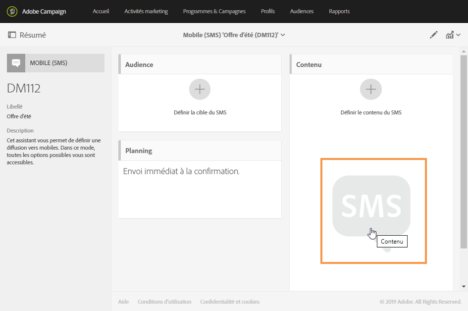
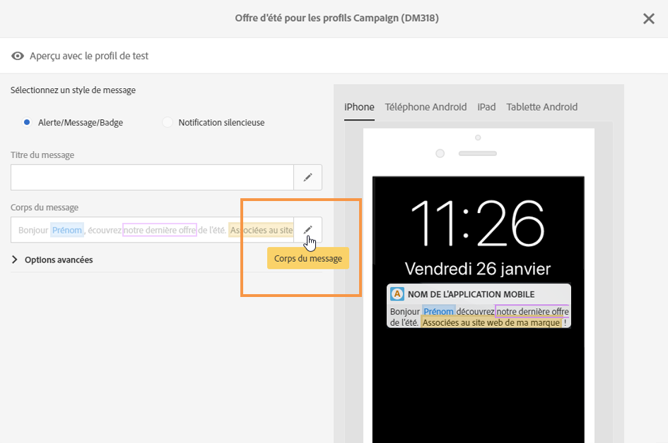

# A propos de la conception du contenu d&#39;un SMS et d&#39;une notification push{#about-sms-and-push-content-design}

Utilisez l&#39;éditeur de contenu pour définir, modifier et personnaliser le contenu des SMS et des notifications push dans Adobe Campaign.

Cette section décrit les spécificités de l&#39;éditeur de contenu de SMS et de notification push, notamment celles de l&#39;[interface de l&#39;éditeur](../../channels/using/sms-and-push-content-editor-interface.md).

Les actions qui sont communes à une ou plusieurs activités marketing sont présentées dans les sections suivantes :

* Pour plus d&#39;informations sur la personnalisation du contenu d&#39;un SMS ou d&#39;une notification push, voir les sections [Insertion d&#39;un champ de personnalisation](../../designing/using/personalization.md#inserting-a-personalization-field) et [Ajouter un bloc de contenu](../../designing/using/personalization.md#adding-a-content-block).
* Pour plus d&#39;informations sur la définition du texte conditionnel dans un SMS ou une notification push, voir[Définir un texte dynamique](../../channels/using/defining-dynamic-text.md).

Pour accéder à l&#39;éditeur de contenu de SMS et de notification push :

* Cliquez sur le bloc **[!UICONTROL Contenu]** dans le tableau de bord d&#39;un SMS.

   

* Cliquez sur le crayon en regard du champ **[!UICONTROL Corps du message]** dans le tableau de bord d&#39;une notification push.

   

**Rubriques connexes :**

* [Créer un SMS](../../channels/using/creating-an-sms-message.md)
* [Créer et envoyer une notification push](../../channels/using/preparing-and-sending-a-push-notification.md)
