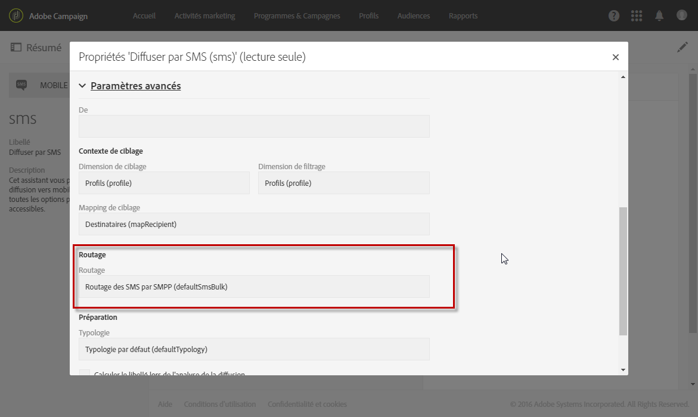

# A propos des SMS{#about-sms-messages}

Adobe Campaign permet de distribuer des messages SMS (Short Message Service).

>[!NOTE]
>
>Le canal SMS est un composant additionnel. Veuillez vérifier votre accord de licence.

Pour les SMS, vous pouvez créer, modifier et personnaliser des messages au format texte uniquement. Vous pouvez également prévisualiser les SMS avant leur envoi.

La longueur des messages SMS est limitée à 160 caractères si l&#39;encodage GSM est utilisé, à 70 caractères seulement si le message est rédigé en Unicode. Par ailleurs, certains caractères spéciaux peuvent avoir une influence sur la longueur du message. Pour en savoir plus, consultez la section [Encodage des SMS](../../administration/using/configuring-sms-channel.md#sms-encoding--length-and-transliteration).

La création d&#39;un SMS est possible depuis le menu **[!UICONTROL Activités marketing]**, à partir d&#39;une campagne ou dans un workflow. Voir [Créer un SMS](../../channels/using/creating-an-sms-message.md).

Pour diffuser des SMS vers un téléphone mobile, il vous faut :

* un compte externe de type **[!UICONTROL Routage]** paramétré sur le canal **[!UICONTROL Mobile (SMS)]** avec le mode de diffusion **[!UICONTROL Envoi en masse]**. Voir à ce propos la section [Routage](../../administration/using/configuring-sms-channel.md#defining-an-sms-routing).
* un modèle de diffusion correctement lié à ce compte externe.

**Rubriques connexes :**

* [Gestion des modèles](../../start/using/marketing-activity-templates.md)
* [Configuration des SMS](../../administration/using/configuring-sms-channel.md#defining-an-sms-routing)
* [Rapport SMS](../../reporting/using/sms-report.md)
* [Guide Campaign Standard Mobile](https://helpx.adobe.com/fr/campaign/kb/acs-mobile.html)

## Modèle de diffusion SMS {#sms-delivery-template}

Adobe Campaign met à votre disposition un modèle de diffusion vers les mobiles. Ce modèle doit être correctement associé au compte externe utilisé pour le canal **[!UICONTROL Mobile (SMS)]**. Pour y accéder et le modifier :

1. Sélectionnez **[!UICONTROL Ressources]** > **[!UICONTROL Modèles]** > **[!UICONTROL Modèles de diffusion]** depuis le menu avancé.
1. Survolez le modèle **[!UICONTROL Envoyer par SMS]** avec la souris et sélectionnez l&#39;option **Dupliquer l&#39;élément**.
1. Sélectionnez le nouveau modèle.
1. Cliquez sur le bouton **[!UICONTROL Editer les propriétés]**.
1. Dans la section **[!UICONTROL Paramètres avancés]** des propriétés du modèle, assurez-vous que ce dernier est bien lié au compte externe à utiliser pour la diffusion des SMS.

   

**Rubriques connexes :**

* [Gestion des modèles](../../start/using/marketing-activity-templates.md)
