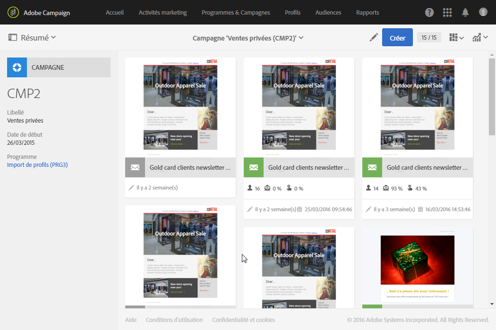

# Accéder aux messages{#accessing-messages}

Vous pouvez exploiter un ensemble de fonctionnalités avancées allant du ciblage, définition et personnalisation des messages, exécution des communications jusqu'aux rapports opérationnels associés.

Les messages sont accessibles :

* au sein d'une campagne
* à partir de la page d'accueil d'Adobe Campaign
* à partir de la liste des activités marketing

## Accéder aux messages dans une campagne  {#accessing-messages-in-campaigns}

Pour accéder à la liste des activités marketing d'une campagne :

1. Accédez à **[!UICONTROL Activités marketing]** depuis la barre de navigation supérieure.
1. Sélectionnez **[!UICONTROL Activités marketing &gt; Plans marketing &gt; Programmes &amp; Campagnes]**.

   Vous pouvez également directement cliquer sur la vignette **[!UICONTROL Programmes &amp; Campagnes]** depuis la page d'accueil. Pour plus d'informations sur les campagnes, consultez la section [Programmes et campagnes](../../start/using/programs-and-campaigns.md).

1. Ouvrez un programme, puis une campagne.

   

1. Cliquez sur la liste déroulante **[!UICONTROL Résumé]**.
1. Cliquez sur **[!UICONTROL Recherche]** pour filtrer l'affichage des messages (par nom, date ou statut).

   Pour filtrer les messages récurrents, vous pouvez cocher la case correspondante.

## Accéder à la liste des messages  {#accessing-the-message-list}

Pour accéder à la liste complète des activités marketing de toutes campagnes confondues, procédez comme suit :

1. Sélectionnez **[!UICONTROL Activités marketing]** depuis la barre de navigation supérieure.

   Vous pouvez également y accéder à partir de la vignette **[!UICONTROL Activités marketing]** sur la page d'accueil. Pour plus d'informations sur la liste des activités marketing, consultez la section [Gestion des activités marketing](../../start/using/marketing-activities.md#creating-a-marketing-activity).

1. Pour filtrer l'affichage des activités marketing (par nom, date, statut ou type d'activité), utilisez les champs de **[!UICONTROL Recherche]** situés à gauche de la liste des activités marketing.

## Cycle de vie d'un message {#message-life-cycle}

Chaque état d'un message est associé à une couleur, visible sur sa vignette dans les listes. Les statuts possibles sont :

* **[!UICONTROL En édition]** (gris) : le message est en édition
* **[!UICONTROL En cours]** (bleu) : l'envoi du message est en cours
* **[!UICONTROL Terminé]** (vert) : l'envoi s'est terminé sans erreur
* **[!UICONTROL En erreur]** (rouge) : l'envoi a été annulé ou une erreur est survenue lors de la préparation ou de l'envoi

   >[!NOTE]
   >
   >Un bandeau jaune de notification peut apparaître au-dessus de la vignette lorsqu'une action est requise, par exemple lorsque vous devez confirmer l'envoi d'un message.

