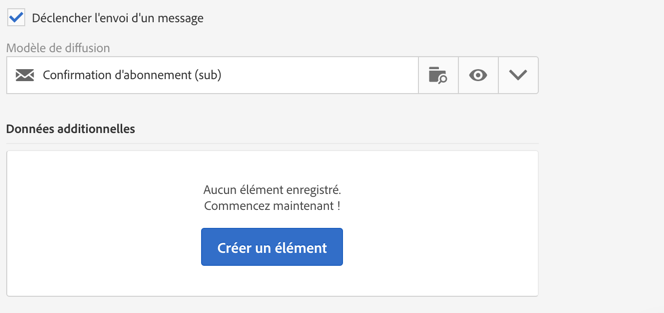
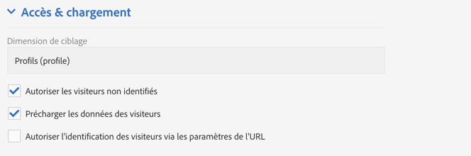
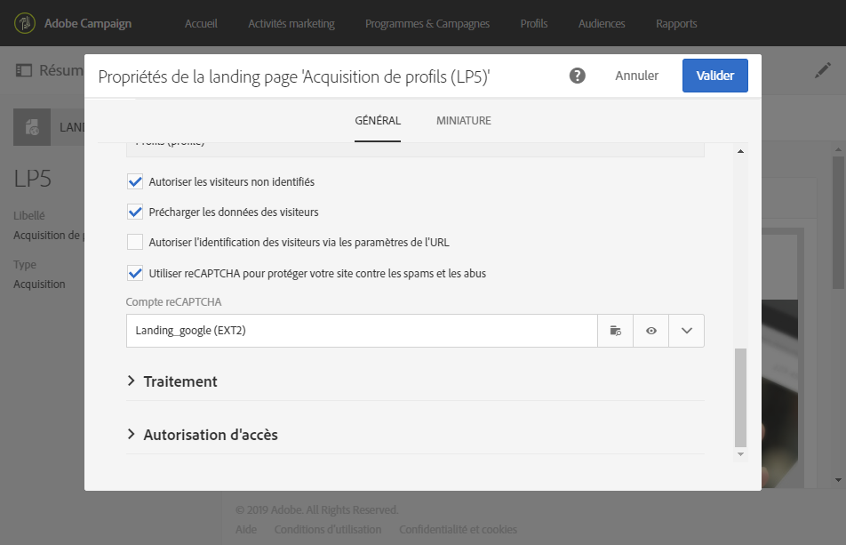

# Paramétrer une landing page {#configuring-landing-page}

## Confirmer la validation d&#39;une landing page    {#confirm-a-landing-page-submission}

Lorsqu&#39;une landing page est validée par un visiteur, vous pouvez configurer les actions déclenchées. Pour cela :

1. Editez les propriétés de la landing page accessibles via l&#39;icône  dans le tableau de bord de la landing page, puis affichez les paramètres **[!UICONTROL Traitement]**.

   

1. Dans la section **[!UICONTROL Actions spécifiques]**, sélectionnez **[!UICONTROL Déclencher l&#39;envoi d&#39;un message]** pour définir l&#39;envoi d&#39;un message automatique, par exemple pour confirmer l&#39;inscription à un service. Vous devez ensuite sélectionner un modèle de diffusion email.

   Si un message de confirmation est déjà configuré au niveau du service, vous ne devez pas en sélectionner un dans cet écran afin d&#39;éviter l&#39;envoi de plusieurs messages de confirmation. Reportez-vous à la section [Configurer un service](../../audiences/using/creating-a-service.md).

1. Créez des **[!UICONTROL Données additionnelles]** pour permettre le stockage des données additionnelles lors de la validation de la landing page. Ces données ne sont pas visibles par le visiteur de la page. Seules les valeurs constantes sont prises en charge.

   

## Associer une landing page à un service {#linking-a-landing-page-to-a-service}

Vous pouvez associer un formulaire à un service afin que les profils puissent s&#39;inscrire à un service spécifique lors de la validation des landing pages.

Les paramètres d&#39;association permettent de définir le type de l&#39;action réalisée et si la landing page est liée spécifiquement à un seul service ou si elle est générique.

Pour sélectionner le service à associer, procédez comme suit :

1. Editez les propriétés de la landing page accessibles via l&#39;icône  dans le tableau de bord de la landing page, puis affichez les paramètres **[!UICONTROL Traitement]**.

   

1. Sélectionnez **[!UICONTROL Inscription]** dans la liste déroulante **[!UICONTROL Actions spécifiques]**.

   

1. Sélectionnez **[!UICONTROL Service spécifique]** pour associer la landing page à un seul service. Ne sélectionnez pas cette option si vous souhaitez utiliser plusieurs services avec la landing page.

   Utilisez l&#39;option **[!UICONTROL Service provenant de l&#39;URL]** pour que la landing page puisse être utilisée pour plusieurs services. Vous devez alors référencer la landing page lors du paramétrage du service.

## Définir les permissions et pré-charger les données    {#setting-permissions-and-pre-loading-data}

L&#39;accès à une landing page peut être limité à des visiteurs identifiés qui proviennent d&#39;un lien figurant dans un message envoyé par Campaign, par exemple, ou à une entité organisationnelle spécifique.
Dans le cas de visiteurs identifiés, vous pouvez précharger leurs données dans la landing page. Pour cela :

1. Editez les propriétés de la landing page accessibles via l&#39;icône  dans le tableau de bord de la landing page, puis affichez les paramètres **[!UICONTROL Accès &amp; chargement]**.

   

1. Sélectionnez **[!UICONTROL Précharger les données des visiteurs]**.

   Si un profil de la base de données correspond au visiteur de la page, ses données sont affichées dans les champs du formulaire mappés avec la base de données et les éléments de personnalisation de la landing page sont pris en compte.

   

Vous pouvez également procéder comme suit :

* Utiliser les paramètres d&#39;URL pour identifier les visiteurs, à l&#39;aide de l&#39;option **[!UICONTROL Autoriser l&#39;identification des visiteurs via les paramètres de l&#39;URL]** : vous devez ensuite choisir la clé de chargement et mapper les paramètres de filtre avec les paramètres de l&#39;URL correspondante.
* Autoriser n&#39;importe quel visiteur à accéder à la landing page, à l&#39;aide de l&#39;option **[!UICONTROL Autoriser les visiteurs non identifiés]**.

Les landing pages peuvent également être liées à une entité organisationnelle. L&#39;accès des utilisateurs aux différentes landing pages sera ainsi défini. Pour assigner une entité organisationnelle :

1. Accédez aux propriétés de votre landing page via l&#39;icône **[!UICONTROL Editer les propriétés]**.

   

1. Développez **[!UICONTROL Autorisation d&#39;accès]**.

1. Cliquez sur le menu déroulant et sélectionnez votre entité organisationnelle. Pour plus d&#39;informations sur la création d&#39;une entité organisationnelle, consultez cette [page](../../administration/using/organizational-units.md).

   

1. Les champs **[!UICONTROL Créé par]**, **[!UICONTROL Créé le]**, **[!UICONTROL Autorisation d&#39;accès]** et **[!UICONTROL Dernière modification]** sont automatiquement renseignés.

1. Cliquez sur **[!UICONTROL Confirmer]**, puis sur **[!UICONTROL Enregistrer]**.

Votre landing page ne peut maintenant être accessible et gérée que par les utilisateurs de l&#39;entité organisationnelle choisie.

## Définir Google reCAPTCHA {#setting-google-recaptcha}

Vous pouvez configurer Google reCAPTCHA version 3 avec votre landing page afin de la protéger contre le spam et les abus causés par les bots. Pour l&#39;utiliser avec votre landing page, vous devez tout d&#39;abord créer un compte externe. Pour plus d&#39;informations sur la façon de le configurer, consultez cette [section](../../administration/using/external-accounts.md#google-recaptcha-external-account).

Une fois votre compte externe Google reCAPTCHA version 3 configuré, vous pouvez l&#39;ajouter à votre landing page :

1. Avant de publier votre landing page, accédez aux propriétés de la page à l&#39;aide de l&#39;icône  figurant dans le dashboard de votre landing page.

   

1. Développez le menu **[!UICONTROL Accès &amp; chargement]**.
1. Cochez l&#39;option **[!UICONTROL Utiliser reCAPTCHA pour protéger votre site contre les spams et les abus]**.
1. Sélectionnez le compte externe Google reCAPTCHA que vous venez de créer.

   

1. Cliquez sur **[!UICONTROL Confirmer]**.

Votre landing page est maintenant configurée avec Google reCAPTCHA, visible en bas de votre page.

Google reCAPTCHA renvoie ensuite un score en fonction des interactions des utilisateurs avec votre page. Pour vérifier votre score, connectez-vous à votre [console d&#39;administration Google](https://g.co/recaptcha/admin).
