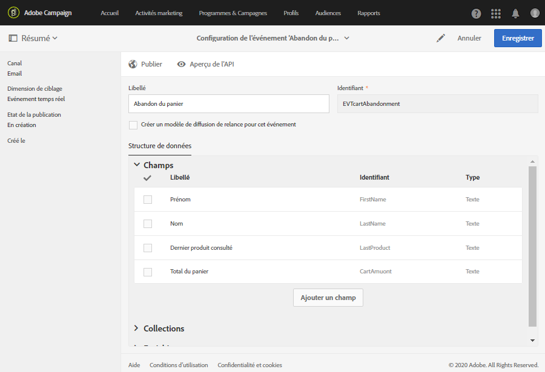
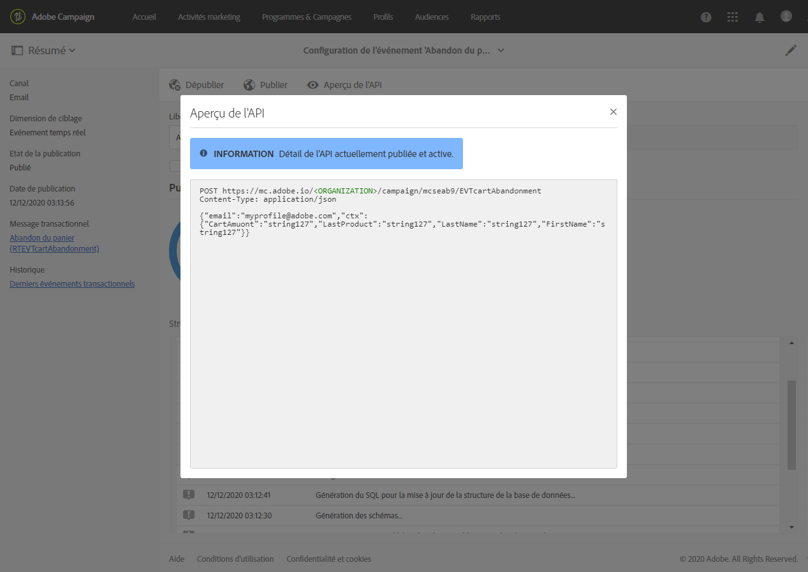

# Configuration d’un événement transactionnel {#configuring-transactional-event}

Pour envoyer un message transactionnel avec Adobe Campaign, vous devez d&#39;abord décrire la structure des données du événement en créant et en configurant un événement.

>[!IMPORTANT]
>
>Seuls les [administrateurs fonctionnels](../../administration/using/users-management.md#functional-administrators) <!--being part of the **[!UICONTROL All]** [organizational unit](../../administration/using/organizational-units.md) -->disposent des droits appropriés pour créer et modifier des configurations de événement.

La configuration varie en fonction du type de message transactionnel [que vous souhaitez envoyer et du canal qui sera utilisé. ](../../channels/using/getting-started-with-transactional-msg.md#transactional-message-types) Pour plus d&#39;informations à ce sujet, voir [Configurations spécifiques](#transactional-event-specific-configurations).

Une fois la configuration terminée, le événement doit être publié. Voir [Publication d’un événement transactionnel](../../channels/using/publishing-transactional-event.md).

## Créer un événement      {#creating-an-event}

Pour commencer, créez l’événement correspondant à vos besoins.

1. Cliquez sur le logo **[!UICONTROL Adobe Campaign]**, en haut à gauche, puis sélectionnez **[!UICONTROL Plans marketing]** > **[!UICONTROL Messages transactionnels]** > **[!UICONTROL Configuration des événements]**.
1. Cliquez sur le bouton **[!UICONTROL Créer]**.
1. Entrez un **[!UICONTROL libellé]** et un **[!UICONTROL ID]** pour le événement. Le champ **[!UICONTROL Identifiant]** est obligatoire et doit commencer par le préfixe &quot;EVT&quot;. Si vous n’utilisez pas ce préfixe, il est automatiquement ajouté lorsque vous cliquez sur **[!UICONTROL Créer]**.

   

   >[!IMPORTANT]
   >
   >L’identifiant ne doit pas dépasser 64 caractères, le préfixe EVT compris.

1. Sélectionnez le canal qui sera utilisé pour envoyer vos messages transactionnels **[!UICONTROL Courriel]**, **[!UICONTROL Mobile (SMS)]** ou **[!UICONTROL Notification Push]**. Un seul canal peut être utilisé pour chaque événement et ne peut plus être modifié par la suite.

1. Sélectionnez la dimension de ciblage qui correspond à la configuration de l’événement souhaitée et cliquez sur **[!UICONTROL Créer]**.

   Les messages transactionnels basés sur un événement ciblent des données contenues dans l’événement lui-même, alors que les messages transactionnels basés sur un profil ciblent des données contenues dans la base de données Adobe Campaign. Pour plus d&#39;informations à ce sujet, consultez [Configurations spécifiques](#transactional-event-specific-configurations).

>[!NOTE]
>
>Le nombre de événements en temps réel peut avoir un impact sur votre plateforme. Pour des performances optimales, veillez à supprimer les événements inutilisés en temps réel. Voir la section [Supprimer un événement](../../channels/using/publishing-transactional-event.md#deleting-an-event).

## Définir les attributs d’événement       {#defining-the-event-attributes}

Dans la section **[!UICONTROL Champs]**, définissez les attributs qui seront intégrés au contenu de l’événement et qui pourront être utilisés pour personnaliser le message transactionnel.

Les étapes d’ajout et de modification des champs s’effectuent de la même manière que pour les [ressources personnalisées](../../developing/using/configuring-the-resource-s-data-structure.md#adding-fields-to-a-resource).

>[!NOTE]
>
>Si vous souhaitez créer un message transactionnel multilingue, définissez un attribut d’événement supplémentaire avec l’identifiant **[!UICONTROL AC_language]**. Cela s’applique uniquement aux messages transactionnels basés sur un événement. Une fois l’événement publié, les étapes nécessaires pour éditer le contenu d’un message transactionnel multilingue sont les mêmes que pour un email standard multilingue. Voir [Créer un email multilingue](../../channels/using/creating-a-multilingual-email.md).

## Définir des collections de données       {#defining-data-collections}

Vous pouvez ajouter une collection d’éléments au contenu de l’événement, chaque élément comprenant lui-même plusieurs attributs.

Cette collection peut être utilisée dans un email transactionnel pour ajouter des [listes de produits](../../channels/using/editing-transactional-message.md#using-product-listings-in-a-transactional-message) au contenu du message, par exemple une liste de produits, avec le prix, le numéro de référence, la quantité, etc. pour chaque produit de la liste.

1. Dans la section **[!UICONTROL Collections]**, cliquez sur le bouton **[!UICONTROL Créer un élément]**.

   

1. Ajoutez un libellé et un identifiant pour la collection.
1. Ajoutez tous les champs que vous souhaitez afficher dans le message transactionnel pour chaque produit de la liste.

   Dans cet exemple, nous avons ajouté les champs suivants :

   

1. L’onglet **[!UICONTROL Enrichissement]** vous permet d’enrichir chaque élément de la collection. Vous pourrez ainsi personnaliser les éléments de la liste de produits correspondante avec les informations de la base de données Adobe Campaign ou d’autres ressources que vous avez créées.

>[!NOTE]
>
>Les étapes d’enrichissement des éléments d’une collection sont les mêmes que celles décrites dans la section [Enrichir l’événement](#enriching-the-transactional-message-content). Notez que l’enrichissement de l’événement ne vous permet pas d’enrichir une collection : vous devez ajouter un enrichissement à la collection elle-même dans la section **[!UICONTROL Collections]**.

Une fois l’événement et le message publiés, vous pouvez utiliser cette collection dans votre message transactionnel.

Voici l’aperçu de l’API pour cet exemple :

**Rubriques connexes :**

* [Prévisualiser et publier l’événement](../../channels/using/publishing-transactional-event.md#previewing-and-publishing-the-event)
* [Utiliser des listes de produits dans un message transactionnel ](../../channels/using/editing-transactional-message.md#using-product-listings-in-a-transactional-message)
* [Publier un message transactionnel         ](../../channels/using/publishing-transactional-message.md#publishing-a-transactional-message)

## Enrichir l’événement {#enriching-the-transactional-message-content}

Vous pouvez enrichir le contenu d’un message transactionnel avec des informations de la base de données Adobe Campaign pour personnaliser vos messages. À partir du nom ou de l’identifiant CRM de vos destinataires, vous pouvez par exemple récupérer des données telles que leur adresse, date de naissance ou tout autre champ personnalisé ajouté à la table Profil afin de personnaliser les informations qui leur seront envoyées.

Il est possible d’enrichir le contenu du message transactionnel avec des informations de l’**[!UICONTROL API Profie &amp; Services]** étendue. Pour plus d’informations, voir [Extension de l’API : Publication de l’extension](../../developing/using/step-2--publish-the-extension.md)

Ces informations peuvent également être stockées dans de nouvelles ressources. Le cas échéant, la ressource doit être liée aux ressources **[!UICONTROL Profil]** ou **[!UICONTROL Service]** soit directement, soit via une autre table. Par exemple, dans la configuration ci-dessous, il est possible d’enrichir le contenu d’un message transactionnel avec des informations de la ressource **[!UICONTROL Produit]**, telles que la catégorie de produit ou l’identifiant, si la ressource **[!UICONTROL Produit]** est liée à la ressource **[!UICONTROL Profil]**.

Pour en savoir plus sur la création et la publication de ressources, voir [cette section](../../developing/using/key-steps-to-add-a-resource.md).

1. Dans la section **[!UICONTROL Enrichissement]**, cliquez sur le bouton **[!UICONTROL Créer un élément]**.

   

1. Sélectionnez la ressource à laquelle vous voulez lier votre message. Dans le cas présent, choisissez la ressource **[!UICONTROL Profil]**.

   

1. Utilisez le bouton **[!UICONTROL Créer un élément]** pour associer un champ de la ressource sélectionnée à l’un des champs que vous avez ajoutés à l’événement (voir [Définir les attributs d’événement](#defining-the-event-attributes)).

   

1. Dans cet exemple, nous réconcilions les champs **[!UICONTROL Nom]** et **[!UICONTROL Prénom]** avec les champs correspondants dans la ressource **[!UICONTROL Profil]**.

   

   Vous pouvez également enrichir le contenu des messages transactionnels à l’aide de la ressource **[!UICONTROL Service]**. Pour en savoir plus sur les services, voir [cette section](../../audiences/using/creating-a-service.md).

1. Si vous créez ou modifiez un événement [basé sur le profil](#profile-based-transactional-messages), dans la section **[!UICONTROL enrichissement de ciblage]**, sélectionnez l’enrichissement qui sera utilisé comme cible de message lors de l’exécution de la diffusion.

   

   >[!NOTE]
   >
   >La création d’un enrichissement et la sélection d’un enrichissement de ciblage en fonction de la ressource **[!UICONTROL Profil]** sont obligatoires pour les événements basés sur un profil.

Une fois l’événement et le message publiés, le lien permettra d’enrichir le contenu du message transactionnel.

**Rubriques connexes :**

* [Prévisualiser et publier l’événement](../../channels/using/publishing-transactional-event.md#previewing-and-publishing-the-event)
* [Personnaliser un message transactionnel](../../channels/using/editing-transactional-message.md#personalizing-a-transactional-message)
* [Publier un message transactionnel         ](../../channels/using/publishing-transactional-message.md#publishing-a-transactional-message)

## Recherche d’événements transactionnels {#searching-transactional-events}

Pour accéder aux événements transactionnels déjà créés et les rechercher, procédez comme suit.

1. Cliquez sur le logo **[!UICONTROL Adobe Campaign]**, en haut à gauche, puis sélectionnez **[!UICONTROL Plans marketing]** > **[!UICONTROL Messages transactionnels]** > **[!UICONTROL Configuration des événements]**.
1. Cliquez sur le bouton **[!UICONTROL Afficher la recherche]**.

   

1. Vous pouvez filtrer par **[!UICONTROL Etat de la publication]**. Vous pouvez ainsi afficher uniquement les événements publiés, par exemple.
1. Vous pouvez également filtrer les événements à l’aide du filtre **[!UICONTROL Dernier événement reçu]**. Par exemple, si vous entrez 10, seules les configurations d’événement avec le dernier événement reçu il y a 10 jours ou plus s’affichent. Vous pouvez ainsi afficher les événements inactifs pour une période donnée.

   

   >[!NOTE]
   >
   >La valeur par défaut est 0. Tous les événements s’affichent alors.

## Paramétrages spécifiques {#transactional-event-specific-configurations}

La configuration des événements transactionnels peut varier en fonction du type de message transactionnel [que vous souhaitez envoyer (événement ou profil) et du canal qui sera utilisé.](../../channels/using/getting-started-with-transactional-msg.md#transactional-message-types)

Les sections suivantes détaillent quelle configuration spécifique devrait être définie en fonction du message transactionnel souhaité. Pour en savoir plus sur les étapes générales à suivre pour configurer un événement, voir        [Créer un événement](#creating-an-event).

### Messages transactionnels basés sur un événement.{#event-based-transactional-messages}

Vous pouvez envoyer des messages transactionnels d’événement ciblant un événement. Ce type de message transactionnel ne contient pas d’informations de profil : la cible de la diffusion est définie par les données contenues dans l’événement lui-même.

Pour envoyer un message transactionnel basé sur un événement, vous devez d&#39;abord créer et configurer un événement ciblant les **données contenues dans le événement lui-même**.

1. Lors de la création de la configuration d’un événement, sélectionnez la dimension de ciblage **[!UICONTROL Evénement en temps réel]** (voir [Créer un événement](#creating-an-event)).
1. Ajoutez des champs à l’événement afin de personnaliser le message transactionnel (voir [Définir les attributs d’événement](#defining-the-event-attributes)).
1. Les messages transactionnels basés sur un événement sont censés utiliser uniquement les données figurant dans l’événement envoyé pour définir le destinataire et la personnalisation du contenu du message.

   Cependant, si vous souhaitez utiliser des informations supplémentaires provenant de la base de données Adobe Campaign, vous pouvez enrichir le contenu du message transactionnel (voir [Enrichissement du contenu du message transactionnel](#enriching-the-transactional-message-content)).

1. Prévisualisez et publiez l’événement (voir [Prévisualiser et publier l’événement](../../channels/using/publishing-transactional-event.md#previewing-and-publishing-the-event)).

   Lors de la prévisualisation du événement, l’API REST contient un attribut spécifiant l’adresse électronique, le téléphone mobile ou les attributs spécifiques à la notification Push, selon le canal sélectionné.

   Une fois la publication effectuée, un message transactionnel associé au nouvel événement est automatiquement créé. Pour que le événement déclenche l’envoi d’un message transactionnel, vous devez [modifier](../../channels/using/editing-transactional-message.md) et [publier](../../channels/using/publishing-transactional-message.md) le message qui vient d’être créé.

1. Intégrer le événement dans votre site Web (voir [Intégrer le déclenchement du événement](../../channels/using/getting-started-with-transactional-msg.md#integrate-event-trigger)).

### Messages transactionnels basés sur un profil       {#profile-based-transactional-messages}

Vous pouvez envoyer des messages transactionnels en fonction des profils du client, ce qui vous permet d’appliquer des règles de typologie marketing, d’inclure le lien de désabonnement, d’ajouter le message au rapports de diffusion global et de l’exploiter dans le parcours du client.

Pour envoyer un message transactionnel basé sur un profil, vous devez d&#39;abord créer et configurer un ciblage de événement **données de la base de données Adobe Campaign**.

1. Lors de la création de la configuration d’un événement, sélectionnez la dimension de ciblage **[!UICONTROL Evénement de profil]** (voir [Créer un événement](#creating-an-event)).
1. Ajoutez des champs à l’événement afin de personnaliser le message transactionnel (voir [Définir les attributs d’événement](#defining-the-event-attributes)). Vous devez ajouter au moins un champ pour créer un enrichissement. Vous n’avez pas à créer des champs tels que **Prénom** et **Nom**, car vous pourrez utiliser les champs de personnalisation de la base de données Adobe Campaign.
1. Créez un enrichissement afin de lier le événement à la ressource **[!UICONTROL Profil]** (voir [Enrichissement du événement](#enriching-the-transactional-message-content)) et sélectionnez cet enrichissement comme enrichissement de ciblage ****.

   >[!IMPORTANT]
   >
   >Cette étape est obligatoire pour les événements basés sur un profil.

1. Prévisualisez et publiez l’événement (voir [Prévisualiser et publier l’événement](../../channels/using/publishing-transactional-event.md#previewing-and-publishing-the-event)).

   Lors de la prévisualisation du événement, l’API REST ne contient aucun attribut spécifiant l’adresse électronique, le téléphone mobile ou les attributs spécifiques à la notification Push, car il sera récupéré à partir de la ressource **[!UICONTROL Profil]**.

   Une fois la publication effectuée, un message transactionnel associé au nouvel événement est automatiquement créé. Pour que le événement déclenche l’envoi d’un message transactionnel, vous devez [modifier](../../channels/using/editing-transactional-message.md) et [publier](../../channels/using/publishing-transactional-message.md) le message qui vient d’être créé.

1. Intégrer le événement dans votre site Web (voir [Intégrer le déclenchement du événement](../../channels/using/getting-started-with-transactional-msg.md#integrate-event-trigger)).

<!--### Transactional SMS messages {#transactional-sms}

The steps to configure an  event to send an SMS transactional message are the same as for the email channel. The only differences are as follows:

* When creating the corresponding event, you need to select the **[!UICONTROL Mobile (SMS)]** channel.

* When previewing the event corresponding to an event-based transactional SMS, the REST API contains an attribute specifying the mobile phone instead of the email address.

* The specificities to edit the content of an SMS transactional message are the same as for a [standard SMS](../../channels/using/about-sms-and-push-content-design.md).-->

### Notifications push transactionnelles {#transactional-push-notifications}

Vous pouvez envoyer deux types de notification push transactionnelle :
* Notification Push transactionnelle anonyme envoyée à tous les utilisateurs qui ont choisi de recevoir des notifications de votre application mobile. Voir [Configuration des notifications Push transactionnelles basées sur le événement](../../channels/using/transactional-push-notifications.md#event-based-transactional-push-notifications).
* Notification Push transactionnelle envoyée aux profils Adobe Campaign qui se sont abonnés à votre application mobile. Voir [Configuration des notifications Push transactionnelles basées sur le profil](../../channels/using/transactional-push-notifications.md#profile-based-transactional-push-notifications).

>[!IMPORTANT]
>
>Pour pouvoir envoyer des notifications push transactionnelles, vous devez configurer Adobe Campaign en conséquence. Voir [Configuration d’une application mobile](../../administration/using/configuring-a-mobile-application.md).

### Messages de relance {#follow-up-messages}

Vous pouvez envoyer un message de relance aux clients qui ont reçu un message transactionnel spécifique.

Les étapes de configuration d&#39;un événement permettant d&#39;envoyer un message de suivi sont détaillées dans [cette section](../../channels/using/follow-up-messages.md#configuring-an-event-to-send-a-follow-up-message).
