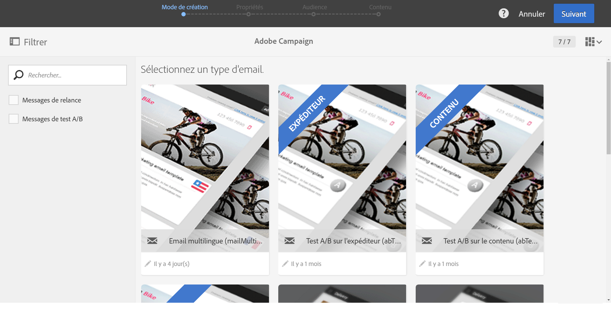
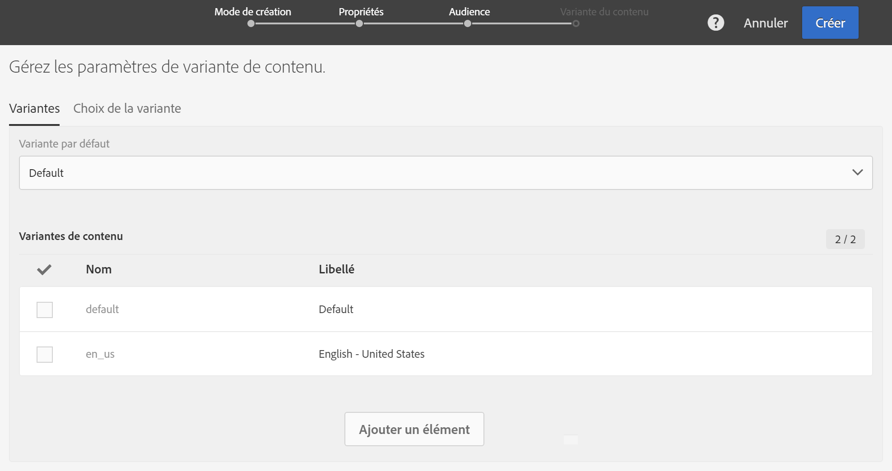
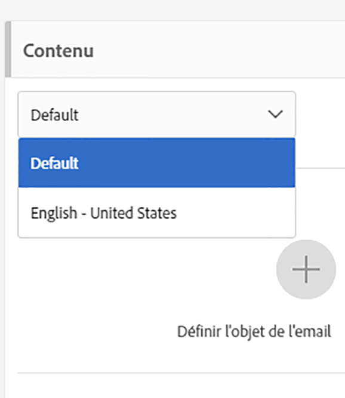

# Créer un email multilingue{#creating-a-multilingual-email}

Vous pouvez envoyer un email multilingue aux profils ayant des préférences linguistiques différentes : chaque profil recevra une variante de l'email dans sa langue préférée.

Pour cela, vérifiez qu'un modèle d'email multilingue est disponible. Si ce n'est pas le cas, apprenez à en créer un dans [cette section](../../start/using/creating-a-multilingual-template.md).

L'audience est composée de profils dont la préférence linguistique a été indiquée.

1. Créez un email à partir d'un [modèle multilingue](../../start/using/creating-a-multilingual-template.md).

   

1. Définissez les propriétés générales et l'audience cible de l'email de la même manière que pour un email standard. Consultez la section [Créer une audience](../../audiences/using/creating-audiences.md).
1. A la quatrième étape de l'assistant de création, définissez les options des variantes. Si le [modèle multilingue](../../start/using/creating-a-multilingual-template.md) contient déjà tous les paramètres désirés, vous pouvez cliquer directement sur le bouton **[!UICONTROL Créer].**

   

   Au besoin, ajoutez des variantes à l'aide du bouton **[!UICONTROL Ajouter un élément].** **[!UICONTROL La variante Par défaut]** ne doit pas être supprimée. When set to **[!UICONTROL default]**, [the profile's preferred language](../../audiences/using/creating-profiles.md) is used to choose the variant. Vous pouvez également définir la variante **[!UICONTROL Par défaut]sur n'importe quelle autre langue.**

1. Confirmez la création de l'email : le tableau de bord des emails s'affiche alors.
1. Définissez le contenu de chaque variante d'email. En fonction du modèle que vous avez choisi, vous pouvez définir plusieurs objets, plusieurs noms d'expéditeurs ou plusieurs contenus différents. Utilisez le menu déroulant afin de naviguer entre les différentes variantes de l'élément. Pour plus d'informations, consultez la section relative à l'[éditeur de contenu](../../designing/using/about-email-content-design.md).

   

1. Testez votre message et validez-le. Reportez-vous à la section [Envoyer un bon à tirer (BAT)](../../sending/using/managing-test-profiles-and-sending-proofs.md#sending-proofs).
1. Planifiez l'envoi à l'aide de l'option **[!UICONTROL Envoi après confirmation]**.
1. Une fois l'email envoyé, vous pouvez accéder à ses logs et rapports pour mesurer le succès de votre campagne. Pour plus d'informations sur le reporting, consultez [cette section](../../reporting/using/about-dynamic-reports.md).

