# Création d'une notification push multilingue{#creating-a-multilingual-push-notification}

## A propos des notifications push multilingues {#about-multilingual-push-notification}

Personnalisez le contenu des notifications push en envoyant des messages selon les préférences linguistiques et de zone géographique des utilisateurs. Vous pouvez directement importer des variantes de contenus de notification push multilingue dans l'éditeur de contenus et envoyer une notification push multilingue dans une seule diffusion.

Cette fonctionnalité utilise les préférences linguistiques indiquées dans les profils des destinataires ou la préférence linguistique système des abonnés de l'application mobile selon le modèle de diffusion utilisé pour la notification push. Si la préférence linguistique n'est pas renseignée pour un utilisateur spécifique, le système utilise la variante par défaut qui est définie pendant la création d'une notification push multilingue. Pour plus d'informations sur la gestion des profils et des abonnés, consultez ce [guide](../../audiences/using/about-profiles-and-audiences.md).

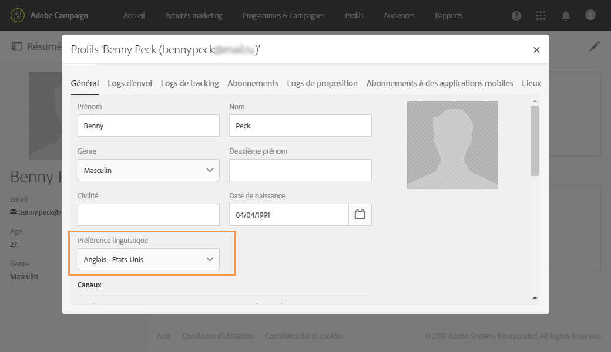

Pour utiliser les variantes de contenus multilingues pour votre diffusion de notification push, suivez ces étapes :

* [Etape 1 : téléchargement d'une variante de contenu multilingue ](../../channels/using/creating-a-multilingual-push-notification.md#step-1--upload-multilingual-content-variant)
* [Etape 2 : aperçu et finalisation d'une notification push à l'aide de variantes de contenus multilingues ](../../channels/using/creating-a-multilingual-push-notification.md#step-2--preview-and-finalize-a-push-notification-using-multilingual-content-variants)
* [Etape 3 : envoi et analyse de la diffusion de notification push multilingue ](../../channels/using/creating-a-multilingual-push-notification.md#step-3--send-and-analyze-multilingual-push-notification-delivery)

## Etape 1 : téléchargement d'une variante de contenu multilingue  {#step-1--upload-multilingual-content-variant}

Avant de personnaliser votre notification push multilingue, vous devez télécharger les variantes de contenus dans un modèle de diffusion multilingue et créer la diffusion.

>[!NOTE]
>
>Vous pouvez également ignorer cette étape si vous souhaitez créer manuellement une variante pour chaque variante linguistique.

1. Dans **[!UICONTROL Activités marketing]**, cliquez sur le bouton **[!UICONTROL Créer]**, puis sélectionnez **[!UICONTROL Notification push]**.
1. Sélectionnez le modèle **[!UICONTROL Envoyer des notifications push multilingues aux profils Campaign]** si vous souhaitez cibler les profils Adobe Campaign abonnés à votre application mobile. Choisissez le modèle **[!UICONTROL Envoyer des notifications push multilingues aux abonnés de l'application]** pour envoyer une notification push à tous les utilisateurs ayant accepté de recevoir des notifications de votre application mobile.

   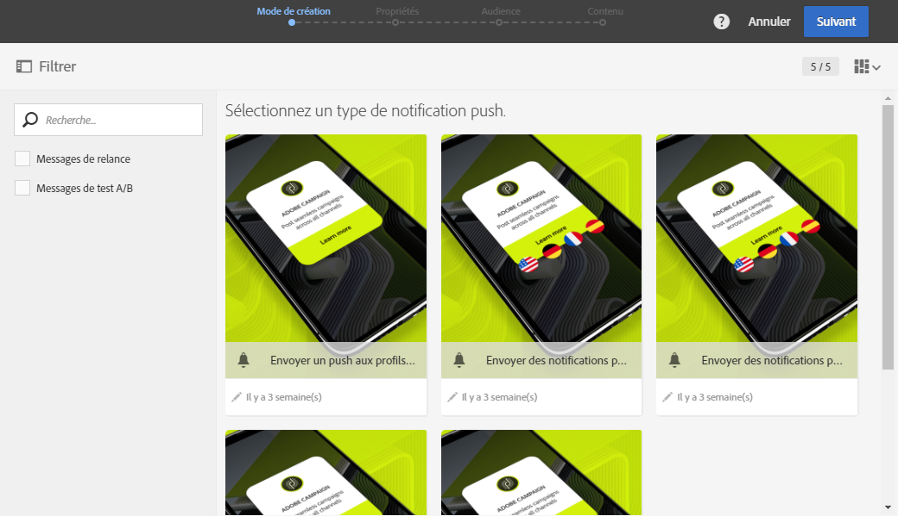

1. Renseignez les propriétés de la notification push et sélectionnez votre application mobile dans le champ **[!UICONTROL Associer une application mobile à une diffusion]**.

   La liste déroulante contiendra les applications des SDK V4 et Adobe Experience Platform.

1. Dans la fenêtre **[!UICONTROL Audiences]**, déposez vos requêtes pour affiner votre audience.

   Les requêtes ajoutées dépendent du modèle sélectionné : si vous avez choisi le modèle **[!UICONTROL Envoyer des notifications push multilingues aux profils Campaign]**, vous pouvez interroger les destinataires connus de votre application mobile. Si vous avez sélectionné en revanche le modèle **[!UICONTROL Envoyer des notifications push multilingues aux abonnés de l'application]**, vous pouvez interroger tous les abonnés d'une application spécifique qui ont accepté de recevoir des notifications.

   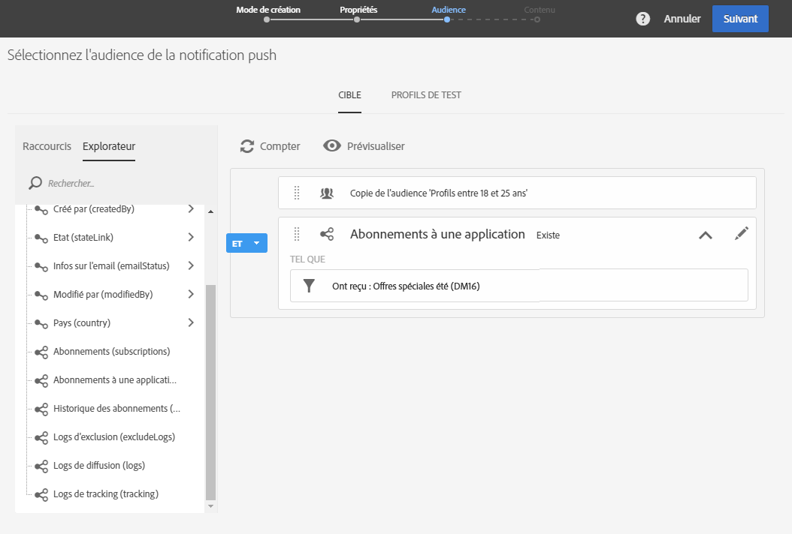

1. Dans la fenêtre **[!UICONTROL Gérez les variantes de contenu]**, déposez votre fichier ou sélectionnez un fichier sur votre ordinateur.

   Le fichier doit être encodé UTF8 et avoir une disposition spécifique que vous pouvez découvrir en cliquant sur l'option **[!UICONTROL Télécharger le fichier d'exemple]**. Vous devez également utiliser la syntaxe adéquate pour les valeurs des paramètres régionaux. Pour plus d'informations sur le format de fichier et les paramètres régionaux pris en charge, consultez cette [technote](http://helpx.adobe.com/campaign/kb/acs-generate-csv-multilingual-push.html).

   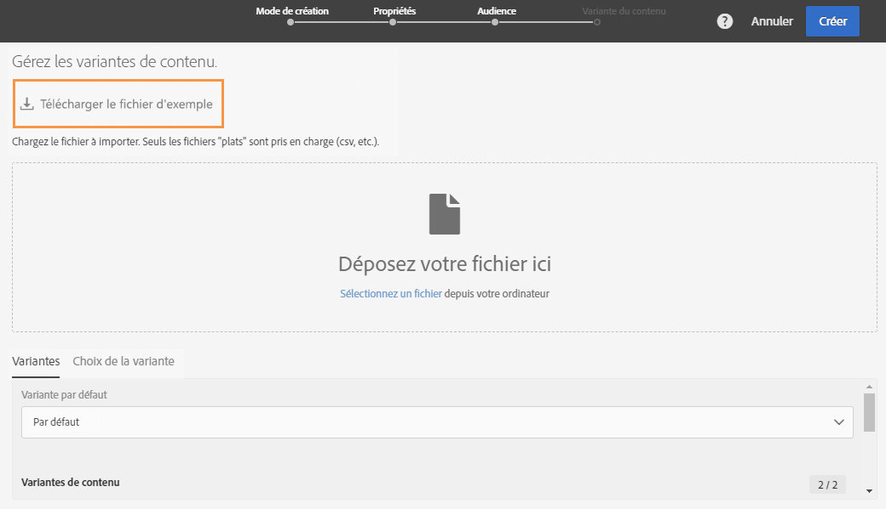

1. Une fois le fichier téléchargé, les variantes linguistiques sont automatiquement renseignées dans l'onglet **[!UICONTROL Variantes]**. Vous pouvez fournir une **[!UICONTROL Variante par défaut]** dans le fichier qui sera la variante de contenu par défaut si aucune préférence linguistique n'est indiquée pour l'utilisateur ciblé.

   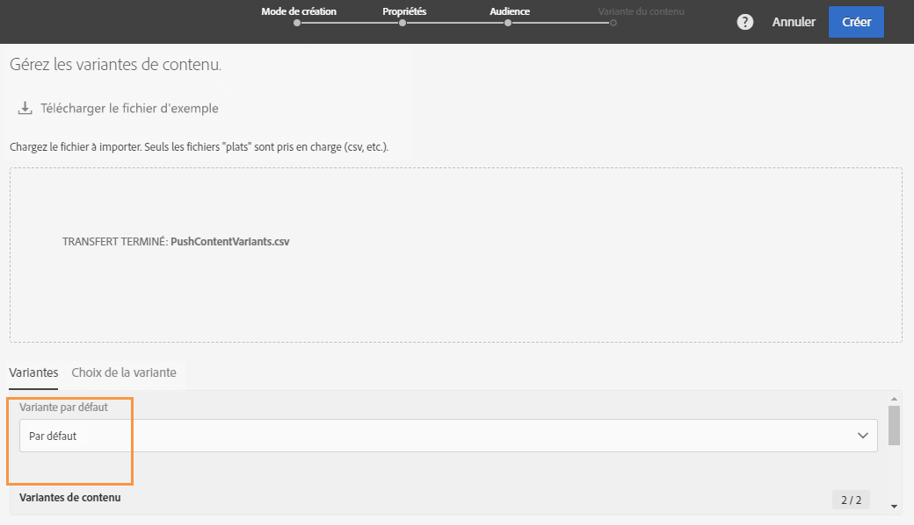

1. L'onglet **[!UICONTROL Choix de la variante]** propose un script permettant de déterminer la préférence linguistique à prendre en compte selon le modèle de diffusion. Il s'agit d'un script d'usine auquel vous n'avez pas à apporter de modifications.
1. Si vous souhaitez ajouter d'autres variantes qui ne sont pas présentes dans le fichier importé, vous pouvez le faire en cliquant sur le bouton **[!UICONTROL Ajouter un élément]** et en ajoutant autant de nouvelles variantes linguistiques que nécessaire.

   Si vous ajoutez d'autres variantes que celles téléchargées depuis le fichier, aucun contenu ne sera associé à cette langue. Vous devrez éditer le contenu directement dans le tableau de bord des diffusions.

   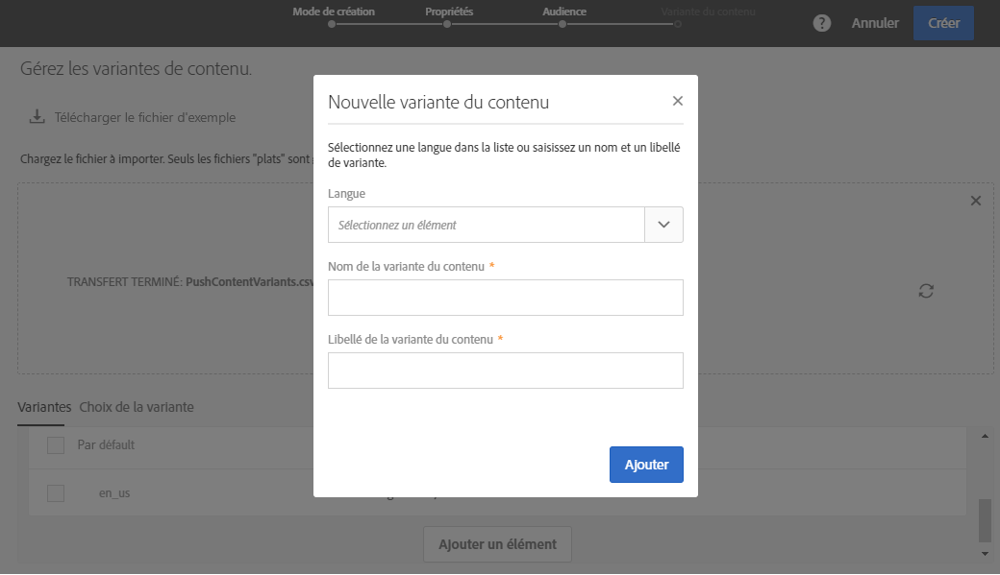

1. Lorsque la configuration est terminée, cliquez sur **[!UICONTROL Créer]**. Vous pouvez toujours retourner dans la fenêtre **[!UICONTROL Variante du contenu]** et apporter quelques modifications depuis le tableau de bord des diffusions.

   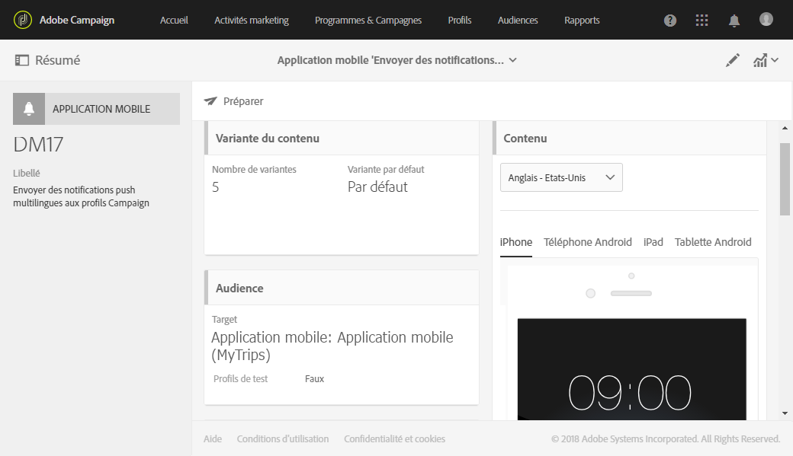

Vous pouvez maintenant commencer à personnaliser votre notification push multilingue.

## Etape 2 : aperçu et finalisation d'une notification push à l'aide de variantes de contenus multilingues  {#step-2--preview-and-finalize-a-push-notification-using-multilingual-content-variants}

Après avoir téléchargé le fichier comportant les variantes de contenus, vous pouvez prévisualiser différentes variantes depuis la diffusion de la notification push.

Vous avez également la possibilité de créer et éditer des variantes supplémentaires en plus de celles téléchargées à partir du fichier.

1. Dans la fenêtre **[!UICONTROL Contenu]** du tableau de bord des diffusions, la liste déroulante permet de prévisualiser le contenu de la notification push selon la langue sélectionnée.

   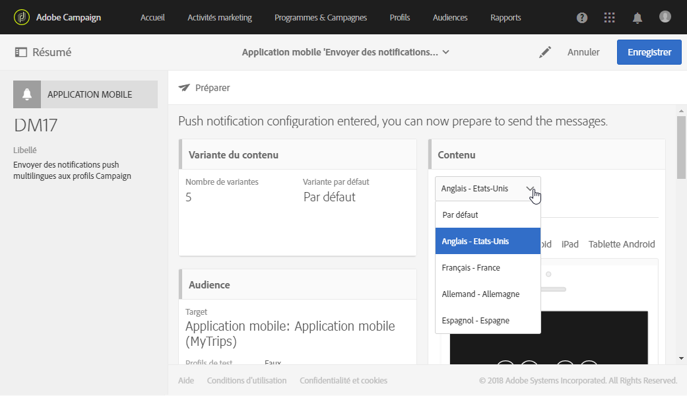

1. Si une variante de contenu n'est pas indiquée pour une langue spécifique, cliquez sur l'icône représentant une cloche sous l'aperçu pour commencer à ajouter du contenu à cette variante linguistique.

   En cliquant sur la fenêtre **[!UICONTROL Contenu]**, la notification push représente le contenu de la langue sélectionnée dans la liste déroulante. Les modifications apportées dans cette fenêtre n'auront une incidence que sur une langue.

1. Vous pouvez également cliquer sur une variante de contenu pour la personnaliser davantage avec des champs de personnalisation par exemple.

   Pour plus d'informations sur la personnalisation d'un message transactionnel, consultez cette [section](../../channels/using/customizing-a-push-notification.md).

   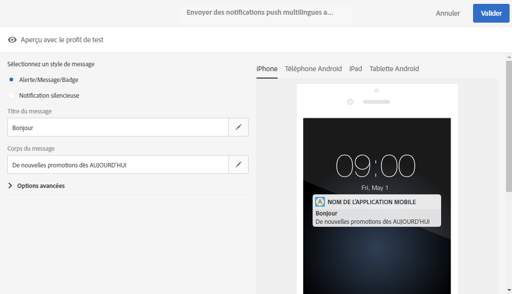

1. Cliquez sur la fenêtre **[!UICONTROL Variante du contenu]** si vous souhaitez ajouter ou supprimer des variantes linguistiques.

   Si vous ajoutez une nouvelle langue, vous devez ajouter manuellement du contenu à la notification push associée à la langue ajoutée.

   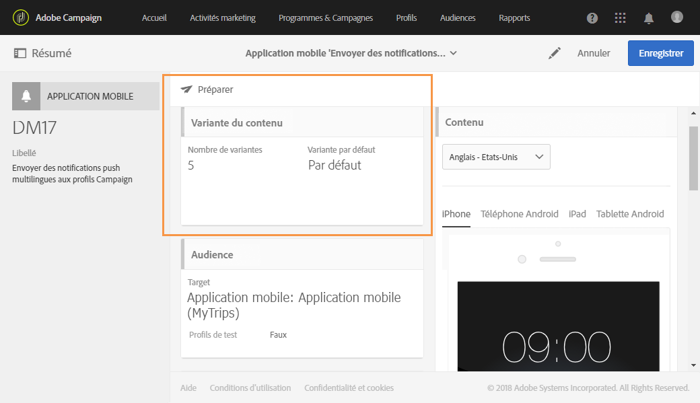

La diffusion de la notification push multilingue est prête à l'envoi.

## Etape 3 : envoi et analyse de la diffusion de notification push multilingue  {#step-3--send-and-analyze-multilingual-push-notification-delivery}

Les notifications push avec des variantes de contenus multilingues peuvent être maintenant envoyées à vos utilisateurs.

1. Pour commencer à préparer l'envoi, cliquez sur le bouton **[!UICONTROL Préparer]**.
1. Lorsque la préparation est terminée sans avertissement, vous pouvez cliquer sur le bouton **[!UICONTROL Confirmer]** pour commencer à envoyer votre notification push multilingue.

   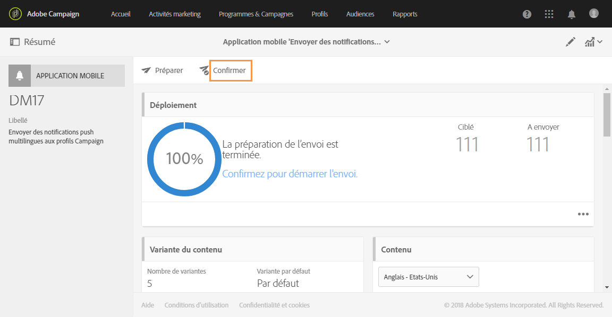

1. Une fois la notification push envoyée, cliquez sur l'icône **[!UICONTROL Rapports]** puis sur **[!UICONTROL Rapports dynamiques]** pour analyser le succès de votre diffusion.

   

1. Sélectionnez **[!UICONTROL Rapport notification push]**.
1. Déposez la dimension **[!UICONTROL Variante]** dans le panneau pour commencer à filtrer vos données.

   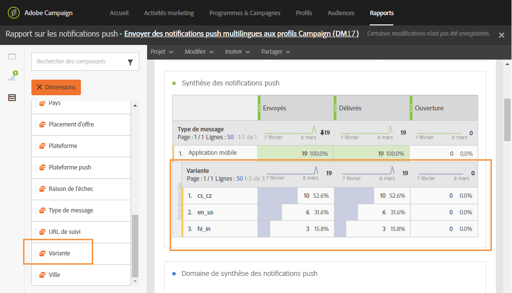

Vous pouvez maintenant mesurer l'impact de la diffusion de votre notification push multilingue sur vos destinataires.

**Rubriques connexes :**

* [Rapport des notifications push (Push notification)](../../reporting/using/push-notification-report.md)
* [Envoi d'une notification push dans un workflow](../../automating/using/push-notification-delivery.md)
* [Accès à des audiences multilingues à l'aide d'un processus](https://helpx.adobe.com/campaign/kb/simplify-campaign-management.html#Engageyourcustomersateverystep)
