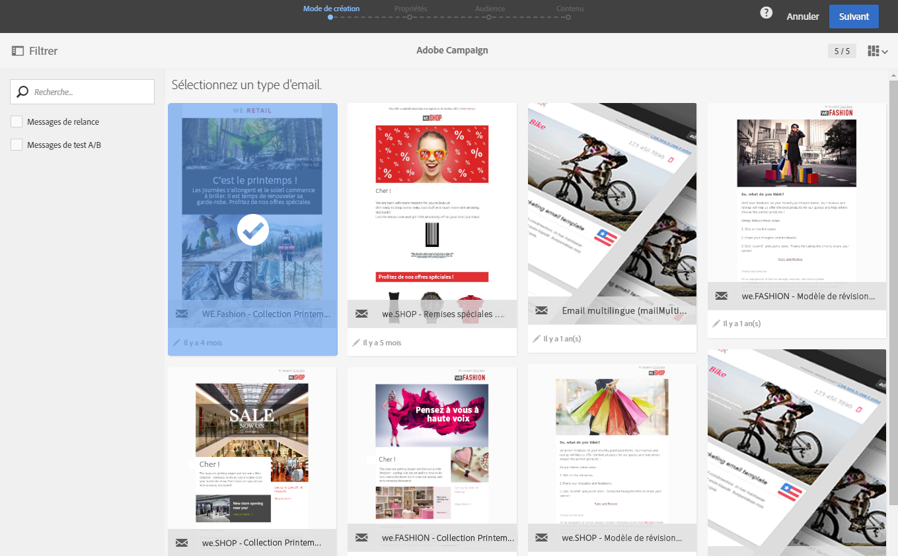
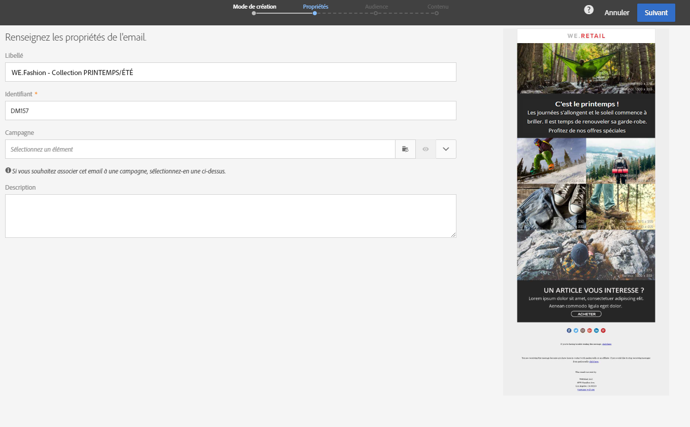
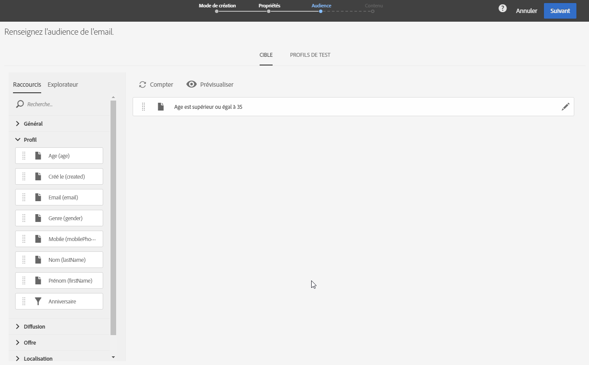
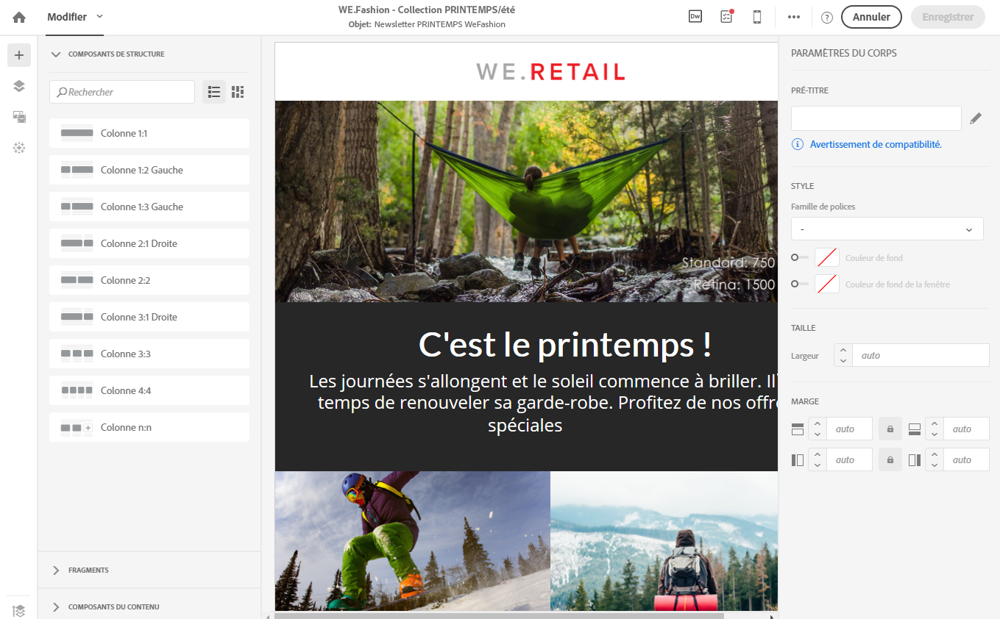
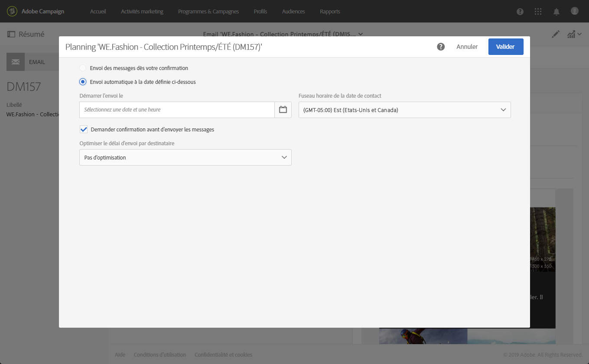
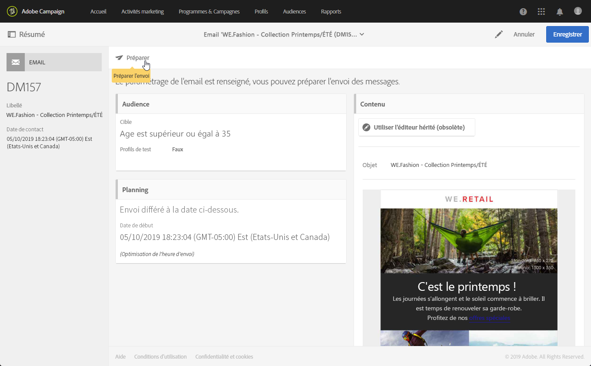
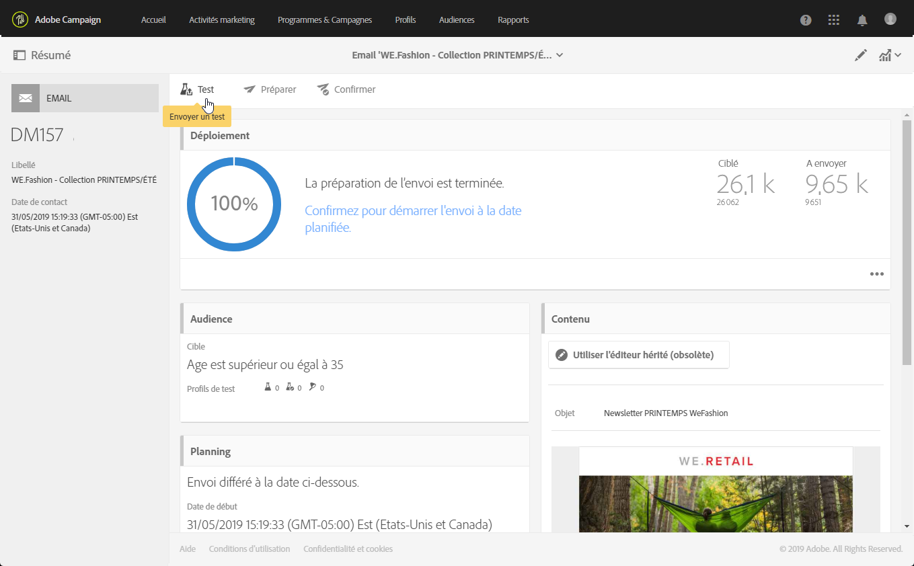
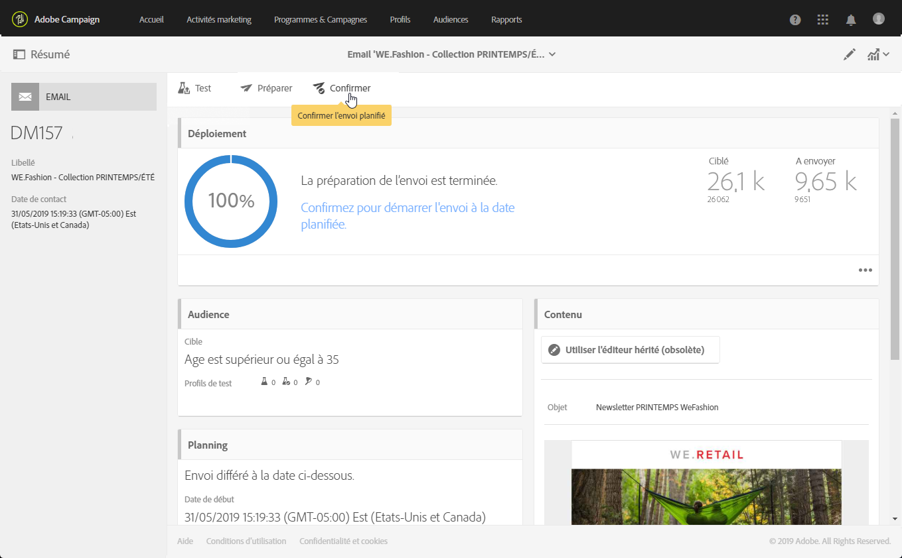

# Créer un email{#creating-an-email}

La création d'un email est possible au sein d'une [campagne](../../start/using/marketing-activities.md#creating-a-marketing-activity), à partir de la [page d'accueil](../../start/using/interface-description.md#home-page) Adobe Campaign ou dans la [liste des activités marketing](../../start/using/marketing-activities.md#about-marketing-activities). Vous avez également la possibilité de créer des diffusions email uniques et récurrentes depuis un workflow.

1. Une fois que vous avez commencé la création d'une activité marketing de type email, choisissez le modèle que vous souhaitez utiliser.

   Chaque activité marketing propose plusieurs modèles par défaut. Cela vous permet de préconfigurer certains paramètres selon vos besoins, mais également d'assigner une marque à votre diffusion. Voir à ce propos [Gérer les modèles](../../start/using/about-templates.md).

   

   >[!NOTE]
   >
   >Les modèles de relance et de test A/B sont masqués par défaut. Cochez les cases situées à gauche (au niveau du panneau latéral **[!UICONTROL Filtrer]**) si vous souhaitez les afficher.

1. Renseignez les propriétés générales de l'email. Vous pouvez saisir un nom dans le champ **Libellé** et modifier l'identifiant. Le nom de l'activité et son identifiant apparaissent dans l'interface, mais ne sont pas visibles par les destinataires des messages.

   Vous pouvez ajouter une description, qui sera visible par l'utilisateur dans le contenu de la campagne.

   

   >[!NOTE]
   >
   >A partir de la page d'accueil ou de la liste des activités marketing, vous pouvez créer votre email à l'intérieur d'une campagne parente. Sélectionnez celle-ci parmi les campagnes déjà créées.

1. Définissez la cible de votre message en fonction des critères de votre entreprise. Voir [Gérer les profils](../../audiences/using/about-profiles.md).

   Vous pouvez également définir les profils de test qui valideront le message. Voir [Gérer les profils de test](../../sending/using/managing-test-profiles-and-sending-proofs.md#managing-test-profiles).

   

1. Définissez et personnalisez le contenu du message, le nom de l'expéditeur et l'objet à l'aide du [Concepteur d'email](../../designing/using/about-email-content-design.md#about-the-email-designer). Voir à ce propos [A propos de la conception du contenu d'un email](../../designing/using/about-email-content-design.md).

   

   Vous pouvez concevoir votre message directement au moyen d'un modèle de contenu prédéfini, ou utiliser Dreamweaver ou Adobe Experience Manager. Si vous ne souhaitez pas concevoir le contenu par vous-même, vous pouvez également charger un contenu qui a été préparé pour vous ou importer un contenu existant depuis une URL. Voir [Sélectionner un contenu existant](../../designing/using/selecting-an-existing-content.md).

1. Prévisualisez votre message. Voir [Prévisualiser le message](../../sending/using/previewing-messages.md).
1. Validez la création de l'email.

   >[!NOTE]
   >
   >Pour pouvoir enregistrer votre email, vous devez éditer le contenu. Si vous cliquez sur **[!UICONTROL Annuler]** à cette étape, vous ne terminerez pas l'assistant et votre email ne sera pas créé.

   Le tableau de bord de l'email s'affiche alors. Il vous permet de vérifier votre message et de [préparer l'envoi](../../sending/using/preparing-the-send.md).

   Le bouton **[!UICONTROL Editer les propriétés]** dans le coin supérieur droit permet d'éditer les propriétés de l'email. Vous pouvez, par exemple, configurer l'email de sorte que son libellé soit calculé au moment de la préparation de la diffusion. Les paramètres disponibles sont répertoriés dans [cette section](../../administration/using/configuring-email-channel.md#list-of-email-properties).

   

1. Planifiez l'envoi. Voir [Planifier des messages](../../sending/using/about-scheduling-messages.md).

   

1. Préparez votre message afin d'analyser sa cible. Voir [Préparer l'envoi](../../sending/using/confirming-the-send.md).

   

   >[!NOTE]
   >
   >Vous pouvez définir des règles de fatigue cross-canal globales qui excluront automatiquement les profils sur-sollicités des campagnes. Voir à ce propos [Règles de fatigue](../../administration/using/fatigue-rules.md).

1. Envoyez des bons à tirer à vérifier, validez votre message et suivez son rendu dans la boîte de réception. Voir [Envoyer un bon à tirer](../../sending/using/managing-test-profiles-and-sending-proofs.md#sending-proofs).

   

1. Envoyez le message et vérifiez sa diffusion à l'aide du dashboard de message et des logs. Voir [Envoyer un message](../../sending/using/confirming-the-send.md).

   

1. Mesurez l'impact de votre message avec des rapports de diffusion. Pour plus d'informations sur le reporting, voir [cette section](../../reporting/using/about-dynamic-reports.md).

**Rubriques connexes** :

* Vidéo [Créer un email](https://helpx.adobe.com/fr/campaign/kt/acs/using/acs-create-email-from-homepage-feature-video-use.html)
* Guide détaillé [Créer un email personnalisé](https://docs.campaign.adobe.com/doc/standard/getting_started/fr/ACS_GettingStartedEmail.html)
* Vidéo [Intégration d'Adobe Campaign et de Dreamweaver](https://helpx.adobe.com/fr/campaign/kt/acs/using/acs-dreamweaver-integration-feature-video-use.html)
* [Intégrer avec Adobe Experience Manager](../../integrating/using/integrating-with-experience-manager.md)

