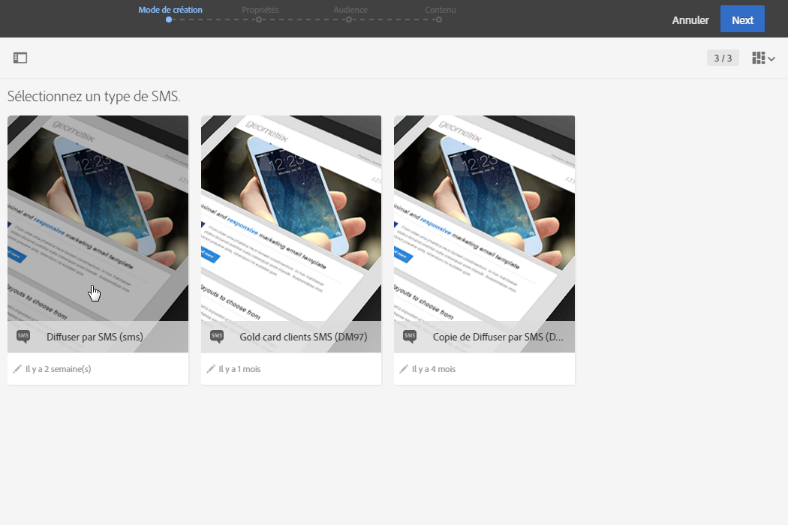
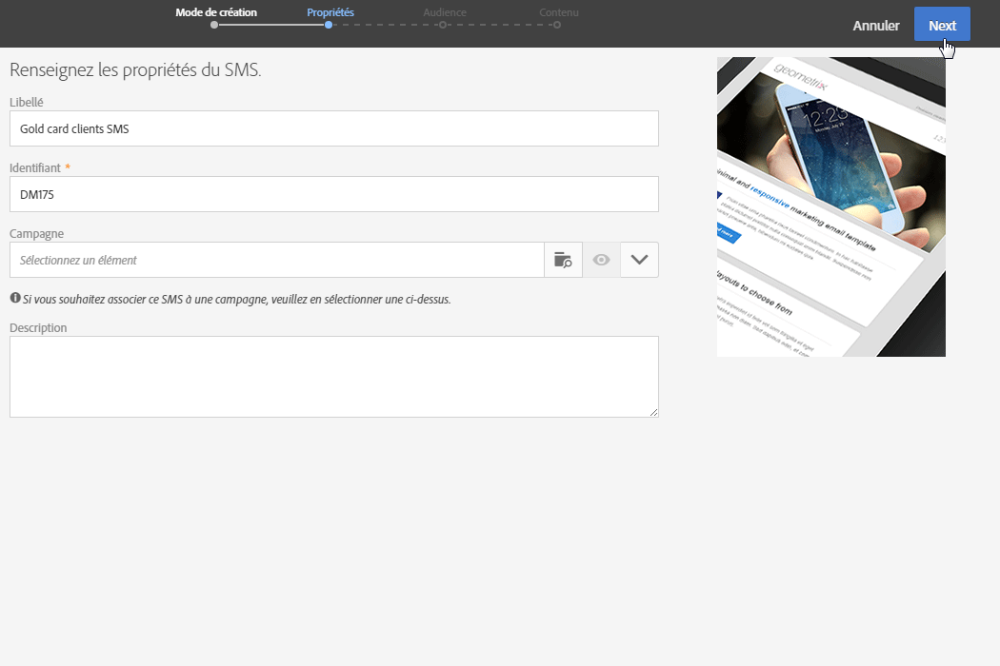
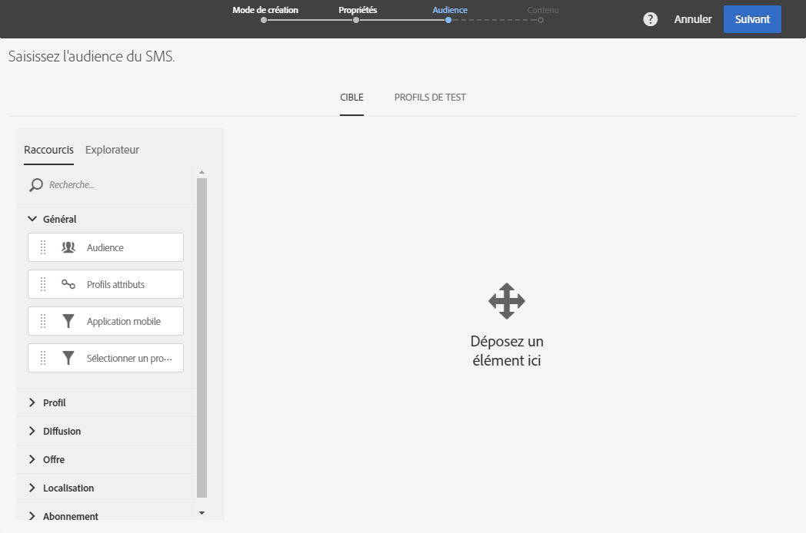
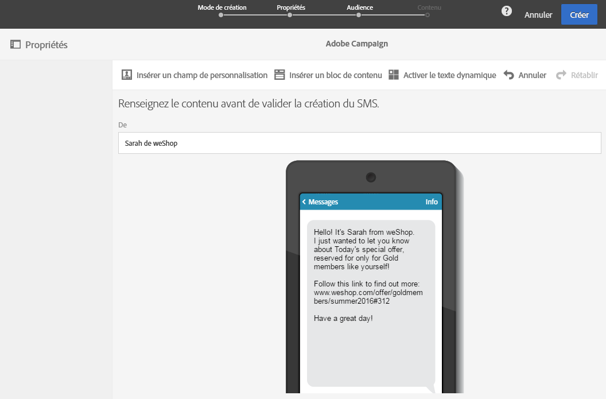
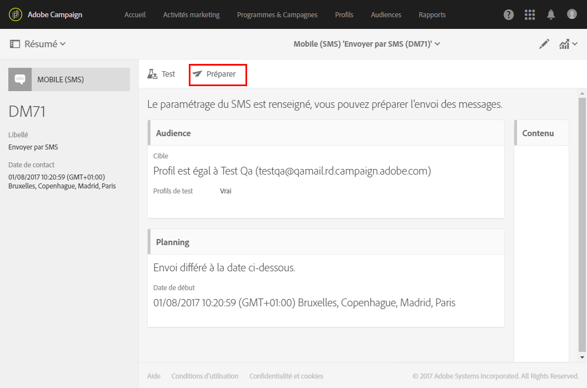
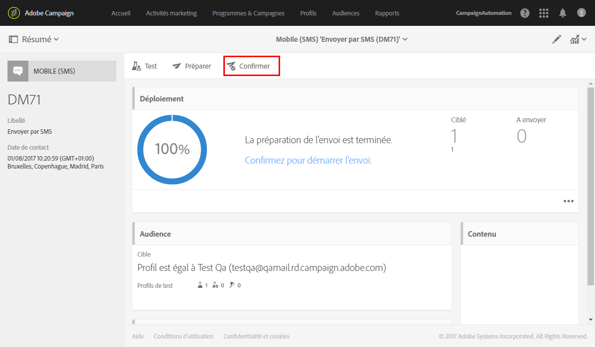

# Créer un SMS{#creating-an-sms-message}

La création d'une diffusion SMS est très similaire à celle d'un email classique. Les étapes suivantes présentent la configuration qui est spécifique à ce canal. Pour plus d'informations sur d'autres options, reportez-vous à la section [Créer un email](../../channels/using/creating-an-email.md).

Les paramètres avancés des SMS sont détaillés dans la section [Configuration des SMS](../../administration/using/configuring-sms-channel.md).

Pour créer et diffuser des SMS vers un téléphone mobile, vous devez avoir :

* un compte externe de type **[!UICONTROL Routage]** paramétré sur le canal **[!UICONTROL Mobile (SMS)]** avec le mode de diffusion **[!UICONTROL Envoi en masse]**. Voir à ce propos la section [Routage](../../administration/using/configuring-sms-channel.md#defining-an-sms-routing),
* un modèle de diffusion correctement lié à ce compte externe.

1. Créez une diffusion SMS depuis la [page d'accueil](../../start/using/interface-description.md#home-page) Adobe Campaign, au sein d'une [campagne](../../start/using/marketing-activities.md#creating-a-marketing-activity) ou dans la [liste des activités marketing](../../start/using/programs-and-campaigns.md#creating-a-campaign).

   Vous pouvez également ajouter une activité SMS à un workflow. Voir à ce propos le guide [Workflows](../../automating/using/sms-delivery.md).

   Lors de la création d'un message, un assistant s'affiche pour vous guider tout le long des étapes les plus importantes. Les éléments définis par le biais de l'assistant peuvent toujours être édités par la suite depuis le tableau de bord du message.

1. Sélectionnez le modèle que vous souhaitez utiliser. Vous pouvez sélectionner le modèle d'usine SMS ou l'un de vos propres modèles.

   

   Pour diffuser vers un téléphone mobile, le modèle de diffusion doit être correctement lié au compte externe de routage des SMS.

1. Renseignez les propriétés générales du SMS.

   

   Le libellé de l'activité et son identifiant apparaissent dans l'interface, mais ne sont pas visibles par les destinataires des messages.

1. Indiquez l'audience que vous souhaitez cibler. Vous pouvez sélectionner une audience existante ou cibler directement une population en définissant et en associant des règles.

   

1. Ajoutez du contenu à votre SMS. Vous pouvez également définir le contenu en cliquant sur la section **[!UICONTROL Contenu]** du tableau de bord de la diffusion, une fois la création du SMS terminée. Voir [A propos de la conception du contenu d'un SMS](../../designing/using/about-sms-and-push-content-design.md).

   Si vous avez inséré des champs de personnalisation ou du texte conditionnel dans le contenu de votre SMS, la longueur du message varie d'un destinataire à l'autre, car cela peut introduire des caractères non pris en charge par l'encodage GSM. La longueur du message doit être évaluée une fois la personnalisation effectuée. Voir [Personnaliser un SMS](../../channels/using/personalizing-sms-messages.md).

   

1. Validez la création du message. Son tableau de bord est alors affiché.
1. Planifiez l'envoi. Le SMS peut être envoyé manuellement juste après la préparation du message ou automatiquement à une date planifiée. Voir [Planifier des messages](../../sending/using/about-scheduling-messages.md).
1. Préparez le message pour analyser sa validité, sa personnalisation et sa cible.

   

   >[!NOTE]
   >
   >Vous pouvez définir des règles de fatigue cross-canal globales qui excluront automatiquement les profils sur-sollicités des campagnes. Voir [Règles de fatigue](../../administration/using/fatigue-rules.md).

1. Envoyez des bons à tirer pour vérifier et valider votre message et contrôlez l'inbox rendering. Voir à ce sujet la section [Envoyer un bon à tirer (BAT)](../../sending/using/managing-test-profiles-and-sending-proofs.md#sending-proofs).
1. Validez l'envoi du message. L'envoi débutera selon le planning que vous avez défini.

   

Le message est envoyé. Vous pouvez vérifier sa diffusion par le biais du tableau de bord du message et des logs.

Une fois l'envoi terminé, vous pouvez commencer à mesurer l'impact de votre message avec les rapports de diffusion intégrés ou personnalisés.

**Rubriques connexes :**

* [A propos de l'édition du contenu d'un SMS et d'une notification push](../../designing/using/about-sms-and-push-content-design.md)
* [Gestion des modèles](../../start/using/about-templates.md)
* Vidéo [Créer une diffusion SMS](https://helpx.adobe.com/fr/campaign/kt/acs/using/acs-creating-a-sms-delivery-feature-video-use.html)

