# Créer le courrier{#creating-the-direct-mail}

La création d'une diffusion courrier est très similaire à celle d'un email classique. Les étapes suivantes présentent la configuration qui est spécifique à ce canal. Pour plus d'informations sur d'autres options, reportez-vous à la section [Créer un email](../../channels/using/creating-an-email.md).

1. Créez une diffusion courrier depuis la [page d'accueil](../../start/using/interface-description.md#home-page) Adobe Campaign, au sein d'une [campagne](../../start/using/marketing-activities.md#creating-a-marketing-activity) ou dans la [liste des activités marketing](../../start/using/programs-and-campaigns.md#creating-a-campaign).

   >[!NOTE]
   >
   >Vous pouvez également ajouter une activité de courrier à un workflow. Voir à ce propos le guide [Workflows](../../automating/using/direct-mail-delivery.md).

   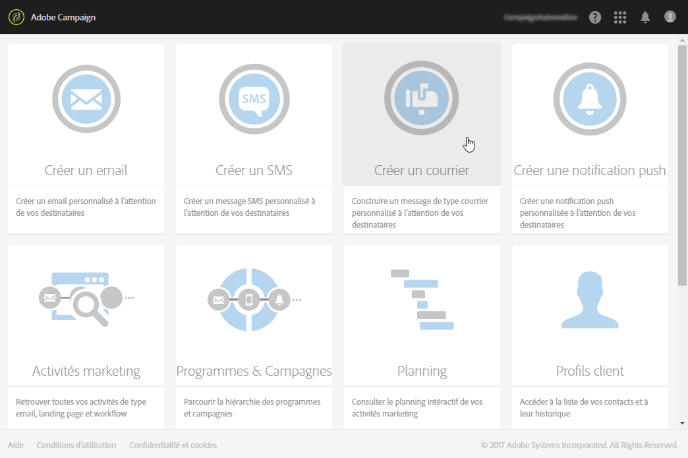

1. Sélectionnez le modèle d'usine **[!UICONTROL Courrier]ou l'un de vos propres modèles.** Pour plus d'informations sur les modèles, reportez-vous à la section [Gestion des modèles](../../start/using/about-templates.md).

   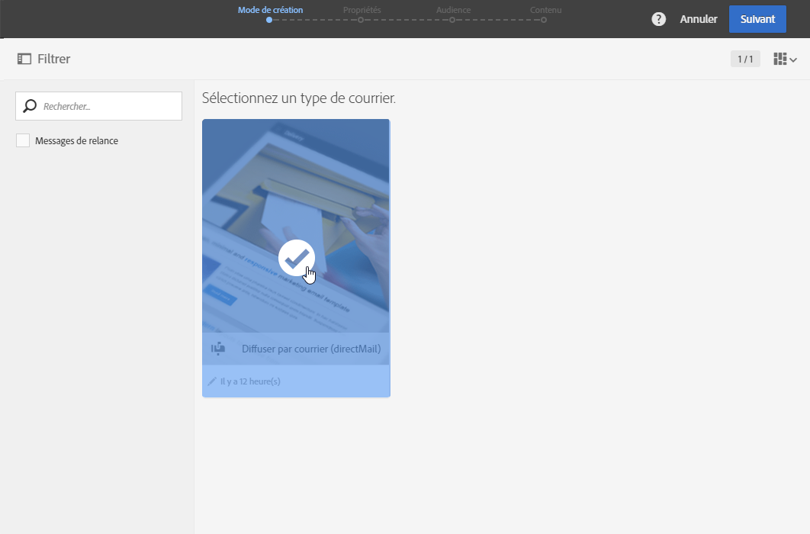

1. Renseignez les propriétés générales de la diffusion.

   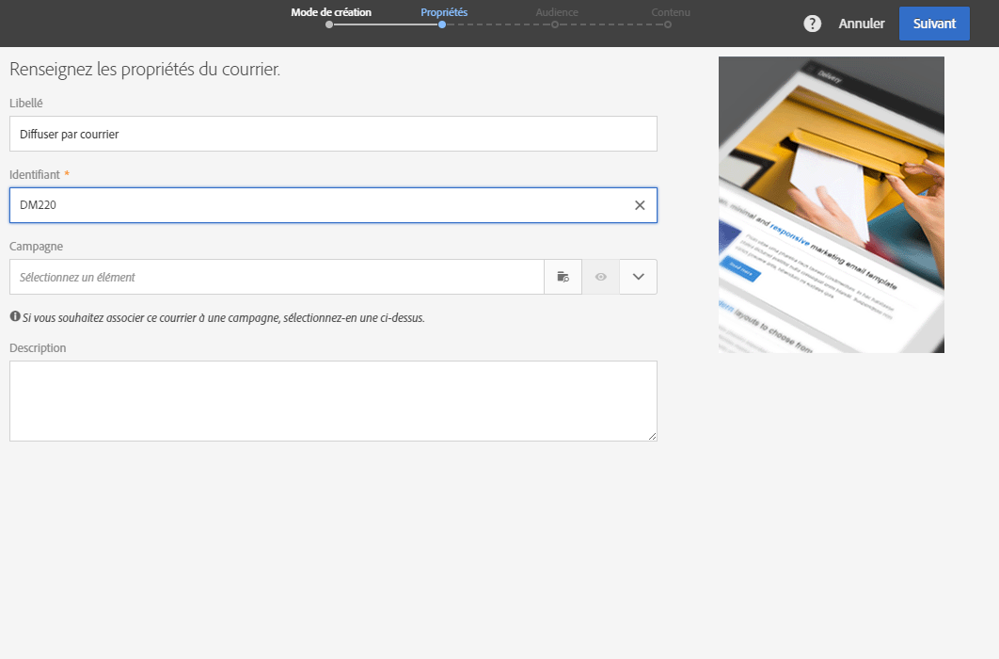

1. Définissez l'audience que vous souhaitez inclure dans le fichier d'extraction ainsi que les profils de test et de type piège. Voir [Définir l'audience du courrier](../../channels/using/defining-the-direct-mail-audience.md).

   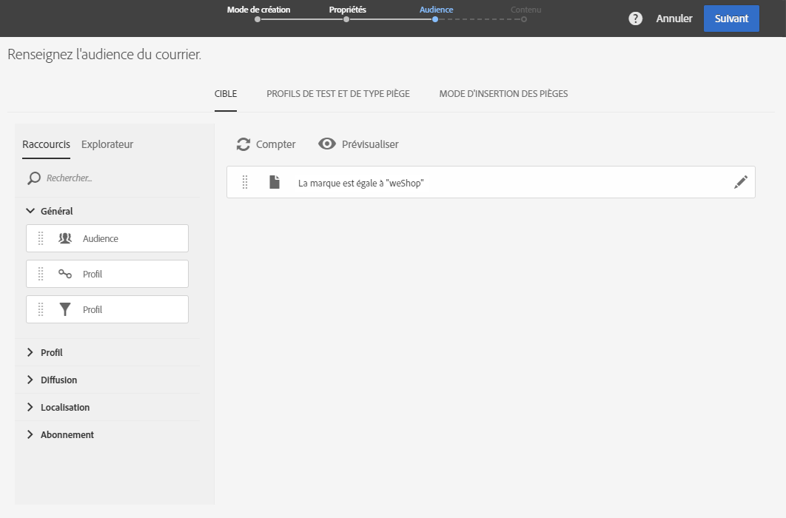

   >[!NOTE]
   >
   >La définition de l'audience est très similaire à celle d'un email classique. Voir [Créer une audience](../../audiences/using/creating-audiences.md).

1. Editez le contenu de votre fichier : colonnes à inclure pour chaque profil, structure du fichier, en-tête et pied de page. Voir [Définir le contenu du courrier](../../channels/using/defining-the-direct-mail-content.md).

   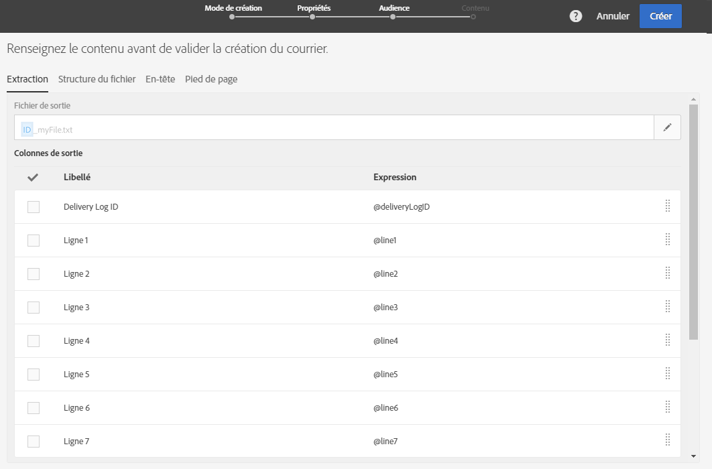

1. Cliquez sur la section **[!UICONTROL Planning]du tableau de bord de la diffusion pour définir la date de contact.** La date de contact est obligatoire pour les courriers. Pour plus d'informations, reportez-vous à la section [Planifier l'envoi](../../sending/using/about-scheduling-messages.md).

   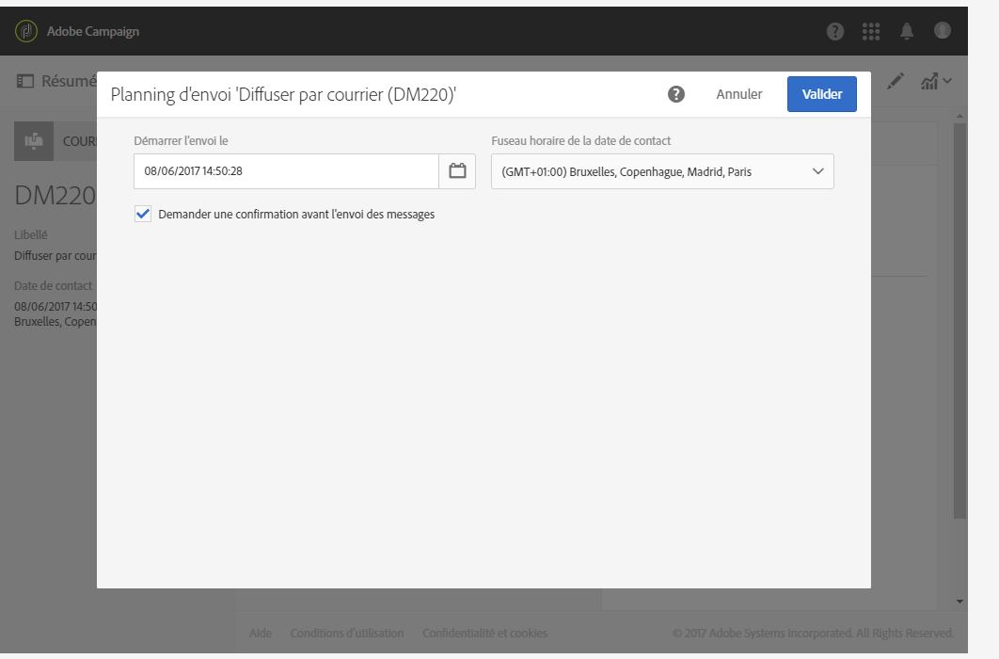

1. Si vous avez ajouté des profils de test (voir la section [Ajouter des profils de test et de type piège](../../channels/using/defining-the-direct-mail-audience.md#adding-test-and-trap-profiles)), vous pouvez tester votre diffusion avant de préparer le fichier final. Vous pouvez ainsi créer un fichier d'exemple contenant uniquement les profils de test sélectionnés.

   Cliquez sur **[!UICONTROL Tester]pour générer le fichier d'exemple.** Cliquez sur **[!UICONTROL Résumé]**, en haut à gauche, puis sélectionnez **[!UICONTROL Bons à tirer]**. Dans la partie gauche de l'écran, sélectionnez le BAT et cliquez ensuite sur **[!UICONTROL Télécharger le fichier]**.

   >[!NOTE]
   >
   >Le rôle **[!UICONTROL Export]est requis pour qu'Adobe Campaign puisse exporter le fichier et permettre de le télécharger.** Veuillez contacter votre administrateur.

   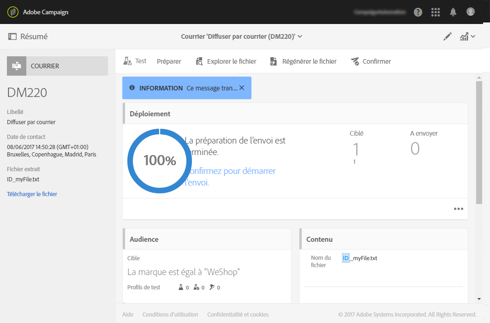

1. Une fois que vous avez défini le contenu, l'audience et la date de contact de la diffusion, cliquez sur le bouton **[!UICONTROL Préparer]dans le tableau de bord de la diffusion.**

   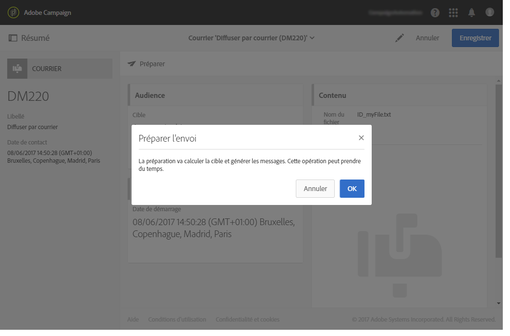

   Les règles de typologie sont appliquées. Toutes les adresses postales non renseignées sont par exemple exclues de la cible, et c'est pourquoi vous devez vérifier que la case **[!UICONTROL Adresse renseignée]** est cochée dans les informations des profils (voir [Recommandations](../../channels/using/about-direct-mail.md#recommendations)). Si vous avez défini un **[!UICONTROL Volume maximal de messages]dans les propriétés du courrier ou au niveau du modèle, cette limite est également appliquée à ce stade.**

   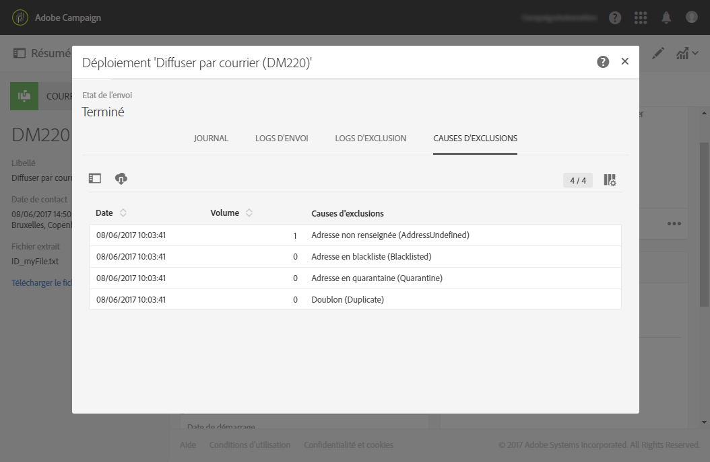

   >[!NOTE]
   >
   >Vous pouvez définir des règles de fatigue cross-canal globales qui excluront automatiquement les profils sur-sollicités des campagnes. Voir [Règles de fatigue](../../administration/using/fatigue-rules.md).

1. Cliquez sur **[!UICONTROL Explorer le fichier]pour prévisualiser les 100 premières lignes du fichier.**

   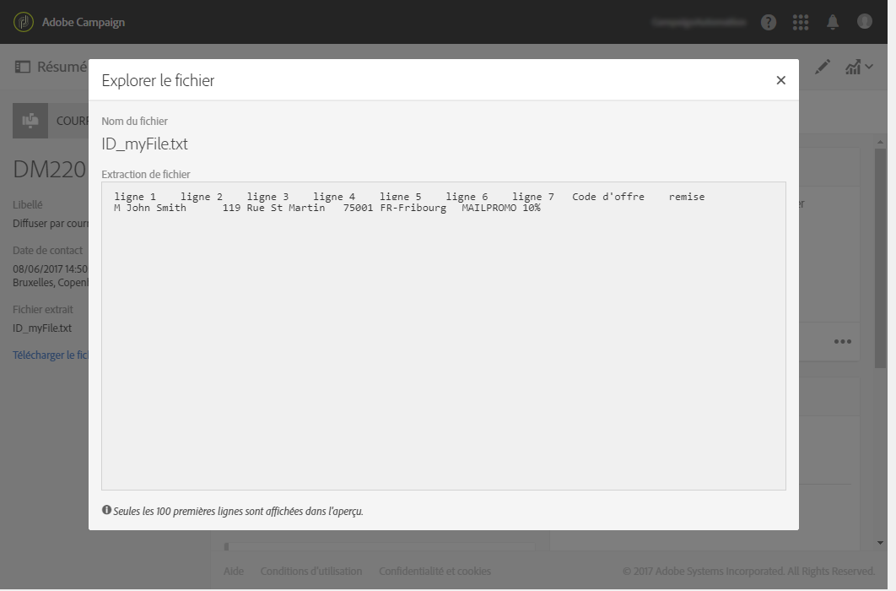

   Le fichier complet peut être téléchargé en local dans la partie gauche de l'écran. Le téléchargement du fichier génère une entrée de journal dans le menu **[!UICONTROL Audits des exports.]** Pour plus d'informations sur les audits des exports, consultez la section [Audits des exports](../../administration/using/auditing-export-logs.md).

   >[!NOTE]
   >
   >Le rôle **[!UICONTROL Export]est requis pour qu'Adobe Campaign puisse exporter le fichier et permettre de le télécharger.** Veuillez contacter votre administrateur.

   Si vous devez modifier le contenu de la diffusion, il vous suffit de cliquer sur le bouton **[!UICONTROL Regénérer le fichier]pour que la modification soit prise en compte.** Il n'est pas nécessaire de recommencer la préparation.

   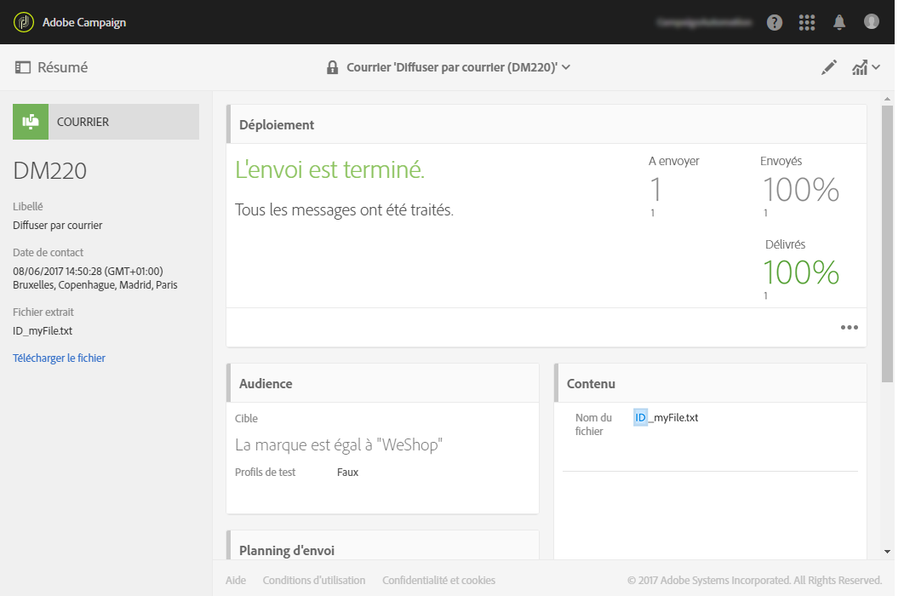

1. Pour confirmer que le fichier est final, cliquez sur le bouton **[!UICONTROL Confirmer]dans le tableau de bord de la diffusion.**

   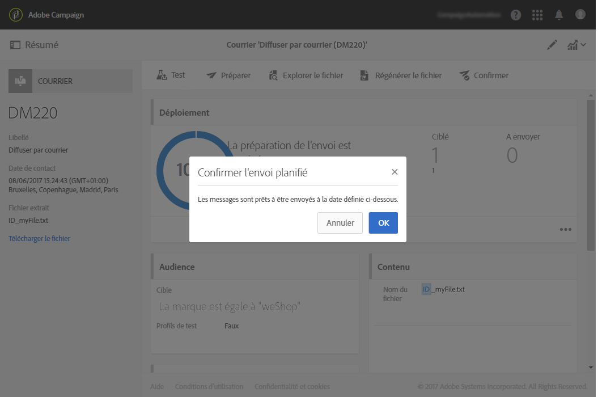

Vous pouvez à présent envoyer le fichier d'extraction à l'opérateur de services postaux. Pour cela, vous disposez de plusieurs options :

* Vous pouvez l'envoyer en pièce jointe dans un email classique.
* Vous pouvez l'envoyer via Adobe Campaign : créez votre diffusion courrier dans un [workflow](../../automating/using/direct-mail-delivery.md) de campagne et ajoutez une activité **[!UICONTROL Transfert de fichier]pour envoyer le fichier via FTP, par exemple.** Voir à ce propos la section [Transfert de fichier](../../automating/using/transfer-file.md).

L'opérateur récupère la liste des adresses erronées et l'envoie à Adobe Campaign qui blackliste automatiquement ces adresses. Voir [Retour à l'expéditeur](../../channels/using/return-to-sender.md).
