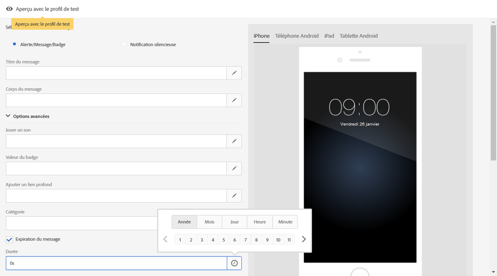

# Personnalisation d&#39;une notification push{#customizing-a-push-notification}

Pour parfaire votre notification push, Adobe Campaign vous permet d&#39;accéder à un ensemble d&#39;options avancées lors de sa création.

En tant qu&#39;utilisateur expert, consultez la note technique [Présentation de la structure de la payload des notifications push Campaign Standard](https://helpx.adobe.com/fr/campaign/kb/understanding-campaign-standard-push-notifications-payload-struc.html) pour configurer des applications mobiles dans Adobe Campaign.

**Contenu connexe :**

* [Rapport des notifications push (Push notification)](../../reporting/using/push-notification-report.md)
* [Envoi d&#39;une notification push dans un workflow](../../automating/using/push-notification-delivery.md)

## Jouer un son {#play-a-sound}

La fonction **[!UICONTROL Jouer un son]** permet à l&#39;application d&#39;émettre des sons sur l&#39;appareil lors de la diffusion d&#39;une notification push, lorsqu&#39;elle n&#39;est pas en cours d&#39;exécution.

Un son permet d&#39;avertir l&#39;utilisateur lors de la réception d&#39;une notification push, ce qui lui donne davantage de visibilité. Pour ajouter un son à votre application mobile :

1. Ouvrez la notification push et accédez à la section **[!UICONTROL Options avancées]**.
1. Dans le champ **[!UICONTROL Jouer un son]**, entrez le nom du fichier son, sans l&#39;extension, que doit lancer le terminal mobile à réception de la notification.

   Pour plus d&#39;informations sur les formats multimédias pris en charge, consultez la documentation [Apple](https://support.apple.com/kb/PH16864?locale=fr_FR) et [Android](https://developer.android.com/guide/topics/media/media-formats).

   

1. Le fichier son est lu lors de la diffusion de la notification s’il est défini dans le package de l’application mobile. Sinon, le son par défaut de l’appareil est émis.

L&#39;utilisateur reçoit ensuite la notification push. Le son est émis uniquement si le téléphone n&#39;est pas muet.

## Actualiser la valeur du badge      {#refresh-the-badge-value}

Un badge est utilisé pour afficher le nombre de nouvelles informations non lues directement sur l&#39;icône de l&#39;application. La valeur du badge disparaît dès que l&#39;utilisateur ouvre ou lit le nouveau contenu de l&#39;application.

A la réception d&#39;une notification sur un appareil, la valeur du badge de l&#39;application associée peut être actualisée ou ajoutée. Pour envoyer une valeur de badge du côté serveur :

1. Ouvrez la notification push et accédez à la section **[!UICONTROL Options avancées]**.
1. La valeur du badge doit être un entier et peut être mise à jour de plusieurs manières différentes :

   * Pour actualiser le badge, saisissez 0 dans le champ **[!UICONTROL Valeur du badge]**. Le badge est alors supprimé de l&#39;icône de l&#39;application.
   * Pour ajouter une valeur de badge, saisissez n&#39;importe quel nombre dans le champ **[!UICONTROL Valeur du badge]**. Ce nombre apparaîtra automatiquement dans le badge dès réception de la notification push par l&#39;utilisateur.
   * Si le champ est vide ou s&#39;il ne contient pas d&#39;entier, la valeur du badge ne change pas.

   Dans cet exemple, la valeur 1 a été saisie dans le champ **[!UICONTROL Valeur du badge]** pour indiquer aux utilisateurs que l&#39;application contient une nouvelle information.

   

1. Une fois le message envoyé, les utilisateurs recevront la notification push. L&#39;application affichera alors automatiquement la nouvelle valeur de badge.

   

## Ajouter un lien profond      {#add-a-deeplink}

Un lien profond vous permet d&#39;amener directement les utilisateurs à un contenu situé dans l&#39;application (au lieu d&#39;ouvrir une page de navigateur Web).

Un lien profond peut contenir des données de personnalisation permettant d&#39;adapter le contenu à chaque utilisateur. Par exemple, les prénoms des destinataires sont remplis automatiquement sur la page vers laquelle l&#39;application les envoie.

Pour ajouter un lien profond à une notification push :

1. Ouvrez la notification push et accédez à la section **[!UICONTROL Options avancées]**.
1. Saisissez le lien dans le champ **[!UICONTROL Ajouter un lien profond]**.

   

1. Une fois le message envoyé, les utilisateurs recevront la notification push puis accéderont à la page spécifique de l&#39;application en interagissant avec la notification (en appuyant ou en cliquant sur le bouton d&#39;appel à l&#39;action, par exemple).

   

## Définir une action      {#define-an-action}

Le cas échéant, vous pouvez ajouter l&#39;identifiant de catégorie de l&#39;application mobile et afficher ensuite des boutons d&#39;action. Ces notifications permettent à l&#39;utilisateur d&#39;effectuer plus rapidement différentes tâches en réponse à celles-ci, sans ouvrir l&#39;application ou la parcourir.

La boîte de dialogue qui s&#39;affiche sur le téléphone de l&#39;utilisateur requiert une prise de décision. Quand l&#39;utilisateur sélectionne l&#39;une des actions, le système notifie l&#39;application afin qu&#39;elle puisse réaliser n&#39;importe quelle tâche associée.

Pour ajouter une catégorie à une notification push :

1. Ouvrez la notification push et accédez à la section **[!UICONTROL Options avancées]**.
1. Entrez un nom de catégorie prédéfinie dans le champ **[!UICONTROL Catégorie]** pour afficher les boutons actifs lorsque la notification push est reçue.

   Le développeur de l&#39;application mobile doit définir l&#39;identifiant de catégorie et le comportement attendu des boutons dans l&#39;application. Consultez à ce sujet la [Documentation développeur Apple](https://developer.apple.com/library/content/documentation/NetworkingInternet/Conceptual/RemoteNotificationsPG/SupportingNotificationsinYourApp.html) (section **Configuration des catégories et notifications actives**) ou la [Documentation développeur Android](https://developer.android.com/guide/topics/ui/notifiers/notifications.html).

   

1. Une fois la notification push envoyée, les utilisateurs la reçoivent et doivent agir à l&#39;aide des boutons actifs configurés auparavant.

   

L&#39;application est ensuite informé de l&#39;action de l&#39;utilisateur afin qu&#39;elle puisse exécuter les tâches associées.

## Ajouter une date d&#39;expiration {#add-expiration-date}

La définition d&#39;une date d&#39;expiration pour votre notification push permet de définir une date d&#39;expiration spécifique à laquelle le message ne sera plus envoyé par Apple ([APNS](https://developer.apple.com/documentation/usernotifications/setting_up_a_remote_notification_server/sending_notification_requests_to_apns)) ou Android ([FCM](https://firebase.google.com/docs/cloud-messaging/concept-options)).

Pour ajouter une date d&#39;expiration à votre notification push :

1. Cochez l’option **[!UICONTROL Expiration du message]** : en sélectionnant l’option **[!UICONTROL Expiration du message]**, la durée est automatiquement définie sur 0. Si vous ne modifiez pas la valeur, APNS et FCM essaieront d&#39;envoyer le message immédiatement. En cas d&#39;échec, le message ne sera pas renvoyé.

1. Dans le champ **[!UICONTROL Durée]**, sélectionnez la validité de votre notification push.

   

1. Si l&#39;utilisateur n&#39;a pas reçu immédiatement votre notification push après que vous l&#39;ayez envoyée car son téléphone n&#39;était pas allumé ou n&#39;avait pas de signal, la notification push est toujours envoyée dans l&#39;intervalle avant expiration.

Notez que si la notification push n&#39;a pas été envoyée avant la date d&#39;expiration, elle sera ignorée.

## Ajouter des champ personnalisés      {#add-custom-fields}

Les champs personnalisés vous permettent de transmettre des données personnalisées à la payload sous la forme d&#39;une paire de valeurs de clés. Vous pouvez utiliser cette option pour transmettre des données supplémentaires à l&#39;application en plus des clés prédéfinies.

Pour ce faire :

1. Ouvrez la notification push et accédez à la section **[!UICONTROL Options avancées]**.
1. Dans la catégorie **[!UICONTROL Champs personnalisés]**, cliquez sur le bouton **[!UICONTROL Ajouter un élément]**.
1. Saisissez vos **[!UICONTROL Clés]**, puis les **[!UICONTROL Valeurs]** associées à chacune des clés.

   

1. La gestion et l&#39;utilisation des champs personnalisés dépendent entièrement de l&#39;application mobile. Dans la notification push ci-dessous, des champs personnalisés ont été utilisés par l&#39;application pour afficher les libellés de boutons pour la notification push.

   

## Ajouter du contenu multimédia {#add-rich-media-content}

Le contenu multimédia permet d&#39;accroître l&#39;engagement des utilisateurs ; ils seront donc plus enclins à ouvrir vos notifications push.

Vous pouvez ajouter un fichier image, gif, audio ou vidéo qui sera lu ou affiché dans la notification. Les utilisateurs de l&#39;application n&#39;ont pas besoin d&#39;ouvrir celle-ci pour le visionner.

Pour insérer du contenu multimédia dans la notification push :

1. Ouvrez la notification push et accédez à la section **[!UICONTROL Options avancées]**.
1. Dans le champ **[!UICONTROL URL du contenu multimédia enrichi]**, saisissez l&#39;URL de votre fichier pour chaque format : iOS et Android.

   À partir d’iOS 10, vous pouvez insérer des fichiers image, gif, audio et vidéo. Pour les versions antérieures d&#39;iOS, la notification push sera affichée sans contenu multimédia. Pour obtenir des étapes détaillées afin d&#39;afficher sur un appareil iOS une image d&#39;une notification push Adobe Campaign, consultez cette [page](https://helpx.adobe.com/fr/campaign/kb/display-image-push.html).

   Pour Android, seules des images peuvent être ajoutées.

   

1. Une fois le message envoyé, l&#39;utilisateur recevra votre notification push et pourra afficher le contenu multimédia.

   

## Changer le comportement des notifications pour iOS      {#change-the-notification-behavior-for-ios}

Pour iOS 10 et version ultérieure, deux options supplémentaires sont disponibles dans la section **[!UICONTROL Options avancées]** des notifications push : **[!UICONTROL Contenu mutable]** et **[!UICONTROL Contenu disponible]**.

Lorsque l&#39;option **[!UICONTROL Contenu mutable]** est cochée ou qu&#39;une URL de contenu multimédia est ajoutée, le flag de contenu mutable est envoyé dans la payload push et permet au contenu de la notification push d&#39;être modifié par une extension de l&#39;application de service de notification fournie dans le SDK iOS. Consultez à ce sujet la [Documentation développeur Apple](https://developer.apple.com/library/content/documentation/NetworkingInternet/Conceptual/RemoteNotificationsPG/ModifyingNotifications.html).

Vous pouvez ensuite tirer parti des extensions de votre application mobile pour modifier davantage le contenu ou la présentation des notifications push envoyées depuis Adobe Campaign. Par exemple, les utilisateurs peuvent utiliser cette option pour :

* décrypter des données diffusées dans un format crypté ;
* télécharger des images ou d&#39;autres fichiers multimédia et les ajouter sous forme de pièces jointes à une notification ;
* changer le texte du titre ou du corps d&#39;une notification ;
* ajouter un identifiant de thread à une notification.

Lorsque l&#39;option **[!UICONTROL Contenu disponible]** est cochée, le flag de contenu disponible est envoyé dans la payload push pour veiller à ce que l&#39;application sorte de veille à la réception de la notification push et puisse accéder ainsi aux données de la payload. Ce mécanisme fonctionne même si l&#39;application est en cours d&#39;exécution à l&#39;arrière-plan et qu&#39;elle ne nécessite pas l&#39;intervention de l&#39;utilisateur (comme appuyer sur la notification push, par exemple). Toutefois, il ne s&#39;applique pas si l&#39;application n&#39;est pas en cours d&#39;exécution. Consultez à ce sujet la [Documentation développeur Apple](https://developer.apple.com/library/content/documentation/NetworkingInternet/Conceptual/RemoteNotificationsPG/CreatingtheNotificationPayload.html).

## Changer le comportement des notifications pour Android {#change-the-notification-behavior-for-android}

Pour Android, vous pouvez saisir l&#39;URL de votre fichier dans le champ **URL du contenu multimédia enrichi**. En revanche, pour la version iOS, vous ne pouvez inclure que des images et non des fichiers gif, audio ou vidéo.

La case à cocher **[!UICONTROL Priorité haute]** permet de configurer une priorité haute ou normale pour les notifications push. Pour plus d&#39;informations sur la priorité des messages, consultez la [documentation destinée aux développeurs Google](https://firebase.google.com/docs/cloud-messaging/concept-options#setting-the-priority-of-a-message).

