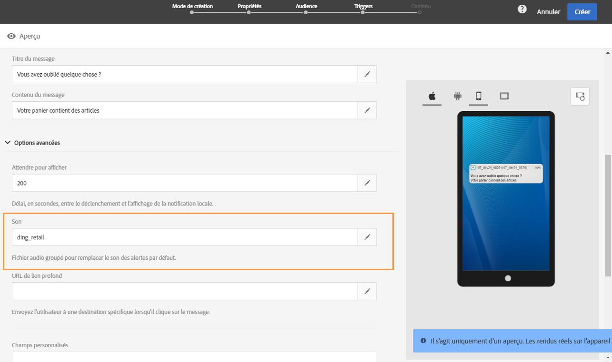

# Personnalisation d&#39;un message In-App{#customizing-an-in-app-message}

Pour parfaire votre message In-App, Adobe Campaign vous permet d’accéder à un ensemble d’options avancées lors de sa création.

L’éditeur de contenu In-App vous permet de choisir entre deux modes de message In-App :

* [Modèle de message](#customizing-with-a-message-template) : ce modèle permet de personnaliser entièrement votre message In-App avec des images ou des vidéos et des boutons d’action.
* [Message personnalisé](#customizing-with-a-custom-html-message) : ce modèle permet d’importer du code HTML personnalisé.

>[!NOTE]
>
> Le rendu des messages In-App est uniquement pris en charge pour l’API Android 19 et les versions ultérieures.

**Rubriques connexes :**

* [Envoi de votre message in-app](../../channels/using/preparing-and-sending-an-in-app-message.md#sending-your-in-app-message)
* [Reporting in-app](../../reporting/using/in-app-report.md)
* [Implémentation du tracking des notifications locales](../../administration/using/local-tracking.md)

## Personnalisation à l’aide d’un modèle de message {#customizing-with-a-message-template}

### Disposition {#layout}

La liste déroulante **[!UICONTROL Disposition]** propose quatre options différentes en fonction de vos besoins en matière de messages :

* **[!UICONTROL Pleine page]** : ce type de disposition couvre tout l’écran des appareils de votre audience.

   Elle prend en charge des composants multimédia (image, vidéo), texte et bouton.

* **[!UICONTROL Grand modal]** : cette disposition apparaît dans une grande fenêtre de style alerte. Votre application est toujours visible en arrière-plan.

   Elle prend en charge des composants multimédia (image, vidéo), texte et bouton.

* **[!UICONTROL Petit modal]** : cette disposition apparaît dans une petite fenêtre de style alerte. Votre application est toujours visible en arrière-plan.

   Elle prend en charge des composants multimédia (image, vidéo), texte et bouton.

* **[!UICONTROL Alerte]** : ce type de disposition apparaît comme message d’alerte du système d’exploitation natif.

   Il ne peut prendre en charge que les composants texte et bouton.

* **[!UICONTROL Notification locale]** : ce type de disposition apparaît en tant que message de bannière.

   Il prend uniquement en charge le son, le texte et la destination. Pour plus d’informations sur la notification locale, consultez [Personnaliser un type de message de notification locale](#customizing-a-local-notification-message-type).

Chaque type de disposition peut être prévisualisé sur différents appareils tels que téléphone, tablette, plateforme (Android ou iOS, par exemple) et orientation (paysage ou portrait) dans la fenêtre de droite de l’éditeur de contenu.

### Média       {#media}

La liste déroulante **[!UICONTROL Médias]** permet d’ajouter des médias à votre message In-App afin de créer une expérience utilisateur unique.

1. Sélectionnez le **[!UICONTROL Type de média]** : image ou vidéo.
1. Pour le type de média **[!UICONTROL Image]**, saisissez l’URL dans le champ **[!UICONTROL URL médias]** en respectant les formats pris en charge.

   En cas de besoin, vous pouvez également saisir le chemin d’accès à une **[!UICONTROL Image groupée]** pouvant être utilisée si l’appareil est déconnecté.

   

1. Pour le type de média **[!UICONTROL Vidéo]**, saisissez l’URL dans le champ **[!UICONTROL URL médias]**.

   Ensuite, saisissez le **[!UICONTROL Poster de vidéo]** à utiliser pendant le téléchargement de la vidéo sur les appareils de l’audience ou jusqu’à ce que les utilisateurs appuient sur le bouton de lecture.

   

### Texte {#text}

En cas de besoin, vous pouvez également ajouter un titre et un contenu à votre message in-app. Pour mieux personnaliser votre message in-app, vous pouvez ajouter différents champs de personnalisation, des blocs de contenu et du texte dynamique à votre contenu.

1. Dans la liste déroulante **[!UICONTROL Texte]**, ajoutez un titre dans le champ **[!UICONTROL Titre du message]**.

   

1. Ajoutez votre contenu dans le champ **[!UICONTROL Contenu du message]**.
1. Pour personnaliser davantage votre texte, cliquez sur l’icône  pour ajouter des champs de personnalisation.

   

1. Saisissez le contenu de votre message et ajoutez vos champs de personnalisation en cas de besoin.

   Pour plus d’informations sur les champs de personnalisation, consultez cette [section](../../designing/using/personalization.md#inserting-a-personalization-field).

   

1. Vérifiez le contenu de votre message dans la fenêtre de prévisualisation.

   

### Boutons       {#buttons}

Vous pouvez ajouter jusqu’à deux boutons à votre message In-App.

1. Dans la liste déroulante **[!UICONTROL Boutons]**, saisissez le texte du premier bouton dans la catégorie **[!UICONTROL Primaire]**.

   

1. Parmi les actions **[!UICONTROL Ignorer]** et **[!UICONTROL Rediriger]**, choisissez celle qui sera affectée au bouton principal.
1. Dans la catégorie **[!UICONTROL Secondaire]**, ajoutez un second bouton à votre message in-app en saisissant votre texte.
1. Sélectionnez l’action associée au second bouton.
1. Si vous choisissez l’action **[!UICONTROL Rediriger]**, saisissez l’URL web ou le lien profond dans le champ **[!UICONTROL URL destination]**.

   

1. Saisissez l’URL web ou le lien profond dans le champ **[!UICONTROL URL destination]**, si vous avez choisi l’action **[!UICONTROL Rediriger]**.
1. Vérifiez le contenu de votre message dans la fenêtre de prévisualisation ou en cliquant sur le bouton Aperçu.

   Consultez la page [Prévisualisation du message in-app](../../channels/using/preparing-and-sending-an-in-app-message.md#previewing-the-in-app-message).

   

### Paramètres       {#settings}

1. Dans la catégorie **[!UICONTROL Paramètres]**, sélectionnez votre couleur de fond entre une couleur claire et foncée.
1. À l’aide de l’option **[!UICONTROL Afficher le bouton Fermer]**, choisissez d’afficher ou non un bouton de fermeture afin que les utilisateurs puissent ignorer le message In-App.
1. À l’aide de l’option **[!UICONTROL Alignement des boutons]**, choisissez si l’alignement de votre bouton sera horizontal ou vertical.
1. Choisissez si votre message in-app peut être ignoré automatiquement après quelques secondes.

   

## Personnaliser un type de message de notification locale       {#customizing-a-local-notification-message-type}

Les notifications locales peuvent uniquement être déclenchées par une application à une heure spécifique et en fonction d’un événement. Elles alerteront les utilisateurs sur le fait que quelque chose se passe dans leur application, même sans accès à Internet.
Pour découvrir comment tracker les notifications locales, reportez-vous à cette [page](../../administration/using/local-tracking.md).

Pour personnaliser une notification locale :

1. Sur votre page **[!UICONTROL Contenu]**, sélectionnez **[!UICONTROL Notification locale]** dans la catégorie **[!UICONTROL Disposition]**.

   

1. Sous la catégorie **[!UICONTROL Texte]**, saisissez le **[!UICONTROL Titre du message]** et **[!UICONTROL Contenu du message]**.

   

1. Sous la catégorie **[!UICONTROL Option avancée]**, dans le champ **[!UICONTROL Attendre pour afficher]**, choisissez la durée (en secondes) pendant laquelle votre notification locale apparaîtra à l’écran une fois votre événement déclenché.
1. Dans le champ **[!UICONTROL Son]**, entrez le nom du fichier son, avec l’extension, que doit lancer l’appareil mobile à réception de la notification.

   Le fichier son est lu lors de la diffusion de la notification s&#39;il est défini dans le package de l&#39;application mobile. Sinon, le son par défaut de l’appareil est émis.

   

1. Spécifiez une destination vers laquelle rediriger vos utilisateurs lorsqu’ils interagissent avec votre notification locale dans le champ **[!UICONTROL URL de lien profond]**.
1. Pour transmettre des données personnalisées dans la payload sous la forme d’une paire de valeurs de clés, vous pouvez ajouter des champs personnalisés à votre notification locale. Dans la catégorie **[!UICONTROL Champs personnalisés]**, cliquez sur le bouton **[!UICONTROL Créer un élément]**.
1. Saisissez vos **[!UICONTROL Clés]**, puis les **[!UICONTROL Valeurs]** associées à chacune des clés.

   Notez que la finalité des champs personnalisés et leur gestion dépendent entièrement de l’application mobile.

1. Dans la catégorie **[!UICONTROL Options Apple]**, remplissez les champs **[!UICONTROL Catégorie]** afin d’ajouter un ID de catégorie pour les actions personnalisées si elles sont disponibles dans votre application mobile Apple.

## Personnalisation à l’aide d’un message HTML personnalisé {#customizing-with-a-custom-html-message}

>[!NOTE]
>
>Un message HTML personnalisé ne prend pas en charge la personnalisation du contenu.

Le mode **[!UICONTROL Message personnalisé]** permet d’importer directement l’un de vos messages HTML préconfigurés.

Pour cela, il vous suffit d’effectuer un glisser-déposer ou de sélectionner votre fichier depuis l’ordinateur.

Le fichier doit avoir une disposition spécifique que vous pouvez découvrir en cliquant sur l’option **Télécharger le fichier d’exemple**.

Vous pouvez également trouver une liste des exigences liées au code HTML personnalisé pour réussir l’import dans Adobe Campaign.

Une fois le code HTML importé, vous pouvez trouver un aperçu de votre fichier sur différents appareils dans la fenêtre de prévisualisation.
