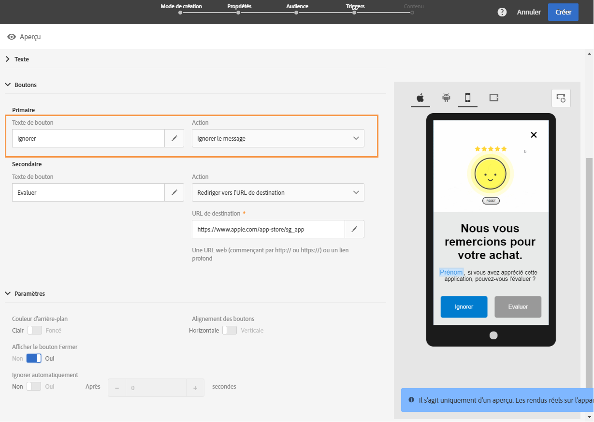
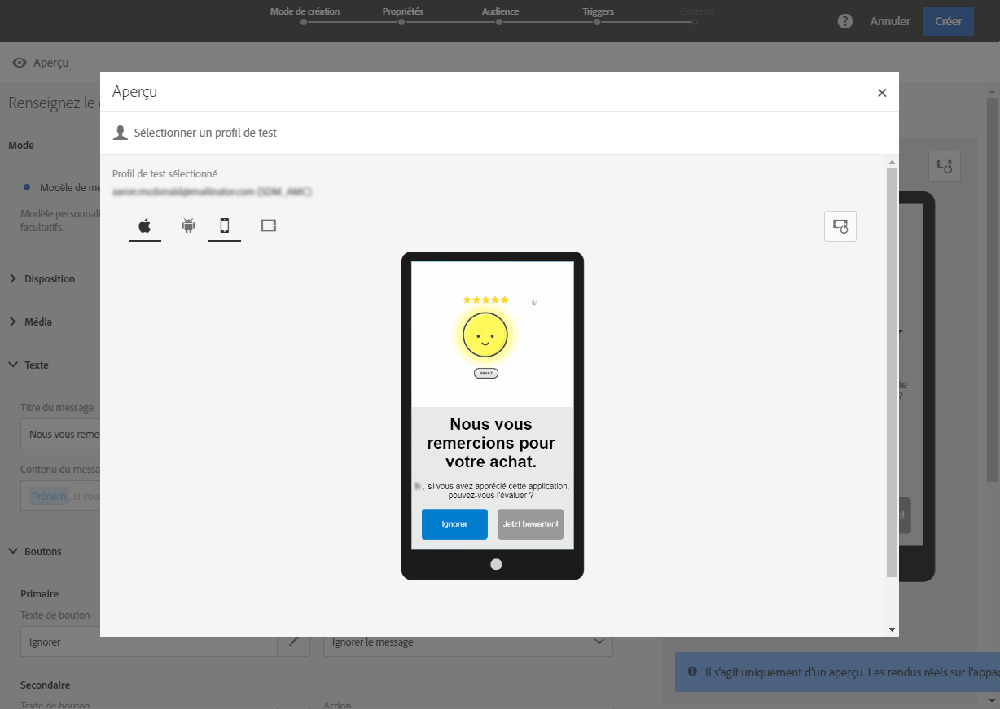

# Personnalisation d&#39;un message in-app{#customizing-an-in-app-message}

Pour parfaire votre message in-app, Adobe Campaign vous permet d&#39;accéder à un ensemble d&#39;options avancées lors de sa création.

L&#39;éditeur de contenu in-app vous permet de choisir entre deux modes de message in-app :

* [Modèle de message](#customizing-with-a-message-template) : ce modèle permet de personnaliser entièrement votre message in-app avec des images ou des vidéos et des boutons d&#39;action.
* [Message personnalisé](#customizing-with-a-custom-html-message) : ce modèle permet d&#39;importer du code HTML personnalisé.

>[!NOTE]
>
> Le rendu des messages in-app est uniquement pris en charge pour l’API Android 19 et les versions ultérieures.

**Rubriques connexes :**

* [Envoi de votre message in-app](../../channels/using/preparing-and-sending-an-in-app-message.md#sending-your-in-app-message)
* [Reporting in-app](../../reporting/using/in-app-report.md)
* [Implémentation du tracking des notifications locales](https://helpx.adobe.com/campaign/kb/local-notification-tracking.html)

## Personnalisation à l&#39;aide d&#39;un modèle de message {#customizing-with-a-message-template}

### Disposition {#layout}

The **[!UICONTROL Layout]** drop-down provides you with four different options to choose from depending on your messaging needs:

* **[!UICONTROL Full page]**: Ce type de mise en page couvre l’ensemble de l’écran de vos   de périphériques.

   Elle prend en charge des composants multimédia (image, vidéo), texte et bouton.

* **[!UICONTROL Large modal]**: Cette disposition s’affiche dans une grande fenêtre de style alerte, votre application reste visible en arrière-plan.

   Elle prend en charge des composants multimédia (image, vidéo), texte et bouton.

* **[!UICONTROL Small modal]**: Cette mise en page s’affiche sous forme d’une petite fenêtre de type d’alerte, votre application est toujours visible en arrière-plan.

   Elle prend en charge des composants multimédia (image, vidéo), texte et bouton.

* **[!UICONTROL Alert]**: Ce type de mise en page s’affiche sous forme de message d’alerte du système d’exploitation natif.

   Il ne peut prendre en charge que les composants texte et bouton.

* **[!UICONTROL Local notification]**: Ce type de mise en page s’affiche sous la forme d’un message de bannière.

   Il prend uniquement en charge le son, le texte et la destination. Pour plus d&#39;informations sur la notification locale, consultez [Personnaliser un type de message de notification locale](#customizing-a-local-notification-message-type).

Chaque type de disposition peut être prévisualisé sur différents appareils tels que téléphone, tablette, plate-forme (Android ou iOS, par exemple) et orientation (paysage ou portrait) dans la fenêtre de droite de l&#39;éditeur de contenu.

### Média  {#media}

The **[!UICONTROL Media]** drop-down allows you to add media to your In-App message to create a compelling experience for end user.

1. Sélectionnez votre **[!UICONTROL Media Type]** image et votre vidéo.
1. For the **[!UICONTROL Image]** media type, enter your URL in the **[!UICONTROL Media URL]** field based on the supported formats.

   If needed, you can also enter the path to a **[!UICONTROL Bundled image]** which can be used if the device is offline.

   

1. For the **[!UICONTROL Video]** media type, enter your URL in the **[!UICONTROL Media URL]** field.

   Then, enter your **[!UICONTROL Video poster]** to be used while the video is downloading on the audience devices or until users tap the play button.

   

### Texte {#text}

En cas de besoin, vous pouvez également ajouter un titre et un contenu à votre message in-app. Pour mieux personnaliser votre message in-app, vous pouvez ajouter différents champs de personnalisation, des blocs de contenu et du texte dynamique à votre contenu.

1. Dans la **[!UICONTROL Text]** liste déroulante, ajoutez un titre dans le **[!UICONTROL Message title]** champ.

   

1. Ajouter votre contenu dans le **[!UICONTROL Message content]** champ.
1. Pour personnaliser davantage votre texte, cliquez sur l&#39;icône  pour ajouter des champs de personnalisation.

   

1. Saisissez le contenu de votre message et ajoutez vos champs de personnalisation en cas de besoin.

   Pour plus d&#39;informations sur les champs de personnalisation, consultez cette [section](../../designing/using/personalization.md#inserting-a-personalization-field).

   

1. Vérifiez le contenu de votre message dans la fenêtre de prévisualisation.

   

### Boutons  {#buttons}

Vous pouvez ajouter jusqu&#39;à deux boutons à votre message In-App.

1. In the **[!UICONTROL Buttons]** drop-down, enter the text of your first button in the **[!UICONTROL Primary]** category.

   

1. Choose which of the two actions **[!UICONTROL Dismiss]** and **[!UICONTROL Redirect]** will be assigned to your primary button.
1. In the **[!UICONTROL Secondary]** category, add a second button to your In-App if needed by entering your text.
1. Sélectionnez l&#39;action associée au second bouton.
1. If you chose the **[!UICONTROL Redirect]** action, enter your web URL or deeplink in the **[!UICONTROL Destination URL]** field.

   

1. Enter your web URL or deeplink in the **[!UICONTROL Destination URL]** field, if you chose the **[!UICONTROL Redirect]** action,
1. Vérifiez le contenu de votre message dans la fenêtre de prévisualisation ou en cliquant sur le bouton Aperçu.

   Consultez la page [Prévisualisation du message in-app](#previewing-the-in-app-message).

   

### Paramètres  {#settings}

1. In the **[!UICONTROL Settings]** category, select your background color between light and dark.
1. Choose to display or not a close button with the **[!UICONTROL Show close button]** option to provide users a way to dismiss the In-App message.
1. Select if your button alignment will be horizontal or vertical with the **[!UICONTROL Button alignment]** option.
1. Choisissez si votre message in-app peut être ignoré automatiquement après quelques secondes.

   

## Personnaliser un type de message de notification locale  {#customizing-a-local-notification-message-type}

Les notifications locales peuvent uniquement être déclenchées par une application à une heure spécifique et en fonction d&#39;un événement. Elles alerteront les utilisateurs sur le fait que quelque chose se passe dans leur application, même sans accès à Internet.
Pour découvrir comment tracker les notifications locales, reportez-vous à cette [page](https://helpx.adobe.com/campaign/kb/local-notification-tracking.html).

Pour personnaliser une notification locale :

1. Dans votre **[!UICONTROL Content]** page, sélectionnez **[!UICONTROL Local notification]** dans le **[!UICONTROL Layout]** du.

   

1. Sous le **[!UICONTROL Text]** , tapez **[!UICONTROL Message title]** et **[!UICONTROL Message content]**.

   

1. Under the **[!UICONTROL Advanced option]** category, in the **[!UICONTROL Wait to display]** field, choose how long in seconds your local notification will be displayed on screen once your event is triggered.
1. In the **[!UICONTROL Sound]** field, enter the filename of the sound file, with the extension, to be played by the mobile device when the local notification is received.

   Le fichier son est lu lors de la diffusion de la notification s&#39;il est défini dans le package de l&#39;application mobile. Sinon, le son par défaut de l&#39;appareil est émis.

   

1. Specify a destination to redirect your users when they interact with your local notification in the **[!UICONTROL Deeplink URL]** field.
1. Pour transmettre des données personnalisées dans la payload sous la forme d&#39;une paire de valeurs de clés, vous pouvez ajouter des champs personnalisés à votre notification locale. In the **[!UICONTROL Custom fields]** category, click the **[!UICONTROL Create an element]** button.
1. Enter your **[!UICONTROL Keys]** then the **[!UICONTROL Values]** associated with each key.

   Notez que la finalité des champs personnalisés et leur gestion dépend entièrement de l&#39;application mobile.

1. In the **[!UICONTROL Apple options]** category, fill in the **[!UICONTROL Category]** fields to add a category ID for custom actions if available in your Apple mobile application.

## Personnalisation à l&#39;aide d&#39;un message HTML personnalisé {#customizing-with-a-custom-html-message}

>[!NOTE]
>
>Un message HTML personnalisé ne prend pas en charge la personnalisation du contenu.

The **[!UICONTROL Custom message]** mode allows you to directly import one of your pre-configured HTML message.

Pour cela, il vous suffit d&#39;effectuer un glisser-déposer ou de sélectionner votre fichier depuis l&#39;ordinateur.

Le fichier doit avoir une disposition spécifique que vous pouvez découvrir en cliquant sur l&#39;option **Télécharger le fichier d&#39;exemple**.

Vous pouvez également trouver une liste des exigences liées au code HTML personnalisé pour réussir l&#39;import dans Adobe Campaign.

Une fois le code HTML importé, vous pouvez trouver un aperçu de votre fichier sur différents appareils dans la fenêtre de prévisualisation.

## Prévisualisation du message in-app {#previewing-the-in-app-message}

Avant d&#39;envoyer votre message in-app, vous pouvez le tester avec vos profils de test pour vérifier ce que l&#39;audience cible verra lorsqu&#39;elle recevra la diffusion.

1. Cliquez sur le **[!UICONTROL Preview]** bouton.

   

1. Click the **[!UICONTROL Select a test profile]** button and select one of your test profiles to start previewing your delivery. Pour plus d&#39;informations sur les profils de test, consultez cette [section](../../audiences/using/managing-test-profiles.md).
1. Vérifiez votre message sur différents appareils tels que des appareils Android, des téléphones iPhone et même des tablettes. Vous pouvez également contrôler si les champs de personnalisation récupèrent les données adéquates.

   

1. Vous pouvez maintenant envoyer votre message et mesurer son impact à l&#39;aide des rapports de diffusion. Pour plus d&#39;informations sur le reporting, consultez [cette section](../../reporting/using/in-app-report.md).

