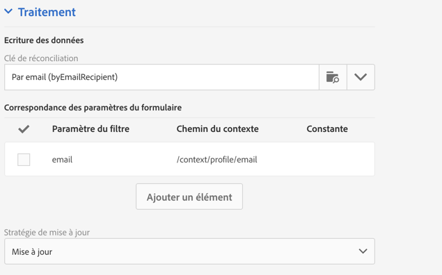

# Réconciliation et stockage des données{#data-storage-and-reconciliation}

Les paramètres de réconciliation permettent de définir le mode de gestion des données entrées dans la landing page lors de sa validation par un visiteur.

Pour cela :

1. Editez les propriétés de la landing page accessibles via l'icône  dans le tableau de bord de la landing page, puis affichez les paramètres **Traitement[!UICONTROL .]**

   

1. Select the **[!UICONTROL Reconciliation key]**: these database fields (for example: email, first name, last name) are used to determine whether the visitor has a profile that is already known in the Adobe Campaign database. Cela permet de mettre à jour ou de créer un profil, en fonction des paramètres de stratégie de mise à jour définis.
1. Define the **[!UICONTROL Form parameter mapping]**: this section allows you to map the landing page field parameters and those used in the reconciliation key.
1. Select the **[!UICONTROL Update strategy]**: if the reconciliation key recovers an existing database profile, you can choose for this profile to be updated with the data entered in the form or instead prevent this update.

