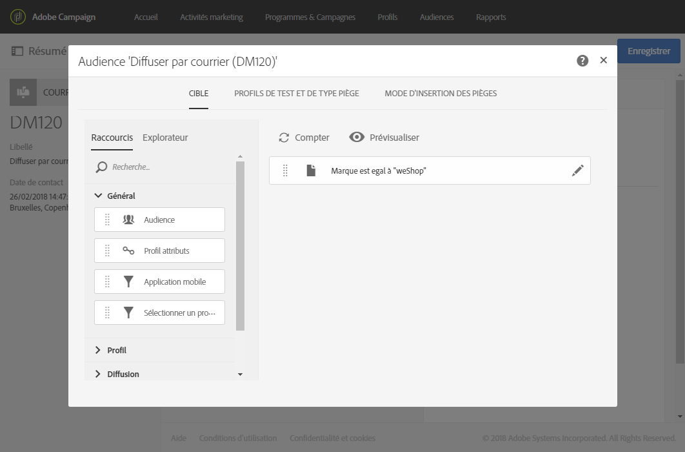

# Définir l'audience du courrier{#defining-the-direct-mail-audience}

Vous pouvez définir l'audience dans l'assistant de création ou en cliquant sur la section **Audience** du tableau de bord de la diffusion.

## Définir la cible principale {#defining-the-main-target}

Pour les courriers, les profils ciblés sont ceux qui seront inclus dans le fichier d'extraction qui sera envoyé à l'opérateur de services postaux.

Pour chaque profil ciblé, une nouvelle ligne est ajoutée dans le fichier d'extraction. La quantité d'informations de profil qui sera incluse pour chaque destinataire est définie dans l'écran [Définir l'extraction](../../channels/using/defining-the-direct-mail-content.md#defining-the-extraction).

>[!CAUTION]
>
>Vérifiez que les profils contiennent une adresse postale car cette information est indispensable pour le prestataire de services postaux. Assurez-vous également que la case **[!UICONTROL Adresse renseignée]est cochée dans les informations des profils.** Voir [Recommandations](../../channels/using/about-direct-mail.md#recommendations).

## Ajouter des profils de test et de type piège {#adding-test-and-trap-profiles}

Ajoutez des profils de test afin de tester votre fichier avec un petit nombre de profils. Vous pouvez ainsi créer un fichier d'exemple pour tester et valider la structure avant de préparer le fichier réel. Voir la section [Gérer les profils de test et envoyer un bon à tirer](../../sending/using/managing-test-profiles-and-sending-proofs.md).

L'utilisation de pièges est essentielle pour les diffusions courrier. Ils permettent, par exemple, de vérifier que votre opérateur de services postaux envoient bien la communication et qu'il ne partage pas votre liste de clients avec un autre opérateur.

Dans le cadre des diffusions courrier, les pièges sont ajoutés pendant l'extraction et mélangés dans le document de sortie. Par défaut, ils sont insérés dans l'ordre de tri du fichier de sortie, mais vous pouvez choisir de les insérer au début ou à la fin du fichier (onglet **[!UICONTROL Mode d'insertion des pièges]).**
