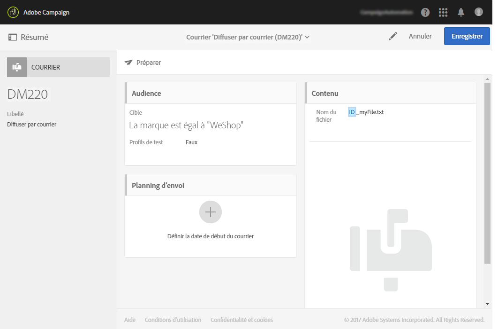
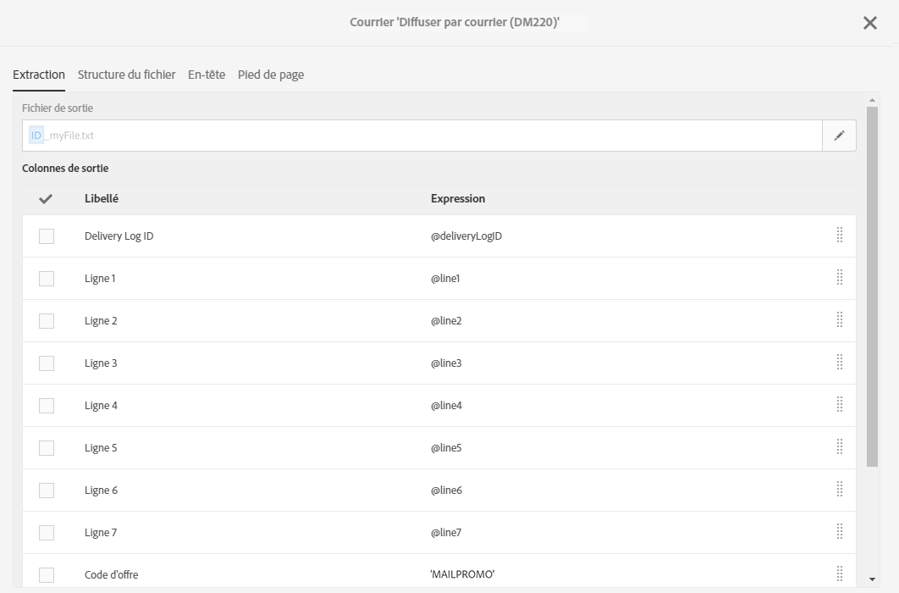
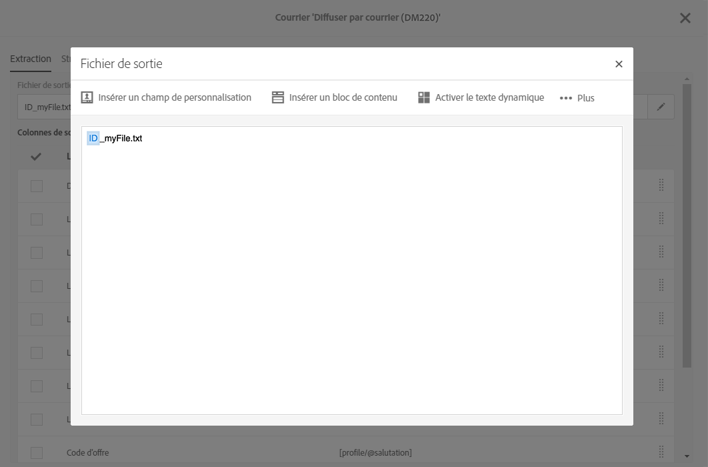
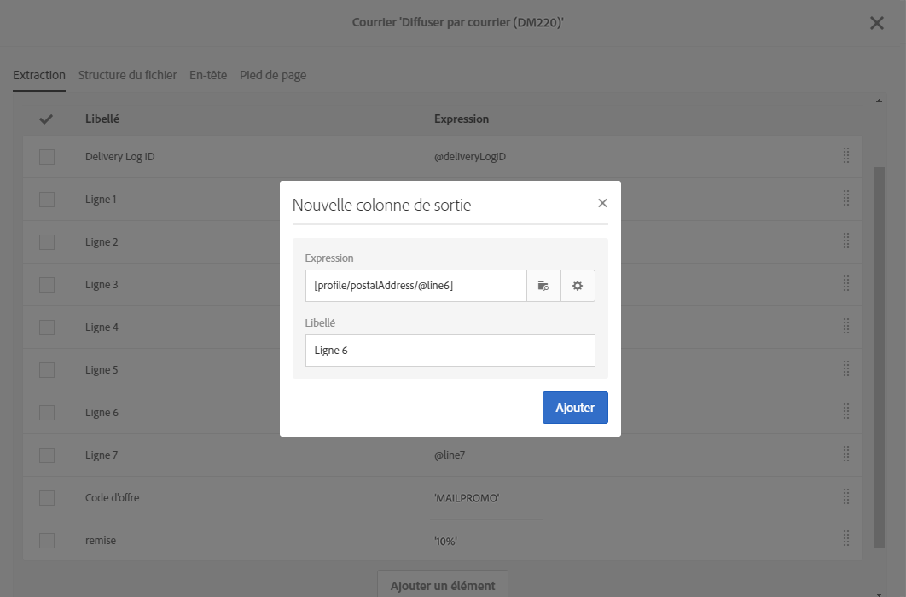
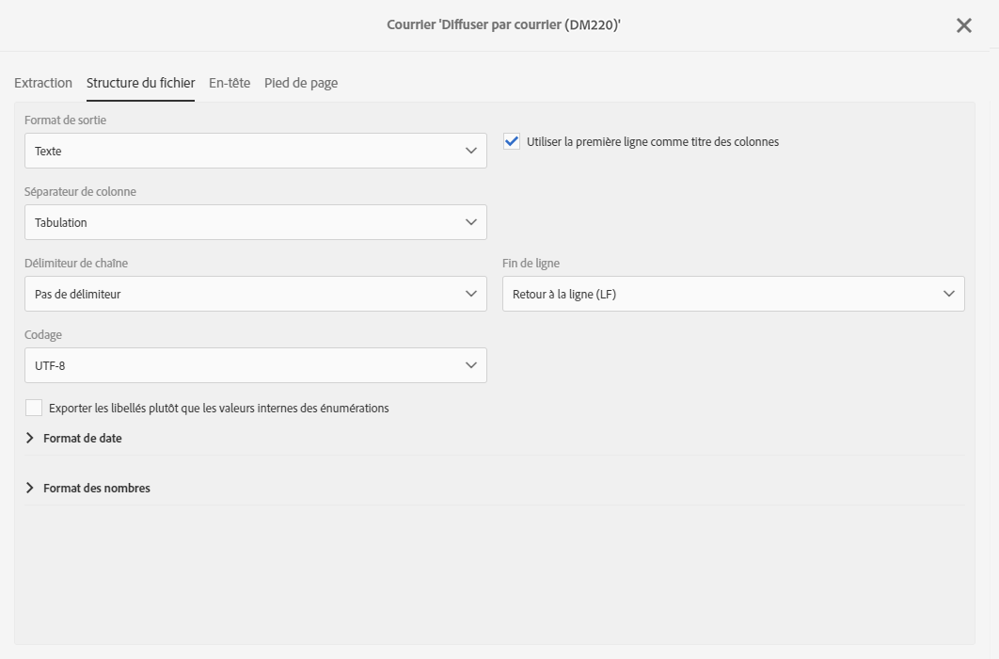
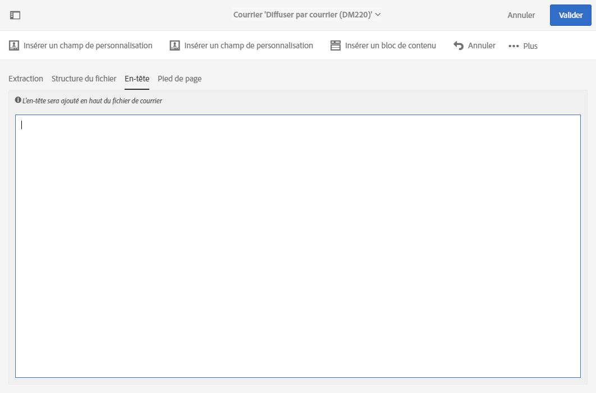
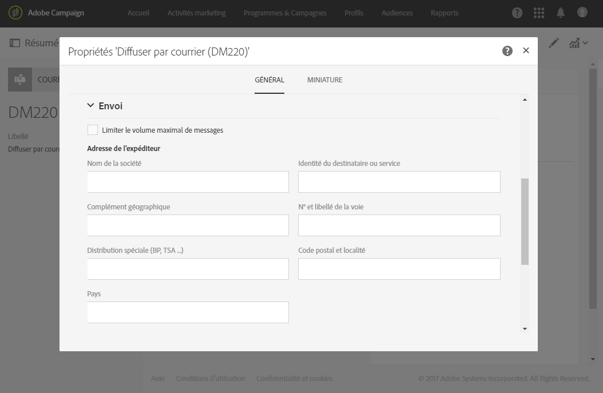

# Définir le contenu du courrier{#defining-the-direct-mail-content}

Vous pouvez définir le contenu dans le dernier écran de l'assistant de création ou en cliquant sur la section **Contenu** du tableau de bord de la diffusion.

L'écran de définition du **[!UICONTROL Contenu]est spécifique au canal courrier.** It is divided into four tabs: **[!UICONTROL Extraction]**, **[!UICONTROL File structure]**, **[!UICONTROL Header]** and **[!UICONTROL Footer]**.

## Définir l'extraction {#defining-the-extraction}

1. Définissez tout d'abord le nom du fichier d'extraction. Cliquez sur le bouton situé à droite du champ **[!UICONTROL Fichier de sortie]et saisissez le libellé souhaité.** Vous pouvez utiliser des champs de personnalisation, des blocs de contenu et du texte dynamique (voir [Définir le contenu](../../designing/using/example--email-personalization.md)). Vous pouvez, par exemple, renseigner le libellé avec l'identifiant de la diffusion ou la date d'extraction.

   

1. Click the **[!UICONTROL +]** or **[!UICONTROL Add an element]** button to add an output column. Les **[!UICONTROL Colonnes de sortie]permettent de définir les informations de profil (colonnes) à exporter dans le fichier de sortie.**

   >[!CAUTION]
   >
   >Vérifiez que les profils contiennent une adresse postale car cette information est indispensable pour le prestataire de services postaux. Assurez-vous également que la case **[!UICONTROL Adresse renseignée]est cochée dans les informations des profils.** Voir [Recommandations](../../channels/using/about-direct-mail.md#recommendations).

   

1. Créez autant de colonnes que nécessaire. Vous pouvez éditer les colonnes en cliquant sur leur expression et leur libellé.

>[!NOTE]
>
>Pour plus d'informations sur la définition des colonnes de sortie, reportez-vous à la section de l'activité de workflow [Extraction de fichier](../../automating/using/extract-file.md).

## Définir la structure de fichier {#defining-the-file-structure}

L'onglet **Structure de fichier** permet de paramétrer les formats de sortie, des dates et des nombres du fichier qui sera exporté.

>[!NOTE]
>
>Les options disponibles sont présentées dans les sections de l'activité de workflow [Extraction de fichier](../../automating/using/extract-file.md).

## Définir l'en-tête et le pied de page {#defining-the-header-and-footer}

Vous pouvez parfois avoir besoin d'ajouter des informations au début ou à la fin du fichier d'extraction. Pour cela, vous pouvez utiliser les onglets **[!UICONTROL En-tête]** et **[!UICONTROL Pied de page]de l'écran de configuration** Contenu **.**

Par exemple, vous souhaiterez peut-être inclure dans l'en-tête du fichier des informations sur l'expéditeur pour l'opérateur de services postaux. Il est possible de personnaliser le pied de page et l'en-tête avec des informations qui sont disponibles dans le cadre de la diffusion. Voir [Définir le contenu](../../designing/using/example--email-personalization.md).

L'adresse de l'expéditeur est définie dans la section **[!UICONTROL Envoi]des propriétés du courrier ou au niveau du modèle.**

