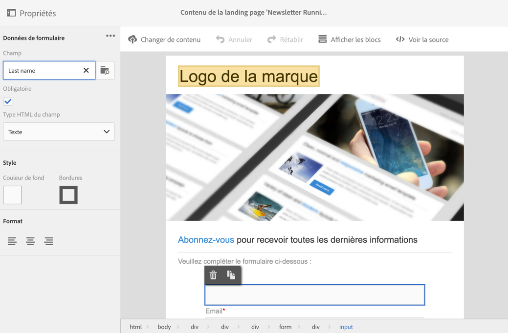
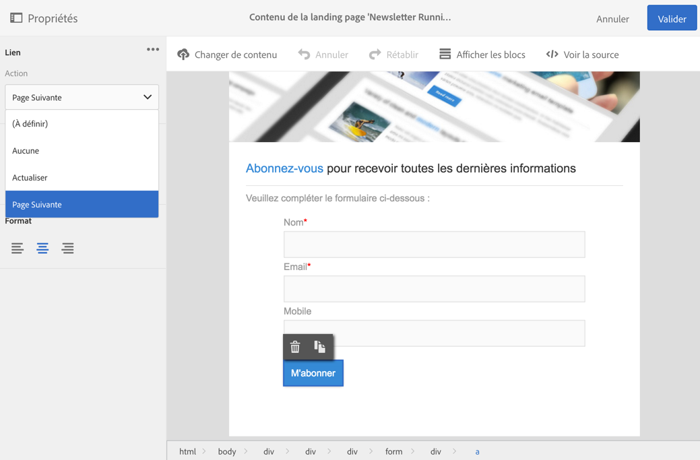
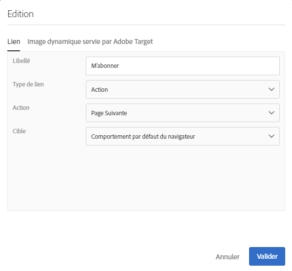
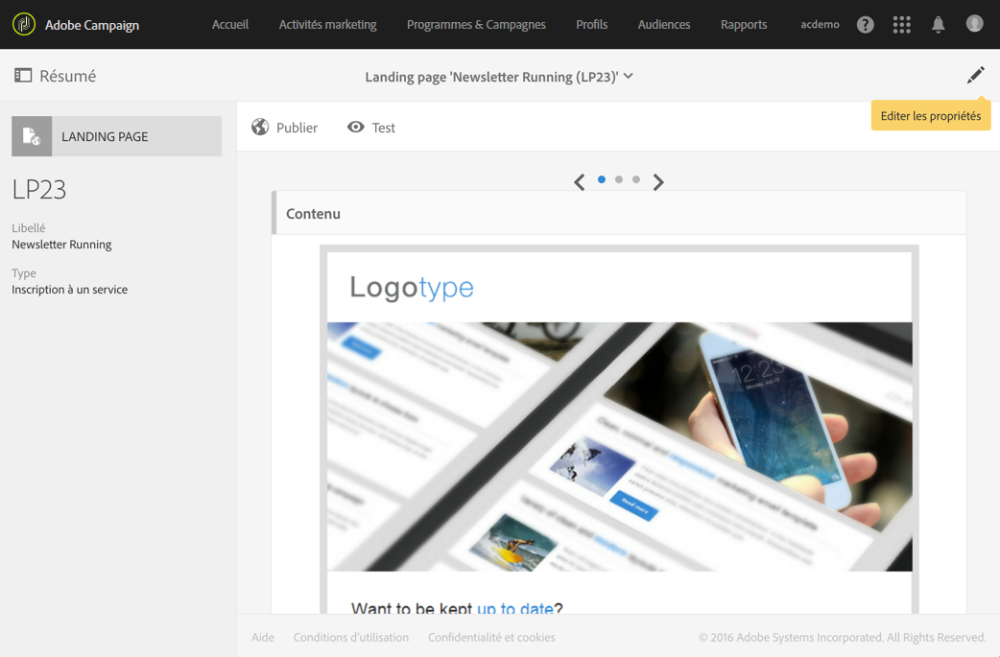
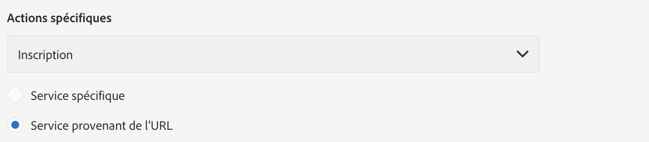
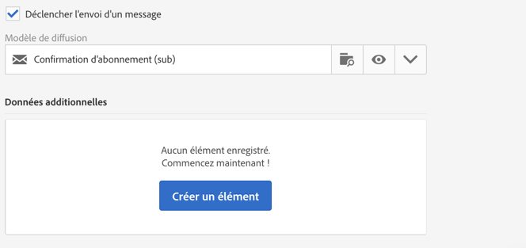
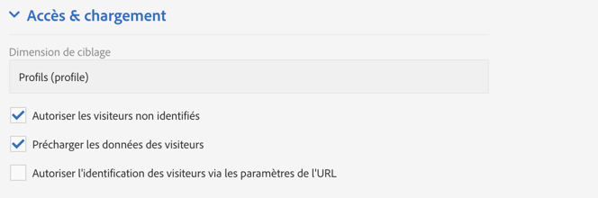
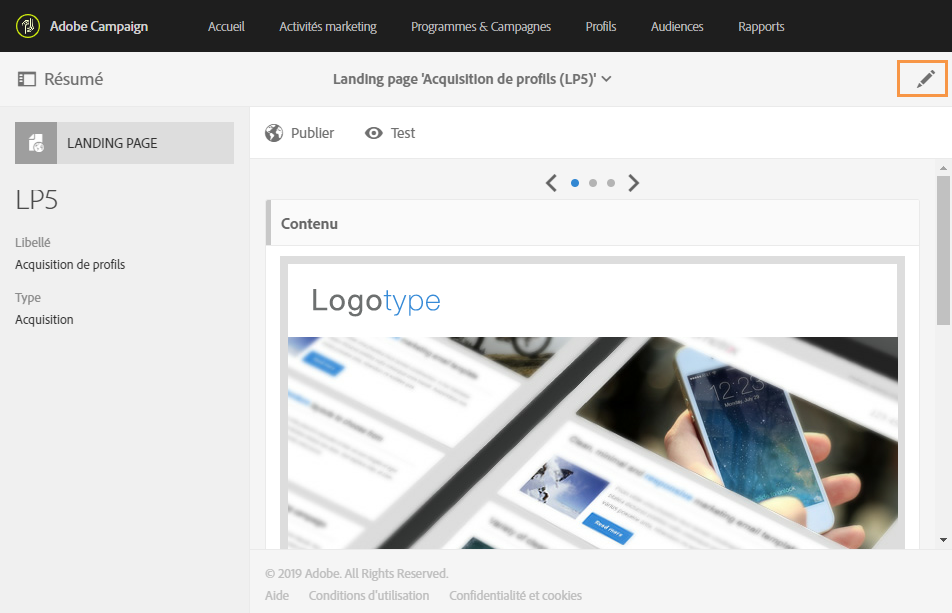
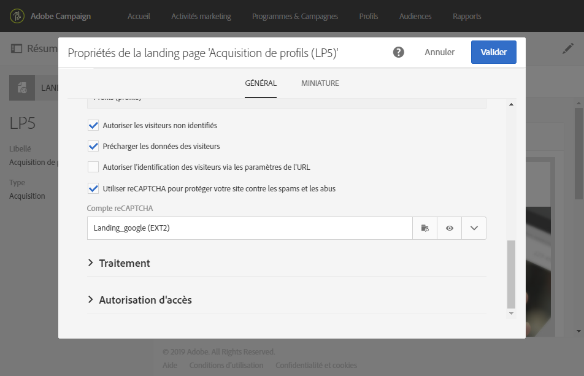
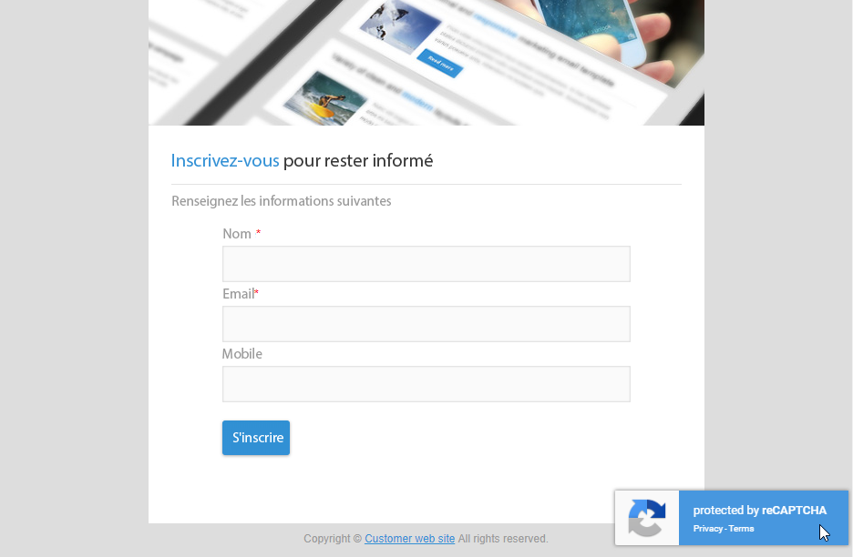

# Concevoir une landing page{#designing-a-landing-page}

## Conception du contenu {#about-content-design}

Les landing pages sont créées de la même façon que toute autre [activité marketing](../../start/using/marketing-activities.md#about-marketing-activities).

Lors de la conception d'une landing page, vous devez définir le contenu :

* de la page elle-même,
* de la page de confirmation,
* de la page d'erreur.

Utilisez le sélecteur situé sous la barre d'actions pour afficher et configurer chacune de ces pages.

Le contenu de ces pages est conçu dans l'éditeur de contenu de Campaign. Voir [Conception du contenu](../../designing/using/about-landing-page-content-design.md).

## Association des champs de formulaire {#mapping-form-fields}

Les champs de saisie sont utilisés pour stocker ou mettre à jour les données dans la base de données Campaign. Pour cela, vous devez associer des champs de la base de données à des blocs de type zone de saisie, bouton radio ou case à cocher. Pour cela :

1. Sélectionnez un bloc dans la landing page.
1. Renseignez la partie **[!UICONTROL Données de formulaire]de la palette.**

   

1. Sélectionnez un champ de base de données à associer au champ de formulaire dans la zone de sélection **[!UICONTROL Champ].**

   Quand l'option **[!UICONTROL Obligatoire]est cochée, la validation de la page est autorisée uniquement si l'utilisateur a renseigné le champ correspondant.** Si un champ obligatoire n'est pas renseigné, un message d'erreur s'affiche lorsque l'utilisateur valide la page.

   >[!NOTE]
   >
   >Les landing pages peuvent seulement être mappées avec des **profils**.

1. Define the field type by choosing, for example **[!UICONTROL Text]**, **[!UICONTROL Number]**,or **[!UICONTROL Date]** in the **[!UICONTROL HTML type of the field]** selection area.

>[!NOTE]
>
>Les champs par défaut des landing pages intégrées sont préconfigurés. Vous pouvez les modifier si nécessaire.

## Valider le formulaire {#submitting-the-form}

Vous pouvez sélectionner l'action à effectuer lorsque le visiteur clique sur le bouton de validation. Pour cela :

1. Sélectionnez le bouton de validation de la landing page.
1. Sélectionnez l'action dans la liste déroulante du panneau de gauche. Possible actions are: **[!UICONTROL Refresh]** (to refresh the page) and **[!UICONTROL Next page]** (to display the confirmation page).

   

De plus, vous pouvez modifier le libellé du bouton ou configurer un lien spécifique. Pour cela :

1. Sélectionnez le bouton de validation.
1. Cliquez sur le bouton 
1. Saisissez le libellé du bouton, puis sélectionnez le type de lien, ses propriétés et la cible.

   

## Associer un formulaire à un service {#linking-a-form-to-a-service}

Vous pouvez associer un formulaire à un service afin que les profils puissent s'inscrire à un service spécifique lors de la validation des landing pages.

Les paramètres d'association permettent de définir le type de l'action réalisée et si la landing page est liée spécifiquement à un seul service ou si elle est générique.

Pour sélectionner le service à associer, procédez comme suit :

1. Editez les propriétés de la landing page accessibles via l'icône  dans le tableau de bord de la landing page, puis affichez les paramètres **Traitement[!UICONTROL .]**

   

1. Sélectionnez **[!UICONTROL Inscription]** dans la liste déroulante **Actions spécifiques[!UICONTROL .]**

   

1. Sélectionnez **[!UICONTROL Service spécifique]pour associer la landing page à un seul service.** Ne sélectionnez pas cette option si vous souhaitez utiliser plusieurs services avec la landing page.

   Utilisez l'option **[!UICONTROL Service provenant de l'URL]pour que la landing page puisse être utilisée pour plusieurs services.** Vous devez alors référencer la landing page lors du paramétrage du service.

### Confirmer la validation d'une landing page {#confirm-a-landing-page-submission}

Lorsqu'une landing page est validée par un visiteur, vous pouvez configurer les actions déclenchées. Pour cela :

1. Editez les propriétés de la landing page accessibles via l'icône  dans le tableau de bord de la landing page, puis affichez les paramètres **Traitement[!UICONTROL .]**

   

1. Dans la section **[!UICONTROL Actions spécifiques]**, sélectionnez **Déclencher l'envoi d'un message]pour définir l'envoi d'un message automatique, par exemple pour confirmer l'inscription à un service.[!UICONTROL ** Vous devez ensuite sélectionner un modèle de diffusion email.

   Si un message de confirmation est déjà configuré au niveau du service, vous ne devez pas en sélectionner un dans cet écran afin d'éviter l'envoi de plusieurs messages de confirmation. Reportez-vous à la section [Configurer un service](../../audiences/using/creating-a-service.md).

1. Créez des **[!UICONTROL Données additionnelles]pour permettre le stockage des données additionnelles lors de la validation de la landing page.** Ces données ne sont pas visibles par le visiteur de la page. Seules les valeurs constantes sont prises en charge.

   

## Définir les permissions et pré-charger les données {#setting-permissions-and-pre-loading-data}

L'accès à une landing page peut être limité à des visiteurs identifiés qui proviennent d'un lien figurant dans un message envoyé par Campaign, par exemple. Dans ce cas, vous pouvez précharger leurs données dans la landing page. Pour cela :

1. Editez les propriétés de la landing page accessibles via l'icône  dans le tableau de bord de la landing page, puis affichez les paramètres **Accès &amp; chargement[!UICONTROL .]**

   

1. Sélectionnez **[!UICONTROL Précharger les données des visiteurs]**.

   Si un profil de la base de données correspond au visiteur de la page, ses données sont affichées dans les champs du formulaire mappés avec la base de données et les éléments de personnalisation de la landing page sont pris en compte.

   

Vous pouvez également :

* Utiliser les paramètres d'URL pour identifier les visiteurs, à l'aide de l'option **[!UICONTROL Autoriser l'identification des visiteurs via les paramètres de l'URL] : vous devez ensuite choisir la clé de chargement et mapper les paramètres de filtre avec les paramètres de l'URL correspondante.**
* Autoriser n'importe quel visiteur à accéder à la landing page, à l'aide de l'option **[!UICONTROL Autoriser les visiteurs non identifiés].**

## Définir Google reCAPTCHA {#setting-google-recaptcha}

Vous pouvez configurer Google reCAPTCHA version 3 avec votre landing page afin de la protéger contre le spam et les abus causés par les bots. Pour l'utiliser avec votre landing page, vous devez tout d'abord créer un compte externe. Pour plus d'informations sur la façon de le configurer, consultez cette [section](../../administration/using/external-accounts.md#google-recaptcha-external-account).

Une fois votre compte externe Google reCAPTCHA version 3 configuré, vous pouvez l'ajouter à votre landing page :

1. Avant de publier votre landing page, accédez aux propriétés de la page à l'aide de l'icône 

   

1. Développez le menu **[!UICONTROL Accès &amp; chargement].**
1. Cochez l'option **[!UICONTROL Utiliser reCAPTCHA pour protéger votre site contre les spams et les abus].**
1. Sélectionnez le compte externe Google reCAPTCHA que vous venez de créer.

   

1. Cliquez sur **[!UICONTROL Confirmer]**.

Votre landing page est maintenant configurée avec Google reCAPTCHA, visible en bas de votre page.

Google reCAPTCHA renvoie ensuite un score en fonction des interactions des utilisateurs avec votre page. Pour vérifier votre score, connectez-vous à votre [console d'administration Google](https://g.co/recaptcha/admin).
