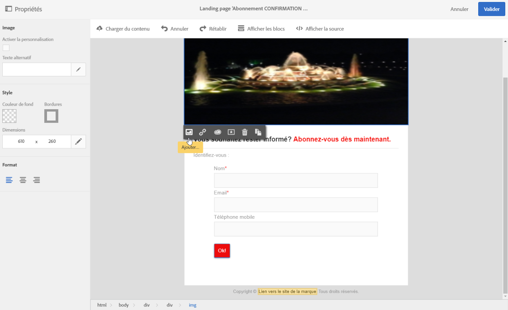
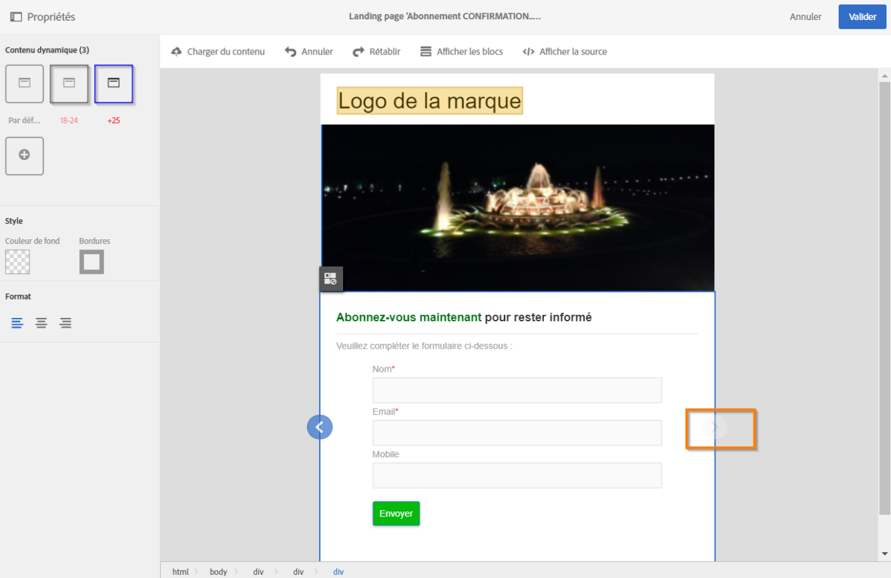

# Concevoir une landing page{#designing-a-landing-page}

## A propos de la conception du contenu d&#39;une landing page {#about-content-design}

Les landing pages sont créées de la même façon que toute autre [activité marketing](../../start/using/marketing-activities.md#about-marketing-activities).

Lors de la conception d&#39;une landing page, vous devez définir le contenu de la page, de la page de confirmation et de la page d&#39;erreur. Utilisez le sélecteur situé sous la barre d&#39;actions pour afficher et configurer chacune de ces pages.

Le contenu des landing pages est conçu dans l&#39;éditeur de contenu de Campaign.

>[!NOTE]
>
>Si votre instance a été installée avant la version 19.0 d&#39;Adobe Campaign Standard, vous avez toujours accès à l&#39;ancien éditeur de contenu d&#39;email. L&#39;interface, les principes d&#39;utilisation et la configuration sont pratiquement les mêmes que ceux décrits ci-dessous pour les landing pages. Cependant, toutes les fonctionnalités peuvent ne pas être disponibles ou gérées dans l&#39;ancien éditeur de contenu d&#39;email qui est obsolète à compter de la version 19.0. Pour éditer rapidement le contenu de votre email par le biais de l&#39;interface de type glisser-déposer avec des fonctionnalités étendues, utilisez le [Concepteur d&#39;email](../../designing/using/designing-content-in-adobe-campaign.md).

Cette page décrit les spécificités de l&#39;éditeur de contenu de landing page. Pour plus d&#39;informations sur les actions communes à une ou plusieurs activités marketing, reportez-vous aux sections suivantes du guide **Concevoir un contenu d&#39;email** :

* [Insertion d&#39;un champ de personnalisation](../../designing/using/personalization.md#inserting-a-personalization-field)
* [Ajout d&#39;un bloc de contenu](../../designing/using/personalization.md#adding-a-content-block)
* [Insertion d&#39;un lien](../../designing/using/links.md#inserting-a-link)
* [Insertion d&#39;images](../../designing/using/images.md)
* [Bonnes pratiques générales pour la conception de contenu](../../designing/using/designing-content-in-adobe-campaign.md#content-design-best-practices)

>[!NOTE]
>Si vous disposez d&#39;une landing page déjà prédéfinie au format HTML, vous pouvez l&#39;importer directement via le bouton **[!UICONTROL Changer de contenu]**.
>
>Avant d&#39;importer une page HTML dans Adobe Campaign, assurez-vous qu&#39;elle s&#39;ouvre et s&#39;affiche correctement dans les différents navigateurs. Si la page HTML contient des scripts en langage JavaScript, ils doivent s&#39;exécuter sans erreur hors de l&#39;éditeur. Evitez en général d&#39;utiliser des scripts dans le contenu des messages pour qu&#39;il soit correctement traité par les clients de messagerie.

## Interface de l&#39;éditeur de contenu de landing page{#landing-page-content-editor-interface}

L&#39;éditeur de contenu de landing page permet de définir, modifier et personnaliser facilement du contenu dans Adobe Campaign. Pour y accéder, cliquez sur le bloc **[!UICONTROL Contenu]** dans le tableau de bord des landing pages.

L&#39;éditeur de contenu est organisé en trois sections distinctes. Elles permettent de visualiser le contenu et de le modifier.

1. La **palette** située à gauche de l&#39;écran permet de modifier les paramètres du bloc sélectionné. Les options pouvant être modifiées sont les suivantes : couleur de fond, bordure, alignement du texte, condition de visibilité, etc. Voir [Insertion d&#39;un champ de personnalisation](../../designing/using/personalization.md#inserting-a-personalization-field).
1. La **barre d&#39;actions** regroupe les options générales de la page. Vous pouvez sélectionner un modèle et changer le mode d&#39;affichage.
1. La **zone d&#39;édition** principale permet d&#39;interagir directement avec le contenu, grâce à la barre d&#39;outils contextuelle : insérer un lien sur une image, modifier la police de caractères, supprimer un champ, etc.

La **barre d&#39;actions** contient différents boutons permettant d&#39;agir sur le contenu en cours de création.

<table> 
 <thead> 
  <tr> 
   <th> Icône  </th> 
   <th> Nom du bouton  </th> 
   <th> Channel  </th> 
   <th> Description  </th> 
  </tr> 
 </thead> 
 <tbody> 
  <tr> 
   <td>    </td> 
   <td> Charger du contenu   </td> 
   <td> Landing page et email  </td> 
   <td> Permet de sélectionner un contenu d'usine ou d'importer votre propre contenu HTML. Reportez-vous à <a href="../../designing/using/using-existing-content.md">Charger un contenu existant</a>.  </td> 
  </tr> 
  <tr> 
   <td>    </td> 
   <td> Annuler   </td> 
   <td> Tous  </td> 
   <td> Annule la dernière action effectuée.  </td> 
  </tr> 
  <tr> 
   <td>    </td> 
   <td> Rétablir   </td> 
   <td> Tous  </td> 
   <td> Rétablit la dernière action que vous avez annulée.  </td> 
  </tr> 
  <tr> 
   <td>    </td> 
   <td> Afficher les blocs   </td> 
   <td> Landing page et email  </td> 
   <td> Permet d'afficher des cadres autour des blocs de contenu (correspond à la balise HTML <strong>&lt;div&gt;</strong>).  </td> 
  </tr> 
  <tr> 
   <td>    </td> 
   <td> Voir la source   </td> 
   <td> Landing page et email  </td> 
   <td> Permet d'afficher le code source HTML de la page.  </td> 
  </tr> 
 </tbody> 
</table>

La **barre d&#39;outils** est un élément contextuel de l&#39;interface de l&#39;éditeur qui présente des fonctionnalités différentes selon la zone sélectionnée. Elle regroupe des boutons d&#39;action et des boutons permettant de modifier le style du texte. Les modifications effectuées s&#39;appliquent toujours sur la zone sélectionnée. Lorsque vous sélectionnez un bloc, vous pouvez par exemple le supprimer ou le dupliquer. Lorsque vous sélectionnez du texte à l&#39;intérieur d&#39;un bloc, vous pouvez le transformer en lien ou le mettre en gras.

>[!CAUTION]
>
>Certaines fonctionnalités de la barre d&#39;outils permettent de mettre en forme le contenu HTML. Cependant, si la page contient une feuille de style CSS, les **instructions** provenant de la feuille de style peuvent s&#39;avérer **prioritaires** par rapport aux instructions spécifiées avec la barre d&#39;outils.

<table> 
 <thead> 
  <tr> 
   <th> Icône  </th> 
   <th> Nom du bouton  </th> 
   <th> Contexte  </th> 
   <th> Description  </th> 
  </tr> 
 </thead> 
 <tbody> 
  <tr> 
   <td>    </td> 
   <td> Lien vers une URL externe   </td> 
   <td> Tout élément  </td> 
   <td> Permet d'ajouter un lien vers une URL. Le paramétrage d'un lien est présenté dans la section <a href="../../designing/using/links.md#inserting-a-link">Insérer un lien</a>.  </td> 
  </tr> 
  <tr> 
   <td>    </td> 
   <td> Lien vers une landing page   </td> 
   <td> Tout élément  </td> 
   <td> Permet d'accéder à une landing page Adobe Campaign. Le paramétrage d'un lien est présenté dans la section <a href="../../designing/using/links.md#inserting-a-link">Insérer un lien</a>.  </td> 
  </tr> 
  <tr> 
   <td>    </td> 
   <td> Lien d'abonnement   </td> 
   <td> Tout élément  </td> 
   <td> Permet d'insérer un lien d'abonnement à un service. Le paramétrage d'un lien est présenté dans la section <a href="../../designing/using/links.md#inserting-a-link">Insérer un lien</a>.  </td> 
  </tr> 
  <tr> 
   <td>    </td> 
   <td> Lien de désabonnement   </td> 
   <td> Tout élément  </td> 
   <td> Permet d'insérer un lien de désabonnement à un service. Le paramétrage d'un lien est présenté dans la section <a href="../../designing/using/links.md#inserting-a-link">Insérer un lien</a>.  </td> 
  </tr> 
  <tr> 
   <td>    </td> 
   <td> Supprimer le lien   </td> 
   <td> Lien (link)  </td> 
   <td> Permet de supprimer, après confirmation, le lien ainsi que tous les paramétrages liés.  </td> 
  </tr> 
  <tr> 
   <td>    </td> 
   <td> Insérer un champ de personnalisation   </td> 
   <td> Elément de texte  </td> 
   <td> Permet d'ajouter un champ de la base de données dans le contenu. Voir <a href="../../designing/using/personalization.md#inserting-a-personalization-field">Insertion d'un champ de personnalisation</a>.  </td> 
  </tr> 
  <tr> 
   <td>    </td> 
   <td> Insérer un bloc de contenu   </td> 
   <td> Elément de texte  </td> 
   <td> Permet d'insérer un bloc de personnalisation dans le contenu. Voir <a href="../../designing/using/personalization.md#adding-a-content-block">Ajouter un bloc de contenu</a>.  </td> 
  </tr> 
  <tr> 
   <td>    </td> 
   <td> Activer le contenu dynamique   </td> 
   <td> Elément de texte  </td> 
   <td> Permet d'insérer un contenu dynamique dans le contenu. Voir <a href="../../channels/using/designing-a-landing-page.md#defining-dynamic-content-in-a-landing-page">Définir le contenu dynamique</a>.  </td> 
  </tr> 
  <tr> 
   <td>    </td> 
   <td> Désactiver le contenu dynamique   </td> 
   <td> Elément de texte  </td> 
   <td> Permet de supprimer un contenu dynamique.  </td> 
  </tr> 
  <tr> 
   <td>    </td> 
   <td> Agrandir la police   </td> 
   <td> Elément de texte  </td> 
   <td> Augmente la taille du texte sélectionné (ajoute <strong>&lt;span style="font-size:"&gt;</strong>).  </td> 
  </tr> 
  <tr> 
   <td>    </td> 
   <td> Diminuer la police   </td> 
   <td> Elément de texte  </td> 
   <td> Réduit la taille du texte sélectionné (ajoute <strong>&lt;span style="font-size:"&gt;</strong>).  </td> 
  </tr> 
  <tr> 
   <td>    </td> 
   <td> Gras   </td> 
   <td> Elément de texte  </td> 
   <td> Ajoute le style gras au texte sélectionné (entoure le texte de la balise <strong>&lt;strong&gt;</strong><strong>&lt;/strong&gt;</strong>).  </td> 
  </tr> 
  <tr> 
   <td>    </td> 
   <td> Italique   </td> 
   <td> Elément de texte  </td> 
   <td> Ajoute le style italique au texte sélectionné (entoure le texte de la balise <strong>&lt;em&gt;</strong><strong>&lt;/em&gt;</strong>).  </td> 
  </tr> 
  <tr> 
   <td>    </td> 
   <td> Souligner   </td> 
   <td> Elément de texte  </td> 
   <td> Ajoute le style souligné au texte sélectionné (entoure le texte de la balise <strong>&lt;span style="text-decoration: underline;"&gt;</strong>).  </td> 
  </tr> 
  <tr> 
   <td>    </td> 
   <td> Changer la couleur de fond   </td> 
   <td> Elément de texte  </td> 
   <td> Permet de changer la couleur de fond du bloc sélectionné (ajoute style="background-color: rgba(170, 86, 255, 0.87)).  </td> 
  </tr> 
  <tr> 
   <td>    </td> 
   <td> Changer la couleur du texte   </td> 
   <td> Elément de texte  </td> 
   <td> Permet de changer la couleur de tout le texte dans le bloc ou seulement celle du texte sélectionné (<strong>&lt;span style="color: #56ff56;"&gt;</strong>).  </td> 
  </tr> 
  <tr> 
   <td>    </td> 
   <td> Image   </td> 
   <td> Bloc contenant une image  </td> 
   <td> Permet d'insérer une image à partir d'un fichier enregistré en local.  </td> 
  </tr> 
  <tr> 
   <td>    </td> 
   <td> Effacer   </td> 
   <td> Tout bloc  </td> 
   <td> Supprime le bloc et tout son contenu.  </td> 
  </tr> 
  <tr> 
   <td>    </td> 
   <td> Doublon   </td> 
   <td> Tout bloc  </td> 
   <td> Duplique le bloc et également tous les styles associés au bloc.  </td> 
  </tr> 
 </tbody> 
</table>

## Gérer la structure et le style d&#39;une landing page{#managing-landing-page-structure-and-style}

### Gérer les blocs dans l&#39;éditeur de contenu {#managing-blocks-in-the-content-editor}

Les différents éléments du contenu HTML sont affichés dans la landing page sous forme de blocs, correspondant à la balise **&lt;div>** **&lt;/div>**. Pour agir sur un bloc, sélectionnez-le. Celui-ci est alors entouré d&#39;un cadre de couleur bleue.

Quand un bloc est sélectionné, les objets parents de l&#39;élément HTML correspondant s&#39;affichent dans un fil d&#39;Ariane situé au bas de la zone d&#39;édition.

Au survol de la souris sur un élément de ce fil d&#39;Ariane, l&#39;élément est mis en surbrillance. Vous pouvez ainsi facilement naviguer entre les divers blocs et sélectionner précisément l&#39;élément HTML que vous souhaitez modifier.

Utilisez les options disponibles dans la palette et la barre d&#39;outils contextuelle pour modifier le bloc, le supprimer ou le dupliquer.

Pour les blocs contenant du texte, cliquez une seconde fois dans le bloc pour activer le mode d&#39;édition du texte. Le contour du bloc devient vert. Vous pouvez alors sélectionner ou saisir du texte. Utilisez les options disponibles dans la palette et la barre d&#39;outils contextuelle pour ajouter un lien ou modifier le formatage du texte.

Les paramètres définis pour un élément d&#39;un bloc (liens, champs de personnalisation, blocs de contenu, etc.) peuvent être modifiés à tout moment à partir de la palette.

### Ajouter une bordure et un arrière-plan dans l&#39;éditeur de contenu     {#adding-a-border-and-a-background-in-the-content-editor}

Vous pouvez définir une **couleur de fond** en sélectionnant une couleur dans le nuancier. Cette couleur sera appliquée au bloc sélectionné.

Vous pouvez ajouter une **bordure** au bloc sélectionné.

### Changer le style du texte dans l&#39;éditeur de contenu     {#changing-the-text-style-in-the-content-editor}

Pour modifier le style du texte, vous devez vous placer à l&#39;intérieur d&#39;un bloc de texte.

Pour modifier l&#39;alignement du texte, sélectionnez l&#39;une des trois icônes suivantes dans la palette de gauche :

* **Aligner à gauche** : aligne le texte à gauche du bloc sélectionné (ajoute style=&quot;text-align: left;&quot;).
* **Centrer** : centre le texte du bloc sélectionné (ajoute style=&quot;text-align: center;&quot;).
* **Aligner à droite** : aligne le texte à droite du bloc sélectionné (ajoute style=&quot;text-align: right;&quot;).

Vous pouvez également utiliser la barre d&#39;outils pour modifier les attributs de la police : changer la taille de la police, mettre le texte en gras ou en italique, le souligner ou changer la couleur du texte. Consultez [cette section](../../channels/using/designing-a-landing-page.md#landing-page-content-editor-interface).

### Insérer des images dans une landing page     {#inserting-images-in-a-landing-page}

1. Dans le contenu d&#39;une landing page, sélectionnez un bloc contenant une image.
1. Sélectionnez le bouton **[!UICONTROL Insérer]**.

   

1. Sélectionnez **[!UICONTROL Image locale]** dans la barre d&#39;outils contextuelle.

   

1. Sélectionnez un fichier.

   

1. Ajustez les propriétés de l&#39;image selon les besoins.

   

## Définir le contenu dynamique dans une landing page{#defining-dynamic-content-in-a-landing-page}

Pour définir du contenu dynamique dans une landing page, sélectionnez un bloc à l&#39;aide du fil d&#39;Ariane ou en cliquant directement sur un élément.

Certains blocs, comme les images, ne peuvent pas être sélectionnés directement. Dans ce cas, sélectionnez le bloc parent à l&#39;aide du fil d&#39;Ariane. Vous pourrez alors modifier tous les éléments compris dans cet élément parent, y compris les images. La condition s&#39;appliquera à tous les éléments enfants du bloc parent.

Le fil d&#39;Ariane est présenté dans la section [Gestion des blocs](../../channels/using/designing-a-landing-page.md#managing-landing-page-structure-and-style).

Les étapes suivantes pour définir le contenu dynamique dans une landing page sont similaires à celles que vous devez suivre pour un email. Reportez-vous à [cette section](../../designing/using/personalization.md#defining-dynamic-content-in-an-email).

>[!NOTE]
>
>Les éléments de variante encadrés en rouge sont ceux pour lesquels une expression n&#39;a pas encore été définie.

Vous pouvez naviguer parmi les différents contenus dynamiques d&#39;un bloc. Pour cela :

1. Sélectionnez le bloc.

   Des flèches apparaissent sur les bords gauche et droit de l&#39;image.

1. Cliquez sur la flèche de droite pour naviguer.

   

   Le rendu des flèches est estompé lorsque vous avez navigué jusqu&#39;au dernier contenu dynamique (ou jusqu&#39;au premier pour la flèche de gauche).

   

1. Pour supprimer toutes les conditions appliquées à un bloc, sélectionnez celui-ci et cliquez de nouveau sur l&#39;icône **[!UICONTROL Désactiver le contenu dynamique]**.
1. Sélectionnez le contenu dynamique que vous souhaitez conserver.

   

Dans la palette :

* Les contenus pour lesquels une expression a été renseignée ne sont plus encadrés en rouge ; ils s&#39;affichent en gris.
* Le contenu actuellement sélectionné s&#39;affiche en bleu.

