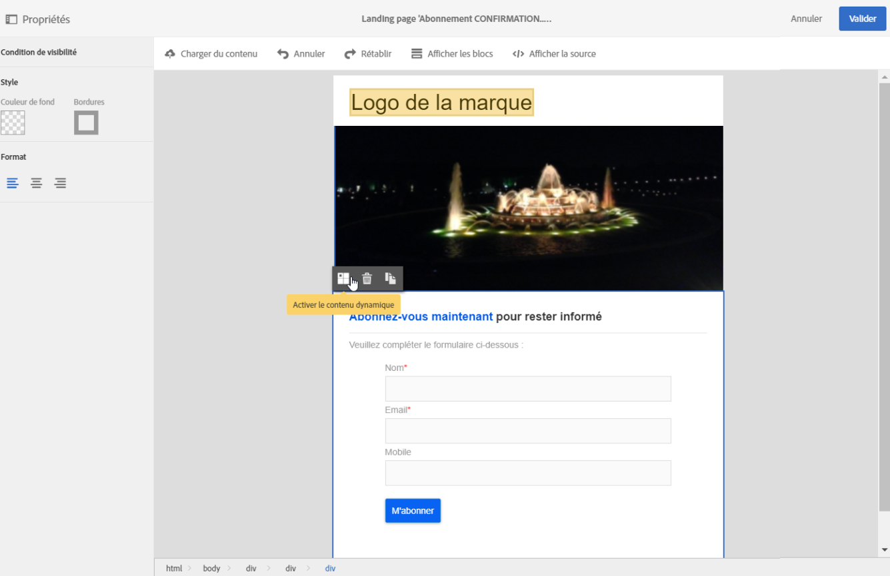

# Concevoir une landing page{#designing-a-landing-page}

## A propos de la conception du contenu d'une landing page {#about-content-design}

Les landing pages sont créées de la même façon que toute autre [activité marketing](../../start/using/marketing-activities.md#about-marketing-activities).

Lors de la conception d'une landing page, vous devez définir le contenu de la page, de la page de confirmation et de la page d'erreur. Utilisez le sélecteur situé sous la barre d'actions pour afficher et configurer chacune de ces pages.

Le contenu des landing pages est conçu dans l'éditeur de contenu de Campaign.

>[!NOTE]
>
>Si votre instance a été installée avant la version 19.0 d'Adobe Campaign Standard, vous avez toujours accès à l'ancien éditeur de contenu d'email. L'interface, les principes d'utilisation et la configuration sont pratiquement les mêmes que ceux décrits ci-dessous pour les landing pages. Cependant, toutes les fonctionnalités peuvent ne pas être disponibles ou gérées dans l'ancien éditeur de contenu d'email qui est obsolète à compter de la version 19.0. Pour modifier rapidement votre contenu de courrier électronique via une interface par glisser-déposer avec des fonctionnalités étendues, utilisez [Email Designer](../../designing/using/overview.md).

Cette page décrit les spécificités de l'éditeur de contenu de landing page. Pour plus d'informations sur les actions communes à une ou plusieurs activités marketing, reportez-vous aux sections suivantes du guide **Concevoir un contenu d'email** :

* [Insertion d'un champ de personnalisation](../../designing/using/personalization.md#inserting-a-personalization-field)
* [Ajout d'un bloc de contenu](../../designing/using/personalization.md#adding-a-content-block)
* [Insertion d'un lien](../../designing/using/links.md#inserting-a-link)
* [Insertion d'images](../../designing/using/images.md)
* [Bonnes pratiques générales pour la conception de contenu](../../designing/using/overview.md#content-design-best-practices)

>[!NOTE]
>Si vous disposez d'une landing page déjà prédéfinie au format HTML, vous pouvez l'importer directement via le bouton **[!UICONTROL Changer de contenu]**.
>
>Avant d'importer une page HTML dans Adobe Campaign, assurez-vous qu'elle s'ouvre et s'affiche correctement dans les différents navigateurs. Si la page HTML contient des scripts en langage JavaScript, ils doivent s'exécuter sans erreur hors de l'éditeur. En général, évitez d’utiliser des scripts dans le contenu des messages pour vous assurer qu’ils sont correctement traités par les clients de messagerie.

## Interface de l'éditeur de contenu de landing page{#landing-page-content-editor-interface}

L'éditeur de contenu de landing page permet de définir, modifier et personnaliser facilement du contenu dans Adobe Campaign. Pour y accéder, cliquez sur le bloc **[!UICONTROL Contenu]** dans le tableau de bord des landing pages.

L’éditeur de contenu est organisé en trois sections différentes. Ces sections vous permettent d’afficher et de modifier le contenu.

1. La **palette** située à gauche de l’écran vous permet de modifier les options générales liées à un bloc sélectionné. Les options pouvant être modifiées sont les suivantes : couleur de fond, bordure, alignement du texte, condition de visibilité, etc. See [Inserting a personalization field](../../designing/using/personalization.md#inserting-a-personalization-field).
1. La barre d’ **actions** contient les options générales de la page. Vous pouvez sélectionner un modèle et changer le mode d'affichage.
1. La **zone d'édition** principale permet d'interagir directement avec le contenu, grâce à la barre d'outils contextuelle : insérer un lien sur une image, modifier la police de caractères, supprimer un champ, etc.

La **barre d'actions** contient différents boutons permettant d'agir sur le contenu en cours de création.

<table> 
 <thead> 
  <tr> 
   <th> Icône  </th> 
   <th> Nom du bouton  </th> 
   <th> Canal  </th> 
   <th> Description  </th> 
  </tr> 
 </thead> 
 <tbody> 
  <tr> 
   <td>    </td> 
   <td> Charger du contenu   </td> 
   <td> Page d’entrée et courrier électronique  </td> 
   <td> Permet de sélectionner du contenu prêt à l’emploi ou d’importer votre propre contenu HTML. Reportez-vous à <a href="../../designing/using/using-existing-content.md">Chargement d’un contenu</a>existant.  </td> 
  </tr> 
  <tr> 
   <td>    </td> 
   <td> Annuler  </td> 
   <td> Tous  </td> 
   <td> Annule la dernière action effectuée.  </td> 
  </tr> 
  <tr> 
   <td>    </td> 
   <td> Rétablir  </td> 
   <td> Tous  </td> 
   <td> Rétablit la dernière action annulée.  </td> 
  </tr> 
  <tr> 
   <td>    </td> 
   <td> Afficher les blocs   </td> 
   <td> Page d’entrée et courrier électronique  </td> 
   <td> Permet d’afficher les zones entourant les blocs de contenu (correspond à la balise <strong>&lt;div&gt;</strong> HTML).  </td> 
  </tr> 
  <tr> 
   <td>    </td> 
   <td> Afficher la source   </td> 
   <td> Page d’entrée et courrier électronique  </td> 
   <td> Permet d’afficher le code source HTML de la page.  </td> 
  </tr> 
 </tbody> 
</table>

La **barre d'outils** est un élément contextuel de l'interface de l'éditeur qui présente des fonctionnalités différentes selon la zone sélectionnée. Il contient des boutons d’action et des boutons qui vous permettent de modifier le style du texte. Les modifications effectuées s'appliquent toujours à la zone sélectionnée. Une fois que vous avez sélectionné un bloc, vous pouvez le supprimer ou le dupliquer, par exemple. Après avoir sélectionné le texte dans un bloc, vous pouvez le transformer en lien ou le mettre en gras.

>[!CAUTION]
>
>Certaines fonctions de la barre d’outils vous permettent de formater le contenu HTML. Toutefois, si la page contient une feuille de style CSS, les **instructions** de la feuille de style peuvent prendre la **priorité** sur les instructions spécifiées dans la barre d’outils.

<table> 
 <thead> 
  <tr> 
   <th> Icône  </th> 
   <th> Nom du bouton  </th> 
   <th> Contexte  </th> 
   <th> Description  </th> 
  </tr> 
 </thead> 
 <tbody> 
  <tr> 
   <td>    </td> 
   <td> Lien vers une URL externe   </td> 
   <td> Tout élément  </td> 
   <td> Permet d’ajouter un lien à une URL. Les détails de la configuration d’un lien sont présentés dans la section <a href="../../designing/using/links.md#inserting-a-link">Insertion d’un lien</a> .  </td> 
  </tr> 
  <tr> 
   <td>    </td> 
   <td> Lien vers une page d’entrée   </td> 
   <td> Tout élément  </td> 
   <td> Permet d’accéder à une page d’entrée Adobe Campaign. Les détails de la configuration d’un lien sont présentés dans la section <a href="../../designing/using/links.md#inserting-a-link">Insertion d’un lien</a> .  </td> 
  </tr> 
  <tr> 
   <td>    </td> 
   <td> Lien d'abonnement   </td> 
   <td> Tout élément  </td> 
   <td> Permet d’insérer un lien d’abonnement au service. Les détails de la configuration d’un lien sont présentés dans la section <a href="../../designing/using/links.md#inserting-a-link">Insertion d’un lien</a> .  </td> 
  </tr> 
  <tr> 
   <td>    </td> 
   <td> Lien de désabonnement   </td> 
   <td> Tout élément  </td> 
   <td> Permet d’insérer un lien de désabonnement de service. Les détails de la configuration d’un lien sont présentés dans la section <a href="../../designing/using/links.md#inserting-a-link">Insertion d’un lien</a> .  </td> 
  </tr> 
  <tr> 
   <td>    </td> 
   <td> Supprimer le lien   </td> 
   <td> Lien (link)  </td> 
   <td> Permet de supprimer le lien, ainsi que toutes les configurations qui y sont liées, après confirmation.  </td> 
  </tr> 
  <tr> 
   <td>    </td> 
   <td> Insérer un champ de personnalisation   </td> 
   <td> Elément Texte  </td> 
   <td> Permet d’ajouter un champ de la base de données au contenu. Reportez-vous à <a href="../../designing/using/personalization.md#inserting-a-personalization-field">Insertion d’un champ</a>de personnalisation.  </td> 
  </tr> 
  <tr> 
   <td>    </td> 
   <td> Insérer un bloc de contenu   </td> 
   <td> Elément Texte  </td> 
   <td> Permet d’ajouter un bloc de personnalisation au contenu. Reportez-vous à <a href="../../designing/using/personalization.md#adding-a-content-block">Ajout d’un bloc</a>de contenu.  </td> 
  </tr> 
  <tr> 
   <td>    </td> 
   <td> Activer le contenu dynamique   </td> 
   <td> Elément Texte  </td> 
   <td> Permet d’insérer du contenu dynamique dans le contenu. Reportez-vous à <a href="../../channels/using/designing-a-landing-page.md#defining-dynamic-content-in-a-landing-page">Définition de contenu</a>dynamique.  </td> 
  </tr> 
  <tr> 
   <td>    </td> 
   <td> Désactiver le contenu dynamique   </td> 
   <td> Elément Texte  </td> 
   <td> Allows you to delete dynamic content.  </td> 
  </tr> 
  <tr> 
   <td>    </td> 
   <td> Agrandissement de la police  </td> 
   <td> Elément Texte  </td> 
   <td> Augmente la taille du texte sélectionné (ajoute <strong>&lt;span style="font-size:"&gt;</strong>).  </td> 
  </tr> 
  <tr> 
   <td>    </td> 
   <td> Réduire la police  </td> 
   <td> Elément Texte  </td> 
   <td> Réduit la taille du texte sélectionné (ajoute <strong>&lt;span style="font-size:"&gt;</strong>).  </td> 
  </tr> 
  <tr> 
   <td>    </td> 
   <td> Gras  </td> 
   <td> Elément Texte  </td> 
   <td> Ajoute le style gras au texte sélectionné (entoure le texte de balises <strong>&lt;strong&gt;</strong><strong>&lt;/strong&gt;</strong> ).  </td> 
  </tr> 
  <tr> 
   <td>    </td> 
   <td> Italique  </td> 
   <td> Elément Texte  </td> 
   <td> Ajoute le style italique au texte sélectionné (entoure le texte de balises <strong>&lt;em&gt;</strong><strong>&lt;/em&gt;</strong> ).  </td> 
  </tr> 
  <tr> 
   <td>    </td> 
   <td> Souligné  </td> 
   <td> Elément Texte  </td> 
   <td> Souligne le texte sélectionné (entoure le texte sélectionné avec <strong>&lt;span style="text-decoration: underline;"&gt;</strong> tag).  </td> 
  </tr> 
  <tr> 
   <td>    </td> 
   <td> Modifier la couleur d’arrière-plan   </td> 
   <td> Elément Texte  </td> 
   <td> Permet de modifier la couleur d’arrière-plan du bloc sélectionné (ajoute style="backcolor: rgba(170, 86, 255, 0.87)).  </td> 
  </tr> 
  <tr> 
   <td>    </td> 
   <td> Changer la couleur du texte   </td> 
   <td> Elément Texte  </td> 
   <td> Permet de modifier la couleur de tout le texte du bloc ou simplement le texte sélectionné dans le bloc (<strong>&lt;span style="color: #56ff56;"&gt;</strong>).  </td> 
  </tr> 
  <tr> 
   <td>    </td> 
   <td> Image   </td> 
   <td> Bloc contenant une image  </td> 
   <td> Permet d’insérer une image à partir d’un fichier enregistré localement.  </td> 
  </tr> 
  <tr> 
   <td>    </td> 
   <td> Supprimer  </td> 
   <td> Tout bloc  </td> 
   <td> Supprime le bloc et son contenu.  </td> 
  </tr> 
  <tr> 
   <td>    </td> 
   <td> Dupliquer  </td> 
   <td> Tout bloc  </td> 
   <td> Duplique le bloc, y compris les styles qui y sont liés.  </td> 
  </tr> 
 </tbody> 
</table>

## Gérer la structure et le style d'une landing page{#managing-landing-page-structure-and-style}

### Gérer les blocs dans l'éditeur de contenu {#managing-blocks-in-the-content-editor}

Les différents éléments du contenu HTML sont affichés dans la landing page sous forme de blocs, correspondant à la balise **&lt;div&gt;** **&lt;/div&gt;**. Sélectionnez un bloc pour interagir avec lui. Il sera alors entouré d'une boîte bleue.

Si un bloc est sélectionné, les objets parents de l’élément HTML correspondant s’affichent dans un chemin de navigation situé au bas de la zone de modification.

Lorsque le pointeur de la souris survole l’un des éléments du chemin de navigation, l’élément concerné est mis en surbrillance. Vous pouvez donc naviguer facilement entre les différents blocs et sélectionner exactement l’élément HTML que vous souhaitez modifier.

Utilisez les options de la palette et de la barre d’outils contextuelle pour modifier, supprimer ou dupliquer le bloc.

Pour les blocs contenant du texte, cliquez de nouveau dans le bloc pour activer le mode de modification du texte. Le cadre autour du bloc devient vert. Vous pouvez ensuite sélectionner ou saisir du texte. Utilisez les options de la palette et de la barre d’outils contextuelle pour ajouter un lien ou modifier la mise en forme du texte.

Paramètres définis pour un élément d’un bloc (liens, champs de personnalisation, blocs de contenu, etc.) peut être modifiée à tout moment à partir de la palette.

### Ajouter une bordure et un arrière-plan dans l'éditeur de contenu  {#adding-a-border-and-a-background-in-the-content-editor}

Vous pouvez également définir une couleur **d’** arrière-plan en sélectionnant une couleur dans le graphique. Cette couleur est appliquée au bloc sélectionné.

Vous pouvez ajouter une **bordure** au bloc sélectionné.

### Changer le style du texte dans l'éditeur de contenu  {#changing-the-text-style-in-the-content-editor}

Pour modifier le style du texte, vous devez cliquer à l’intérieur d’un bloc de texte.

Pour modifier l’alignement du texte, sélectionnez l’une des trois icônes suivantes dans la palette de gauche :

* **Aligner à gauche**: aligne le texte à gauche du bloc sélectionné (ajoute style="text-align: left;").
* **Centre**: centre le texte dans le bloc sélectionné (ajoute style="text-align: center;").
* **Aligner à droite** : aligne le texte à droite du bloc sélectionné (ajoute style="text-align: right;").

Vous pouvez également utiliser la barre d’outils pour modifier les attributs de police : adaptez la taille de la police, mettez le texte en gras ou en italique, soulignez ou modifiez la couleur du texte. Consultez [cette section](../../channels/using/designing-a-landing-page.md#landing-page-content-editor-interface).

### Insérer des images dans une landing page  {#inserting-images-in-a-landing-page}

1. Dans le contenu d'une landing page, sélectionnez un bloc contenant une image.
1. Sélectionnez le bouton **[!UICONTROL Insérer]**.

   

1. Sélectionnez **[!UICONTROL Image locale]** dans la barre d'outils contextuelle.

   

1. Sélectionnez un fichier.

   

1. Modifiez les propriétés de l’image selon vos besoins.

   

## Définir le contenu dynamique dans une landing page{#defining-dynamic-content-in-a-landing-page}

Pour définir du contenu dynamique dans une landing page, sélectionnez un bloc à l'aide du fil d'Ariane ou en cliquant directement sur un élément.

Certains blocs, tels que les images, ne peuvent pas être sélectionnés directement. Dans ce cas, sélectionnez le bloc parent à l’aide du chemin de navigation. Vous pouvez ensuite modifier tous les éléments inclus dans cet élément parent, y compris les images. La condition sera appliquée à tous les éléments enfants du bloc parent.

Le chemin de navigation est présenté dans la section [Gestion des blocs](../../channels/using/designing-a-landing-page.md#managing-landing-page-structure-and-style) .

Les étapes suivantes pour définir le contenu dynamique dans une page d’entrée sont similaires aux étapes à suivre pour un courrier électronique. Reportez-vous à [cette section](../../designing/using/personalization.md#defining-dynamic-content-in-an-email).

>[!NOTE]
>
>Si un élément variante est présenté en rouge, cela signifie qu’une expression n’a pas encore été définie.

Vous pouvez naviguer entre les différents contenus dynamiques d’un bloc. Pour cela :

1. Sélectionnez le bloc.

   Les flèches apparaissent sur les côtés droit et gauche de l’image.

1. Cliquez sur la flèche droite pour parcourir le contenu dynamique disponible.

   

   Les flèches de chaque côté s’estompent selon que vous avez atteint le dernier ou le premier contenu dynamique disponible.

   

1. Pour supprimer toutes les conditions appliquées à un bloc, sélectionnez celui-ci et cliquez de nouveau sur l'icône **[!UICONTROL Désactiver le contenu dynamique]**.
1. Sélectionnez le contenu dynamique que vous souhaitez conserver.

   

Dans la palette :

* Les contenus auxquels une expression est entrée ne sont plus décrits en rouge, mais en gris.
* Le contenu actuellement sélectionné apparaît en bleu.

