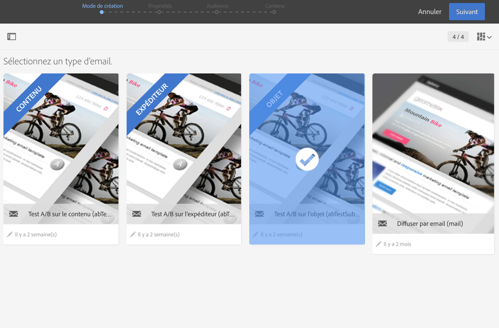
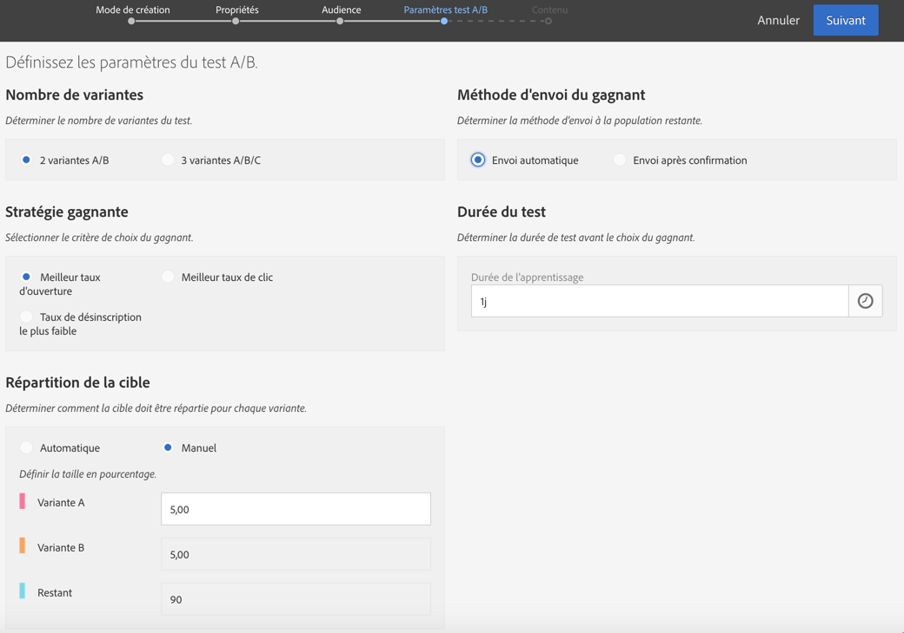
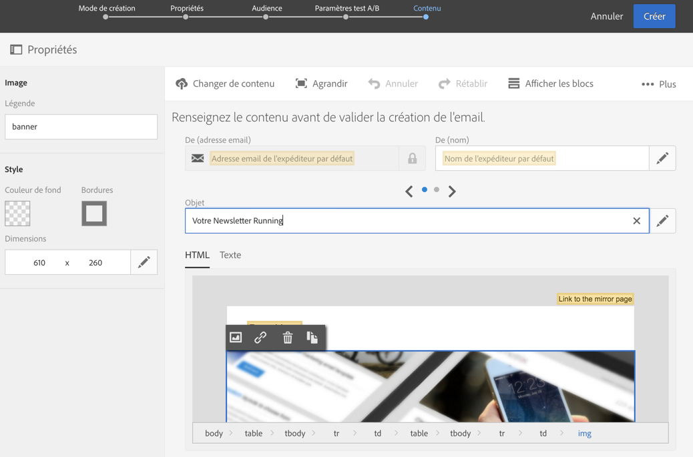
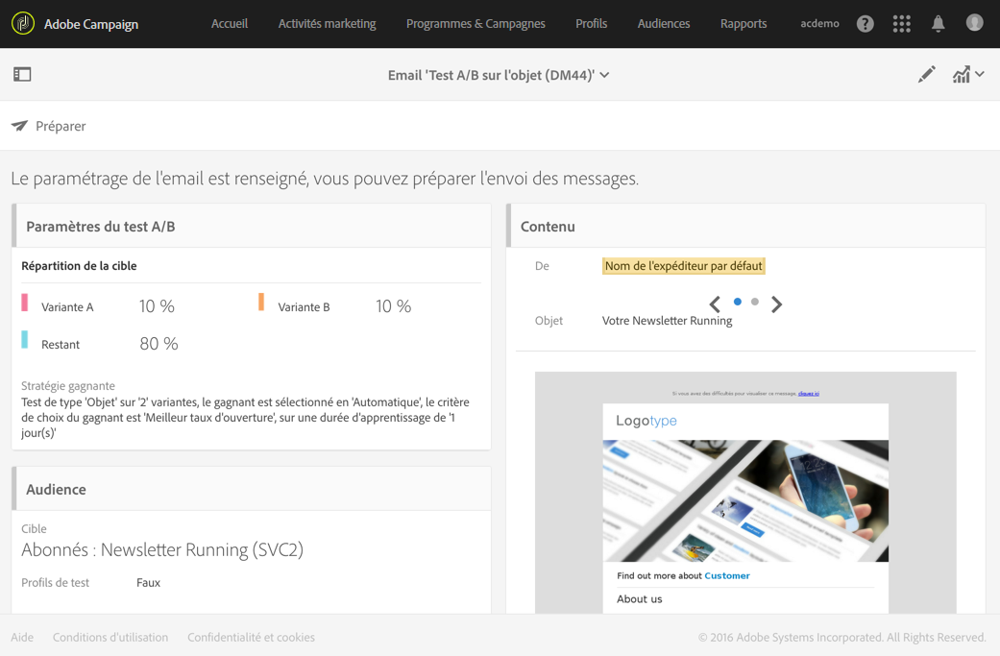

# Créer un email de test A/B{#designing-an-a-b-test-email}

La fonctionnalité de test A/B dans Adobe Campaign vous permet de définir de deux à trois variantes d'un email. Chaque variante est envoyée à des échantillons de population afin de déterminer celle qui entraîne les meilleurs résultats. Une fois déterminée, la variante gagnante est alors envoyée à la population ciblée restante.

Vous pouvez choisir de faire varier le contenu, le sujet ou l'expéditeur de l'email.

>[!NOTE]
>
>Il est impossible de réaliser des tests A/B sur des emails créés dans Adobe Experience Manager.

## Créer un email de test A/B {#creating-an-a-b-test-email}

La création d'un email de type test A/B peut être réalisée à l'aide de l'assistant de création d'un email standard, auquel est ajoutée une étape de paramétrage du test A/B. La création d'un email standard est présentée dans la section [Créer un email](../../channels/using/creating-an-email.md).

Dans le cadre spécifique d'un test A/B :

1. Créez un email à partir de l'un des trois modèles spécifiques à l'A/B testing, en fonction de l'élément que vous souhaitez faire varier :

   * Test A/B sur l'expéditeur
   * Test A/B sur le contenu
   * Test A/B sur l'objet
   

   >[!NOTE]
   >
   >Les modèles de relance et de test A/B sont masqués par défaut. Cochez la case Test A/B située à gauche (au niveau du panneau latéral **[!UICONTROL Filtrer]) pour les afficher.**

1. Définissez les propriétés générales et l'audience cible de l'email de la même manière que pour un email standard. Consultez la section [Créer une audience](../../audiences/using/creating-audiences.md).
1. A la quatrième étape de l'assistant de création, définissez les paramètres du test A/B :

   * **[!UICONTROL Nombre de variantes : vous pouvez choisir d'utiliser deux ou trois variantes.]** Si vous choisissez trois variantes, ce choix n'est plus modifiable après validation de cette étape de l'assistant.
   * **[!UICONTROL Stratégie gagnante : sélectionnez le critère à utiliser pour déterminer la variante gagnante.]**
   * **[!UICONTROL Répartition de la cible : choisissez quel pourcentage de la cible recevra chaque variante.]** Le pourcentage restant recevra la variante gagnante une fois qu'elle sera déterminée. La sélection est réalisée aléatoirement parmi les profils de la cible.
   * **[!UICONTROL Méthode d'envoi du gagnant : choisissez si vous souhaitez que la variante gagnante soit automatiquement envoyée une fois déterminée ou si vous souhaitez confirmer manuellement l'envoi à la population restante.]**
   * **[!UICONTROL Durée du test : indiquez la durée du test.]** La variante gagnante est déterminée automatiquement à l'issue de cette durée. Vous pouvez choisir manuellement la variante gagnante avant la fin du test depuis le tableau de bord de l'email.

      Le test doit avoir une durée supérieure ou égale à une heure afin que des données de tracking puissent être collectées et correctement prises en compte pour le choix de la variante gagnante.
   

1. Une fois les paramètres du test A/B définis, passez à l'étape suivante de l'assistant et définissez le contenu de l'email. En fonction du modèle que vous avez choisi, vous pouvez définir plusieurs objets, plusieurs noms d'expéditeurs ou plusieurs contenus différents. Utilisez le carrousel afin de naviguer entre les différentes variantes de l'élément. Pour plus d'informations, consultez la section relative à l'[éditeur de contenu](../../designing/using/about-email-content-design.md).

   

1. Validez la création de l'email. Le tableau de bord de l'email s'affiche.
1. Planifiez l'envoi. La date définie indique le début du test A/B.
1. Vérifiez les paramètres du test A/B affichés au niveau du bloc **[!UICONTROL Paramètres du test A/B.]** Vous pouvez les modifier jusqu'à la confirmation de l'envoi du test (étape 9) en sélectionnant le bloc.

   

1. Préparez l'envoi de l'email afin d'analyser la cible et le nombre de messages à envoyer. Consultez la section [Préparer l'envoi](../../sending/using/preparing-the-send.md).
1. Avant d'envoyer le test A/B, vérifiez votre email en envoyant des BAT.
1. Une fois la préparation terminée, confirmez l'envoi du test. Après la confirmation, les paramètres de test A/B ne sont plus modifiables.

   The A/B test starts on the date defined in the **[!UICONTROL Schedule]**.You can track its progress using the **[!UICONTROL A/B test]** and **[!UICONTROL Deployment]** blocks.

   Vous pouvez à tout moment sélectionner manuellement la variante gagnante si vous souhaitez écourter la durée du test.

   Une fois le test terminé, un tableau récapitulatif s'affiche sur le bloc **[!UICONTROL Test A/B], qui permet de visualiser les différents indicateurs relatifs aux différentes variantes testées.**

1. Si vous avez sélectionné **[!UICONTROL Envoi après confirmation]comme méthode d'envoi, vous devez sélectionner manuellement la variante gagnante pour commencer à l'envoyer à la population restante.** If you have selected **[!UICONTROL Automatic]**, the winning variant is automatically sent to the remaining population as soon as it has been determined by the system.

   >[!NOTE]
   >
   >En cas d'égalité, la variante gagnante doit être sélectionnée manuellement. Vous pouvez avertir l'auteur de l'email, ainsi que la ou les personnes l'ayant modifié, qu'une variante a été sélectionnée ou doit l'être. Voir [Notifications d'Adobe Campaign](../../administration/using/sending-internal-notifications.md).

Votre email est maintenant défini et envoyé. Vous pouvez accéder à ses logs et rapports pour mesurer le succès de votre campagne.

**Rubrique connexe** :

Vidéo [Créer un email](https://helpx.adobe.com/campaign/kt/acs/using/acs-create-email-from-homepage-feature-video-use.html)

## A propos des indicateurs de test A/B {#about-a-b-test-indicators}

Dans le tableau de bord des emails, plusieurs indicateurs sont proposés pour vous aider à mesurer votre test A/B : nombre de clics, ouvertures, bounces, etc.

Notez que l'indicateur **[!UICONTROL Réactivité estimée des destinataires]est un taux comparant le nombre de destinataires ayant cliqué au nombre de destinataires ayant ouvert l'email.** Par exemple, si 10 destinataires ont ouvert l'email et si 5 d'entre eux ont cliqué dessus, le taux de réactivité est de 50 %.
