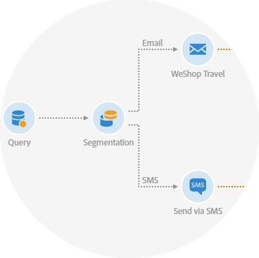

# Découvrir les canaux de communication{#discovering-communication-channels}

 Adobe Campaign vous permet de lancer, de mesurer et d&#39;automatiser des campagnes sur chaque.
L&#39;harmonisation de tous vos  marketing n&#39;est pas un impossible. Avec l&#39;aide de  Adobe Campaign, vous pouvez importer les données client de différents systèmes, périphériques et dans un seul et même. Ensuite, lancez des campagnes pertinentes et opportunes qui répondent aux besoins de vos clients aux bons endroits et de la bonne manière lors de leur parcours client.

Cinq  de communication sont disponibles en  Adobe Campaign :

* Email, présenté dans la section [Créer un email](../../channels/using/about-emails.md)
* SMS, présenté dans la section [Créer un SMS](../../channels/using/about-sms-messages.md)
* Notification push, présentée dans la section [Créer une notification push](../../channels/using/about-push-notifications.md)
* Messages In-App, présentés dans la section [Créer un message In-App](../../channels/using/about-in-app-messaging.md)
* Courrier, présenté dans la section [Créer une diffusion courrier](../../channels/using/about-direct-mail.md)

All marketing activities are based on a [template](../../start/using/marketing-activity-templates.md). Vous pouvez utiliser les modèles pour configurer les propriétés et gagner du temps et de la cohérence dans votre stratégie de messagerie.

Par exemple, pour les courriels, l’administrateur fonctionnel chargé de la configuration des modèles peut définir :

* Les paramètres standard d&#39;un email : audience, planning, contenu
* Les paramètres avancés d&#39;envoi, de validité, de tracking, etc
* Les paramètres de pré-configuration du ciblage et de la personnalisation (contexte de ciblage)

## Rubriques connexes :

| Pages utiles | Autres ressources |
|---|---|
| [Créer des modèles](../../start/using/marketing-activity-templates.md) | [Optimiser votre délivrabilité](../../sending/using/about-deliverability.md) |
| [Conception d’un contenu de courrier électronique](../../designing/using/designing-content-in-adobe-campaign.md) | [Bonnes pratiques de diffusion](https://helpx.adobe.com/fr/campaign/kb/delivery-best-practices.html) |
| [Création d&#39;une notification push multilingue](../../channels/using/creating-a-multilingual-push-notification.md) | [Conception de](../../channels/using/getting-started-with-landing-pages.md) |
| [Messages transactionnels](../../channels/using/about-transactional-messaging.md) | [Importation d’un contenu AEM](../../integrating/using/creating-email-experience-manager.md) |
| [Commencer à utiliser les courriers électroniques](https://helpx.adobe.com/fr/campaign/kb/acs-get-started-with-emails.html) | [Envoi de messages avec](../../automating/using/about-channel-activities.md) |
