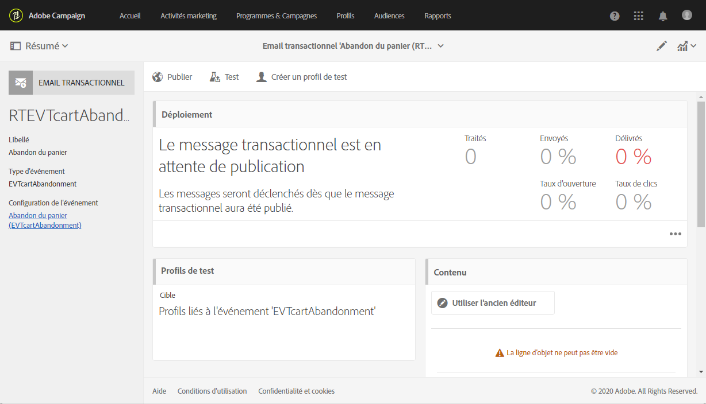
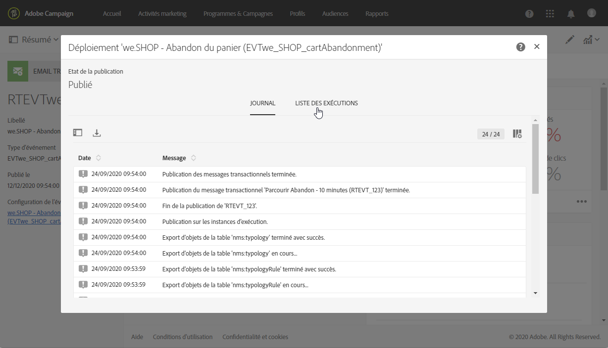

# Modification d&#39;un message transactionnel {#editing-transactional-message}

Une fois que vous avez créé et publié un événement<!--(the cart abandonment example as explained in [this section](../../channels/using/getting-started-with-transactional-msg.md#transactional-messaging-operating-principle))-->, le message transactionnel correspondant est automatiquement créé.

Les étapes de configuration et de publication du événement sont présentées dans les sections [Configuration d&#39;un événement transactionnel](../../channels/using/configuring-transactional-event.md) et [Publication d&#39;un événement transactionnel](../../channels/using/publishing-transactional-event.md).

Les étapes d&#39;accès, de modification et de personnalisation de ce message sont décrites ci-dessous.

>[!IMPORTANT]
>
>Seuls les utilisateurs dotés du rôle [Administration](../../administration/using/users-management.md#functional-administrators) peuvent accéder aux messages transactionnels et les modifier.

Une fois votre message prêt, il peut être testé et publié. Voir [Test d&#39;un message transactionnel](../../channels/using/testing-transactional-message.md) et [cycle de vie du Message transactionnel](../../channels/using/publishing-transactional-message.md).

## Accès aux messages transactionnels {#accessing-transactional-messages}

Pour accéder au message transactionnel que vous avez créé :

1. Cliquez sur le logo **[!UICONTROL Adobe Campaign]**, en haut à gauche.
1. Sélectionnez **[!UICONTROL Plans marketing]** > **[!UICONTROL Messages transactionnels]** > **[!UICONTROL Messages transactionnels]**.

   

1. Cliquez sur le message de votre choix pour le modifier.

   

Vous pouvez également accéder directement à un message transactionnel via le lien situé dans la zone de gauche de l’écran de configuration du événement correspondant. Voir [Prévisualisation et publication d’un événement](../../channels/using/publishing-transactional-event.md#previewing-and-publishing-the-event)

## Personnaliser un message transactionnel          {#personalizing-a-transactional-message}

Pour modifier et personnaliser un message transactionnel, procédez comme suit.

>[!NOTE]
>
>Cette section décrit comment modifier un message transactionnel **basé sur un événement**. Les caractéristiques des messages transactionnels **basés sur le profil** sont détaillées [ci-dessous](#profile-transactional-message-specificities).
>
>Les étapes de configuration pour créer un message transactionnel basé sur un événement sont présentées dans [cette section](../../channels/using/configuring-transactional-event.md#event-based-transactional-messages).

Par exemple, vous souhaitez envoyer une notification aux utilisateurs de votre site Web qui ont ajouté des produits à leur panier et qui quittent le site sans avoir à effectuer leurs achats. Cet exemple est présenté dans la section [Principe d&#39;exploitation de la messagerie transactionnelle](../../channels/using/getting-started-with-transactional-msg.md#transactional-messaging-operating-principle).

1. Cliquez sur le bloc **[!UICONTROL Contenu]** pour modifier l’objet et le contenu de votre message. Dans cet exemple, sélectionnez un modèle contenant des images et du texte. Pour plus d’informations sur les modèles de contenu de courrier électronique, voir [Conception de courriers électroniques à l’aide de modèles](../../designing/using/using-reusable-content.md#designing-templates).

   

1. Ajoutez un objet et modifiez le contenu de votre message en fonction de vos besoins.

   >[!NOTE]
   >
   >Le lien vers le panier abandonné est un lien vers une URL externe qui redirigera la personne sur son panier. Ce paramétrage n’est pas géré dans Adobe Campaign.

1. Dans cet exemple, vous souhaitez ajouter trois champs que vous avez définis lors de la [création de votre événement](../../channels/using/configuring-transactional-event.md) : prénom, dernier produit consulté, montant total du panier. Pour ce faire, [insérez un champ de personnalisation](../../designing/using/personalization.md#inserting-a-personalization-field) dans le contenu du message.

1. Accédez à ces champs via **[!UICONTROL Contexte]** > **[!UICONTROL Evénement temps réel]** > **[!UICONTROL Contexte de l’événement]**.

   

1. Vous pouvez également enrichir le contenu de votre message. Pour ce faire, ajoutez les champs du tableau que vous avez lié à votre configuration de événement (voir [Enrichissement du événement](../../channels/using/configuring-transactional-event.md#enriching-the-transactional-message-content)). Dans cet exemple, sélectionnez le champ **[!UICONTROL Titre (formule de politesse)]** de la table **[!UICONTROL Profil]** dans **[!UICONTROL Contexte]** > **[!UICONTROL événement en temps réel]** > **[!UICONTROL contexte du Événement]**.

   

1. Insérez tous les champs nécessaires.

   

1. Prévisualisez votre message en sélectionnant le profil que vous avez défini pour cet événement.

   Les étapes de prévisualisation d’un message sont présentées dans la section [Prévisualiser le message](../../sending/using/previewing-messages.md).

   

   Vous constatez que les champs de personnalisation correspondent bien aux informations saisies dans le profil de test. Pour plus d&#39;informations à ce sujet, voir [Définition d&#39;un profil de test spécifique](../../channels/using/testing-transactional-message.md#defining-specific-test-profile).

## Utiliser des listes de produits dans un message transactionnel     {#using-product-listings-in-a-transactional-message}

Lors de la modification du contenu d’un courrier électronique transactionnel, vous pouvez créer des listes de produits référençant une ou plusieurs collections de données. Par exemple, dans un courrier électronique d’abandon de panier, vous pouvez inclure une liste de tous les produits qui se trouvaient dans le panier des utilisateurs lorsqu’ils ont quitté votre site Web, avec une image, le prix et un lien vers chaque produit.

>[!IMPORTANT]
>
>Les listes de produits ne sont disponibles que pour le canal de messagerie électronique, lorsque vous modifiez le contenu des messages électroniques transactionnels via l’interface [Concepteur de messages électroniques](../../designing/using/designing-content-in-adobe-campaign.md#email-designer-interface).

Pour ajouter une liste de produits abandonnés dans un message transactionnel, suivez les étapes ci-dessous.

Vous pouvez également regarder [cet ensemble de vidéos](https://experienceleague.adobe.com/docs/campaign-standard-learn/tutorials/designing-content/product-listings-in-transactional-email.html?lang=en#configure-product-listings-in-transactional-emails) expliquant les étapes requises pour configurer les listes de produits dans un courrier électronique transactionnel.

>[!NOTE]
>
>Adobe Campaign ne prend pas en charge les listes de produits imbriquées, ce qui signifie que vous ne pouvez pas inclure une liste de produits dans une autre.

### Définir une liste de produits         {#defining-a-product-listing}

Avant de pouvoir utiliser une liste de produits dans un message transactionnel, vous devez définir au niveau de l’événement la liste des produits et les champs de chaque produit de la liste que vous souhaitez afficher. Voir à ce propos la section [Définir des collections de données](../../channels/using/configuring-transactional-event.md#defining-data-collections).

1. Dans le message transactionnel, cliquez sur le bloc **[!UICONTROL Contenu]** pour modifier le contenu de l’email.
1. Placez un composant de structure dans l’espace de travail. Pour en savoir plus sur ce sujet, voir [Définition de la structure du courrier électronique](../../designing/using/designing-from-scratch.md#defining-the-email-structure).

   Par exemple, sélectionnez un composant de structure à une colonne et ajoutez un composant de texte, un composant d’image et un composant de bouton. Pour plus d’informations à ce sujet, voir [Utilisation des composants de contenu](../../designing/using/designing-from-scratch.md#about-content-components).

1. Sélectionnez le composant de structure que vous venez de créer et cliquez sur l’icône **[!UICONTROL Activer la liste de produits]** dans la barre d’outils contextuelle.

   

   Le composant de structure est mis en surbrillance avec un cadre orange et les paramètres de **[!UICONTROL Liste de produits]** sont affichés dans la palette gauche.

   

1. Sélectionnez l’affichage des éléments de la collection :

   * **[!UICONTROL Ligne]** : horizontalement, c’est-à-dire que chaque élément se trouve sur une ligne.
   * **[!UICONTROL Colonne]** : verticalement, c’est-à-dire que les éléments sont côte à côte sur une même ligne.

   >[!NOTE]
   >
   >L’option **[!UICONTROL Colonne]** n’est disponible que lorsque vous utilisez un composant de structure multicolonne (**[!UICONTROL Colonne 2:2]**, **[!UICONTROL Colonne 3:3]** et **[!UICONTROL Colonne 4:4]** ). Lors de l’édition de la liste de produits, ne remplissez que la première colonne. Les autres colonnes ne seront pas prises en compte. Pour plus d&#39;informations sur la sélection des composants de structure, voir [Définition de la structure du courrier électronique](../../designing/using/designing-from-scratch.md#defining-the-email-structure).

1. Sélectionnez la collection de données que vous avez créée lors de la configuration de l’événement associé au message transactionnel. Elle se trouve sous le nœud **[!UICONTROL Contexte]** > **[!UICONTROL Evénement temps réel]** > **[!UICONTROL Contexte de l’événement]**.

   

   Pour plus d’informations sur la configuration de l’événement, consultez la section [Définir des collections de données](../../channels/using/configuring-transactional-event.md#defining-data-collections).

1. Utilisez la liste déroulante **[!UICONTROL Premier élément]** pour sélectionner l’élément qui sera au début de la liste affichée dans l’email.

   Par exemple, si vous sélectionnez 2, le premier élément de la collection ne sera pas affiché dans l’email. La liste de produits commencera sur le deuxième élément.

1. Sélectionnez le nombre maximal d’éléments à afficher dans la liste.

   >[!NOTE]
   >
   >Si vous souhaitez que les éléments de votre liste s’affichent verticalement (**[!UICONTROL Colonne]**), le nombre maximal d’éléments est limité en fonction du composant de structure sélectionné (2, 3 ou 4 colonnes). Pour plus d’informations sur la sélection de composants de structure, consultez la section [Editer la structure de l’email](../../designing/using/designing-from-scratch.md#defining-the-email-structure).

### Remplir la liste de produits         {#populating-the-product-listing}

Pour afficher une liste des produits provenant de l’événement associé à l’email transactionnel, suivez les étapes ci-dessous.

Pour plus d’informations sur la création d’une collection et de champs associés lors de la configuration de l’événement, consultez la section [Définir des collections de données](../../channels/using/configuring-transactional-event.md#defining-data-collections).

1. Choisissez le composant d’image que vous avez inséré, sélectionnez **[!UICONTROL Activer la personnalisation]** et cliquez sur le crayon dans le volet Paramètres.

   

1. Sélectionnez **[!UICONTROL Ajouter un champ de personnalisation]** dans la fenêtre **[!UICONTROL URL de la source de l’image]** qui s’affiche.

   Dans le nœud **[!UICONTROL Contexte]** > **[!UICONTROL Evénement temps réel]** > **[!UICONTROL Contexte de l’événement]**, ouvrez le nœud correspondant à la collection que vous avez créée (ici **[!UICONTROL Liste des produits]**) et sélectionnez le champ d’image que vous avez défini (ici **[!UICONTROL Image du produit]** ). Cliquez sur **[!UICONTROL Enregistrer]**.

   

   Le champ de personnalisation que vous avez sélectionné est maintenant affiché dans le volet Paramètres.

1. A l’emplacement désiré, sélectionnez **[!UICONTROL Insérer un champ de personnalisation]** dans la barre d’outils contextuelle.

   

1. Dans le nœud **[!UICONTROL Contexte]** > **[!UICONTROL Evénement temps réel]** > **[!UICONTROL Contexte de l’événement]**, ouvrez le nœud correspondant à la collection que vous avez créée (ici **[!UICONTROL Liste des produits]**) et sélectionnez le champ que vous avez créé (ici **[!UICONTROL Nom du produit]**). Cliquez sur **[!UICONTROL Confirmer]**.

   

   Le champ de personnalisation que vous avez sélectionné est maintenant affiché à l’emplacement voulu dans le contenu de l’email.

1. Procédez de la même manière pour insérer le prix.
1. Sélectionnez du texte et cliquez sur **[!UICONTROL Ajouter un lien]** dans la barre d’outils contextuelle.

   

1. Sélectionnez **[!UICONTROL Ajouter un champ de personnalisation]** dans la fenêtre **[!UICONTROL Ajouter un lien]** qui s’affiche.

   Dans le nœud **[!UICONTROL Contexte]** > **[!UICONTROL Evénement temps réel]** > **[!UICONTROL Contexte de l’événement]**, ouvrez le nœud correspondant à la collection que vous avez créée (ici **[!UICONTROL Liste des produits]**) et sélectionnez le champ d’URL que vous avez créé (ici **[!UICONTROL URL du produit]**). Cliquez sur **[!UICONTROL Enregistrer]**.

   >[!IMPORTANT]
   >
   >Pour des raisons de sécurité, veillez à insérer le champ de personnalisation dans un lien commençant par un nom de domaine statique approprié.

   

   Le champ de personnalisation que vous avez sélectionné est maintenant affiché dans le volet Paramètres.

1. Choisissez le composant de structure sur lequel la liste de produits est appliquée et sélectionnez **[!UICONTROL Afficher la version de secours]** pour définir un contenu par défaut.

   

1. Faites glisser un ou plusieurs composants de contenu et éditez-les si nécessaire.

   

   Le contenu de remplacement sera affiché si la collection est vide lorsque l’événement est déclenché, par exemple lorsqu’un client ne possède aucun produit dans son panier.

1. Dans le volet Paramètres, éditez les styles de la liste de produits. Pour plus d’informations sur ce sujet, voir [Gestion des styles de courrier électronique](../../designing/using/styles.md).
1. Prévisualisez l’email en utilisant un profil de test associé à l’événement transactionnel adéquat et pour lequel vous avez défini des données de collection. Par exemple, ajoutez les informations suivantes dans la section **[!UICONTROL Données de l’événement]** pour le profil de test que vous souhaitez utiliser :

   

   Pour plus d’informations sur la définition d’un profil de test dans un message transactionnel, consultez [cette section](../../channels/using/testing-transactional-message.md#defining-specific-test-profile).

## Spécifications des messages transactionnels en fonction du profil {#profile-transactional-message-specificities}

Vous pouvez envoyer des messages transactionnels en fonction de profils marketing client, ce qui vous permet d’exploiter toutes les informations de profil pour personnaliser le contenu du message, d’utiliser le lien de désinscription et d’appliquer des règles de typologie marketing telles que [règles de fatigue](../../sending/using/fatigue-rules.md).

* Pour en savoir plus sur les différences entre les messages transactionnels basés sur le événement et ceux basés sur le profil, voir [cette section](../../channels/using/getting-started-with-transactional-msg.md#transactional-message-types).

* Les étapes de configuration pour créer un message transactionnel basé sur un profil sont détaillées dans [cette section](../../channels/using/configuring-transactional-event.md#profile-based-transactional-messages).

<!--### Editing a profile transactional message {#editing-profile-transactional-message}-->

Les étapes de création, de modification et de personnalisation d’un message transactionnel de profil sont pratiquement identiques à celles d’un message transactionnel de événement.

Les différences sont énumérées ci-dessous.

1. [Accédez au message transactionnel qui a été créé afin de l&#39;éditer.](#accessing-transactional-messages)
1. Dans le message transactionnel, cliquez sur la section **[!UICONTROL Contenu]**. Outre les modèles de courrier électronique transactionnel, vous pouvez également choisir tout modèle de courrier électronique ciblant la ressource **[!UICONTROL Profil]**.

   

1. Sélectionnez le modèle d&#39;email par défaut. Comme tous les courriers électroniques marketing, il comprend un **lien de désinscription**.

   

   Pour en savoir plus sur les modèles, voir [cette section](../../designing/using/using-reusable-content.md#content-templates).

1. En outre, contrairement aux configurations basées sur des événements en temps réel, vous avez **accès direct à toutes les informations de profil** pour personnaliser votre message. Vous pouvez ajouter [champs de personnalisation](../../designing/using/personalization.md#inserting-a-personalization-field) comme vous le feriez pour tout autre courrier électronique marketing standard.

1. Enregistrez vos modifications avant de publier le message. Voir à ce propos la section [Publier un message transactionnel](../../channels/using/publishing-transactional-message.md#publishing-a-transactional-message).

<!--### Monitoring a profile transactional message delivery {#monitoring-a-profile-transactional-message-delivery}

Once the message is published and your site integration is done, you can monitor the delivery.

1. To view the message delivery log, click the icon at the bottom right of the **[!UICONTROL Deployment]** block.

1. Click the **[!UICONTROL Execution list]** tab.

   

1. Select the latest execution delivery.

   An **execution delivery** is a non-actionable and non-functional technical message created once a month for each transactional message, and each time a transactional message is edited and published again

1. Select the **[!UICONTROL Sending logs]** tab. In the **[!UICONTROL Status]** column, **[!UICONTROL Sent]** indicates that a profile has opted in.

   

1. Select the **[!UICONTROL Exclusions logs]** tab to view recipients who have been excluded from the message target, such as addresses on denylist.

   

>[!NOTE]
>
>For more information on accessing and using the logs, see [Monitoring a delivery](../../sending/using/monitoring-a-delivery.md).

For any profile that has opted out, the **[!UICONTROL Address on denylist]** typology rule excluded the corresponding recipient.

This rule is part of a specific typology that applies to all transactional messages based on the **[!UICONTROL Profile]** table.

**Related topics**:

* [Integrate the event triggering](../../channels/using/getting-started-with-transactional-msg.md#integrate-event-trigger)
* [About typologies and typology rules](../../sending/using/about-typology-rules.md)-->
