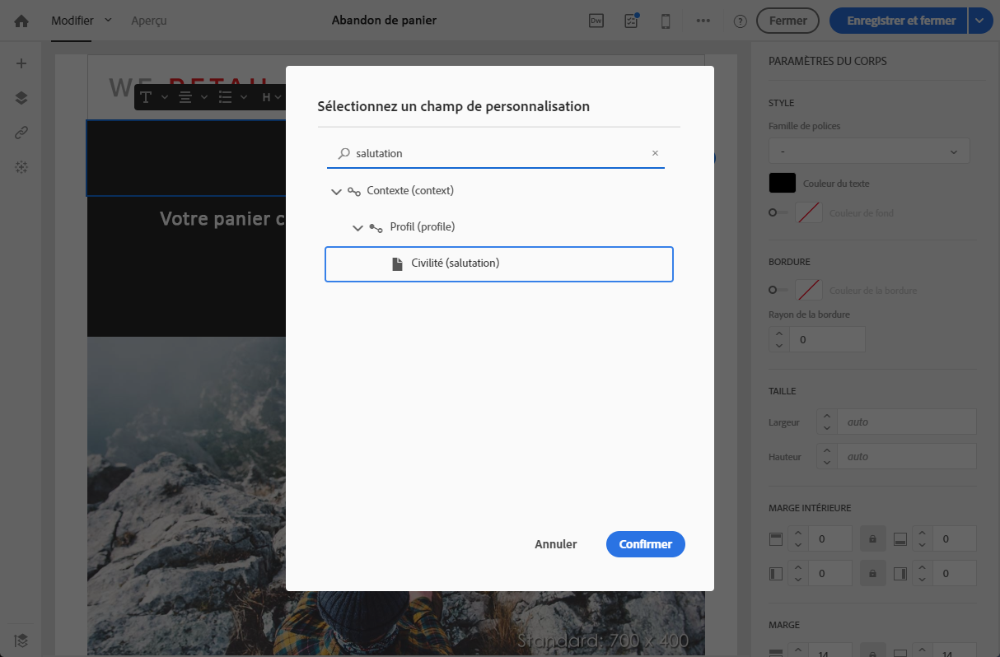
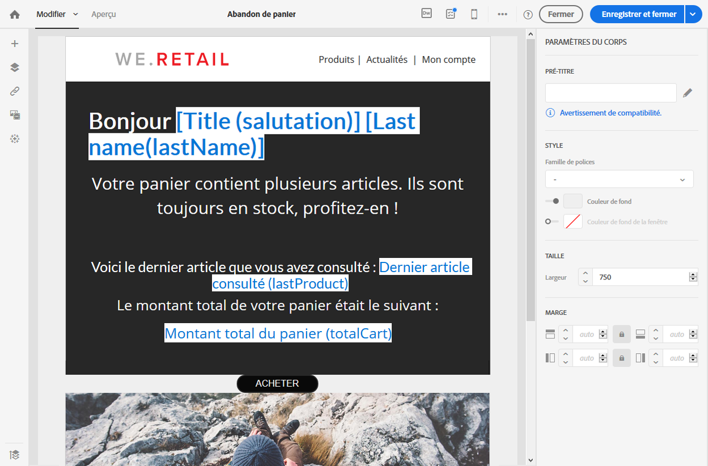
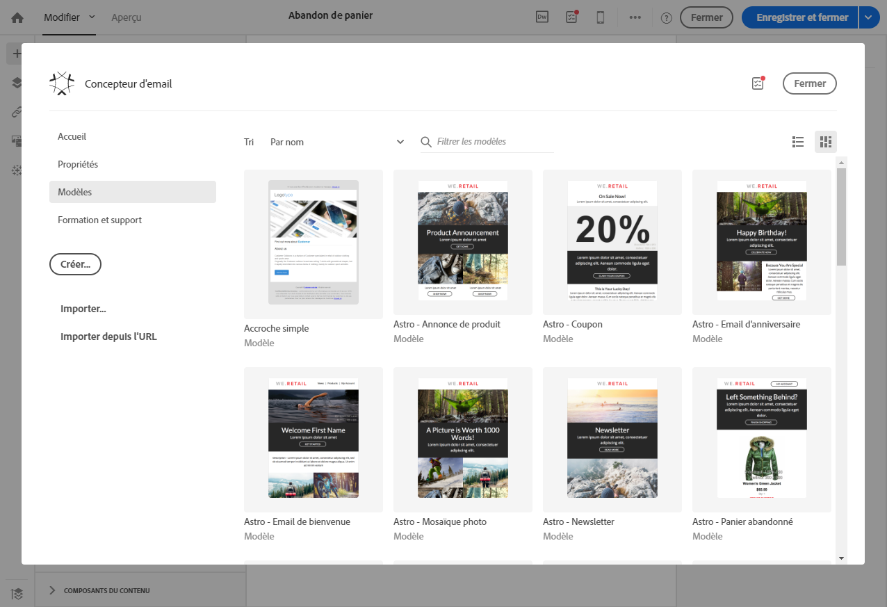

# Modification d’un message transactionnel {#editing-transactional-message}

Une fois que vous avez créé et publié un événement<!--(the cart abandonment example as explained in [this section](../../channels/using/getting-started-with-transactional-msg.md#transactional-messaging-operating-principle))-->, le message transactionnel correspondant est automatiquement créé.

Les étapes de configuration et de publication d’événement sont présentées dans les sections [Configuration d&#39;un événement transactionnel](../../channels/using/configuring-transactional-event.md) et [Publication d&#39;un événement transactionnel](../../channels/using/publishing-transactional-event.md).

Les étapes d’accès, de modification et de personnalisation de ce message sont décrites ci-dessous.

>[!IMPORTANT]
>
>Seuls les utilisateurs dotés du rôle [Administration](../../administration/using/users-management.md#functional-administrators) peuvent accéder aux messages transactionnels et les modifier.

Une fois votre message prêt, il peut être testé et publié. Voir [Test d&#39;un message transactionnel](../../channels/using/testing-transactional-message.md) et [Cycle de vie du message transactionnel](../../channels/using/publishing-transactional-message.md).

## Accès aux messages transactionnels {#accessing-transactional-messages}

Pour accéder au message transactionnel que vous avez créé :

1. Cliquez sur le logo **[!UICONTROL Adobe Campaign]**, en haut à gauche.
1. Sélectionnez **[!UICONTROL Plans marketing]** > **[!UICONTROL Messages transactionnels]** > **[!UICONTROL Messages transactionnels]**.

   

1. Cliquez sur le message de votre choix pour le modifier.

   

Vous pouvez également accéder directement à un message transactionnel via le lien situé dans la zone latérale gauche de l’écran de configuration de l’événement correspondant. Voir [Prévisualisation et publication de l&#39;événement](../../channels/using/publishing-transactional-event.md#previewing-and-publishing-the-event)

## Personnaliser un message transactionnel           {#personalizing-a-transactional-message}

Pour modifier et personnaliser un message transactionnel, procédez comme suit.

>[!NOTE]
>
>Cette section décrit comment modifier un message transactionnel **basé sur un événement**. Les caractéristiques des messages transactionnels **basés sur un profil** sont présentées [ci-dessous](#profile-transactional-message-specificities).
>
>Les étapes de configuration pour créer un message transactionnel basé sur un événement sont présentées dans [cette section](../../channels/using/configuring-transactional-event.md#event-based-transactional-messages).

Par exemple, vous souhaitez envoyer une notification aux utilisateurs de votre site web qui ont ajouté des produits à leur panier et qui quittent le site sans avoir effectuer leurs achats. Cet exemple est présenté dans la section [Principe de fonctionnement de la messagerie transactionnelle](../../channels/using/getting-started-with-transactional-msg.md#transactional-messaging-operating-principle).

1. Cliquez sur le bloc **[!UICONTROL Contenu]** pour modifier l’objet et le contenu de votre message. Dans cet exemple, sélectionnez un modèle contenant des images et du texte. Pour plus d’informations sur les modèles de contenu d’email, voir [Conception d&#39;emails à l&#39;aide de modèles](../../designing/using/using-reusable-content.md#designing-templates).

   

1. Ajoutez un objet et modifiez le contenu de votre message en fonction de vos besoins.

   >[!NOTE]
   >
   >Le lien vers le panier abandonné est un lien vers une URL externe qui redirigera la personne sur son panier. Ce paramétrage n’est pas géré dans Adobe Campaign.

1. Dans cet exemple, vous souhaitez ajouter trois champs que vous avez définis lors de la [création de votre événement](../../channels/using/configuring-transactional-event.md) : prénom, dernier produit consulté, montant total du panier. Pour ce faire, [insérez un champ de personnalisation](../../designing/using/personalization.md#inserting-a-personalization-field) dans le contenu du message.

1. Accédez à ces champs via **[!UICONTROL Contexte]** > **[!UICONTROL Evénement temps réel]** > **[!UICONTROL Contexte de l’événement]**.

   

1. Vous pouvez également enrichir le contenu de votre message. Pour ce faire, ajoutez les champs de la table que vous avez liée à votre configuration d&#39;événement (voir [Enrichir l&#39;événement](../../channels/using/configuring-transactional-event.md#enriching-the-transactional-message-content)). Dans notre exemple, sélectionnez le champ **[!UICONTROL Titre (formule de salutation)]** dans la table **[!UICONTROL Profil]** via **[!UICONTROL Contexte]** > **[!UICONTROL Événement temps réel]** > **[!UICONTROL Contexte de l&#39;événement]**.

   

1. Insérez tous les champs nécessaires.

   

1. Prévisualisez votre message en sélectionnant le profil que vous avez défini pour cet événement.

   Les étapes de prévisualisation d’un message sont présentées dans la section [Prévisualiser le message](../../sending/using/previewing-messages.md).

   

   Vous constatez que les champs de personnalisation correspondent bien aux informations saisies dans le profil de test. Voir à ce propos la section [Définition d&#39;un profil de test spécifique](../../channels/using/testing-transactional-message.md#defining-specific-test-profile).

<!--## Using product listings in a transactional message {#using-product-listings-in-a-transactional-message}

When editing the content of a transactional email, you can create product listings referencing one or more data collections. For example, in a cart abandonment email, you can include a list of all products that were in the users' carts when they left your website, with an image, the price, and a link to each product.

>[!IMPORTANT]
>
>Product listings are only available for the email channel, when editing transactional email content through the [Email Designer](../../designing/using/designing-content-in-adobe-campaign.md#email-designer-interface) interface.

To add a list of abandoned products in a transactional message, follow the steps below.

You can also watch [this set of videos](https://experienceleague.adobe.com/docs/campaign-standard-learn/tutorials/designing-content/product-listings-in-transactional-email.html?lang=en#configure-product-listings-in-transactional-emails) explaining the steps that are required to configure product listings in a transactional email.

>[!NOTE]
>
>Adobe Campaign does not support nested product listings, meaning that you cannot include a product listing inside another one.

### Defining a product listing {#defining-a-product-listing}

Before being able to use a product listing in a transactional message, you need to define at the event level the list of products and the fields for each product of the list you want to display. For more on this, see [Defining data collections](../../channels/using/configuring-transactional-event.md#defining-data-collections).

1. In the transactional message, click the **[!UICONTROL Content]** block to modify the email content.
1. Drag and drop a structure component to the workspace. For more on this, see [Defining the email structure](../../designing/using/designing-from-scratch.md#defining-the-email-structure).

   For example, select a one-column structure component and add a text component, an image component and a button component. For more on this, see [Using content components](../../designing/using/designing-from-scratch.md#about-content-components).

1. Select the structure component you just created and click the **[!UICONTROL Enable product listing]** icon from the contextual toolbar.

   

   The structure component is highlighted with an orange frame and the **[!UICONTROL Product listing]** settings are displayed in the left palette.

   

1. Select how the elements of the collection will be displayed:

    * **[!UICONTROL Row]**: horizontally, meaning each element on one row under the other.
    * **[!UICONTROL Column]**: vertically, meaning each element next to the other on the same row.

   >[!NOTE]
   >
   >The **[!UICONTROL Column]** option is only available when using a multicolumn structure component ( **[!UICONTROL 2:2 column]**, **[!UICONTROL 3:3 column]** and **[!UICONTROL 4:4 column]** ). When editing the product listing, only fill in the first column: the other columns will not be taken into account. For more on selecting structure components, see [Defining the email structure](../../designing/using/designing-from-scratch.md#defining-the-email-structure).

1. Select the data collection you created when configuring the event related to the transactional message. You can find it under the **[!UICONTROL Context]** > **[!UICONTROL Real-time event]** > **[!UICONTROL Event context]** node.

   

   For more on configuring the event, see [Defining data collections](../../channels/using/configuring-transactional-event.md#defining-data-collections).

1. Use the **[!UICONTROL First item]** drop-down list to select which element will start the list displayed in the email.

   For example, if you select 2, the first item of the collection will not be displayed in the email. The product listing will start on the second item.

1. Select the maximum number of items to display in the list.

   >[!NOTE]
   >
   >If you want the elements of your list to be displayed vertically ( **[!UICONTROL Column]** ), the maximum number of items is limited according to the selected structure component (2, 3 or 4 columns). For more on selecting structure components, see [Editing the email structure](../../designing/using/designing-from-scratch.md#defining-the-email-structure).

### Populating the product listing {#populating-the-product-listing}

To display a list of products coming from the event linked to the transactional email, follow the steps below.

For more on creating a collection and related fields when configuring the event, see [Defining data collections](../../channels/using/configuring-transactional-event.md#defining-data-collections).

1. Select the image component you inserted, select **[!UICONTROL Enable personalization]** and click the pencil in the Settings pane.

   

1. Select **[!UICONTROL Add personalization field]** in the **[!UICONTROL Image source URL]** window that opens.

   From the **[!UICONTROL Context]** > **[!UICONTROL Real-time event]** > **[!UICONTROL Event context]** node, open the node corresponding to the collection that you created (here **[!UICONTROL Product list]** ) and select the image field that you defined (here **[!UICONTROL Product image]** ). Click **[!UICONTROL Save]**.

   

   The personalization field that you selected is now displayed in the Settings pane.

1. At the desired position, select **[!UICONTROL Insert personalization field]** from the contextual toolbar.

   

1. From the **[!UICONTROL Context]** > **[!UICONTROL Real-time event]** > **[!UICONTROL Event context]** node, open the node corresponding to the collection that you created (here **[!UICONTROL Product list]** ) and select the field that you created (here **[!UICONTROL Product name]** ). Click **[!UICONTROL Confirm]**.

   

   The personalization field that you selected is now displayed at the desired position in the email content.

1. Proceed similarly to insert the price.
1. Select some text and select **[!UICONTROL Insert link]** from the contextual toolbar.

   

1. Select **[!UICONTROL Add personalization field]** in the **[!UICONTROL Insert link]** window that opens.

   From the **[!UICONTROL Context]** > **[!UICONTROL Real-time event]** > **[!UICONTROL Event context]** node, open the node corresponding to the collection that you created (here **[!UICONTROL Product list]** ) and select the URL field that you created (here **[!UICONTROL Product URL]** ). Click **[!UICONTROL Save]**.

   >[!IMPORTANT]
   >
   >For security reasons, make sure you insert the personalization field inside a link starting with a proper static domain name.

   

   The personalization field that you selected is now displayed in the Settings pane.

1. Select the structure component on which the product listing is applied and select **[!UICONTROL Show fallback]** to define a default content.

   

1. Drag one or more content components and edit them as needed.

   

   The fallback content will be displayed if the collection is empty when the event is triggered, for example if a customer has nothing in his cart.

1. From the Settings pane, edit the styles for the product listing. For more on this, see [Managing email styles](../../designing/using/styles.md).
1. Preview the email using a test profile linked to the relevant transactional event and for which you defined collection data. For example, add the following information in the **[!UICONTROL Event data]** section for the test profile you want to use:

   

   For more on defining a test profile in a transactional message, see [this section](../../channels/using/testing-transactional-message.md#defining-specific-test-profile).-->

## Caractéristiques des messages transactionnels basés sur un profil {#profile-transactional-message-specificities}

Vous pouvez envoyer des messages transactionnels en fonction de profils marketing client, ce qui vous permet d’exploiter toutes les informations de profil pour personnaliser le contenu du message, d’utiliser le lien de désabonnement et d’appliquer des règles de typologie marketing telles que [règles de fatigue](../../sending/using/fatigue-rules.md).

* Pour en savoir plus sur les différences entre les messages transactionnels basés sur un événement et ceux basés sur un profil, voir [cette section](../../channels/using/getting-started-with-transactional-msg.md#transactional-message-types).

* Les étapes de configuration pour créer un message transactionnel basé sur un profil sont présentées dans [cette section](../../channels/using/configuring-transactional-event.md#profile-based-transactional-messages).

Les étapes pour créer, personnaliser et publier un message transactionnel de profil sont les mêmes que pour un message transactionnel d’événement.

Les différences sont énumérées ci-dessous.

1. [Accédez au message transactionnel qui a été créé afin de l’éditer.](#accessing-transactional-messages)
1. Dans le message transactionnel, cliquez sur la section **[!UICONTROL Contenu]**. Outre les modèles d’email transactionnel, vous pouvez également choisir tout modèle d’email ciblant la ressource **[!UICONTROL Profil]**.

   

1. Sélectionnez le modèle d’email par défaut. Comme tous les emails marketing, il contient un **lien de désabonnement**.

   

   Pour plus d’informations sur les modèles, voir [cette section](../../designing/using/using-reusable-content.md#content-templates).

1. De plus, contrairement aux configurations basées sur des événements temps réel, vous disposez d’un **accès direct à toutes les informations de profil** pour personnaliser votre message. Vous pouvez ajouter des [champs de personnalisation](../../designing/using/personalization.md#inserting-a-personalization-field) comme vous le feriez pour tout autre email marketing standard.

1. Enregistrez vos modifications avant de publier le message. Voir à ce propos la section [Publication d’un message transactionnel](../../channels/using/publishing-transactional-message.md#publishing-a-transactional-message).

<!--### Monitoring a profile transactional message delivery {#monitoring-a-profile-transactional-message-delivery}

Once the message is published and your site integration is done, you can monitor the delivery.

1. To view the message delivery log, click the icon at the bottom right of the **[!UICONTROL Deployment]** block.

1. Click the **[!UICONTROL Execution list]** tab.

   

1. Select the latest execution delivery.

   An **execution delivery** is a non-actionable and non-functional technical message created once a month for each transactional message, and each time a transactional message is edited and published again

1. Select the **[!UICONTROL Sending logs]** tab. In the **[!UICONTROL Status]** column, **[!UICONTROL Sent]** indicates that a profile has opted in.

   

1. Select the **[!UICONTROL Exclusions logs]** tab to view recipients who have been excluded from the message target, such as addresses on denylist.

   

>[!NOTE]
>
>For more information on accessing and using the logs, see [Monitoring a delivery](../../sending/using/monitoring-a-delivery.md).

For any profile that has opted out, the **[!UICONTROL Address on denylist]** typology rule excluded the corresponding recipient.

This rule is part of a specific typology that applies to all transactional messages based on the **[!UICONTROL Profile]** table.

**Related topics**:

* [Integrate the event triggering](../../channels/using/getting-started-with-transactional-msg.md#integrate-event-trigger)
* [About typologies and typology rules](../../sending/using/about-typology-rules.md)-->
