# Messages transactionnels basés sur un événement{#event-transactional-messages}

Vous pouvez envoyer des messages transactionnels d'événement ciblant un événement. Ce type de message transactionnel ne contient pas d'informations de profil : la cible de la diffusion est définie par les données contenues dans l'événement lui-même.

Une fois que vous avez créé et publié l'événement de votre choix (l'abandon de panier, comme expliqué dans [cette section](../../channels/using/about-transactional-messaging.md#transactional-messaging-operating-principle)), le message transactionnel correspondant est automatiquement créé.

Les étapes de configuration sont présentées dans la section [Configurer un événement pour envoyer un message transactionnel](../../administration/using/configuring-transactional-messaging.md#use-case--configuring-an-event-to-send-a-transactional-message).

Pour que l'événement entraîne l'envoi d'un message transactionnel, vous devez personnaliser le message, le tester et le publier.

>[!NOTE]
>
>Pour accéder aux messages transactionnels, vous devez disposer des droits d'administration ou figurer dans le groupe de sécurité **[!UICONTROL Agents Message Center]** (mcExec). Les messages transactionnels basés sur un événement ne contiennent pas d'informations sur les profils. Ils ne sont donc pas compatibles avec les règles de fatigue (même dans le cas d'un enrichissement avec des profils). Voir [Règles de fatigue](../../administration/using/fatigue-rules.md#choosing-the-channel).

## Définir un profil de test dans un message transactionnel   {#defining-a-test-profile-in-a-transactional-message}

Définissez un profil de test adapté, qui vous permettra de prévisualiser votre message et d'envoyer un bon à tirer (BAT) afin de le valider.

### Créer un profil de test dans un message transactionnel   {#creating-a-test-profile-within-the-transactional-----------message}

1. Pour accéder au message créé, cliquez sur le logo **[!UICONTROL Adobe Campaign]** en haut à gauche, puis sélectionnez **[!UICONTROL Plans marketing]** &gt; **[!UICONTROL Messages transactionnels]** &gt; **[!UICONTROL Messages transactionnels]**.

   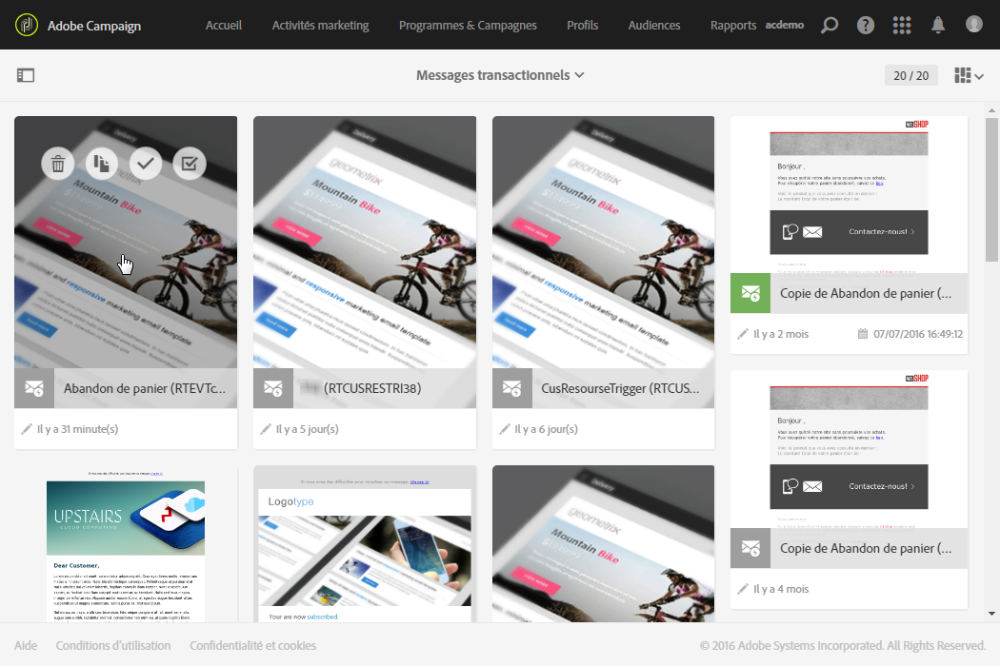

1. Créez un profil de test qui sera lié à votre événement.

   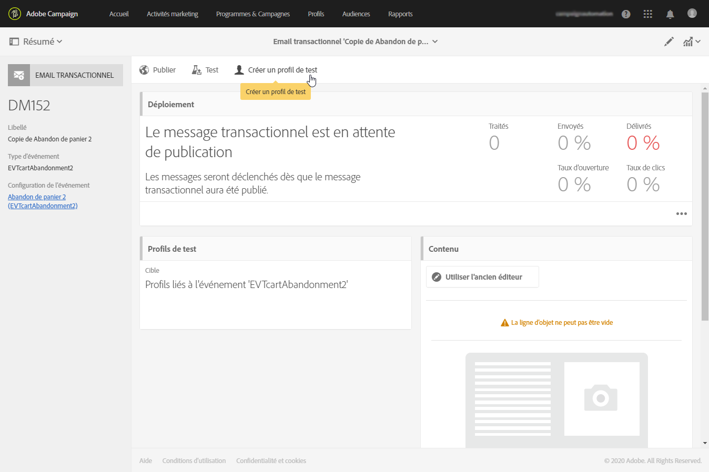

1. Indiquez les informations à transmettre au format JSON dans la section **[!UICONTROL Données de l'événement utilisées pour la personnalisation]**. C'est le contenu qui sera utilisé lors de la prévisualisation du message et que recevra le profil de test à l'envoi du BAT.

   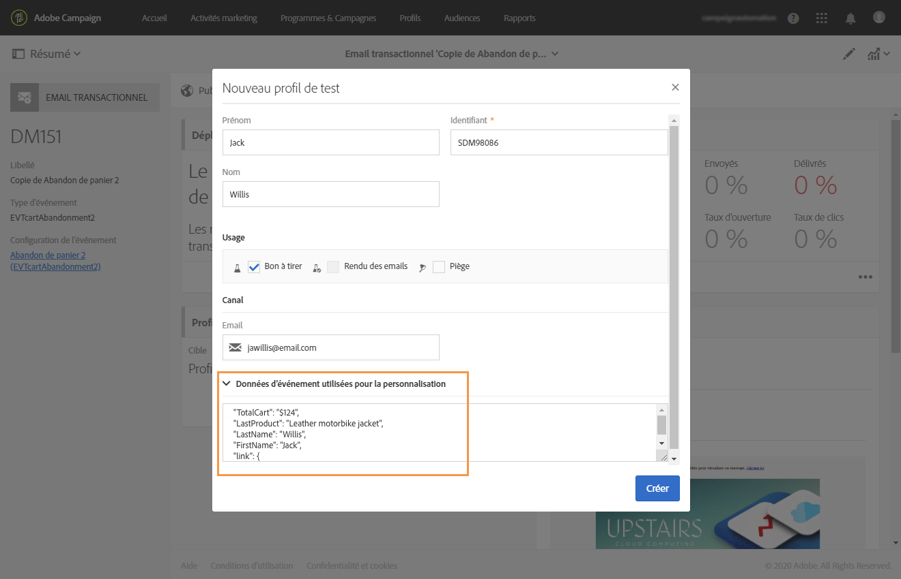

   >[!NOTE]
   >
   >Vous pouvez également saisir les informations associées à la table des profils. Voir [Enrichir le contenu d'un message transactionnel](../../administration/using/configuring-transactional-messaging.md#enriching-the-transactional-message-content).

1. Une fois créé, le profil de test est pré-renseigné dans le message transactionnel. Cliquez sur le bloc **[!UICONTROL Profils de test]** du message pour vérifier la cible de votre BAT.

   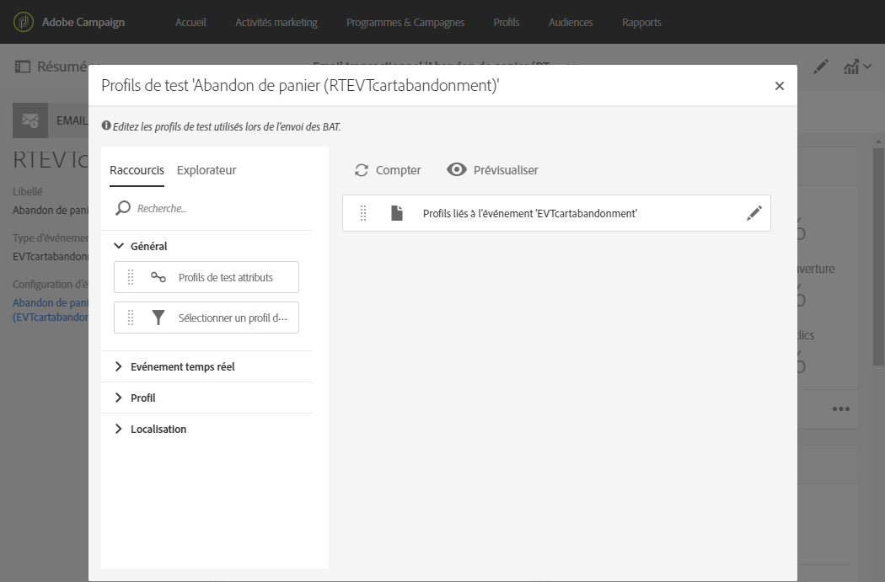

### Créer un profil de test en dehors du message transactionnel {#creating-a-test-profile-outside-the-transactional-----------message}

Vous pouvez également créer un profil de test ou en utiliser un existant depuis le menu **[!UICONTROL Profils de test]**.

1. Cliquez sur le logo **[!UICONTROL Adobe Campaign]**, en haut à gauche, puis sélectionnez **[!UICONTROL Profils &amp; audiences]** &gt; **[!UICONTROL Profils de test]**.
1. Dans la section **[!UICONTROL Evénement]** de la page du profil de test de votre choix, sélectionnez l'événement que vous avez créé. Dans cet exemple, choisissez "Abandon de panier (EVTcartAbandonment)".
1. Indiquez les informations à transmettre au format JSON dans la zone de texte **[!UICONTROL Données de l'événement]**.

   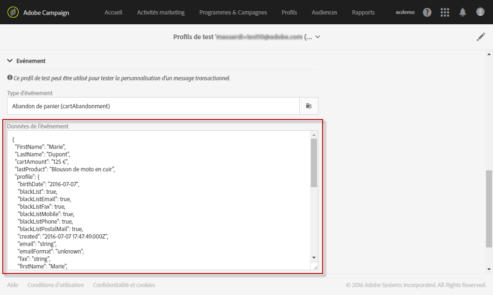

1. Enregistrez vos modifications.

Vous pouvez maintenant accéder au message que vous avez créé et sélectionner le profil de test mis à jour.

**Rubriques connexes :**

* [Gestion des profils de test](../../sending/using/managing-test-profiles-and-sending-proofs.md)
* [Définir les audiences](../../audiences/using/creating-audiences.md)

## Personnaliser un message transactionnel   {#personalizing-a-transactional-message}

Pour configurer la personnalisation dans un message transactionnel, procédez comme suit :

1. Cliquez sur le bloc **[!UICONTROL Contenu]** pour modifier l'objet et le contenu de votre message. Pour cet exemple, importez un modèle HTML contenant les images, la feuille de style et un fichier HTML. L'import de modèles HTML est présenté dans la section [Charger un contenu existant](../../designing/using/selecting-an-existing-content.md).

   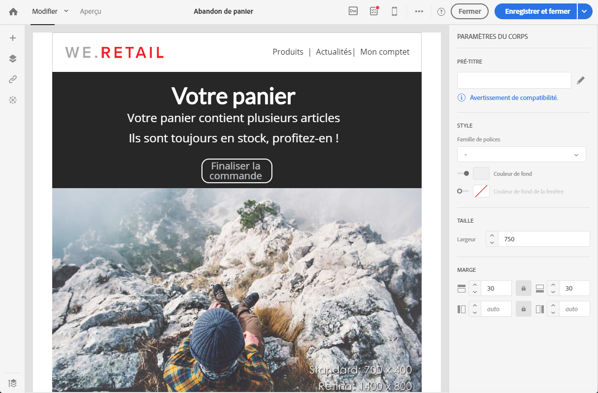

1. Saisissez le contenu de votre message. Dans cet exemple, nous avons ajouté trois champs de personnalisation : le nom, le dernier produit consulté et le montant total du panier. Le lien vers le panier abandonné est un lien vers une URL externe qui redirigera la personne sur son panier. Ce paramétrage n'est pas géré dans Adobe Campaign.

   Pour ajouter les champs que vous avez définis lorsque vous avez créé votre événement (voir [Configuration d'un événement](../../administration/using/configuring-transactional-messaging.md#use-case--configuring-an-event-to-send-a-transactional-message)), insérez un champ de personnalisation dans le contenu du message. Pour retrouver les champs, sélectionnez **[!UICONTROL Evénement transactionnel]** &gt; **[!UICONTROL Contexte de l'événement]**.

   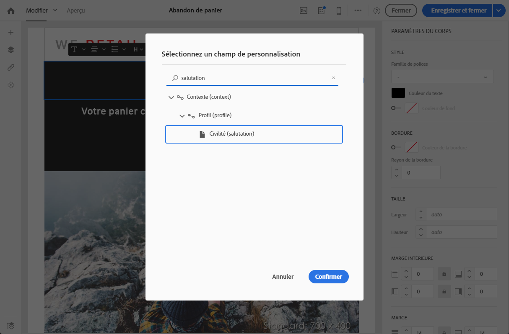

1. Pour enrichir le contenu de votre message, ajoutez les champs de votre choix en les sélectionnant dans la table à laquelle vous avez lié votre événement. Dans notre exemple, sélectionnez le champ **[!UICONTROL Title (salutation)]** dans la table **[!UICONTROL Profile]**.

   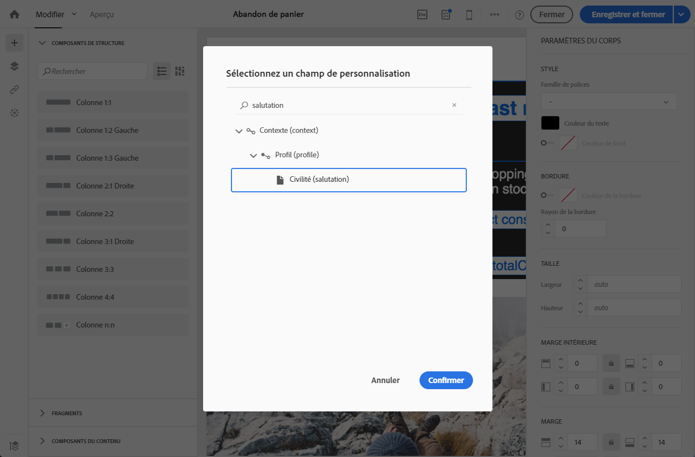

   Les étapes d'insertion d'un champ de personnalisation sont présentées dans la section [Insertion d'un champ de personnalisation](../../designing/using/inserting-a-personalization-field.md).

   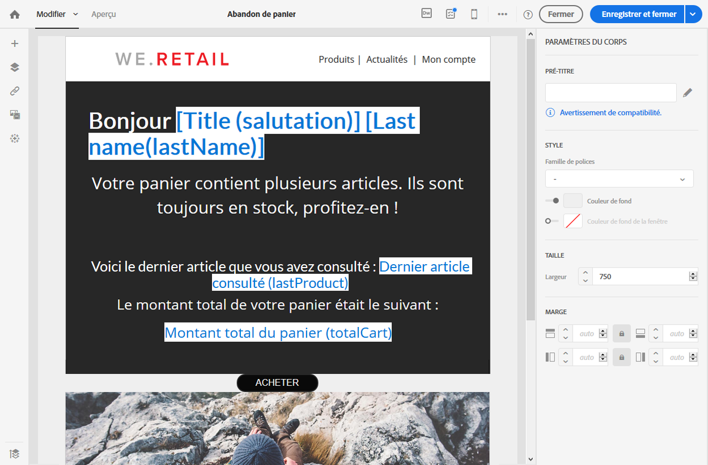

1. Prévisualisez votre message en sélectionnant le profil que vous avez défini pour cet événement.

   Les étapes de prévisualisation d'un message sont présentées dans la section [Prévisualiser le message](../../sending/using/preparing-the-send.md).

   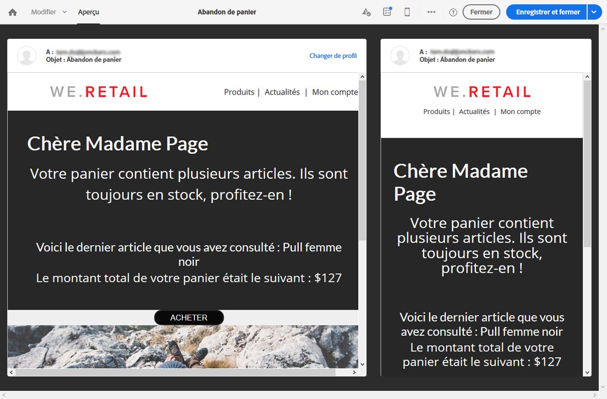

   Vous constatez que les champs de personnalisation correspondent bien aux informations saisies dans le profil de test. Voir à ce sujet [Définir un profil de test dans un message transactionnel](../../channels/using/event-transactional-messages.md#defining-a-test-profile-in-a-transactional-message).

## Utiliser des listes de produits dans un message transactionnel   {#using-product-listings-in-a-transactional-message}

Vous pouvez créer des listes de produits référençant une ou plusieurs collections de données dans un email transactionnel. Par exemple, dans un email d'abandon de panier, vous pouvez inclure la liste de tous les produits figurant dans le panier de l'utilisateur au moment où il a quitté le site web, avec une image, le prix et un lien vers chaque produit.

>[!CAUTION]
>
>Les listes de produits ne sont disponibles que lorsque vous éditez des emails transactionnels via l'interface du [Concepteur d'email](../../designing/using/about-email-content-design.md#about-the-email-designer).

Pour ajouter une liste de produits abandonnés dans un message transactionnel, suivez les étapes ci-dessous.

Vous pouvez également regarder une série de vidéos expliquant les étapes nécessaires à la configuration de listes de produits dans un email transactionnel. Voir à ce propos [cette page](https://helpx.adobe.com/fr/campaign/kt/acs/using/acs-product-listings-in-transactional-emails-feature-video-setup.html).

>[!NOTE]
>
>Adobe Campaign ne prend pas en charge les listes de produits imbriquées, ce qui signifie que vous ne pouvez pas inclure une liste de produits dans une autre.

### Définir une liste de produits   {#defining-a-product-listing}

Avant de pouvoir utiliser une liste de produits dans un message transactionnel, vous devez définir au niveau de l'événement la liste des produits et les champs de chaque produit de la liste que vous souhaitez afficher. Voir à ce propos la section [Définir des collections de données](../../administration/using/configuring-transactional-messaging.md#defining-data-collections).

1. Dans le message transactionnel, cliquez sur le bloc **[!UICONTROL Contenu]** pour modifier le contenu de l'email.
1. Placez un composant de structure dans l'espace de travail. Voir à ce propos la section [Editer la structure de l'email](../../designing/using/defining-the-email-structure.md#editing-the-email-structure).

   Par exemple, sélectionnez un composant de structure à une colonne et ajoutez un composant de texte, un composant d'image et un composant de bouton. Voir à ce propos la section [Ajouter des fragments et des composants de contenu](../../designing/using/defining-the-email-structure.md#adding-fragments-and-content-components).

1. Sélectionnez le composant de structure que vous venez de créer et cliquez sur l'icône **[!UICONTROL Activer la liste de produits]** dans la barre d'outils contextuelle.

   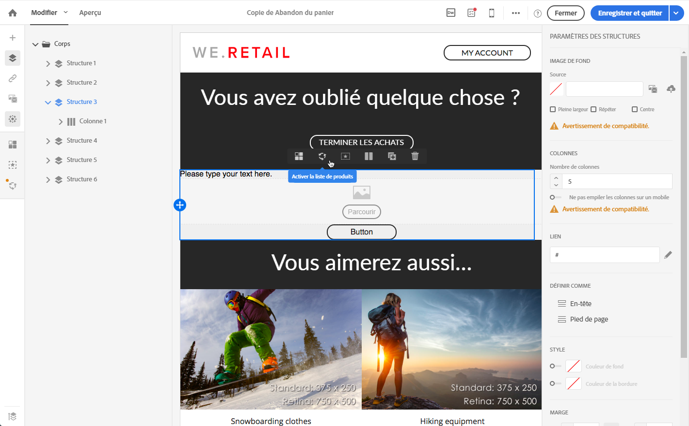

   Le composant de structure est mis en surbrillance avec un cadre orange et les paramètres de **[!UICONTROL Liste de produits]** sont affichés dans la palette gauche.

   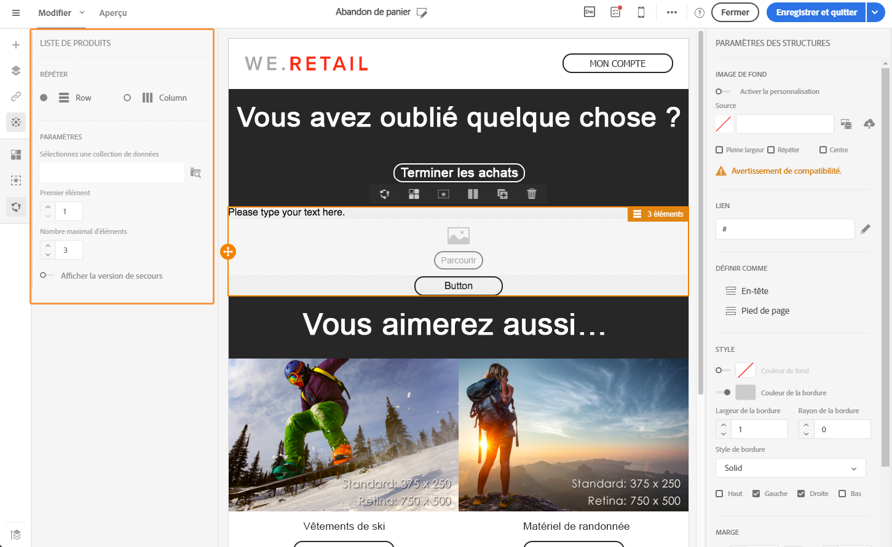

1. Sélectionnez l'affichage des éléments de la collection :

   * **[!UICONTROL Ligne]** : horizontalement, c'est-à-dire que chaque élément se trouve sur une ligne.
   * **[!UICONTROL Colonne]** : verticalement, c'est-à-dire que les éléments sont côte à côte sur une même ligne.
   >[!NOTE]
   >
   >L'option **[!UICONTROL Colonne]** n'est disponible que lorsque vous utilisez un composant de structure multicolonne (**[!UICONTROL Colonne 2:2]**, **[!UICONTROL Colonne 3:3]** et **[!UICONTROL Colonne 4:4]**). Lors de l'édition de la liste de produits, ne remplissez que la première colonne. Les autres colonnes ne seront pas prises en compte. Pour plus d'informations sur la sélection de composants de structure, consultez la section [Editer la structure de l'email](../../designing/using/defining-the-email-structure.md#editing-the-email-structure).

1. Sélectionnez la collection de données que vous avez créée lors de la configuration de l'événement associé au message transactionnel. Elle se trouve sous le nœud **[!UICONTROL Contexte]** &gt; **[!UICONTROL Evénement temps réel]** &gt; **[!UICONTROL Contexte de l'événement]**.

   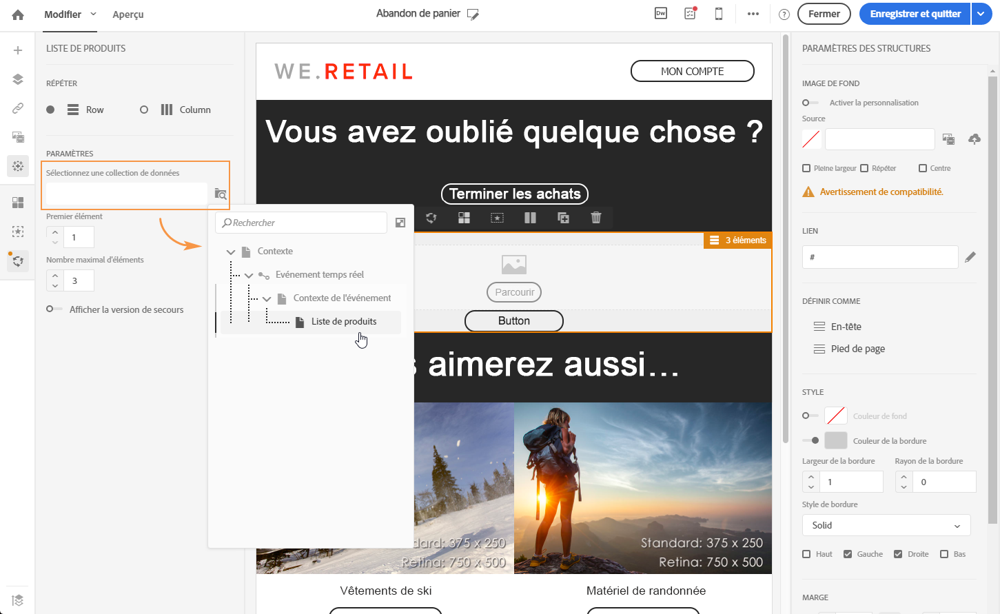

   Pour plus d'informations sur la configuration de l'événement, consultez la section [Définir des collections de données](../../administration/using/configuring-transactional-messaging.md#defining-data-collections).

1. Utilisez la liste déroulante **[!UICONTROL Premier élément]** pour sélectionner l'élément qui sera au début de la liste affichée dans l'email.

   Par exemple, si vous sélectionnez 2, le premier élément de la collection ne sera pas affiché dans l'email. La liste de produits commencera sur le deuxième élément.

1. Sélectionnez le nombre maximal d'éléments à afficher dans la liste.

   >[!NOTE]
   >
   >Si vous souhaitez que les éléments de votre liste s'affichent verticalement (**[!UICONTROL Colonne]**), le nombre maximal d'éléments est limité en fonction du composant de structure sélectionné (2, 3 ou 4 colonnes). Pour plus d'informations sur la sélection de composants de structure, consultez la section [Editer la structure de l'email](../../designing/using/defining-the-email-structure.md#editing-the-email-structure).

### Remplir la liste de produits   {#populating-the-product-listing}

Pour afficher une liste des produits provenant de l'événement associé à l'email transactionnel, suivez les étapes ci-dessous.

Pour plus d'informations sur la création d'une collection et de champs associés lors de la configuration de l'événement, consultez la section [Définir des collections de données](../../administration/using/configuring-transactional-messaging.md#defining-data-collections).

1. Choisissez le composant d'image que vous avez inséré, sélectionnez **[!UICONTROL Activer la personnalisation]** et cliquez sur le crayon dans le volet Paramètres.

   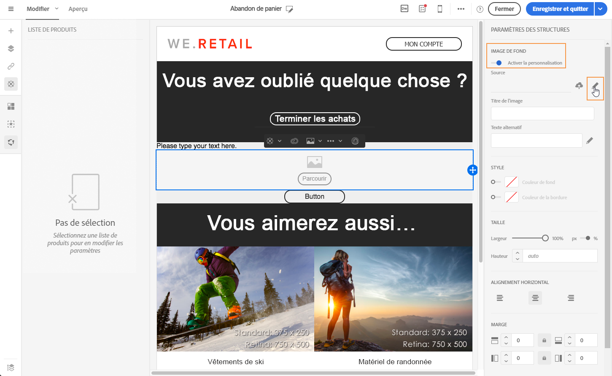

1. Sélectionnez **[!UICONTROL Ajouter un champ de personnalisation]** dans la fenêtre **[!UICONTROL URL de la source de l'image]** qui s'affiche.

   Dans le nœud **[!UICONTROL Contexte]** &gt; **[!UICONTROL Evénement temps réel]** &gt; **[!UICONTROL Contexte de l'événement]**, ouvrez le nœud correspondant à la collection que vous avez créée (ici **[!UICONTROL Liste des produits]**) et sélectionnez le champ d'image que vous avez défini (ici **[!UICONTROL Image du produit]**). Cliquez sur **[!UICONTROL Enregistrer]**.

   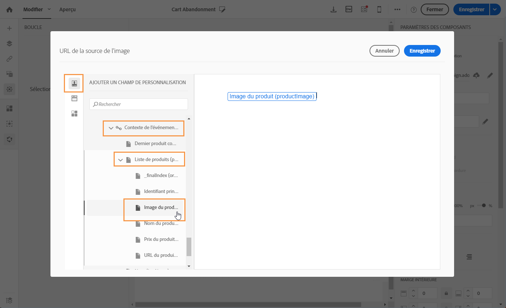

   Le champ de personnalisation que vous avez sélectionné est maintenant affiché dans le volet Paramètres.

1. A l'emplacement désiré, sélectionnez **[!UICONTROL Insérer un champ de personnalisation]** dans la barre d'outils contextuelle.

   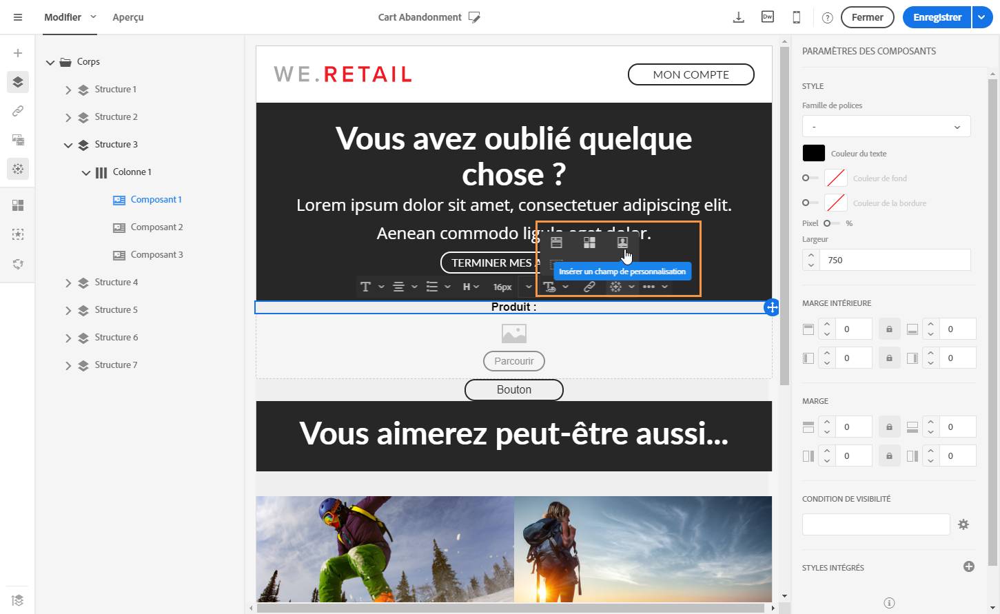

1. Dans le nœud **[!UICONTROL Contexte]** &gt; **[!UICONTROL Evénement temps réel]** &gt; **[!UICONTROL Contexte de l'événement]**, ouvrez le nœud correspondant à la collection que vous avez créée (ici **[!UICONTROL Liste des produits]**) et sélectionnez le champ que vous avez créé (ici **[!UICONTROL Nom du produit]**). Cliquez sur **[!UICONTROL Confirmer]**.

   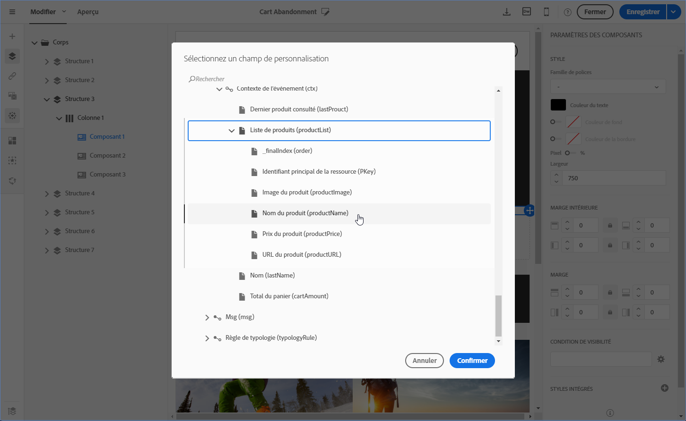

   Le champ de personnalisation que vous avez sélectionné est maintenant affiché à l'emplacement voulu dans le contenu de l'email.

1. Procédez de la même manière pour insérer le prix.
1. Sélectionnez du texte et cliquez sur **[!UICONTROL Ajouter un lien]** dans la barre d'outils contextuelle.

   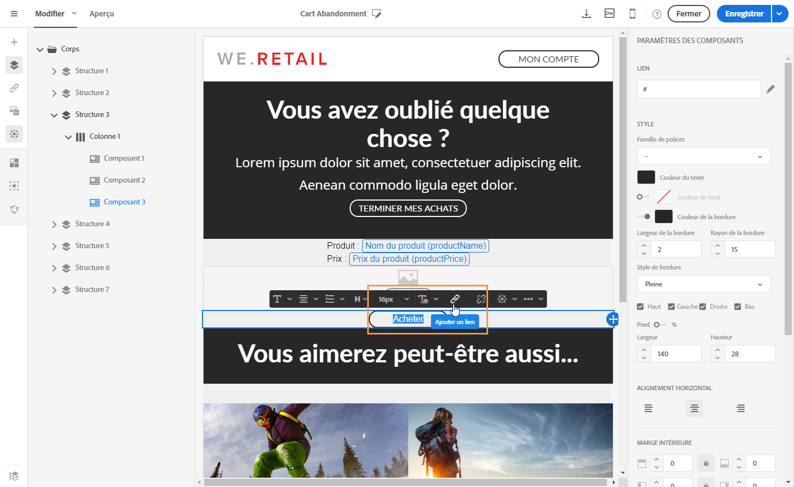

1. Sélectionnez **[!UICONTROL Ajouter un champ de personnalisation]** dans la fenêtre **[!UICONTROL Ajouter un lien]** qui s'affiche.

   Dans le nœud **[!UICONTROL Contexte]** &gt; **[!UICONTROL Evénement temps réel]** &gt; **[!UICONTROL Contexte de l'événement]**, ouvrez le nœud correspondant à la collection que vous avez créée (ici **[!UICONTROL Liste des produits]**) et sélectionnez le champ d'URL que vous avez créé (ici **[!UICONTROL URL du produit]**). Cliquez sur **[!UICONTROL Enregistrer]**.

   >[!CAUTION]
   >
   >Pour des raisons de sécurité, veillez à insérer le champ de personnalisation dans un lien commençant par un nom de domaine statique approprié.

   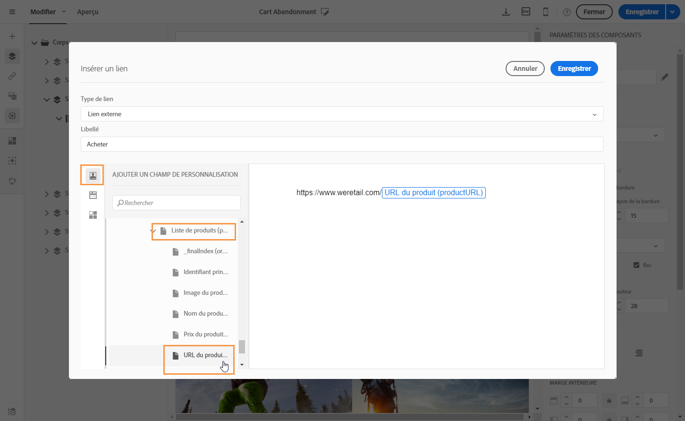

   Le champ de personnalisation que vous avez sélectionné est maintenant affiché dans le volet Paramètres.

1. Choisissez le composant de structure sur lequel la liste de produits est appliquée et sélectionnez **[!UICONTROL Afficher la version de secours]** pour définir un contenu par défaut.

   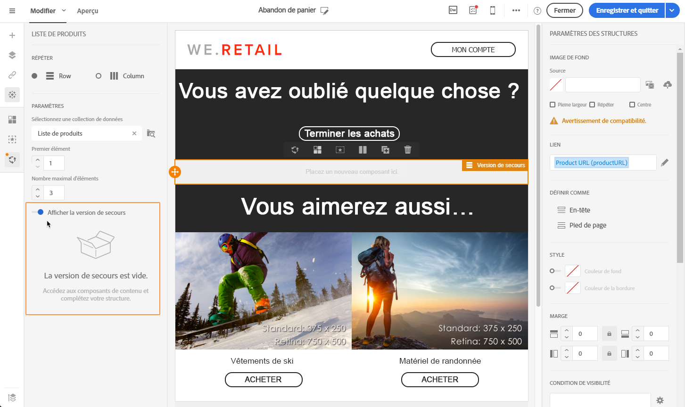

1. Faites glisser un ou plusieurs composants de contenu et éditez-les si nécessaire.

   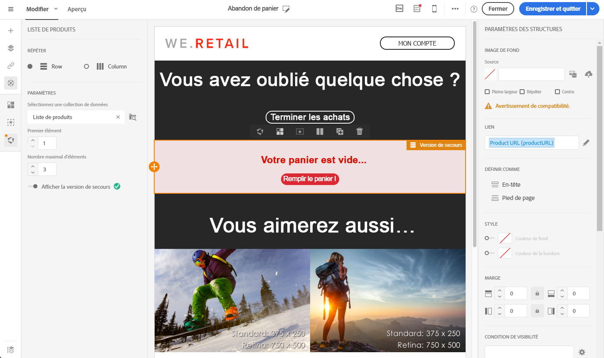

   Le contenu de remplacement sera affiché si la collection est vide lorsque l'événement est déclenché, par exemple lorsqu'un client ne possède aucun produit dans son panier.

1. Dans le volet Paramètres, éditez les styles de la liste de produits. Voir à ce propos la section [Editer les styles d'un email](../../designing/using/editing-email-styles.md).
1. Prévisualisez l'email en utilisant un profil de test associé à l'événement transactionnel adéquat et pour lequel vous avez défini des données de collection. Par exemple, ajoutez les informations suivantes dans la section **[!UICONTROL Données de l'événement]** pour le profil de test que vous souhaitez utiliser :

   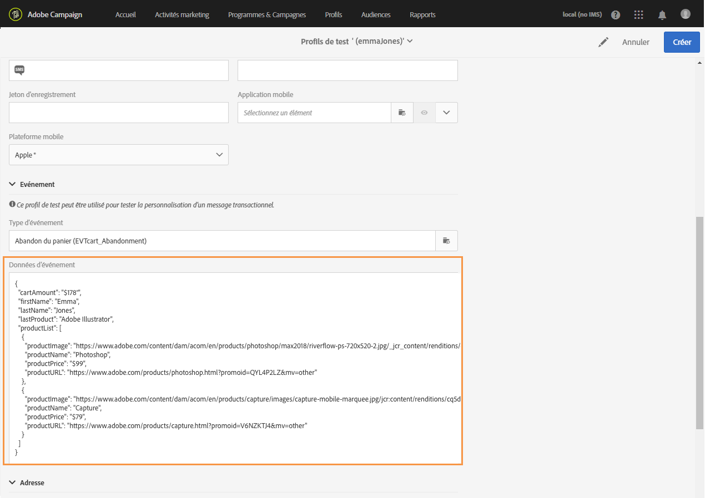

   Pour plus d'informations sur la définition d'un profil de test dans un message transactionnel, consultez [cette section](../../channels/using/event-transactional-messages.md#defining-a-test-profile-in-a-transactional-message).

## Tester un message transactionnel {#testing-a-transactional-message}

Après avoir enregistré votre message transactionnel, vous pouvez envoyer un bon à tirer (BAT) pour le tester.

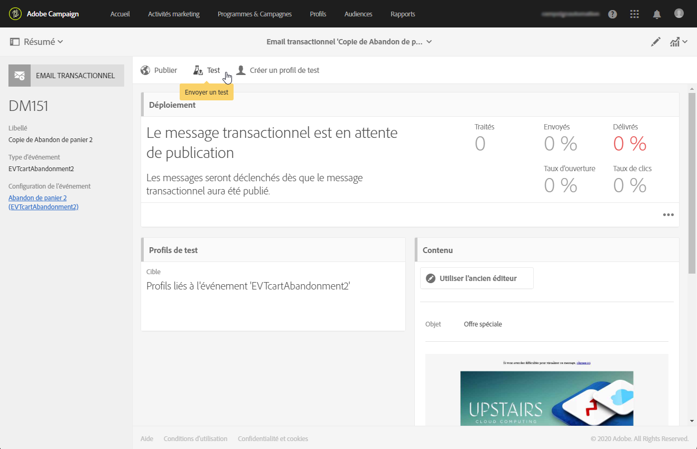

Les étapes d'envoi d'un BAT sont présentées dans la section [Envoyer un bon à tirer](../../sending/using/managing-test-profiles-and-sending-proofs.md#sending-proofs).

## Publier un message transactionnel   {#publishing-a-transactional-message}

Une fois que vous avez validé le message transactionnel, vous pouvez le publier.

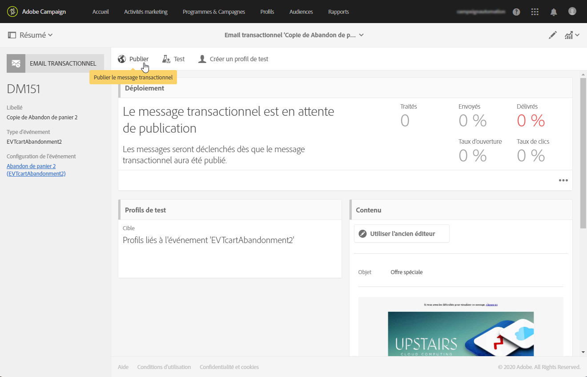

A présent, dès que l'événement "Abandon de panier" est déclenché, il entraîne automatiquement l'envoi d'un message contenant la civilité et le nom du destinataire, l'URL du panier, le dernier produit consulté ou la liste des produits si vous avez défini une liste de produits et le montant total du panier.

Pour accéder aux rapports relatifs à votre message transactionnel, utilisez le bouton **[!UICONTROL Rapports]**. Voir [Rapports](../../reporting/using/about-dynamic-reports.md).

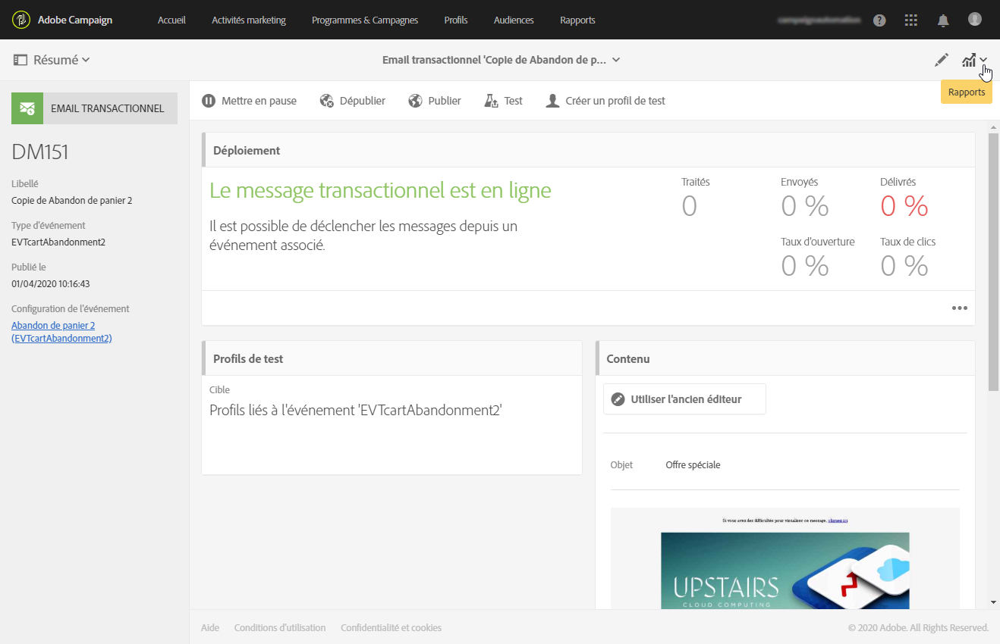

## Suspendre la publication d'un message transactionnel   {#suspending-a-transactional-message-publication}

Vous pouvez suspendre la publication de votre message transactionnel en utilisant le bouton **[!UICONTROL Mettre en pause]**, afin de modifier les données contenues dans le message par exemple. Les événements ne sont alors plus traités, mais ils sont conservés dans une file d'attente, dans la base de données Adobe Campaign.

Les événements placés dans la file d'attente sont conservés pendant une période définie dans l'API REST (voir la [documentation sur l'API REST](https://docs.campaign.adobe.com/doc/standard/en/api/ACS_API.html)) ou dans l'événement trigger si vous utilisez le core service Triggers (voir [Utilisation de Campaign et des triggers Experience Cloud](../../integrating/using/about-adobe-experience-cloud-triggers.md)).

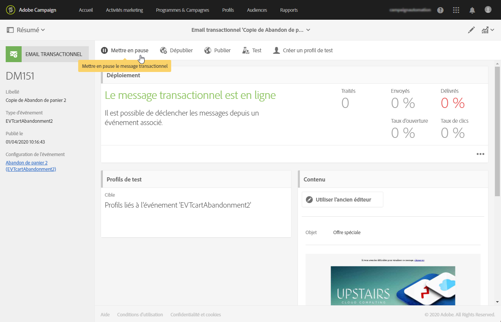

Lorsque vous cliquez sur **[!UICONTROL Reprendre]**, tous les événements placés dans la file d'attente sont envoyés (à condition qu'ils n'aient pas expiré). Ils contiennent alors les modifications effectuées tant que la publication du modèle était suspendue.

## Dépublier un message transactionnel   {#unpublishing-a-transactional-message}

Cliquez sur **[!UICONTROL Dépublier]** pour annuler la publication du message transactionnel. L'événement correspondant est également dépublié, ce qui supprime de l'API REST la ressource correspondant à l'événement précédemment créé. Désormais, même si l'événement est déclenché via votre site web, les messages correspondants ne sont plus envoyés et ils ne sont pas stockés dans la base de données.

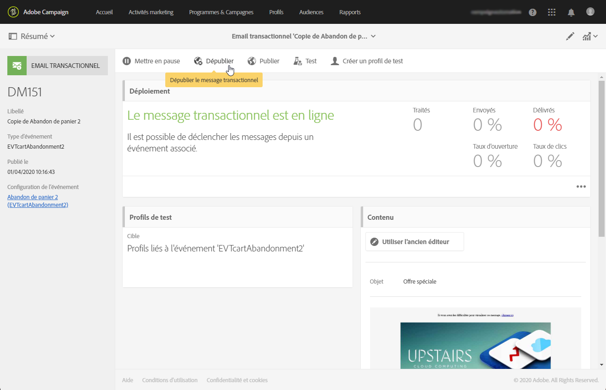

>[!NOTE]
>
>Pour publier de nouveau le message, revenez d'abord à la configuration de l'événement correspondant et publiez-le. Vous pouvez alors republier votre message. Voir à ce propos la section [Publier un message transactionnel](../../channels/using/event-transactional-messages.md#publishing-a-transactional-message).

Si vous dépubliez un message transactionnel mis en pause, vous devrez attendre jusqu'à 24 heures avant de pouvoir le republier. Ce délai permet au workflow **[!UICONTROL Nettoyage de la base]** de nettoyer tous les événements qui ont été envoyés dans la file d'attente. Les étapes de mise en pause d'un message sont présentées dans la section [Suspendre la publication d'un message transactionnel](../../channels/using/event-transactional-messages.md#suspending-a-transactional-message-publication).

Le workflow **[!UICONTROL Nettoyage de la base]**, qui s'exécute tous les jours à 4h00, est accessible via **[!UICONTROL Administration]** &gt; **[!UICONTROL Paramétrage de l'application]** &gt; **[!UICONTROL Workflows]**.

## Supprimer un message transactionnel {#deleting-a-transactional-message}

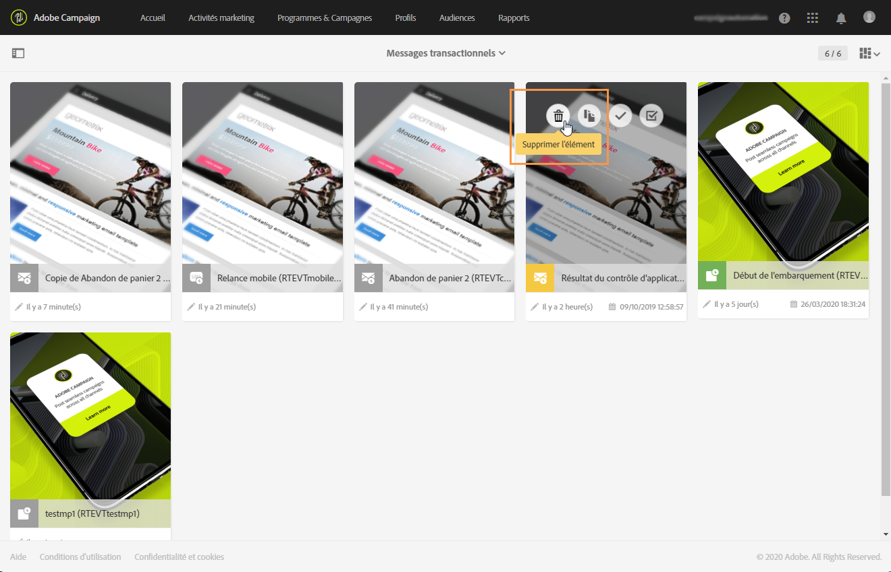

En sélectionnant un message transactionnel, vous pouvez le supprimer à l'aide du bouton **[!UICONTROL Supprimer l'élément]** même s'il a déjà été publié. La suppression d'un message transactionnel ne peut toutefois être effectuée que sous certaines conditions :

* **Messages transactionnels** : pour supprimer un message transactionnel, ce message doit être dépublié et ne pas être en pause.

   Si le message transactionnel est dépublié, la configuration de l'événement doit également être dépubliée pour supprimer votre message transactionnel, sauf si un autre message transactionnel est lié à l'événement correspondant. Pour plus d'informations sur la dépublication d'un message transactionnel, consultez cette [section](../../channels/using/event-transactional-messages.md#unpublishing-a-transactional-message).

   >[!CAUTION]
   >
   >La suppression d'un message transactionnel ayant déjà envoyé des notifications entraîne celle de ses logs d'envoi et du tracking.

* **Messages transactionnels d'un modèle d'événement d'usine (messages transactionnels internes)** : pour supprimer un message transactionnel interne, ce message doit être dépublié et ne pas être en pause.

   Il ne doit pas également être le seul message transactionnel dans l'événement. D'autres messages doivent être associés à l'événement correspondant.

## Processus de reprise d'un message transactionnel   {#transactional-message-retry-process}

Un message transactionnel temporairement non diffusé fait l'objet de reprises automatiques jusqu'à l'expiration de la diffusion. Pour plus d'informations sur la durée de diffusion, voir [Paramètres de période de validité](../../administration/using/configuring-email-channel.md#validity-period-parameters).

En cas d'échec de l'envoi d'un message transactionnel, il existe deux systèmes de reprise :

* Au niveau des messages transactionnels, un message transactionnel peut échouer avant que l'événement ne soit assigné à une diffusion d'exécution, c'est-à-dire entre la réception de l'événement et la préparation de la diffusion. Voir [Processus de reprise du traitement d'un événement](../../channels/using/event-transactional-messages.md#event-processing-retry-process).
* Au niveau du processus d'envoi, une fois l'événement assigné à une diffusion d'exécution, le message transactionnel peut échouer en raison d'une erreur temporaire. Voir [Processus de reprise de l'envoi d'un message](../../channels/using/event-transactional-messages.md#message-sending-retry-process).

### Processus de reprise du traitement d'un événement   {#event-processing-retry-process}

Si l'événement ne peut pas être assigné à une diffusion d'exécution, son traitement est reporté. Des reprises sont ensuite effectuées jusqu'à ce qu'il soit assigné à une nouvelle diffusion d'exécution.

>[!NOTE]
>
>Un événement reporté n'apparaît pas dans les logs d'envoi de messages transactionnels, car il n'est pas encore assigné à une diffusion d'exécution.

Par exemple, l'événement ne pourrait pas être assigné à une diffusion d'exécution, en raison d'un contenu incorrect, d'un problème de droits d'accès ou de branding, d'une erreur détectée lors de l'application des règles de typologie, etc. Dans ce cas, vous pouvez mettre le message en pause, l'éditer pour résoudre le problème et le publier à nouveau. Le système de reprise l'assignera ensuite à une nouvelle diffusion d'exécution.

### Processus de reprise de l'envoi d'un message   {#message-sending-retry-process}

Une fois que l'événement a été assigné à une diffusion d'exécution, le message transactionnel peut échouer en raison d'une erreur temporaire, par exemple si la boîte du destinataire est pleine. Voir à ce propos [Reprises après un échec temporaire de diffusion](../../sending/using/understanding-delivery-failures.md#retries-after-a-delivery-temporary-failure).

>[!NOTE]
>
>Lorsqu'un événement est assigné à une diffusion d'exécution, il apparaît dans les logs d'envoi de cette diffusion d'exécution, et uniquement à ce moment. Les diffusions en échec sont affichées dans l'onglet **[!UICONTROL Liste des exécutions]** du message transactionnel.

### Limitations {#limitations}

**Mise à jour des logs d'envoi**

Dans le processus de reprise, les logs d'envoi de la nouvelle diffusion d'exécution ne sont pas immédiatement mis à jour (la mise à jour est réalisée via un workflow planifié). Cela signifie que le message peut être à l'état **[!UICONTROL En attente]**, même si l'événement transactionnel a été traité par la nouvelle diffusion d'exécution.

**Diffusion d'exécution en échec**

Vous ne pouvez pas arrêter une diffusion d'exécution. Cependant, si la diffusion d'exécution actuelle échoue, une nouvelle est créée dès qu'un nouvel événement est reçu, et tous les nouveaux événements sont traités par cette nouvelle diffusion d'exécution. Aucun nouvel événement n'est traité par la diffusion d'exécution en échec.

Si certains événements déjà assignés à une diffusion d'exécution ont été reportés et si cette diffusion d'exécution échoue, le système de reprise n'assigne pas les événements reportés à la nouvelle diffusion d'exécution, ce qui signifie que ces événements sont perdus.
