# Messages de relance {#follow-up-messages}

Un message de suivi est un modèle de diffusion marketing prédéfini qui peut être utilisé dans un processus pour envoyer une autre communication aux destinataires d’un message transactionnel spécifique.

Reprenons l&#39;exemple présenté dans la section [Principe de fonctionnement des messages transactionnels](../../channels/using/getting-started-with-transactional-msg.md#transactional-messaging-operating-principle) : un email d&#39;abandon de panier est envoyé aux visiteurs de votre site Web ayant ajouté des produits dans leur panier, mais ayant quitté le site sans poursuivre leurs achats.

Vous souhaitez envoyer un rappel convivial à tous les clients qui ont reçu la notification d&#39;abandon de panier mais qui ne l&#39;ont pas ouverte au bout de trois jours. Ils recevront un message de suivi basé sur les mêmes données que celles utilisées dans le premier courrier électronique envoyé.

## Configuration d’un événement pour envoyer un message de relance      {#configuring-an-event-to-send-a-follow-up-message}

Pour envoyer un message de suivi, vous devez d’abord configurer en conséquence le événement correspondant au message transactionnel déjà reçu.

1. Utilisez la même configuration d’événement que celle que vous avez créée pour envoyer un message transactionnel basé sur un événement. Voir [Configuration d&#39;un événement transactionnel](../../channels/using/configuring-transactional-event.md).
1. Lors de la configuration de l’événement, cochez la case **[!UICONTROL Créer un modèle de diffusion de relance pour cet événement]** avant de le publier.

   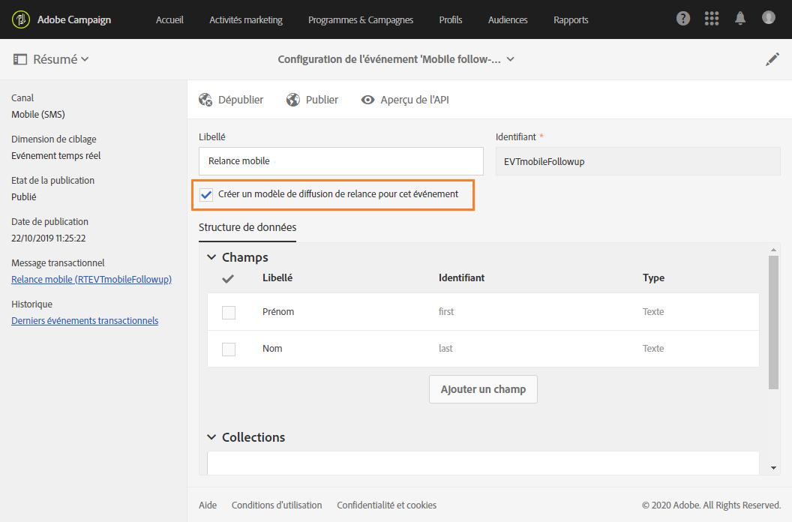

1. [Prévisualisation et publication du événement](../../channels/using/publishing-transactional-event.md#previewing-and-publishing-the-event).

Une fois la publication effectuée, un message transactionnel et un modèle de diffusion de relance associés au nouvel événement sont automatiquement créés. Les étapes pour envoyer le message de suivi sont détaillées dans [cette section](#sending-a-follow-up-message).

## Accéder aux messages de relance      {#accessing-the-follow-up-messages}

Pour gérer un événement dans un workflow, un modèle de diffusion est nécessaire. Le [message transactionnel](../../channels/using/editing-transactional-message.md) créé lors de la publication de l&#39;événement ne peut cependant pas être utilisé comme modèle. Vous devez donc créer un modèle de diffusion de relance spécifique qui prend en charge ce type d&#39;événement et qui peut être utilisé comme modèle dans un workflow.

Pour accéder à ce modèle :

1. Cliquez sur le logo **[!UICONTROL Adobe Campaign]**, en haut à gauche.
1. Sélectionnez **[!UICONTROL Ressources]** > **[!UICONTROL Modèles]** > **[!UICONTROL Modèles de diffusion]**.
1. Cochez la case **[!UICONTROL Messages de relance]** dans le volet de gauche.

   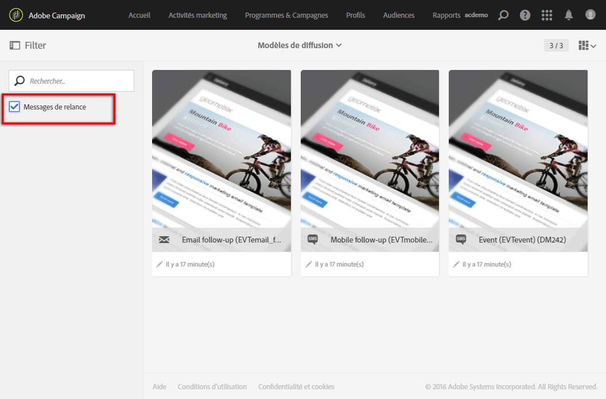

Seuls les messages de relance sont affichés.

>[!IMPORTANT]
>
>Seuls les utilisateurs dotés du rôle [Administration](../../administration/using/users-management.md#functional-administrators) peuvent accéder aux messages transactionnels et les modifier.

## Envoyer un message de relance {#sending-a-follow-up-message}

Une fois que vous avez créé le modèle de diffusion de relance, vous pouvez l&#39;utiliser dans un workflow pour envoyer un message de relance.

<!--You need to set up a workflow targeting the event corresponding to the transactional message that was already received.-->

1. Accédez à la liste des activités marketing et créez un workflow.

   Voir [Création d’un processus](../../automating/using/building-a-workflow.md#creating-a-workflow).

1. Placez une activité **[!UICONTROL Planificateur]** dans le workflow, puis ouvrez-la. Définissez la fréquence d&#39;exécution sur une fois par jour.

   L&#39;activité Planificateur est présentée dans la section [Planificateur](../../automating/using/scheduler.md).

1. Placez une activité **[!UICONTROL Requête]** dans votre workflow, puis ouvrez-la.

   L&#39;activité Requête est présentée dans la section [Requête](../../automating/using/query.md).

1. Pour effectuer la requête sur une autre ressource que celle des profils, accédez à l&#39;onglet **[!UICONTROL Propriétés]** de l&#39;activité et cliquez sur la liste déroulante **[!UICONTROL Ressource]**.

   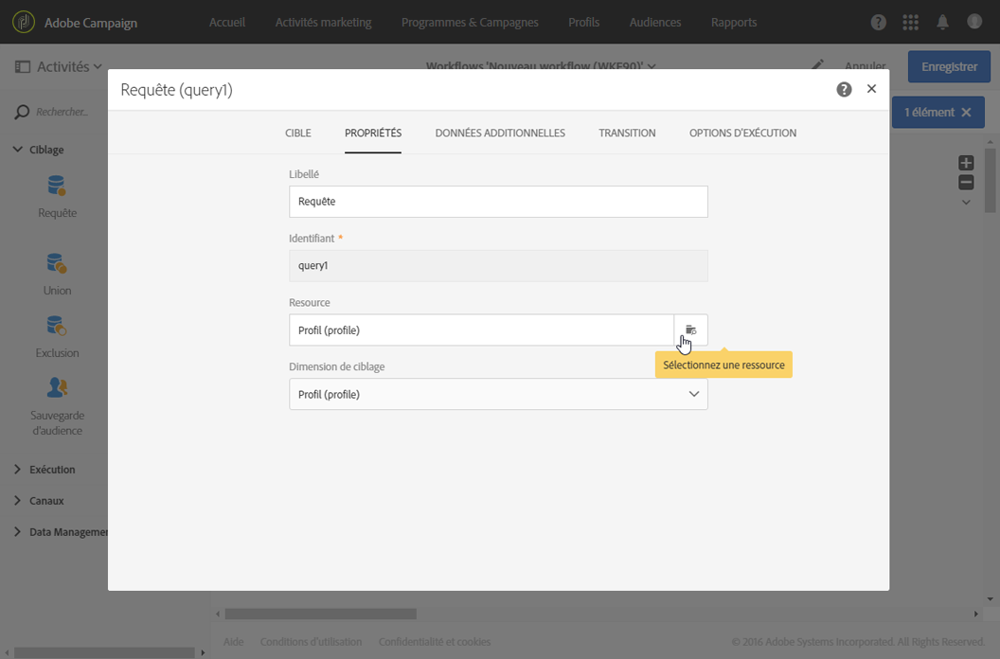

   >[!NOTE]
   >
   >Par défaut, l&#39;activité est pré-paramétrée pour rechercher des profils.

1. Sélectionnez l&#39;événement à cibler. Vous aurez ainsi uniquement accès aux données de cet événement.

   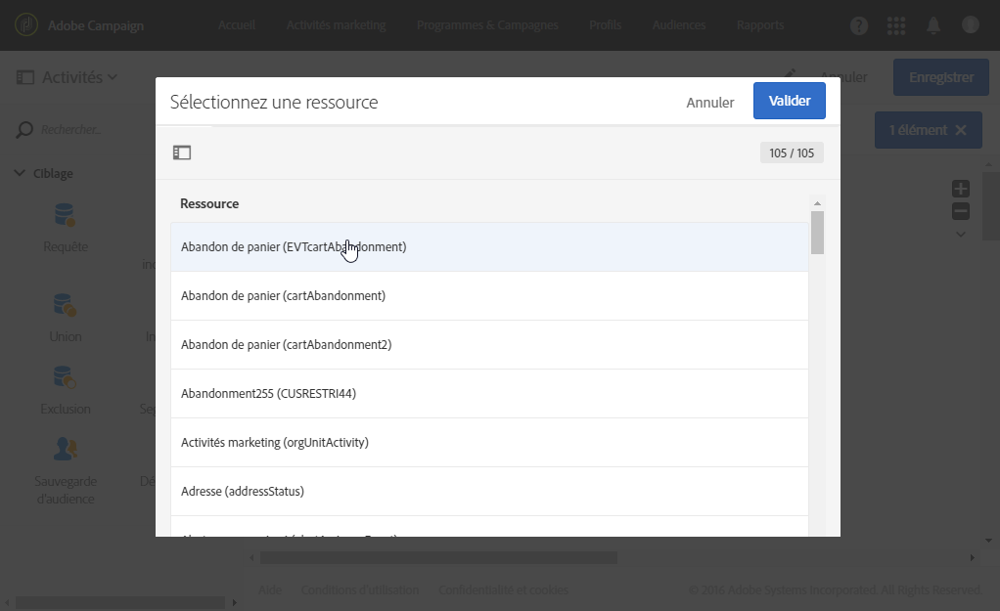

1. Accédez à l’onglet activité **[!UICONTROL Cible]**, puis faites glisser et déposez l’élément **[!UICONTROL Logs de diffusion (journaux)]** de la palette dans l’espace de travail.

   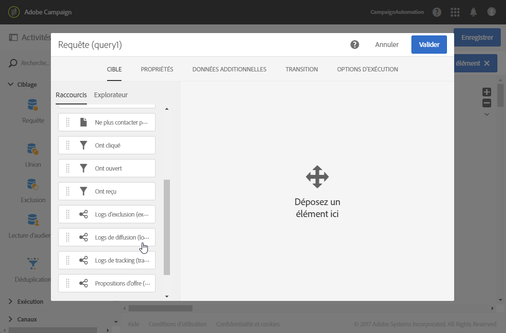

   Sélectionnez **[!UICONTROL Exists]** pour cible à tous les clients qui ont reçu le courrier électronique.

   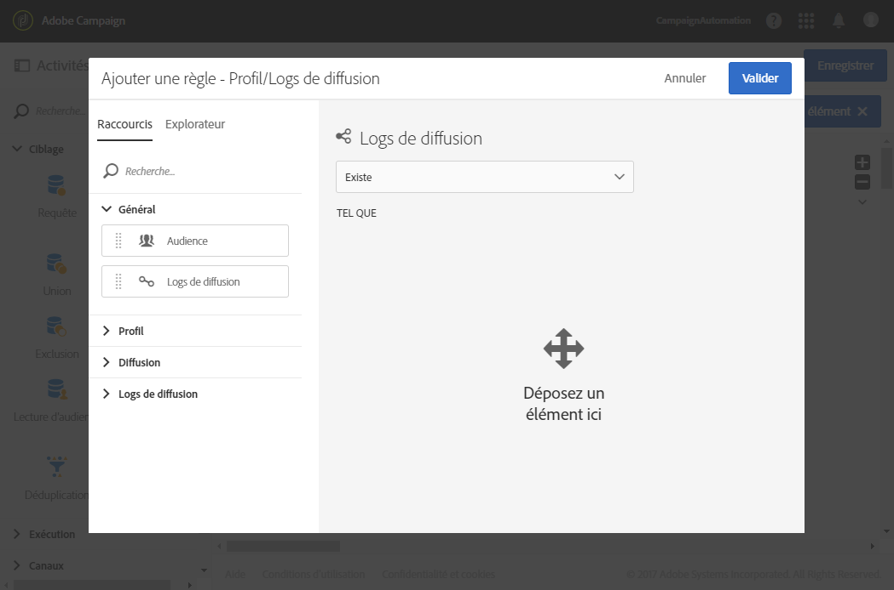

1. Déplacez l’élément **[!UICONTROL Logs de tracking (suivi)]** de la palette vers l’espace de travail et sélectionnez **[!UICONTROL N’existe pas]** pour cible à tous les clients qui n’ont pas ouvert le courrier électronique.

   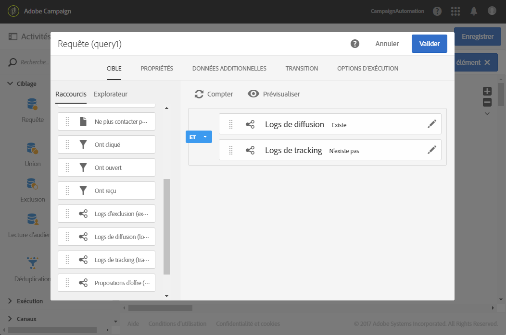

1. Effectuez un glisser-déposer de l’événement que vous ciblez (**Abandon de panier** dans cet exemple) de la palette vers l’espace de travail. Définissez ensuite une règle pour cibler tous les messages envoyés il y a trois jours.

   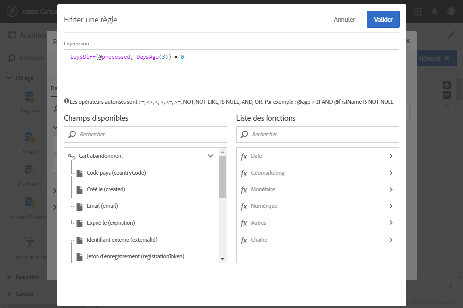

   Tous les destinataires qui ont reçu le message transactionnel trois jours avant l&#39;exécution du workflow et qui ne l&#39;ont pas encore ouvert sont donc ciblés.

   Cliquez sur **[!UICONTROL Confirmer]** pour enregistrer la requête.

1. Placez une activité **Diffusion Email** dans votre workflow.

   L&#39;activité Diffusion Email est présentée dans la section [Diffusion Email](../../automating/using/email-delivery.md).

   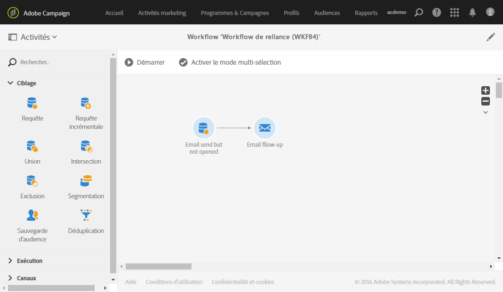

   Vous pouvez également utiliser une diffusion [SMS](../../automating/using/sms-delivery.md) ou une diffusion de notification Push [Push](../../automating/using/push-notification-delivery.md). Dans ce cas, vous devez sélectionner le canal **[!UICONTROL Mobile (SMS)]** ou **[!UICONTROL Application mobile]** lors de la configuration de l&#39;événement. Voir la section [Créer un événement](../../channels/using/configuring-transactional-event.md#creating-an-event).

1. Ouvrez l’activité **Diffusion Email**. Dans l&#39;assistant de création, cochez la case **[!UICONTROL Messages de relance]** et sélectionnez le modèle de diffusion de relance qui a été créé après la publication de l&#39;événement.

   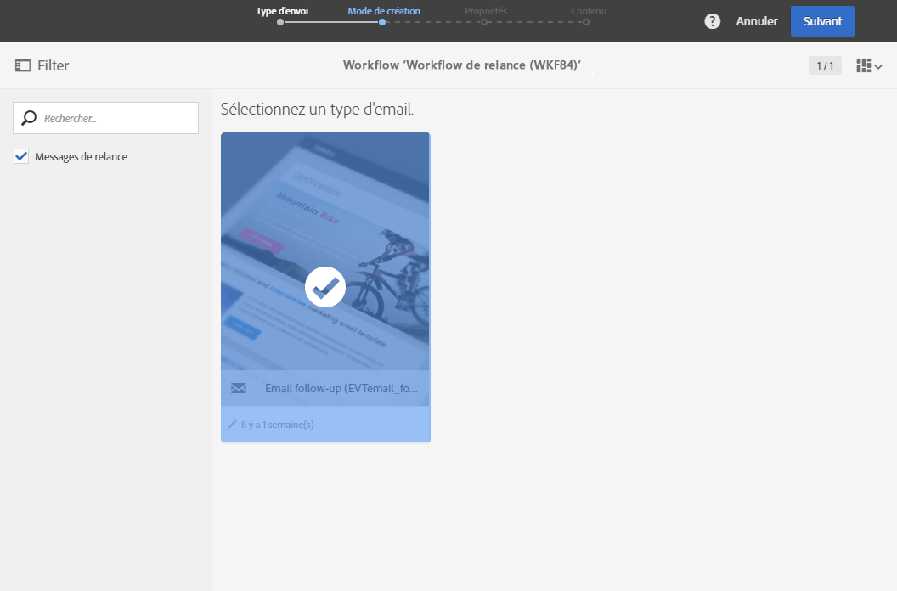

1. Dans le contenu du message de relance, vous pouvez utiliser le contenu de l&#39;événement en ajoutant des champs de personnalisation.

   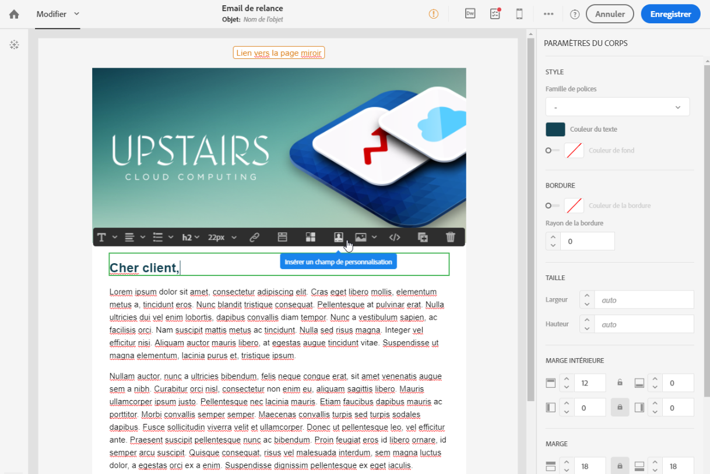

1. Trouvez les champs que vous avez définis lors de la création de votre événement en sélectionnant **[!UICONTROL Contexte]** > **[!UICONTROL Evénement temps réel]** > **[!UICONTROL Contexte de l’événement]**. Voir [Personnaliser un message transactionnel](../../channels/using/editing-transactional-message.md#personalizing-a-transactional-message).

   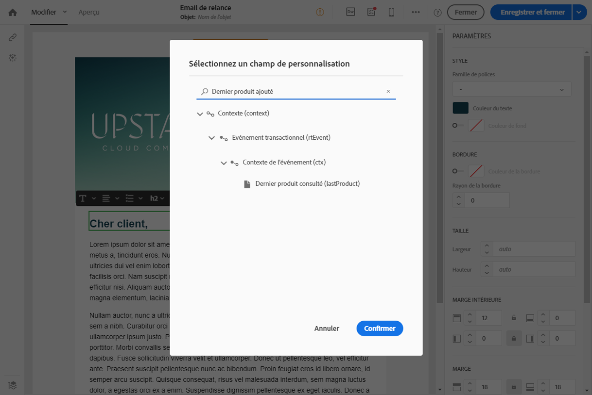

   Ainsi, vous pouvez utiliser le même contenu, notamment les données enrichies, qui a été utilisé lors du premier envoi de l&#39;événement, afin de créer un rappel personnalisé.

1. Enregistrez l&#39;activité et démarrez le workflow.

Une fois le workflow lancé, chaque client ayant reçu une notification d&#39;abandon de panier il y a trois jours, mais ne l&#39;ayant pas ouverte, recevra un message de relance reposant sur les mêmes données que dans cette première notification.

>[!NOTE]
>
>Si vous avez sélectionné la dimension de ciblage **[!UICONTROL Profil]** lors de la création de la configuration de l&#39;événement, le message de relance utilisera également la base de données marketing d&#39;Adobe Campaign. Voir [Messages transactionnels basés sur un profil](../../channels/using/editing-transactional-message.md#profile-transactional-message-specificities).
