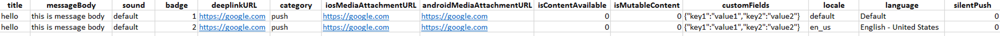

# Génération d’un fichier CSV pour la notification Push multilingue{#generating-csv-multilingual-push}

Le téléchargement d’un fichier CSV pour générer du contenu à diffuser est une fonctionnalité utilisée pour prendre en charge les notifications Push multilingues. Le format du fichier CSV doit respecter certaines directives pour que le téléchargement du fichier soit réussi et, par conséquent, pour pouvoir créer une diffusion. Les sections suivantes décrivent le format de fichier et ses considérations.

## Format du fichier {#file-format}

La publication multilingue requiert 14 colonnes dans le fichier CSV :

* title
* messageBody
* Son
* Badge
* deeplinkURI
* Catégorie
* iosMediaAttachmentURL
* androidMediaAttachmentURL
* isContentAvailable
* isMutableContent
* customFields
* Paramètre régional
* Langue
* silentPush



Vérifiez l’exemple CSV en cliquant sur **[!UICONTROL Download a sample file]** dans la **[!UICONTROL Manage Content Variants]** fenêtre. For more on this, refer to the this [section](../../channels/using/creating-a-multilingual-push-notification.md).

* **title, messageBody, son, badge, deeplinkURI, catégorie, iosMediaAttachmentURL, androidMediaAttachmentURL**: contenu de charge utile push normal. Vous devez fournir ces informations de la même manière que lors de la création de distributions Push.
* **Champs** personnalisés :  utilisez le format JSON pour les champs personnalisés, par exemple&quot;{&quot;&quot;key1&quot;&quot;:&quot;&quot;value1&quot;&quot;&quot;,&quot;&quot;key2&quot;&quot;:&quot;&quot;value2&quot;&quot;}&quot;. Reportez-vous à l’exemple de fichier ci-dessus pour obtenir un exemple de champs personnalisés.
* **isContentAvailable**: Indicateur pour la vérification Contenu disponible, la valeur 1 implique true, la valeur 0 implique false. La valeur par défaut est 0. Si vous laissez cette colonne vide, la valeur est considérée comme 0.
* **isMutableContent**: pour le contenu muable, la valeur 1 implique true, la valeur 0 implique false. La valeur par défaut est 0. Si vous laissez cette colonne vide, la valeur est considérée comme 0.
* **locale**: locale est le champ des variantes de langue, par ex. &quot;en_us&quot; pour le français-américain et &quot;fr_fr&quot; pour le français-français.
* **langue**: nom de la langue associée au paramètre régional. Par exemple, si le paramètre régional est &quot;en_us&quot;, le nom de la langue doit être &quot;Anglais-Etats-Unis&quot;.
* **silencePush**: Indicateur du type de notification Push. S’il s’agit d’une notification Push régulière, la valeur doit être 0. S’il s’agit d’une notification Push silencieuse, la valeur doit être 1. La valeur par défaut est 0. Si vous laissez cette colonne vide, la valeur est considérée comme 0.

## Contraintes et instructions relatives à la création d’un fichier CSV {#constraints-guideline-csv}

**Le nom de chaque colonne est fixe**.
Vous devez inclure le nom de chaque colonne dans le fichier CSV. Si vous n’utilisez aucune colonne pour le contenu, laissez-la vide.

**Les colonnes &quot;locale&quot; et &quot;language&quot; sont obligatoires et la valeur est unique pour chaque ligne.**
Une valeur vide pour cette colonne entraînera un échec du téléchargement du fichier.

**L&#39;ordre des colonnes est important**. L’ordre des colonnes dans le fichier téléchargé doit respecter le même format que le fichier d’exemple.

**Citer le contenu** des colonnes. Puisqu’il s’agit d’un fichier CSV (signifiant valeurs séparées par des virgules), tout contenu de colonne incluant une virgule (,) doit être cité. Par exemple, &quot;Bonjour, Tom !&quot;

**Le codage UTF-8 est nécessaire pour les caractères internationaux.**

**Si vous générez le fichier en texte brut, séparez chaque colonne par &quot;,&quot;.**

**Discordance de la variable.** Si vous utilisez un bloc de contenu et des audiences ciblées avec des langues spécifiques, vous devez répertorier toutes les langues ciblées dans votre fichier CSV, sinon vous obtiendrez une erreur lors de l’envoi de la diffusion.

## Insertion du champ de personnalisation dans le fichier csv {#personalization-field-csv}

Si vous souhaitez utiliser des champs de personnalisation, vous devez inclure <span> la balise dans le fichier.

Pour insérer le champ de personnalisation &quot;firstName&quot; dans messageBody, le message doit être :

```
 "Hello <span class="nl-dce-field nl-dce-done"  data-nl-expr="/context/profile/firstName">First name</span>, this is message".
```

Le champ &quot;firstName&quot; est représenté par :

```
 <span class="nl-dce-field nl-dce-done" data-nl-expr="/context/profile/firstName">First name</span>
```

Dans l’étendue, il existe deux attributs obligatoires :

* L&#39;une est la classe qui est statique. Quel que soit le champ de personnalisation que vous prévoyez d’utiliser, il sera toujours class=&quot;nl-dce-field nl-dce-done&quot;.

* Un autre est data-nl-expr, qui est le chemin du champ de personnalisation. Par exemple, si vous insérez le champ de personnalisation &quot;firstName&quot; depuis l’interface utilisateur, le chemin de navigation sera **[!UICONTROL Context (context)]** > **[!UICONTROL Profile (profile)]** > **[!UICONTROL First name (firstName)]** (comme illustré dans l’image ci-dessous). Dans ce cas, le chemin sera

   ```
   /context/profile/firstName. data-nl-expr="/context/profile/firstName".
   ```


## Paramètres régionaux et noms de langue {#locale-language-names}

Les langues suivantes sont prises en charge :

| Paramètre régional | Langue |
|:-:|:-:|
| af_za | Afrikaans - Afrique du Sud |
| sq_al | Albanais - Albanie |
| ar_dz | Arabe - Algérie |
| ar_bh | Arabe - Bahreïn |
| ar_iq | Arabe - Irak |
| ar_il | Arabe - Israël |
| ar_jo | Arabe - Jordanie |
| ar_kw | Arabe - Koweït |
| ar_lb | Arabe - Liban |
| ar_ma | Arabe - Maroc |
| ar_om | Arabe - Oman |
| ar_qa | Arabe - Qatar |
| ar_sa | Arabe - Arabie saoudite |
| ar_sy | Arabe - Syrie |
| ar_tn | Arabe - Tunisie |
| ar_ae | Arabe - Emirats arabes unis |
| ar_ye | Arabe - Yémen |
| hy_am | Arménien - Arménie |
| az_az | Azéri - Azerbaïdjan |
| be_by | Biélorusse - Biélorussie |
| bs_ba | Bosniaque - Bosnie |
| bg_bg | Bulgare - Bulgarie |
| ca_es | Catalan - Espagne |
| zh_cn | Chinois (simplifié) - Chine |
| zh_sg | Chinois (simplifié) - Singapour |
| zh_hk | Chinois (traditionnel) - Région administrative spéciale de Hong Kong (Chine) |
| zh_tw | Chinois (traditionnel) - région de Taïwan |
| hr_hr | Croate - Croatie |
| cs_cz | Tchèque - Tchéquie |
| da_dk | Danois - Danemark |
| nl_be | Néerlandais - Belgique |
| nl_nl | Néerlandais - Pays-Bas |
| en_au | Anglais - Australie |
| en_bz | Anglais - Belize |
| en_ca | Anglais - Canada |
| en_in | Anglais - Inde |
| en_ie | Anglais - Irlande |
| en_jm | Anglais - Jamaïque |
| en_nz | Anglais - Nouvelle-Zélande |
| en_ph | Anglais - Philippines |
| en_za | Anglais - Afrique du Sud |
| en_tt | Anglais - Trinité-et-Tobago |
| en_gb | Anglais - Royaume-Uni |
| en_us | Anglais - Etats-Unis |
| en_zw | Anglais - Zimbabwe |
| et_ee | Estonien - Estonie |
| fi_fi | Finnois - Finlande |
| fr_be | Français - Belgique |
| fr_ca | Français - Canada |
| fr_fr | Français - France |
| fr_lu | Français - Luxembourg |
| fr_ch | Français - Suisse |
| de_at | Allemand - Autriche |
| de_de | Allemand - Allemagne |
| de_lu | Allemand - Luxembourg |
| de_ch | Allemand - Suisse |
| el_cy | Grec - Chypre |
| el_gr | Grec - Grèce |
| gu_in | Goudjrati - Inde |
| he_il | Hébreu - Israël |
| hi_in | Hindi - Inde |
| hu_hu | Hongrois - Hongrie |
| is_is | Islandais - Islande |
| id_id | Indonésien - Indonésie |
| it_it | Italien - Italie |
| it_ch | Italien - Suisse |
| ja_jp | Japonais - Japon |
| kn_in | Kannada - Inde |
| kk_kz | Kazakh - Kazakhstan |
| ko_kr | Coréen - Corée du Sud |
| lv_lv | Letton - Lettonie |
| lt_lt | Lituanien - Lituanie |
| mk_mk | Macédonien - Macédoine |
| ms_my | Malais - Malaisie |
| mr_in | Marathi - Inde |
| no_no | Norvégien - Norvège |
| pl_pl | Polonais - Pologne |
| pt_br | Portugais - Brésil |
| pt_pt | Portugais - Portugal |
| pa_in | Pendjabi - Inde |
| ro_md | Roumain - Moldavie |
| ro_ro | Roumain - Roumanie |
| ru_kz | Russe - Kazakhstan |
| ru_ru | Russe - Russie |
| ru_ua | Russe - Ukraine |
| a_in | Sanskrit - Inde |
| sr_ba | Serbe - Bosnie |
| sr_rs | Serbe - Serbie |
| sk_sk | Slovaque - Slovaquie |
| sl_si | Slovène - Slovénie |
| es_ar | Espagnol - Argentine |
| es_bo | Espagnol - Bolivie |
| es_cl | Espagnol - Chili |
| es_co | Espagnol - Colombie |
| es_cr | Espagnol - Costa Rica |
| es_do | Espagnol - République dominicaine |
| es_ec | Espagnol - Equateur |
| es_sv | Espagnol - El Salvador |
| es_gt | Espagnol - Guatemala |
| es_hn | Espagnol - Honduras |
| es_mx | Espagnol - Mexique |
| es_ni | Espagnol - Nicaragua |
| es_pa | Espagnol - Panama |
| es_py | Espagnol - Paraguay |
| es_pe | Espagnol - Pérou |
| es_pr | Espagnol - Porto Rico |
| es_es | Espagnol - Espagne |
| es_uy | Espagnol - Uruguay |
| es_ve | Espagnol - Venezuela |
| sw_ke | Swahili - Kenya |
| sv_fi | Suédois - Finlande |
| sv_se | Suédois - Suède |
| ta_in | Tamoul - Inde |
| tt_ru | Tatar - Russe |
| te_in | Télougou - Inde |
| th_th | Thaï - Thaïlande |
| tr_cy | Turc - Chypre |
| tr_tr | Turc - Turquie |
| uk_ua | Ukrainien - Ukraine |
| ur_in | Ourdou - Inde |
| ur_pk | Ourdou - Pakistan |
| vi_vn | Vietnamien - Vietnam |