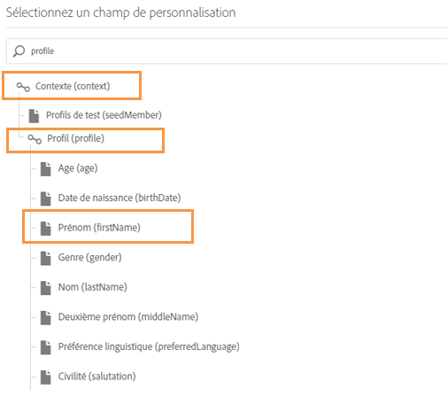

# Génération d’un fichier CSV pour les notifications push multilingues{#generating-csv-multilingual-push}

Le téléchargement d’un fichier CSV pour générer du contenu à diffuser est une fonctionnalité utilisée pour prendre en charge les notifications push multilingues. Le format du fichier CSV doit respecter certaines instructions pour que le téléchargement du fichier puisse être effectué et, par conséquent, pour la création d’une diffusion. Les sections suivantes décrivent le format de fichier et les points à prendre en compte.

## Format du fichier {#file-format}

14 colonnes sont requises dans le fichier CSV pour une notification push multilingue :

1. title
1. messageBody
1. sound
1. adge
1. deeplinkURI
1. category
1. iosMediaAttachmentURL
1. androidMediaAttachmentURL
1. isContentAvailable
1. isMutableContent
1. customFields
1. locale
1. language
1. silentPush

Consultez l’exemple de fichier CSV en cliquant sur **[!UICONTROL Télécharger un fichier d’exemple]** dans la fenêtre **[!UICONTROL Gérer les variantes de contenu]**. Voir à ce propos cette [section](../../channels/using/creating-a-multilingual-push-notification.md).

* **title, messageBody, sound, badge, deeplinkURI, catégorie, iosMediaAttachmentURL, androidMediaAttachmentURL** : contenu de payload push normal. Vous devez fournir ces informations de la même manière que lors de la création de diffusions push.
* **Champs personnalisés** : utilisez le format JSON pour les champs personnalisés, par exemple `{"key1":"value1","key2":"value2"}`. Pour obtenir un exemple de champs personnalisés, reportez-vous au fichier d’exemple ci-dessus.
* **isContentAvailable** : drapeau pour la vérification de Contenu disponible, la valeur 1 impliquant true, la valeur 0 impliquant false. La valeur par défaut est 0. Si vous laissez cette colonne vide, la valeur est considérée comme étant 0.
* **isMutableContent** : drapeau pour le Contenu mutable, la valeur 1 impliquant true, la valeur 0 impliquant false. La valeur par défaut est 0. Si vous laissez cette colonne vide, la valeur est considérée comme étant 0.
* **locale** : le paramètre régional est le champ des variantes de langue, par ex. « en_us » pour l’anglais américain et « fr_fr » pour le français de France.
* **language** : nom de la langue associée au paramètre régional. Par exemple, si le paramètre régional est « en_us », le nom de la langue doit être « Anglais - États-Unis ».
* **silencePush** : drapeau pour le type de notification push. S’il s’agit d’une notification push classique, la valeur doit être 0. S’il s’agit d’une notification push silencieuse, la valeur doit être 1. La valeur par défaut est 0. Si vous laissez cette colonne vide, la valeur est considérée comme étant 0.

## Contraintes et instructions relatives à la création d’un fichier CSV {#constraints-guideline-csv}

**Le nom de chaque colonne est fixe**.
Vous devez inclure le nom de chaque colonne dans le fichier CSV. Si vous n’utilisez aucune colonne pour le contenu, laissez-la vide.

**Les colonnes « locale » et « language » sont obligatoires et la valeur est unique pour chaque ligne.**
Une valeur vide pour cette colonne entraînera un échec de téléchargement de fichier.

**L’ordre des colonnes est important**. L’ordre des colonnes dans le fichier téléchargé doit respecter le même format que le fichier d’exemple.

**Contenu des colonnes entre guillemets**. Puisqu’il s’agit d’un fichier CSV (valeurs séparées par des virgules), tout contenu de colonne incluant une virgule (,) doit être mis entre guillemets. Par exemple, &quot;Bonjour, Tom !&quot;

**L’encodage UTF-8 est nécessaire pour les caractères internationaux.**

**Si vous générez le fichier en texte brut, séparez chaque colonne par une « , ».**

**Discordance de variantes.** Si vous utilisez un bloc de contenu et des audiences ciblées avec des langues spécifiques, vous devez répertorier toutes les langues ciblées dans votre fichier CSV, sinon vous obtiendrez une erreur lors de l’envoi de la diffusion.

## Insertion d’un champ de personnalisation dans le fichier csv {#personalization-field-csv}

Si vous souhaitez utiliser des champs de personnalisation, vous devez inclure la balise <span> dans le fichier.

Pour insérer le champ de personnalisation « firstName » dans messageBody, le message doit être :

```
 "Hello <span class="nl-dce-field nl-dce-done"  data-nl-expr="/context/profile/firstName">First name</span>, this is message".
```

Le champ « firstName » est représenté par :

```
 <span class="nl-dce-field nl-dce-done" data-nl-expr="/context/profile/firstName">First name</span>
```

Dans le conteneur span, il existe deux attributs obligatoires :

* L’un est la classe qui est statique. Quel que soit le champ de personnalisation que vous prévoyez d’utiliser, il sera toujours class=&quot;nl-dce-field nl-dce-done&quot;.

* Un autre est data-nl-expr, qui est le chemin du champ de personnalisation. Par exemple, si vous insérez le champ de personnalisation « firstName » depuis l’interface utilisateur, le chemin de navigation sera **[!UICONTROL Contexte (context)]** > **[!UICONTROL Profil (profile)]** > **[!UICONTROL Prénom (firstName)]** (comme illustré dans l’image ci-dessous). Dans ce cas, le chemin sera

   ```
   /context/profile/firstName. data-nl-expr="/context/profile/firstName".
   ```



## Paramètre régional et noms de langue {#locale-language-names}

Les langues prises en charge sont les suivantes :

| Paramètre régional | Langue |
|:-:|:-:|
| af_za | Afrikaans - Afrique du Sud |
| sq_al | Albanais - Albanie |
| ar_dz | Arabe - Algérie |
| ar_bh | Arabe - Bahreïn |
| ar_iq | Arabe - Irak |
| ar_il | Arabe - Israël |
| ar_jo | Arabe - Jordanie |
| ar_kw | Arabe - Koweït |
| ar_lb | Arabe - Liban |
| ar_ma | Arabe - Maroc |
| ar_om | Arabe - Oman |
| ar_qa | Arabe - Qatar |
| ar_sa | Arabe - Arabie saoudite |
| ar_sy | Arabe - Syrie |
| ar_tn | Arabe - Tunisie |
| ar_ae | Arabe - Emirats arabes unis |
| ar_ye | Arabe - Yémen |
| hy_am | Arménien - Arménie |
| az_az | Azéri - Azerbaïdjan |
| be_by | Biélorusse - Biélorussie |
| bs_ba | Bosniaque - Bosnie |
| bg_bg | Bulgare - Bulgarie |
| ca_es | Catalan - Espagne |
| zh_cn | Chinois (simplifié) - Chine |
| zh_sg | Chinois (simplifié) - Singapour |
| zh_hk | Chinois (traditionnel) - Hong Kong (RAS Chine) |
| zh_tw | Chinois (traditionnel) - région de Taïwan |
| hr_hr | Croate - Croatie |
| cs_cz | Tchèque - Tchéquie |
| da_dk | Danois - Danemark |
| nl_be | Néerlandais - Belgique |
| nl_nl | Néerlandais - Pays-Bas |
| en_au | Anglais - Australie |
| en_bz | Anglais - Belize |
| en_ca | Anglais - Canada |
| en_in | Anglais - Inde |
| en_ie | Anglais - Irlande |
| en_jm | Anglais - Jamaïque |
| en_nz | Anglais - Nouvelle-Zélande |
| en_ph | Anglais - Philippines |
| en_za | Anglais - Afrique du Sud |
| en_tt | Anglais - Trinité-et-Tobago |
| en_gb | Anglais - Royaume-Uni |
| en_us | Anglais - Etats-Unis |
| en_zw | Anglais - Zimbabwe |
| et_ee | Estonien - Estonie |
| fi_fi | Finnois - Finlande |
| fr_be | Français - Belgique |
| fr_ca | Français - Canada |
| fr_fr | Français - France |
| fr_lu | Français - Luxembourg |
| fr_ch | Français - Suisse |
| de_at | Allemand - Autriche |
| de_de | Allemand - Allemagne |
| de_lu | Allemand - Luxembourg |
| de_ch | Allemand - Suisse |
| el_cy | Grec - Chypre |
| el_gr | Grec - Grèce |
| gu_in | Goudjrati - Inde |
| he_il | Hébreu - Israël |
| hi_in | Hindi - Inde |
| hu_hu | Hongrois - Hongrie |
| is_is | Islandais - Islande |
| id_id | Indonésien - Indonésie |
| it_it | Italien - Italie |
| it_ch | Italien - Suisse |
| ja_jp | Japonais - Japon |
| kn_in | Kannada - Inde |
| kk_kz | Kazakh - Kazakhstan |
| ko_kr | Coréen - Corée du Sud |
| lv_lv | Letton - Lettonie |
| lt_lt | Lituanien - Lituanie |
| mk_mk | Macédonien - Macédoine |
| ms_my | Malais - Malaisie |
| mr_in | Marathi - Inde |
| no_no | Norvégien - Norvège |
| pl_pl | Polonais - Pologne |
| pt_br | Portugais - Brésil |
| pt_pt | Portugais - Portugal |
| pa_in | Pendjabi - Inde |
| ro_md | Roumain - Moldavie |
| ro_ro | Roumain - Roumanie |
| ru_kz | Russe - Kazakhstan |
| ru_ru | Russe - Russie |
| ru_ua | Russe - Ukraine |
| a_in | Sanskrit - Inde |
| sr_ba | Serbe - Bosnie |
| sr_rs | Serbe - Serbie |
| sk_sk | Slovaque - Slovaquie |
| sl_si | Slovène - Slovénie |
| es_ar | Espagnol - Argentine |
| es_bo | Espagnol - Bolivie |
| es_cl | Espagnol - Chili |
| es_co | Espagnol - Colombie |
| es_cr | Espagnol - Costa Rica |
| es_do | Espagnol - République dominicaine |
| es_ec | Espagnol - Equateur |
| es_sv | Espagnol - El Salvador |
| es_gt | Espagnol - Guatemala |
| es_hn | Espagnol - Honduras |
| es_mx | Espagnol - Mexique |
| es_ni | Espagnol - Nicaragua |
| es_pa | Espagnol - Panama |
| es_py | Espagnol - Paraguay |
| es_pe | Espagnol - Pérou |
| es_pr | Espagnol - Porto Rico |
| es_es | Espagnol - Espagne |
| es_uy | Espagnol - Uruguay |
| es_ve | Espagnol - Venezuela |
| sw_ke | Swahili - Kenya |
| sv_fi | Suédois - Finlande |
| sv_se | Suédois - Suède |
| ta_in | Tamoul - Inde |
| tt_ru | Tatar - Russie |
| te_in | Télougou - Inde |
| th_th | Thaï - Thaïlande |
| tr_cy | Turc - Chypre |
| tr_tr | Turc - Turquie |
| uk_ua | Ukrainien - Ukraine |
| ur_in | Ourdou - Inde |
| ur_pk | Ourdou - Pakistan |
| vi_vn | Vietnamien - Vietnam |
