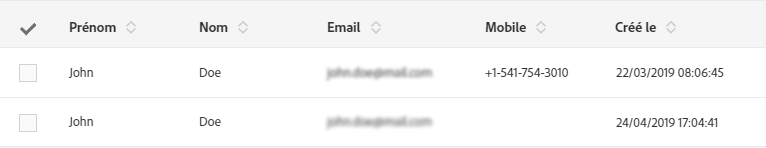

# Prise en main des landing pages {#getting-started-with-landing-pages}

Voici les principales étapes de configuration d’une landing page :

Cette page contient des informations sur chacune de ces étapes, ainsi que des références à la documentation dédiée pour obtenir des informations supplémentaires.

 [Découvrez comment créer des landing pages en vidéo](#video)

**Rubriques connexes :**

* [Créer un service](../../audiences/using/creating-a-service.md)
* [Configuration d’un processus de double opt-in](setting-up-a-double-opt-in-process.md)

## Limites des landing pages{#landing-page-limitations}

La section ci-dessous répertorie les limites que vous devez connaître avant de commencer à configurer des landing pages.

**Ecriture et mise à jour des données**

* Les landing pages sont limitées uniquement aux ressources **[!UICONTROL Profil]** et **[!UICONTROL Abonnement]**. Un enregistrement peut être sauvegardé et mis à jour depuis le **[!UICONTROL Profil]** et un abonnement/désabonnement à un **[!UICONTROL Service]**.
Pour en savoir plus sur la configuration des ressources, voir [Configuration de la structure de données de la ressource](../../developing/using/configuring-the-resource-s-data-structure.md).

>[!IMPORTANT]
>
>Une page d’entrée ne peut pas afficher ni mettre à jour les données d’une autre ressource que **[!UICONTROL Profil]** et **[!UICONTROL Abonnement]**.

**Préchargement**

* Une landing page ne peut pas afficher automatiquement une liste d’enregistrements. Elle ne peut pas répertorier les services auxquels les profils sont déjà abonnés. Pour plus d’informations sur les services, consultez cette [page](../../audiences/using/creating-a-service.md).

* Une landing page avec un formulaire prérenseigné (les données sont préchargées avec la page) n’est accessible qu’à partir d’un email Adobe Campaign. Il est impossible d’accéder à ce type de formulaire depuis une page d’un site web.

**Réconciliation**

* Le comportement de réconciliation est le suivant : dès qu’une correspondance est trouvée, la réconciliation s’arrête. La réconciliation ne peut donc être effectuée que sur un enregistrement de profil et non sur plusieurs enregistrements lorsqu’il existe des doublons.

Vous souhaitez par exemple envoyer la landing page d’acquisition suivante à vos profils afin de mettre à jour votre base de données Campaign avec les numéros des téléphones mobiles de vos profils.

Si l’un de vos profils renseigne votre landing page avec de nouvelles informations mais possède déjà un profil dupliqué, le profil correspondant avec la date de création la plus ancienne est mis à jour, car les profils sont classés par ordre de priorité en fonction de la date de création uniquement.

Dans le cas présent, seul le premier profil a été mis à jour, car il s’agit de l’entrée la plus ancienne.

**Test des landing pages**

* Les landing pages ne fonctionnent que sur les profils et non sur les profils de test. Elles ne peuvent donc pas être testées dans le cadre d’un BAT d’email.

## Etape 1 - Configurer le modèle de landing page {#configure-the-landing-page-template}

Avant de configurer une landing page, vous devez configurer un modèle de landing page correspondant à vos besoins. Une fois le modèle prêt, toutes les landing pages reposant sur celui-ci seront préconfigurées avec les paramètres souhaités.

1. Depuis le menu avancé, via le logo Adobe Campaign, sélectionnez **[!UICONTROL Ressources]** / **[!UICONTROL Modèles]** / **[!UICONTROL Modèles de landing page]**, puis dupliquez le modèle que vous souhaitez utiliser.
1. Dans les propriétés du modèle, spécifiez tous les paramètres que vos landing pages doivent avoir en commun, par exemple, la dimension de ciblage, les paramètres d’accès aux pages pour les visiteurs identifiés ou non, les actions spécifiques à la validation de formulaire par un visiteur, la marque/le logo à utiliser dans le contenu, etc. Pour plus d’informations sur les propriétés des landing pages, reportez-vous à [cette section](../../channels/using/configuring-landing-page.md)
1. Enregistrez vos modifications.

Pour plus d’informations sur les modèles de landing page, reportez-vous à [cette section](../../channels/using/getting-started-with-landing-pages.md).

## Etape 2- Créer et configurer la landing page {#create-and-configure-the-landing-page}

Créez une landing page dans le programme ou la campagne de votre choix, à partir du modèle défini à l’étape précédente.

1. Créez la landing page à partir du modèle souhaité.
1. Renseignez les paramètres généraux de la landing page (libellé, description, etc.).
1. Vous accéderez ensuite au tableau de bord de la landing page. Si nécessaire, modifiez les propriétés de la landing page (voir [Paramétrer une landing page](../../channels/using/configuring-landing-page.md)). Par défaut, les propriétés sont celles configurées dans le modèle de landing page.
Pour des raisons de sécurité et de performances de la Plateforme, il est vivement recommandé de définir une date d’expiration dans les propriétés de la landing page. Une fois cette opération terminée, la landing page est automatiquement dépubliée à la date sélectionnée. Pour plus d’informations sur les paramètres de validité, reportez-vous à [cette section](../../channels/using/testing-publishing-landing-page.md#setting-up-validity-parameters).

   

>[!NOTE]
>
>Vos modifications sont effectives uniquement pour la landing page en cours d’édition. Si vous souhaitez appliquer ces modifications à d’autres landing pages, vous pouvez les effectuer dans un modèle dédié et créer d’autres landing pages à partir de ce modèle.

## Etape 3 - Concevoir la landing page {#design-the-landing-page}

Vous pouvez maintenant définir le contenu de la landing page. Celle-ci contient par défaut trois pages, accessibles via les options de défilement : la page principale de contenu, une page de confirmation et une page d’erreur.

Plusieurs champs sont configurés par défaut sur chaque page. Si nécessaire, vous pouvez éditer leurs propriétés et mappage.

Vous pouvez également configurer le comportement du bouton de confirmation lorsqu’un profil clique dessus et personnaliser le contenu selon vos besoins (image, champs de personnalisation, etc.). Par exemple, vous pouvez insérer le prénom d’un profil dans la page de confirmation de la landing page pour le remercier de s’être inscrit.

Pour plus d’informations sur la conception d’une landing page, reportez-vous à [cette section](../../channels/using/designing-a-landing-page.md).

## Etape 4 - Tester la landing page {#test-the-landing-page}

Une fois la landing page définie, vous pouvez simuler son exécution et son comportement lorsqu’elle sera disponible en ligne.

>[!IMPORTANT]
>
>Les tests de landing pages ne peuvent être effectués qu’avec des profils, et non des profils de test. Lors de l’envoi du formulaire, les données du profil sélectionné seront mises à jour. Pour éviter de modifier des profils réels, utilisez un faux profil client.

Si le comportement observé lors du test de la landing page est satisfaisant, vous pouvez alors publier cette dernière afin qu’elle soit disponible en ligne.

Pour plus d’informations sur le test d’une landing page, reportez-vous à [cette section](../../channels/using/testing-publishing-landing-page.md#testing-the-landing-page-).

## Etape 5 - Publier la landing page {#publish-the-landing-page}

Une fois les tests terminés, vous pouvez publier la landing page via le bouton **[!UICONTROL Publier]** de la barre d’actions du tableau de bord. Un bloc de suivi indique la progression et le statut de la publication.

La publication de la landing page permet de la rendre accessible en ligne. Une fois publiée, vous pouvez toujours la mettre à jour : pour cela, vous devez la publier de nouveau après chaque modification. Vous pouvez également dépublier une landing page à tout moment afin qu’elle ne soit plus accessible.

Une fois publiée, votre landing page est prête à être utilisée. Vous pouvez alors mettre en place différents mécanismes permettant d’y accéder afin d’acquérir de nouveaux profils dans votre base ou d’obtenir des informations complémentaires sur les profils existants.

Pour plus d’informations sur la publication d’une landing page, reportez-vous à [cette section](../../channels/using/testing-publishing-landing-page.md#publishing-a-landing-page).

## Tutoriel vidéo {#video}

Cette vidéo montre comment créer et modifier une landing page.

>[!VIDEO](https://video.tv.adobe.com/v/24093?quality=12&captions=fre_fr)

D’autres vidéos pratiques sur Campaign Standard sont disponibles [ici](https://experienceleague.adobe.com/docs/campaign-standard-learn/tutorials/overview.html?lang=fr).
