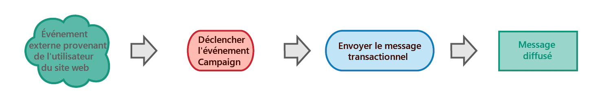

# Prise en main de la messagerie transactionnelle {#getting-started-with-transactional-messaging}

## Vue d’ensemble {#overview}

### Qu’est-ce qu’un message transactionnel ?

Il s&#39;agit d&#39;une communication individuelle et unique, envoyée en temps réel par un fournisseur tel qu&#39;un site Web. Elle est particulièrement attendue, car elle contient des informations importantes que le destinataire souhaite vérifier ou confirmer.

* **Quand doit-il être envoyé ?** Ce message contenant des informations importantes, l’utilisateur s’attend à ce qu’il soit envoyé en temps réel. Le délai entre le déclenchement de l’événement et l’arrivée du message doit donc être très court.

* **Pourquoi est-ce important ?** En général, un message transactionnel bénéficie d’un taux d’ouverture élevé. Il doit donc être soigneusement conçu, car il peut avoir un impact important sur le comportement des clients dans la mesure où il définit la relation client.

* **Par exemple ?** Il peut s’agir d’un message de bienvenue après la création d’un compte, d’une confirmation qu’une commande a été livrée, d’une facture, d’un message confirmant un changement de mot de passe ou d’une notification après qu’un client a consulté votre site Web...

### Envoi de messages transactionnels

Adobe Campaign permet d’intégrer cette fonctionnalité à un système d’information qui lui envoie les événements destinés à être transformés en messages transactionnels personnalisés.

Selon vos options, les messages transactionnels peuvent être envoyés par email, SMS ou notification push. Veuillez vérifier votre contrat de licence.

>[!NOTE]
>
>Adobe Campaign donne la priorité au traitement des messages transactionnels par rapport à toute autre diffusion.

Les messages transactionnels sont également disponibles depuis l&#39;API Adobe Campaign Standard. Pour en savoir plus sur ce sujet, consultez la [documentation consacrée](../../api/using/managing-transactional-messages.md).

>[!NOTE]
>
>Tous les messages transactionnels sont désormais envoyés avec le MTA amélioré d’Adobe Campaign pour une meilleure délivrabilité, un débit et une gestion des bounces améliorés. Tous les impacts sont les mêmes que pour les messages marketing standard. Voir à ce propos [cette section](../../administration/using/configuring-email-channel.md).

### Types de message transactionnel {#transactional-message-types}

Dans Adobe Campaign, deux types de message transactionnel sont disponibles :

**Les** messages transactionnels événements ciblent un événement :
* Ils ne contiennent pas d’informations sur le profil.
* Ils ne sont pas compatibles avec les règles de fatigue (même dans le cas d’un enrichissement avec profils).
* La cible de diffusion est définie par les données contenues dans l’événement lui-même.

**Les** messages transactionnels de profil ciblent les profils de la base de données marketing Campaign. Avec ce type de message, vous pouvez :
* Appliquez les [règles de typologie marketing](../../sending/using/managing-typology-rules.md) ou [règles de fatigue](../../sending/using/fatigue-rules.md).
* inclure le lien de désinscription dans les messages ;
* ajouter les messages transactionnels au reporting de diffusion globale ;
* utiliser les messages transactionnels dans le parcours client.

Le type du message est défini lors de la configuration de l&#39;événement qui sera transformé en message transactionnel. Reportez-vous à [cette section](../../channels/using/configuring-transactional-event.md#transactional-event-specific-configurations).

>[!IMPORTANT]
>
>Pour accéder à tous les messages transactionnels, vous devez faire partie du groupe de sécurité **[!UICONTROL Administrateurs (toutes entités)]**.

## Principe de fonctionnement des messages transactionnels {#transactional-messaging-operating-principle}

Le processus global de messagerie transactionnelle peut être décrit comme suit :

Supposons, par exemple, que vous soyez une société disposant d’un site Web sur lequel vos clients peuvent acheter des produits.

Adobe Campaign vous permet d’envoyer un courrier électronique de notification aux clients qui ont ajouté des produits à leur panier : lorsque l&#39;un d&#39;eux quitte votre site Web sans passer par leurs achats (événement externe qui déclenche un événement Campaign), un courrier électronique d&#39;abandon de panier leur est automatiquement envoyé (diffusion de message transactionnel).

<!--The steps for putting this into place are detailed below.-->

### Principales étapes {#key-steps}

Les principales étapes de la création et de la gestion de messages transactionnels personnalisés dans Adobe Campaign sont résumées dans le graphique ci-dessous.

Chacune de ces étapes est décrite plus en détail ci-dessous.

### Étape 1 - Créer et publier la configuration de l’événement {#create-event-configuration}

| Utilisateur | Action | Résultat |
|--- |--- |--- |
| Cette étape doit être effectuée par un utilisateur disposant de [droits d’administration](../../administration/using/users-management.md#functional-administrators). | Configurez un événement qui sera appelé « Abandon de panier » et publiez cette configuration d’événement. | L’API qui sera utilisée par le développeur de votre site web est déployée et un message transactionnel est automatiquement créé. |

La création et la publication d&#39;un événement sont présentées dans les sections [Configuration d&#39;un événement transactionnel](../../channels/using/configuring-transactional-event.md) et [Publication d&#39;un événement transactionnel](../../channels/using/publishing-transactional-event.md).

### Étape 2 - Modifier et publier le message transactionnel {#create-transactional-message}

| Utilisateur | Action | Résultat |
|--- |--- |--- |
| Cette étape peut être effectuée par tout utilisateur marketing disposant des [droits d’accès des utilisateurs de base](../../administration/using/users-management.md#basic-users). | Modifiez et personnalisez le message transactionnel, testez-le, puis publiez-le. | Le message transactionnel est alors prêt à être envoyé. |

Pour plus d’informations sur la modification et la publication d’un message transactionnel, voir [Modification de messages transactionnels](../../channels/using/editing-transactional-message.md) et [cycle de vie du Message transactionnel](../../channels/using/publishing-transactional-message.md).

### Étape 3 - Intégrer le déclenchement de l’événement {#integrate-event-trigger}

<!--**Event triggering integration**-->

| Utilisateur | Action | Résultat |
|--- |--- |--- |
| Cette étape est effectuée par le développeur de votre site web. | Utilisez l’API REST des messages transactionnels pour intégrer l’événement à votre site web. | L’événement est déclenché lorsqu’un client abandonne son panier. |

Une fois que vous avez créé un événement, vous devez intégrer le déclenchement de ce événement dans votre site Web.<!--In this example, you want a "Cart abandonment" event to be triggered whenever one of your clients leaves your website before purchasing the products in their cart.-->**Pour ce faire, le développeur web de votre site doit se servir de l’API REST Adobe Campaign Standard**.

Pour plus d’informations sur l’utilisation de l’API Campaign REST pour gérer les messages transactionnels, consultez la [documentation de l’API REST](../../api/using/managing-transactional-messages.md).

### Étape 4 - Diffuser le message {#message-delivery}

Une fois toutes ces étapes effectuées, le message peut être diffusé.

Dès qu&#39;un utilisateur quitte le site sans commander les produits dans son panier, l’événement Campaign correspondant est déclenché. L’utilisateur reçoit automatiquement un courrier électronique de notification.

## Rubriques connexes :

* [Principales étapes pour envoyer un message](../../channels/using/key-steps-to-send-a-message.md)
* [Prise en main des canaux de communication](../../channels/using/get-started-communication-channels.md)
* [Notifications push transactionnelles](../../channels/using/transactional-push-notifications.md)
* [Messages de relance](../../channels/using/follow-up-messages.md)
