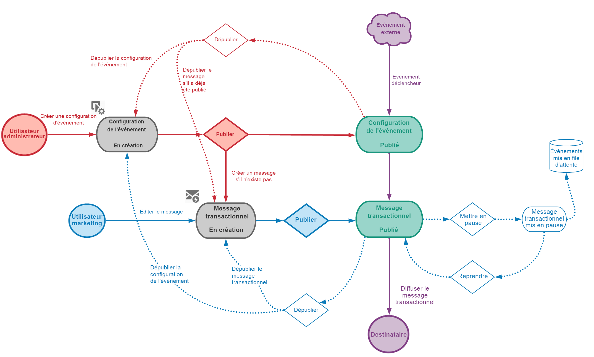

# Prise en main de la messagerie transactionnelle {#getting-started-with-transactional-messaging}

## Vue d’ensemble

Présentation du concept de **messagerie transactionnelle**

La messagerie transactionnelle vous permet d’envoyer en temps réel des messages individuels et uniques à vos clients.

Il peut s’agir de messages de bienvenue, de confirmations d’expédition de commandes, de mises à jour de mot de passe, etc.
Adobe Campaign permet d’intégrer cette fonctionnalité à un système d’information qui lui envoie les événements destinés à être transformés en messages transactionnels personnalisés.

Selon vos options, les messages transactionnels peuvent être envoyés par email, SMS ou notification push. Veuillez vérifier votre contrat de licence.

Adobe Campaign donne la priorité au traitement des messages transactionnels par rapport à toute autre diffusion.

Les messages transactionnels sont également disponibles depuis l&#39;API Adobe Campaign Standard. Consultez à ce sujet la [documentation dédiée](../../api/using/managing-transactional-messages.md).

>[!NOTE]
>
>Tous les messages transactionnels sont désormais envoyés avec le MTA amélioré d’Adobe Campaign pour une meilleure délivrabilité, un débit et une gestion des bounces améliorés. Tous les impacts sont les mêmes que pour les messages marketing standard. Voir à ce propos cette [section](../../administration/using/configuring-email-channel.md).

## Définition des messages transactionnels {#transactional-messaging-definition}

<table>
<tr>
<td align="center"> 
<b>Qu’est-ce qu’un message transactionnel ?</b>
</td>
<td>
Il s’agit d’une communication individuelle et unique, envoyée par un fournisseur, par exemple un site web.
</td>
<td>
Elle est particulièrement attendue, car elle contient des informations importantes que le destinataire souhaite vérifier ou confirmer.
</td>
</tr>
<tr>
<td align="center"> 
<b>Quand doit-il être envoyé ?</b>
</td>
<td>
 Ce message contenant des informations importantes, l’utilisateur s’attend à ce qu’il soit envoyé en temps réel.
</td>
<td>
Le délai entre le déclenchement de l’événement et l’arrivée du message doit donc être très court.
</td>
</tr>
<tr>
<td align="center"> 
<b>Pourquoi est-ce important ?</b>
</td>
<td>
En général, un message transactionnel bénéficie d’un taux d’ouverture élevé. Il doit donc être soigneusement conçu.
</td>
<td>
En effet, il peut avoir un impact important sur le comportement du client dans la mesure où il définit la relation avec lui.
</td>
</tr>
<tr>
<td align="center"> 
<b>Par exemple ?</b>
</td>
<td>
Il peut s’agir d’un message de bienvenue envoyé suite à la création d’un compte, de la confirmation de l’expédition d’une commande, d’une facture...
</td>
<td>
Il peut également s’agir d’un message confirmant un changement de mot de passe ou d’une notification après qu’un client a consulté votre site web...
</td>
</tr>
</table>

## Types de message transactionnel

Dans Adobe Campaign, deux types de message transactionnel sont disponibles :

[Messages transactionnels basés sur un événement](../../channels/using/event-transactional-messages.md) ciblant un événement.

* Les messages transactionnels d’événements ne contiennent pas d’informations sur les profils.

* Ils ne sont pas compatibles avec les [règles de fatigue](../../sending/using/fatigue-rules.md) (même dans le cas d’un enrichissement avec profils).

* La cible de diffusion est définie par les données contenues dans l’événement lui-même.

[Messages transactionnels basés sur un profil](../../channels/using/profile-transactional-messages.md) ciblant des profils de la base de données marketing Campaign.

Avec les messages transactionnels basés sur un profil, vous pouvez :

* appliquer des [règles de typologie marketing](../../sending/using/managing-typology-rules.md) ou des [règles de fatigue](../../sending/using/fatigue-rules.md) ;

* inclure le lien de désinscription dans les messages ;

* ajouter les messages transactionnels au reporting de diffusion globale ;

* utiliser les messages transactionnels dans le parcours client.

Le type du message est défini lors de la configuration de l&#39;événement qui sera transformé en message transactionnel. Voir [Configuration des messages transactionnels](../../administration/using/configuring-transactional-messaging.md).

>[!IMPORTANT]
>
>Pour accéder à tous les messages transactionnels, vous devez faire partie du groupe de sécurité **[!UICONTROL Administrateurs (toutes entités)]**.

## Principe de fonctionnement des messages transactionnels {#transactional-messaging-operating-principle}

Prenons le cas d’une société disposant d’un site web sur lequel ses clients peuvent acheter des produits.

Adobe Campaign vous permet d’envoyer un email de notification aux utilisateurs du site ayant ajouté des produits dans leur panier : lorsque l’un d’eux quitte le site sans poursuivre ses achats, un email d’abandon de panier lui est automatiquement envoyé.

Les étapes de mise en œuvre sont les suivantes.

### Étape 1 - Créer et publier la configuration de l’événement {#create-event-configuration}

**Configuration des événements transactionnels**:

* Configurez un événement qui sera appelé « Abandon de panier » et publiez cette configuration d’événement.

* L’API qui sera utilisée par le développeur de votre site web est déployée et un message transactionnel est automatiquement créé.

* Veuillez noter que cette étape doit être effectuée par un utilisateur disposant de [droits d’administration](../../administration/using/users-management.md#functional-administrators).

La création et la publication d’un événement sont présentées dans la section [Configuration d’un événement pour envoyer un message transactionnel basé sur un événement](../../administration/using/configuring-transactional-messaging.md#use-case--configuring-an-event-to-send-a-transactional-message).

### Étape 2 - Modifier et publier le message transactionnel {#create-transactional-message}

**Modification des messages transactionnels**

* Modifiez et personnalisez le message transactionnel, testez-le, puis publiez-le.

* Le message transactionnel sera alors prêt à être envoyé.

* Cette étape peut être effectuée par tout utilisateur marketing disposant des [droits d’accès des utilisateurs de base](../../administration/using/users-management.md#basic-users).

Pour en savoir plus sur la modification et la publication d’un message transactionnel, voir la section [Messages transactionnels basés sur un événement](../../channels/using/event-transactional-messages.md).

### Étape 3 - Intégrer le déclenchement de l’événement {#integrate-event-trigger}

**Intégration du déclenchement de l’événement**

* Utilisez l’API REST des messages transactionnels pour intégrer l’événement à votre site web.&lt;

* L’événement est déclenché lorsqu’un client abandonne son panier.

* Cette étape est effectuée par le développeur de votre site web.

Pour plus d’informations sur l’intégration de l’événement dans votre site web, voir la section [Intégration à un site](../../administration/using/configuring-transactional-messaging.md#integrating-the-triggering-of-the-event-in-a-website).

### Étape 4 - Diffuser le message {#message-delivery}

**Événement externe provenant de votre site web**

* Une fois toutes ces étapes effectuées, le message peut être diffusé.

* Dès qu&#39;un utilisateur quitte le site sans commander les produits dans son panier, l’événement Campaign correspondant est déclenché.

* L’utilisateur reçoit alors automatiquement un email de notification.

## Principales étapes {#key-steps}

Les principales étapes de la création et de la gestion de messages transactionnels personnalisés dans Adobe Campaign sont résumées dans le graphique ci-dessous.

## Rubriques connexes :

* [Principales étapes pour envoyer un message](../../channels/using/key-steps-to-send-a-message.md)
* [Prise en main des canaux de communication](../../channels/using/get-started-communication-channels.md)

<!--## Transactional messaging publication process {#transactional-messaging-pub-process}

The chart below illustrates the whole transactional messaging publication process.

For more on the event configuration steps, see [Transactional messaging configuration](../../administration/using/configuring-transactional-messaging.md).

Read more:

* [Event transactional messages](../../channels/using/event-transactional-messages.md)
* [Profile transactional messages](../../channels/using/profile-transactional-messages.md)
* [Transactional push notifications](../../channels/using/transactional-push-notifications.md)
* [Follow-up messages](../../channels/using/follow-up-messages.md)-->