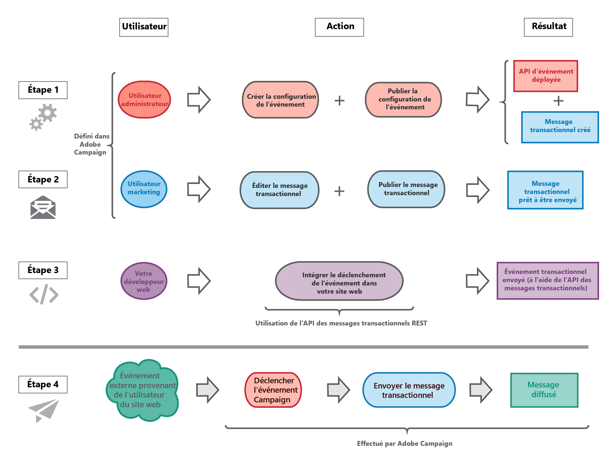

# Prise en main de la messagerie transactionnelle {#getting-started-with-transactional-messaging}

## Vue d’ensemble  {#overview}

Un message transactionnel est une communication individuelle et unique envoyée en temps réel à un utilisateur par un prestataire tel qu’un site web. Il est particulièrement attendu, car il contient des informations importantes que le destinataire souhaite vérifier ou confirmer.

* **Quand doit-il être envoyé ?** Ce message contenant des informations importantes, l’utilisateur s’attend à ce qu’il soit envoyé en temps réel. Le délai entre le déclenchement de l’événement et l’arrivée du message doit donc être très court.

* **Pourquoi est-ce important ?** En général, un message transactionnel bénéficie d’un taux d’ouverture élevé. Il doit donc être soigneusement conçu, car il peut avoir un impact important sur le comportement des clients dans la mesure où il définit la relation client.

* **Par exemple ?** Il peut s’agir d’un message de bienvenue après la création d’un compte, d’une confirmation qu’une commande a été expédiée, d’une facture, d’un message confirmant un changement de mot de passe ou d’une notification après qu’un client a consulté votre site web, etc.

Adobe Campaign permet d’intégrer cette fonctionnalité à un système d’information qui lui envoie les événements destinés à être transformés en messages transactionnels personnalisés.

Selon vos options, les messages transactionnels peuvent être envoyés par email, SMS ou [notification push](../../channels/using/transactional-push-notifications.md). Veuillez vérifier votre contrat de licence.

>[!NOTE]
>
>Adobe Campaign donne la priorité au traitement des messages transactionnels par rapport à toute autre diffusion.

<!--Guidelines to implement transactional messaging capabilities in your website are detailed in [this section](../../api/using/managing-transactional-messages.md).-->

Avant de commencer par la messagerie transactionnelle, veillez à lire les [meilleures pratiques et limites](../../channels/using/transactional-messaging-limitations.md) correspondantes.

## Principe de fonctionnement des messages transactionnels {#transactional-messaging-operating-principle}

Le processus global de messagerie transactionnelle peut être décrit comme suit :

Par exemple, imaginez que vous êtes une société disposant d’un site web sur lequel vos clients peuvent acheter des produits.

Adobe Campaign vous permet d’envoyer un email de notification aux clients qui ont ajouté des produits à leur panier. Lorsque l’un d&#39;eux quitte votre site web sans passer par ses achats (événement externe qui déclenche un événement Campaign), un email d’abandon de panier lui est automatiquement envoyé (diffusion de message transactionnel).

Les principales étapes de mise en place de ce système sont décrites ci-dessous dans [cette section](#key-steps).

## Types de message transactionnel {#transactional-message-types}

Dans Adobe Campaign, deux types de messages transactionnels sont disponibles :

**Messages transactionnels basés sur un événement** ciblant les données contenues dans l’événement. Ces messages :
* Ne contiennent pas d’informations sur le profil et ne peuvent donc pas inclure de liens de désabonnement.
* Ne sont pas compatibles avec les règles de fatigue (même dans le cas d’un enrichissement avec profils).
* Ont la cible de diffusion définie par les données contenues dans l&#39;événement.

Vous pouvez envoyer un message transactionnel basé sur un événement à un client qui doit par exemple récupérer un mot de passe oublié ou confirmer une commande. En effet, vous ne souhaitez pas que votre destinataire se désabonne de ce type de communication et cette notification ne doit pas être ajoutée au compteur des messages marketing dans le cadre d&#39;une règle de fatigue.

**Messages transactionnels basés sur un profil** ciblant des profils de la base de données marketing Campaign. Avec ce type de message, vous pouvez :
* utiliser les données contenues dans la base de données Adobe Campaign ;
* personnaliser votre message avec les informations de profil en ajoutant un [enrichissement](../../channels/using/configuring-transactional-event.md#enriching-the-transactional-message-content) à la configuration d&#39;événement ;
* appliquer des [règles de typologie marketing](../../sending/using/managing-typology-rules.md) ou des [règles de fatigue](../../sending/using/fatigue-rules.md) ;
* inclure le lien de désinscription dans les messages ;
* ajouter les messages transactionnels au reporting de diffusion globale ;
* utiliser les messages transactionnels dans le parcours client.

Par exemple, vous pouvez utiliser ce type de messages lorsque vous contactez vos clients après qu’ils ont abandonné leur panier sur votre site web, afin de les inciter à poursuivre leur achat. Cela vous permet de personnaliser plus facilement votre message en accédant directement à toutes les informations de votre base de données de profil, d’appliquer des règles marketing et d’inclure ce message dans le reporting et le parcours client global afin d’avoir une meilleure vue sur le comportement de vos clients.

Le type du message est défini lors de la configuration de l’événement qui sera transformé en message transactionnel. Consultez les sections de configuration des [messages transactionnels basés sur un événement](../../channels/using/configuring-transactional-event.md#event-based-transactional-messages) et [des messages transactionnels basés sur un profil](../../channels/using/configuring-transactional-event.md#profile-based-transactional-messages).

## Principales étapes {#key-steps}

Les principales étapes de création et de gestion des messages transactionnels personnalisés dans Adobe Campaign sont résumées dans le schéma ci-dessous.

Chacune de ces étapes est décrite plus en détail ci-dessous.

>[!IMPORTANT]
>
>Seuls les utilisateurs dotés du rôle [Administration](../../administration/using/users-management.md#functional-administrators) peuvent configurer des événements transactionnels et des messages transactionnels d’accès.

### Étape 1 - Créer et publier la configuration de l’événement {#create-event-configuration}

| Utilisateur | Action | Résultat |
|--- |--- |--- |
| Cette étape doit être effectuée par un administrateur disposant de [droits d&#39;administration](../../administration/using/users-management.md#functional-administrators). | Configurez un événement qui sera appelé « Abandon de panier » et publiez cette configuration d’événement. | L’API qui sera utilisée par le développeur de votre site web est déployée et un message transactionnel est automatiquement créé. |

La création et la publication d’un événement sont présentées dans les sections [Configuration d&#39;un événement transactionnel](../../channels/using/configuring-transactional-event.md) et [Publication d&#39;un événement transactionnel](../../channels/using/publishing-transactional-event.md).

### Étape 2 - Modifier et publier le message transactionnel {#create-transactional-message}

| Utilisateur | Action | Résultat |
|--- |--- |--- |
| Cette étape peut être effectuée par un utilisateur marketing disposant de [droits d&#39;administration](../../administration/using/users-management.md#functional-administrators). | Modifiez et personnalisez le message transactionnel, testez-le, puis publiez-le. | Le message transactionnel sera alors prêt à être envoyé. |

Pour plus d’informations sur la modification et la publication d’un message transactionnel, voir [Modification de messages transactionnels](../../channels/using/editing-transactional-message.md) et [Cycle de vie du message transactionnel](../../channels/using/publishing-transactional-message.md).

### Étape 3 - Intégrer le déclenchement de l’événement {#integrate-event-trigger}

<!--**Event triggering integration**-->

| Utilisateur | Action | Résultat |
|--- |--- |--- |
| Cette étape est effectuée par le développeur de votre site web. | Utilisez l’API REST des messages transactionnels pour intégrer l’événement à votre site web. | L’événement est déclenché lorsqu’un client abandonne son panier. |

Une fois que vous avez créé l’événement de votre choix, il vous faut intégrer le déclenchement de cet événement à votre site web.<!--In this example, you want a "Cart abandonment" event to be triggered whenever one of your clients leaves your website before purchasing the products in their cart.-->**Pour ce faire, le développeur web de votre site doit se servir de l’API REST Adobe Campaign Standard**.

Pour plus d’informations sur l’utilisation de l’API REST Campaign pour gérer les messages transactionnels, consultez la [documentation de l&#39;API REST](../../api/using/managing-transactional-messages.md).

### Étape 4 - Diffuser le message {#message-delivery}

Une fois toutes ces étapes effectuées, le message peut être diffusé.

Dès qu’un utilisateur quitte le site sans commander les produits dans son panier, l’événement Campaign correspondant est déclenché. L’utilisateur reçoit alors automatiquement un email de notification.

## Rubriques connexes :

* [Principales étapes pour envoyer un message](../../channels/using/key-steps-to-send-a-message.md)
* [Prise en main des canaux de communication](../../channels/using/get-started-communication-channels.md)
* [Notifications push transactionnelles](../../channels/using/transactional-push-notifications.md)
* [Messages de relance](../../channels/using/follow-up-messages.md)
