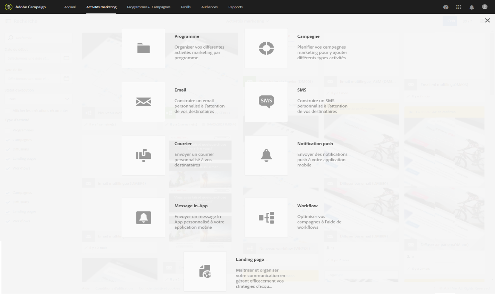
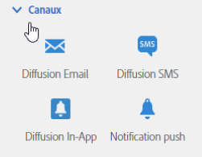
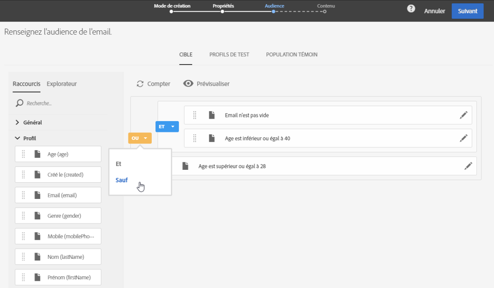
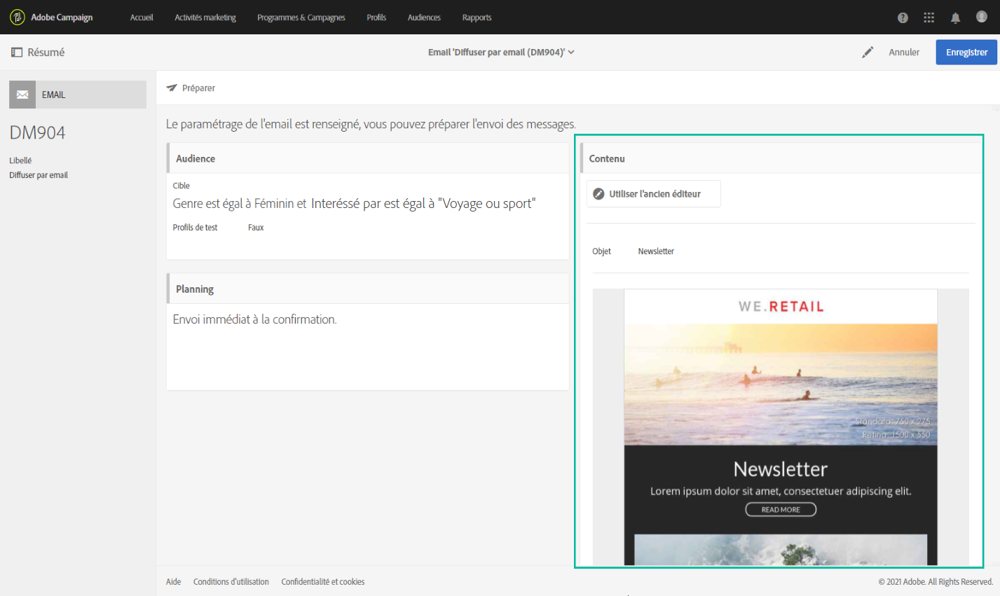
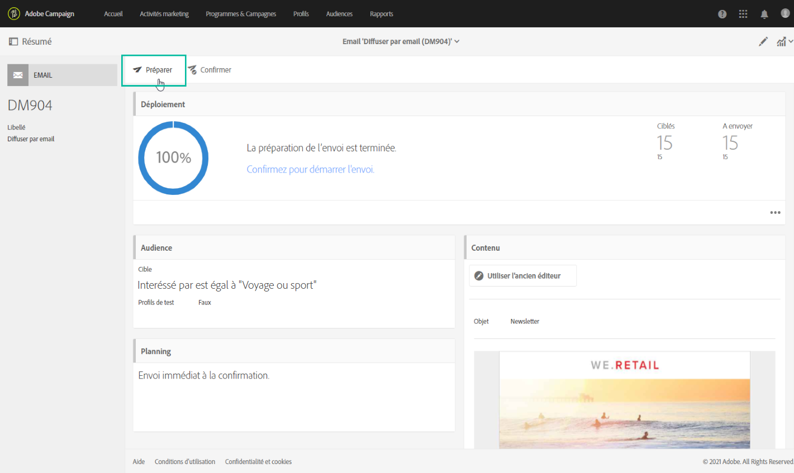
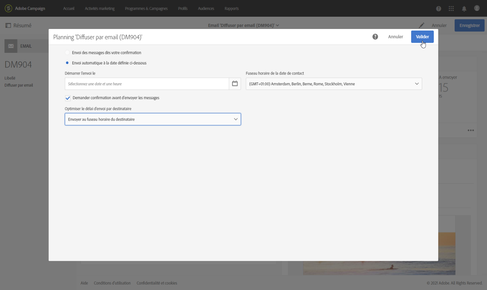
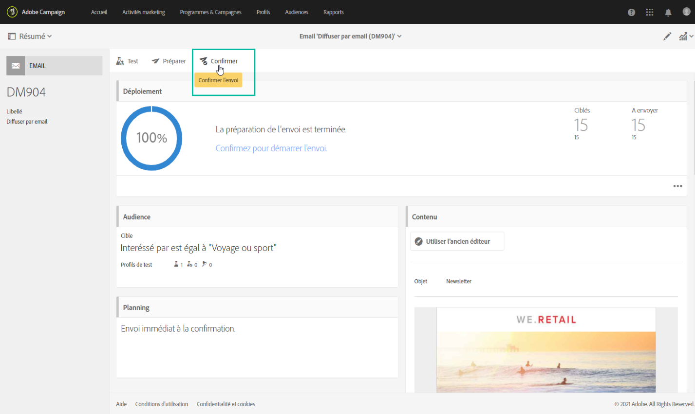
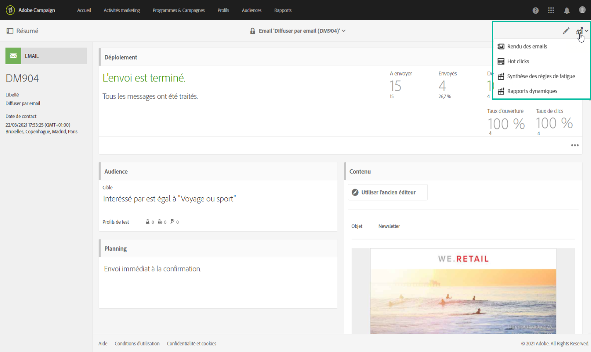

# Principales étapes pour envoyer un message{#key-steps-to-send-a-message}

Dans cette section, vous apprendrez comment créer et envoyer des messages personnalisés à une audience ciblée à l’aide d’Adobe Campaign Standard.

Des informations spécifiques sur la création et la configuration de chaque canal de communication sont disponibles dans les sections suivantes :

* [Création d’un email](../../channels/using/creating-an-email.md)
* [Création d’un SMS](../../channels/using/creating-an-sms-message.md)
* [Création d’une diffusion courrier](../../channels/using/creating-the-direct-mail.md)
* [Création d’une notification push](../../channels/using/preparing-and-sending-a-push-notification.md).
* [Préparation et envoi d’un message In-App](../../channels/using/preparing-and-sending-an-in-app-message.md)

Pour découvrir les bonnes pratiques en matière de diffusion, consultez la section [Bonnes pratiques de diffusion](../../sending/using/delivery-best-practices.md).

## Création de votre message

Tirez profit des [activités marketing](../../start/using/marketing-activities.md) de Campaign Standard pour créer un email, un SMS, un courrier, une notification push ou un message In-App.

Les messages peuvent être créés à partir de la liste des activités marketing ou à partir d’un workflow, à l’aide des [activités dédiées](../../automating/using/about-channel-activities.md).

## Définition de l’audience

Définissez les destinataires de votre message. Pour ce faire, utilisez l’[éditeur de requêtes](../../automating/using/editing-queries.md) du volet gauche pour filtrer les données contenues dans votre base de données et créer des règles permettant de cibler votre audience.

Plusieurs types d’audiences sont disponibles :

* La **[!UICONTROL cible]** est la cible principale de votre email,
* Les **[!UICONTROL profils de test]** sont les profils utilisés pour tester et valider votre email (voir [Gestion des profils de test](../../audiences/using/managing-test-profiles.md)).

## Conception et personnalisation de contenu

Dans le bloc **[!UICONTROL Contenu]**, concevez et personnalisez le contenu de votre message à l’aide des champs de votre base de données. Pour plus d’informations sur la conception de contenu pour un canal spécifique, consultez les sections répertoriées en haut de cette page.

## Préparation et test

[Préparez](../../sending/using/preparing-the-send.md) le message. Ce processus calcule la population cible et prépare le message personnalisé.

**Vérifiez et testez votre message** avant de l’envoyer à l’aide des fonctionnalités de Campaign Standard : prévisualisation, rendu des emails, révision et bien d’autres. Voir à ce propos [cette section](../../sending/using/previewing-messages.md).

Utilisez le bloc **[!UICONTROL Planification]** pour définir quand vos messages seront envoyés (voir [Planification des messages](../../sending/using/about-scheduling-messages.md)).

## Envoi et suivi

Une fois que votre message est prêt, vous pouvez confirmer l’envoi. Le bloc **[!UICONTROL Déploiement]** affiche la progression et le résultat de l’envoi.

Plusieurs logs sont disponibles pour vous aider à surveiller la diffusion de vos messages (voir [surveillance d’une diffusion](../../sending/using/monitoring-a-delivery.md)). Vous pouvez également suivre le comportement des destinataires de votre diffusion grâce aux [fonctionnalités de suivi](../../sending/using/tracking-messages.md) de Campaign Standard.

Mesurez l’efficacité de vos messages ainsi que l’évolution de vos envois et de vos campagnes à l’aide de divers indicateurs et graphiques (voir [Accès aux rapports](../../reporting/using/about-dynamic-reports.md)).

