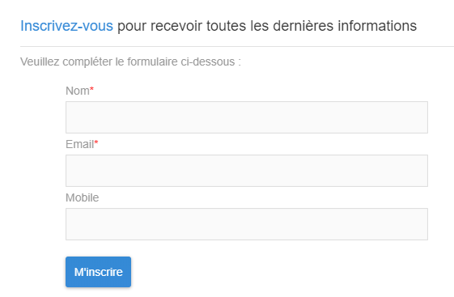
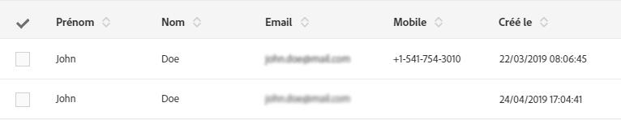

# Landing page limitations{#landing-page-limitations}

**Rédaction et mise à jour des données**

* Landing pages are limited to **[!UICONTROL Profile]** and **[!UICONTROL Subscription]** resources only. Record can be saved and updated from **[!UICONTROL Profile]** and a subscription/unsubscription to a **[!UICONTROL Service]**.
To learn more on resources configuration, see [Configuring the resource's data structure](../../developing/using/configuring-the-resource-s-data-structure.md).

[!CAUTION]
> A landing page cannot display or update data from any other resource than **[!UICONTROL Profile]** and **[!UICONTROL Subscription]**.

**Préchargement**

* La page d'entrée ne peut pas afficher automatiquement une liste d'enregistrements. Elle ne peut pas répertorier les services auxquels les profils déjà s'abonnent. For more information on services, refer to this [page](../../audiences/using/creating-a-service.md).

* La page d'entrée avec un formulaire prérempli (les données sont préchargées avec la page) ne peut être accessible qu'à partir d'un courrier électronique Adobe Campaign. Il est impossible d'accéder à un tel formulaire à partir d'une page de site Web.

**Réconciliation**

* Le comportement de réconciliation est le suivant : dès qu'une correspondance est trouvée, le processus de réconciliation s'arrête. Cela signifie que la réconciliation ne peut être effectuée que sur un enregistrement de profil et non sur plusieurs enregistrements lorsqu'il existe des doublons.

Par exemple, vous souhaitez envoyer la page d'entrée d'acquisition suivante à vos profils afin de mettre à jour votre base de données Campaign avec les numéros mobiles de vos profils.

Si l'un de vos profils remplit votre page d'entrée avec de nouvelles informations mais a déjà un profil dupliqué, le profil correspondant avec la date de création la plus ancienne est mis à jour puisque les profils sont prioritaires, selon leur date de création uniquement.

Ici seul le premier profil a été mis à jour puisqu'il s'agit de l'entrée la plus ancienne.

**Test de la page d'entrée**

* Les pages d'entrée ne fonctionnent que sur les profils et ne peuvent pas tester les profils de test, signifiant que les pages d'entrée ne peuvent pas être testées dans le cadre d'un courrier électronique.
