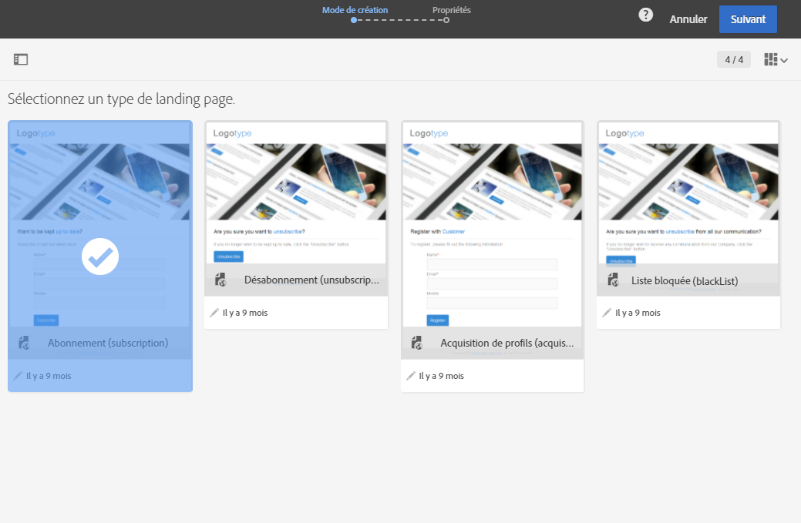

# A propos des modèles de landing page {#landing-page-templates}

Campaign intègre un jeu de modèles de landing page intégrés.

* **[!UICONTROL Acquisition]** : il s'agit du modèle par défaut des landing pages. Il permet de capturer et de mettre à jour les données dans la base de données Campaign.
* **[!UICONTROL Inscription]** : ce modèle doit être utilisé pour proposer des inscriptions à un service.
* **[!UICONTROL Désinscription]** : ce modèle peut être lié à un email envoyé aux abonnés à un service afin de leur permettre de se désinscrire de celui-ci.
* **[!UICONTROL Blackliste]** : ce modèle doit être utilisé lorsqu'un profil ne souhaite plus être contacté par Campaign. Pour plus d'informations sur le blacklistage, consultez [Les processus d'inscription et de désinscription dans Campaign](../../audiences/using/about-opt-in-and-opt-out-in-campaign.md).

Ces modèles sont proposés par défaut lors de la création d'une nouvelle landing page.



Pour accéder aux modèles, cliquez sur le logo Adobe Campaign dans le coin supérieur gauche et sélectionnez **[!UICONTROL Ressources]** &gt; **[!UICONTROL Modèles]** &gt; **[!UICONTROL Modèles de landing page]**.

>[!NOTE]
>
>Adobe vous recommande de créer vos propres modèles en dupliquant un modèle intégré. Certains paramètres peuvent seulement être définis dans les modèles de landing page et ne sont pas modifiables directement sur les landing pages.

Lors de la construction d'un modèle, il est conseillé d'ajouter un attribut **'type'** aux balises . Cette information sera interprétée par l'éditeur et aidera l'utilisateur à associer un champ de la base de données au champ du formulaire lors du paramétrage de l'application Web.

Exemple de code HTML dans le modèle :

```
<input id="email" type="email" name="email"/>
```

La liste officielle des attributs 'type' est disponible à l'adresse suivante : [http://www.w3schools.com/tags/att_input_type.asp](http://www.w3schools.com/tags/att_input_type.asp)