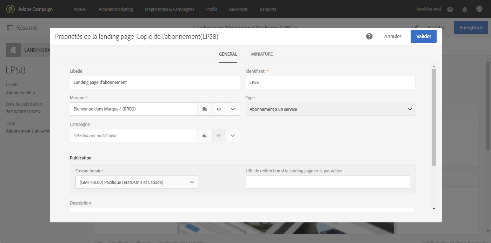

# Etapes principales de la configuration d'une landing page {#main-steps-create-a-landing-page}

## A propos de la création d'une landing page

Voici les principales étapes de configuration d'une landing page :

Cette page contient des informations sur chacune de ces étapes, ainsi que des références à la documentation dédiée pour obtenir des informations supplémentaires.

## Configuration du modèle de landing page {#configure-the-landing-page-template}

Avant de configurer une landing page, vous devez configurer un modèle de landing page correspondant à vos besoins. Une fois le modèle prêt, toutes les landing pages reposant sur celui-ci seront préconfigurées avec les paramètres souhaités.

1. Depuis le menu avancé, via le logo Adobe Campaign, sélectionnez **[!UICONTROL Ressources]**/**[!UICONTROL Modèles]** / **[!UICONTROL Modèles de landing page]**, puis dupliquez le modèle que vous souhaitez utiliser.
1. Dans les propriétés du modèle, spécifiez tous les paramètres que vos landing pages doivent avoir en commun, par exemple, la dimension de ciblage, les paramètres d'accès aux pages pour les visiteurs identifiés ou non, les actions spécifiques à la validation de formulaire par un visiteur, la marque/le logo à utiliser dans le contenu, etc.
1. Enregistrez vos modifications.

Pour plus d'informations sur les modèles de landing page, reportez-vous à [cette section](../../channels/using/about-landing-pages.md).

## Création et configuration d'une landing page {#create-and-configure-the-landing-page}

Créez une landing page dans le programme ou la campagne de votre choix, à partir du modèle défini à l'étape précédente.

1. Créez la landing page à partir du modèle souhaité.
1. Renseignez les paramètres généraux de la landing page (libellé, description, etc.).
1. Vous accéderez ensuite au tableau de bord de la landing page. Si nécessaire, éditez les propriétés de la landing page. Par défaut, les propriétés sont celles configurées dans le modèle de landing page.
Pour des raisons de sécurité et de performances de la plate-forme, il est vivement recommandé de définir une date d'expiration dans les propriétés de la landing page. Une fois cette opération terminée, la landing page est automatiquement dépubliée à la date sélectionnée. Pour plus d'informations sur les paramètres de validité, reportez-vous à [cette section](../../channels/using/sharing-a-landing-page.md#setting-up-validity-parameters).

   

   >[!NOTE]
   >
   >Vos modifications sont effectives uniquement pour la landing page en cours d'édition. Si vous souhaitez appliquer ces modifications à d'autres landing pages, vous pouvez les effectuer dans un modèle dédié et créer d'autres landing pages à partir de ce modèle.

## Concevoir une landing page {#design-the-landing-page}

Vous pouvez maintenant définir le contenu de la landing page. Celle-ci contient par défaut trois pages, accessibles via les options de défilement : la page principale de contenu, une page de confirmation et une page d'erreur.

Plusieurs champs sont configurés par défaut sur chaque page. Si nécessaire, vous pouvez éditer leurs propriétés et mappage.

Vous pouvez également configurer le comportement du bouton de confirmation lorsqu'un profil clique dessus et personnaliser le contenu selon vos besoins (image, champs de personnalisation, etc.). Par exemple, vous pouvez insérer le prénom d'un profil dans la page de confirmation de la landing page pour le remercier de s'être inscrit.

Pour plus d'informations sur la conception d'une landing page, reportez-vous à [cette section](../../channels/using/designing-a-landing-page.md).

## Tester la landing page {#test-the-landing-page}

Une fois la landing page définie, vous pouvez simuler son exécution et son comportement lorsqu'elle sera disponible en ligne.

>[!CAUTION]
>
>Les tests de landing pages ne peuvent être effectués qu'avec des profils, et non des profils de test. Lors de l'envoi du formulaire, les données du profil sélectionné seront mises à jour. Pour éviter de modifier des profils réels, utilisez un faux profil client.

Si le comportement observé lors du test de la landing page est satisfaisant, vous pouvez alors publier cette dernière afin qu'elle soit disponible en ligne.

Pour plus d'informations sur le test d'une landing page, reportez-vous à [cette section](../../channels/using/sharing-a-landing-page.md#testing-the-landing-page-).

## Publier la landing page {#publish-the-landing-page}

Une fois les tests terminés, vous pouvez publier la landing page via le bouton **[!UICONTROL Publier]** de la barre d'actions du tableau de bord. Un bloc de suivi indique la progression et le statut de la publication.

La publication de la landing page permet de la rendre accessible en ligne. Une fois publiée, vous pouvez toujours la mettre à jour : pour cela, vous devez la publier de nouveau après chaque modification. Vous pouvez également dépublier une landing page à tout moment afin qu'elle ne soit plus accessible.

Une fois publiée, votre landing page est prête à être utilisée. Vous pouvez alors mettre en place différents mécanismes permettant d'y accéder afin d'acquérir de nouveaux profils dans votre base ou d'obtenir des informations complémentaires sur les profils existants.

Pour plus d'informations sur la publication d'une landing page, reportez-vous à [cette section](../../channels/using/sharing-a-landing-page.md#publishing-a-landing-page).
